# 신혼집 평가 애플리케이션 설계서 (v0.1 Draft)

> **문서 목적**: 요구사항을 구현 가능한 수준으로 구체화하고, 기술 선택의 근거와 미해결 이슈를 명시한다.
> **작성일**: 2026-08-24
> **스택**: Java 21 / Spring Boot 3.x / Mustache / PostgreSQL(or MySQL) / Vanilla JS(ES Modules)

---

## 1. 요약

| 항목 | 결정 |
|---|---|
| 아키텍처 | Mustache로 App Shell 1회 렌더 + **Alpine.js** 기반 클라이언트 렌더링 (Shell-SPA) |
| 지도 | **카카오맵 JS SDK 단일 스택** 권장 / 네이버 클라우드 Maps는 차선 (Session 3.1) |
| 대중교통 | **ODsay LAB 대중교통 길찾기 API** |
| POI 채점 | 카카오 로컬 REST API (카테고리 그룹코드 기반 반경 검색) |
| 매물 수집 | **네이버 매물 상세 텍스트 붙여넣기 파싱** — 48필드 실측 검증. 크롤링은 생존 확인 배치에만 (Session 9) |
| 대출 한도 | 외부 API 없음 → **자체 계산 엔진 + 규제 파라미터 테이블** (Session 3.4) |
| 참고 시세 | 국토부 실거래가 API — **참고 표기 전용**, 채점에는 미반영 (Session 3.3, 5.6) |
| DB | **PostgreSQL** 단일 (JSONB, PostGIS 옵션) + **Redis** (세션 미러·캐시) |
| 배포 | `https://cena.furaiki-lifelog.com` · 리버스 프록시 + Let's Encrypt |
| 인증 | **Spring Session Data Redis**, 30분 idle timeout, sliding expiration |
| 알림 | Slack **Incoming Webhook**, URL은 `application.yaml` 정의 (Session 12.4) |
| 설정 | `SYSTEM_CONFIG` 테이블 + Admin 화면(M6), 부팅 시 yml 시드 |
| 화면 | Main Frame 7개 + Modal 24개 (Session 7, 10) |

---

## 2. 아키텍처

### 2.1 전체 구성

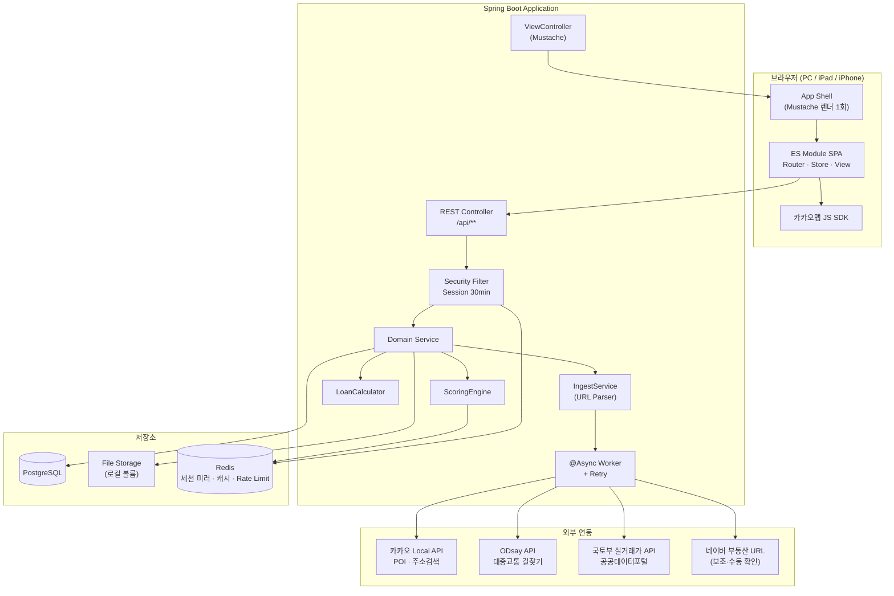

### 2.1.1 Redis 사용처

**Postgres 단일 + Redis 보조** 구성입니다. Redis는 영속 저장소가 아니라 성능·휘발성 계층으로만 씁니다.

| 용도 | 대체 시 | TTL |
|---|---|---|
| Spring Session 백엔드 | 재기동 시에도 세션 유지, Postgres 부하 없이 조회 | 30분 idle |
| 카카오 POI · ODsay 경로 캐시 | 없으면 매번 외부 API 재호출 | 30일 |
| 로그인 시도 Rate Limit | 없으면 무제한 시도 허용 | 15분 |
| Slack 알림 디바운스 락(Session 16-I21) | 없으면 등록 알림이 개별 발송됨 | 60초 |

Redis 장애 시 세션은 JDBC로 폴백 가능하도록 `SessionRepository` 구현을 이중화하지 않고 **Redis를 단일 세션 저장소로 확정**합니다(단순성 우선). 캐시 계층 장애는 API 재호출로 흡수되어 기능 저하 없이 느려지기만 합니다.

### 2.2 SPA와 Mustache의 공존 전략

요구사항에 `Mustache`와 `SPA`가 동시에 명시되어 있으나 이 둘은 원래 상충한다(전자는 서버 렌더, 후자는 클라이언트 렌더). 절충안:

| 레이어 | 담당 | 렌더링 위치 |
|---|---|---|
| `layout.mustache` | HTML skeleton, CSS/JS 번들 링크, CSRF 토큰, 부트스트랩 JSON | **서버** (최초 1회) |
| `login-shell.mustache` | 비로그인 시 블러 배경 + 로그인 모달 | **서버** |
| 매물 리스트 / 지도 / 상세 / 모달 | `<template>` 태그 + `mustache.js` | **클라이언트** |

**핵심**: `.mustache` 파일을 서버(`Mustache.java`)와 클라이언트(`mustache.js`)가 **공유**한다. 빌드 시 `src/main/resources/templates/partials/*.mustache`를 JS 번들로 인라인시켜 동일 문법을 양쪽에서 사용. 이렇게 하면 "Mustache로 개발"이라는 요구를 지키면서 SPA 동작을 얻는다.

라우팅은 History API 기반 클라이언트 라우터를 쓰고, 서버는 `/`, `/admin/**` 등 모든 경로에서 동일 shell을 반환한다.

---

## 3. 외부 API 선정

### 3.1 지도 API 비교

| API | 국내 지도 품질 | 지오코딩 | POI 카테고리 검색 | 대중교통 경로 | 도보 경로 | 비용 | 판정 |
|---|---|---|---|---|---|---|---|
| **카카오맵** | 최상 | 우수 | **카테고리 그룹코드 + 반경검색 지원** | ✕ | ✕ | 무료(일 30만) | **1순위** |
| **네이버 클라우드 Maps** | 최상 | 최상 | 약함(지역검색 5건 제한) | ✕ | 자동차만(Directions 5) | 종량제 | 2순위 |
| **Google Maps** | 보통(국내 규제로 제한적) | 보통 | Places API 우수 | 국내 제한적 | **국내 도보/자동차 제한** | 종량제·고가 | 부적합 |
| **Bing Maps** | — | — | — | — | — | — | **탈락** |
| Apple MapKit JS | 보통 | 보통 | 약함 | ✕ | ✕ | 제한적 | 부적합 |

**Bing은 검토 대상에서 제외해야 합니다.** <cite index="55-1">Bing Maps for Enterprise는 이미 deprecated 되었고 무료(Basic) 계정은 전면 종료, 엔터프라이즈 계정도 2028년 6월 30일까지만 사용 가능합니다.</cite> <cite index="52-1">Microsoft는 2024년 6월 30일 이후 신규 고객을 받지 않고 있으므로,</cite> 지금 신규 개발에 채택할 수 없습니다. 대체재는 Azure Maps이나 국내 데이터 품질이 떨어집니다.

**Google은 국내 지도 데이터 반출 규제**로 도보·자동차 길찾기와 상세 지도 기능이 제한됩니다. 이 앱은 "도보 20분 이내 편의점" 같은 국내 POI 판정이 핵심이므로 부적합합니다.

**최종 권고: 카카오맵 단일 스택.**
- 이유 1: 지도 표출과 POI 채점을 **한 벤더로 통일**할 수 있다. 카카오 로컬 API 결과를 타사 지도 위에 표출하면 이용약관 위반 소지가 있어, 네이버 지도 + 카카오 POI 조합은 리스크가 있다.
- 이유 2: 카테고리 그룹코드로 요구된 채점 항목을 거의 그대로 커버한다.

| 채점 항목 | 카카오 카테고리 그룹코드 |
|---|---|
| 역세권 | `SW8` 지하철역 |
| 교육 (초·중) | `SC4` 학교 (+ 이름 필터) |
| 교육 (어린이집·유치원) | `PS3` |
| 편의점 | `CS2` (+ 브랜드명 필터) |
| 마트 | `MT1` (+ 브랜드명 필터) |
| 패스트푸드 | `FD6` (+ 브랜드명 필터) |
| 카페 | `CE7` (+ 브랜드명 필터) |
| 문화시설 | `CT1` |
| 운동시설·공원·산 | `AT4` + 키워드 검색 (Session 16-I5) |

> 네이버 부동산 URL 파싱과의 정합성을 최우선한다면 네이버 Maps로 가되, POI 채점은 서버 내부 계산에만 쓰고 지도에 표출하지 않는 방식으로 분리해야 합니다.

### 3.2 대중교통 소요시간

**ODsay LAB `대중교통 길찾기 API`** 채택. <cite index="80-1">출발지 경위도(SX, SY)와 도착지 경위도(EX, EY)만 넘기면 대중교통 경로를 반환하며,</cite> <cite index="74-1">서울/경기 및 6대 광역시를 커버합니다.</cite> 네이버·카카오·구글 모두 국내 대중교통 경로 API를 공개하지 않으므로 사실상 유일한 선택지입니다.

**주의**: <cite index="78-1">무료 API의 도보 거리·시간은 직선거리 기반으로 계산되며, 실제 도보 엔진을 쓰는 경로 계산은 유료 API입니다.</cite> 역세권 채점의 도보 시간도 같은 한계를 갖습니다(Session 16-I4).

### 3.3 매물 데이터 소스

| 방식 | 정확도 | 리스크 | 역할 |
|---|---|---|---|
| **텍스트 붙여넣기 파싱** | **최상 — 48필드 실측** | 낮음 | **기본** (Session 9) |
| 수기 입력 | 최상 | 없음 | 붙여넣기 실패 필드 폴백 |
| 서버 URL 크롤링 | 하 | **높음** (Session 16-I2) | 생존 확인 배치에만 |
| 국토부 실거래가 API | 상 | 없음 | 시세 검증·보정 |
| ~~K-apt 공동주택 기본정보~~ | — | — | **불필요** — 세대수·주차·준공·난방·용적률이 붙여넣기로 확보 |
| 네이버 공개 API | — | — | **부동산 매물 API 부재** |

**현재 매물(호가)을 제공하는 합법적 공개 API는 존재하지 않습니다.** 국토부 실거래가 API는 *과거 체결가*만 제공합니다. 따라서 "URL 붙여넣기 → 자동 등록"은 **초안 생성 + 사용자 확인** 워크플로로 설계하고, 파싱 실패 시 수기 입력으로 자연스럽게 폴백해야 합니다.

### 3.4 대출 한도

**개인별 대출 한도를 반환하는 공개 API는 없습니다.** 금융위원회 `금융상품 한눈에` API로 상품 목록과 금리는 수집 가능하지만, 한도는 소득·DSR·LTV를 조합해 **자체 계산**해야 합니다.

규제가 자주 바뀌므로 **모든 규제 수치를 코드가 아닌 DB 테이블(`regulation_param`)에 둡니다.**

```
LTV비율, 대출총액상한, DSR한도, 스트레스가산금리,
취득세구간, 중개보수요율, 생애최초우대율, 전세보증기관한도
```

---

## 4. 도메인 모델

```mermaid
erDiagram
    USERS ||--o{ USER_CRITERION_SCORE : rates
    USERS ||--o{ PROPERTY_OPINION : writes
    USERS ||--o{ COMMUTE_RESULT : "has commute to"
    PROPERTY ||--o{ PROPERTY_IMAGE : has
    PROPERTY ||--o{ PROPERTY_AGENT : "brokered by"
    AGENT ||--o{ PROPERTY_AGENT : brokers
    PROPERTY ||--o{ PROPERTY_SCORE : scored
    PROPERTY ||--o{ USER_CRITERION_SCORE : receives
    PROPERTY ||--o{ COMMUTE_RESULT : produces
    PROPERTY ||--o{ NEARBY_FACILITY : near
    PROPERTY ||--o{ PROPERTY_OPINION : about
    PROPERTY ||--o| LOAN_ESTIMATE : estimates
    PROPERTY ||--o{ LISTING_CHECK_LOG : "checked by batch"
    PROPERTY ||--o{ REFERENCE_TRANSACTION : "referenced by"
    CRITERION ||--o{ PROPERTY_SCORE : defines
    CRITERION ||--|| CRITERION_WEIGHT : "weighted by"

    USERS {
        bigint id PK
        varchar nickname UK
        varchar email UK
        varchar password_hash
        varchar role "ADMIN | MEMBER"
        varchar workplace_name
        decimal workplace_lat
        decimal workplace_lng
        boolean must_change_password
        bigint available_budget "가용 예산(원) — 예산상한 합산용"
        boolean enabled "활성/비활성"
        timestamp disabled_at
        bigint disabled_by FK
        timestamp created_at
    }

    PROPERTY {
        bigint id PK
        varchar name "단지명"
        varchar dong_ho "동/호"
        varchar deal_type "SALE|JEONSE|MONTHLY"
        bigint price_deposit "매매가 or 보증금(원)"
        bigint price_monthly "월세(원)"
        int maintenance_fee
        varchar address_road
        varchar address_jibun
        decimal lat
        decimal lng
        decimal area_supply_m2
        decimal area_exclusive_m2
        varchar floor_raw "7 or 고/중/저"
        int floor_no
        int floor_total
        varchar floor_band "HIGH|MID|LOW"
        varchar room_bath "3/2"
        varchar direction
        int approval_year "사용승인"
        varchar move_in_type "IMMEDIATE|NEGOTIABLE|DATE"
        date move_in_date
        decimal parking_per_household
        int total_households
        varchar heating_type
        int building_count "단지 동수 — 수기 입력"
        bigint kb_price "KB시세 — 대출 산정 기준"
        varchar source_type "MANUAL|PASTE|CRAWL"
        varchar source_url
        varchar naver_article_no "매물번호"
        text raw_paste_text "원문 보존 → 재파싱용"
        varchar parser_version
        jsonb parse_confidence "필드별 EXACT|DERIVED|MISSING"
        boolean is_draft "모바일 URL만 저장한 미완성"
        varchar listing_status "ACTIVE|SOLD_OUT|UNREACHABLE|ARCHIVED"
        boolean active "리스트 노출 여부"
        timestamp last_checked_at
        int check_fail_streak "연속 실패 횟수"
        timestamp sold_detected_at
        bigint created_by FK
        timestamp created_at
    }

    AGENT {
        bigint id PK
        varchar office_name
        varchar agent_name
        varchar phone
        varchar mobile
        varchar registration_no "등록번호"
        varchar address
        decimal lat
        decimal lng
    }

    PROPERTY_AGENT {
        bigint property_id FK
        bigint agent_id FK
        boolean is_primary
    }

    PROPERTY_IMAGE {
        bigint id PK
        bigint property_id FK
        varchar image_type "FLOOR_PLAN|PHOTO"
        varchar storage_path
        int sort_order
    }

    CRITERION {
        varchar code PK "COMFORT|PRICE|MOVE_IN|COMMUTE|AGE|FLOOR|STATION|EDUCATION|AMENITY|PARKING|GREEN"
        varchar name
        varchar scoring_type "AUTO|MANUAL|HYBRID"
        boolean enabled
    }

    CRITERION_WEIGHT {
        varchar criterion_code PK
        int priority_rank "1=최우선"
        decimal weight "가중치 배수"
        timestamp updated_at
    }

    PROPERTY_SCORE {
        bigint id PK
        bigint property_id FK
        varchar criterion_code FK
        decimal auto_score "0~100, nullable"
        decimal manual_score "0~100, nullable"
        decimal effective_score
        varchar score_source "AUTO|MANUAL|FALLBACK"
        varchar fallback_reason
        timestamp computed_at
    }

    USER_CRITERION_SCORE {
        bigint property_id FK
        bigint user_id FK
        varchar criterion_code FK
        int score "1~5 또는 0~100"
    }

    COMMUTE_RESULT {
        bigint property_id FK
        bigint user_id FK
        int total_minutes
        int transfer_count
        int walk_minutes
        jsonb path_summary
        timestamp fetched_at
    }

    NEARBY_FACILITY {
        bigint id PK
        bigint property_id FK
        varchar category "STATION|SCHOOL|CONVENIENCE|MART|..."
        varchar sub_category
        varchar name
        int distance_m
        int walk_minutes
        timestamp fetched_at
    }

    PROPERTY_OPINION {
        bigint id PK
        bigint property_id FK
        bigint user_id FK
        varchar opinion_type "MERIT|DEMERIT"
        varchar content
        int sort_order
    }

    LISTING_CHECK_LOG {
        bigint id PK
        bigint property_id FK
        timestamp checked_at
        int http_status
        varchar verdict "ALIVE|GONE|BLOCKED|ERROR"
        varchar evidence "판정 근거 스니펫"
        int elapsed_ms
        boolean notified
    }

    SYSTEM_CONFIG {
        varchar config_key PK
        varchar config_value
        varchar value_type "STRING|INT|BOOL|SECRET"
        varchar category "SLACK|BATCH|SCORING|LOAN"
        varchar description
        boolean masked "UI 마스킹 여부"
        bigint updated_by FK
        timestamp updated_at
    }

    NOTIFICATION_LOG {
        bigint id PK
        varchar event_type "PROPERTY_CREATED|LISTING_SOLD_OUT|BATCH_ERROR"
        bigint property_id FK
        varchar channel
        varchar status "SENT|FAILED|RETRYING"
        int retry_count
        varchar error_message
        jsonb payload
        timestamp created_at
        timestamp sent_at
    }

    REFERENCE_TRANSACTION {
        bigint id PK
        bigint property_id FK
        varchar deal_type "TRADE|RENT"
        date contract_date
        bigint price
        int floor
        varchar source "MOLIT_TRADE|MOLIT_RENT"
        timestamp cached_at
    }

    LOAN_ESTIMATE {
        bigint id PK
        bigint property_id FK
        varchar product_type "MORTGAGE|JEONSE"
        decimal ltv_rate
        bigint ltv_limit
        bigint dsr_limit
        bigint final_limit
        bigint required_cash
        bigint acquisition_tax
        jsonb assumptions
        timestamp computed_at
    }
```

### 4.1 부동산 필드 정의 (네이버페이 부동산 기준)

네이버페이 부동산 매물 상세에서 노출되는 항목을 기준으로 정리했습니다.

**거래 정보**
| 필드 | 타입 | 비고 |
|---|---|---|
| 거래 유형 | enum | 매매 / 전세 / 월세 |
| 매매가·보증금 | bigint | 원 단위 저장, 표시는 억/만원 |
| 월세 | bigint | 월세일 때만 |
| 관리비 | int | 포함 항목 별도 텍스트 |
| 융자금 | bigint | optional |

**면적·구조**
공급면적(㎡), 전용면적(㎡), **전용면적(평) = 전용㎡ ÷ 3.3058 (파생 컬럼)**, 방/욕실 수, 해당층/총층, 방향(기준: 거실 창), 구조(계단식/복도식)

**건물**
단지명, 사용승인일, 총 세대수, 총 동수, 세대당 주차대수, 난방방식, 건폐율/용적률

**입주**
입주가능일 유형(즉시/협의/날짜), 입주가능일

**위치**
도로명주소, 지번주소, 위도, 경도

**중개인 (1:N)**
중개사무소명, 대표자명, 전화번호, 휴대폰, 등록번호, 사무소 주소·좌표

---

## 5. 채점 엔진

### 5.1 정규화 원칙

모든 항목은 **0~100 스케일로 정규화**한 뒤 가중치를 곱합니다. 원점수 스케일이 제각각인 상태로 가중치만 곱하면 비교가 무의미해집니다.

```
TotalScore = Σ(effective_score_i × weight_i) / Σ(weight_i)
```

**대카테고리 분리**: 매매와 전세는 가격 스케일과 대출 구조가 완전히 달라 **별도 순위표**로 운영합니다. M1 리스트 상단에 `매매 / 전세` 탭을 두고, `PRICE` 정규화와 정렬을 카테고리 내부에서만 수행합니다. 카테고리를 섞은 통합 순위는 제공하지 않습니다.

`weight`는 Admin이 정한 우선순위 랭크에서 파생 (예: rank 1 → 2.0, rank 2 → 1.8 … 등차 또는 등비, 설정 가능).

정렬: `TotalScore DESC, name ASC(한글 가나다, `Collator.getInstance(Locale.KOREAN)`)`

### 5.2 항목별 산식

| 코드 | 항목 | 방식 | 산식 |
|---|---|---|---|
| `COMFORT` | 공간의 쾌적함 | MANUAL | 사용자별 1~5 → 평균 → ×20 |
| `PRICE` | 가격 | AUTO | **예산 절대평가.** `100 × (1 − 호가/예산상한)`, 예산상한 = 활성 사용자 `available_budget` 합계. 초과 시 0점 (Session 5.2.1) |
| `MOVE_IN` | 입주시기 | AUTO | 즉시=100, 협의=85, 기준일 이내=`100−(D/기준일)×40`, 기준일 초과=0 |
| `COMMUTE` | 직주근접 | AUTO | 사용자별 소요시간 → `clamp(100−(t−20)×1.43, 0, 100)` (20분↓ 만점, 90분↑ 0점) → **전 사용자 평균** |
| `AGE` | 건물 연식 | AUTO | `clamp(100 − (현재연도−승인연도)×2.5, 10, 100)` (40년 → 10점 하한) |
| `FLOOR` | 층 | AUTO | **확정 규칙 — Session 5.5 참조** |
| `STATION` | 역세권 | AUTO | 최근접역 도보 t분. `t≤5 → 100`, `5<t≤20 → 100×(20−t)/15`, `t>20 → 0` |
| `EDUCATION` | 교육여건 | AUTO | 도보 30분(≈2.0km) 내 초/중/어린이집/유치원 4종 존재 여부 × 25점 |
| `AMENITY` | 편의시설 | AUTO | 도보 20분(≈1.3km) 내 6개 카테고리. 카테고리당 `min(count,3)/3 × 16.67` |
| `PARKING` | 주차 | AUTO | `clamp(세대당대수 / 1.0 × 100, 0, 100)` |
| `GREEN` | 녹색환경 | AUTO | 도보 30분 내 공원 / 탐방로 산 / 산책로 하천 3종 × 33.3 |
| `BUILDING_COUNT` | 단지 건물동 수 | **MANUAL** | 1동=0, 2~4동은 선형 증가, **5동 이상은 동일 최고점**. 산식은 자동이나 입력값은 수기 |

### 5.2.1 가격 채점 — 예산 절대평가

**예산 상한 = 활성 사용자 전원의 `available_budget` 합계.** 상대평가(리스트 내 min-max)를 쓰지 않으므로, 매물을 추가·삭제해도 기존 매물의 가격 점수가 흔들리지 않습니다.

```
score = clamp(100 × (1 − 호가 / 예산상한), 0, 100)
```

| 호가 | 예산 12억 기준 |
|---|---|
| 8.5억 | 29.2 |
| 10억 | 16.7 |
| 12억 | 0.0 |
| 15억 | 0.0 (초과) |

**채점 기준은 호가(`price_deposit`)입니다.** KB시세(`kb_price`)는 대출 한도 산출에만 쓰고 채점에 쓰지 않습니다. 실제로 지불하는 돈은 호가이기 때문입니다.

다만 **호가/시세 괴리율**을 보조 지표로 리스트에 표시합니다. 실측 사례는 15억/13.5억 = **+11.1%** 로, 시세보다 비싸게 부른 매물임을 한눈에 알 수 있습니다.

**재계산 트리거**: 사용자가 `available_budget`을 수정하거나 활성/비활성이 바뀌면 예산 상한이 변하므로 **전 매물 `PRICE` 재계산**이 필요합니다. 외부 API 호출은 없으므로 즉시 처리됩니다.

### 5.2.2 단지 건물동 수 채점 (신규)

나홀로 아파트는 재건축 동의율 확보가 어렵고 환금성이 낮다는 판단(Session 16-I2 임장 경험 반영)을 반영합니다.

```java
public double scoreBuildingCount(int buildings) {
    if (buildings <= 1) return 0.0;
    if (buildings >= 5) return 100.0;
    return (buildings - 1) / 4.0 * 100.0;   // 2동 25 · 3동 50 · 4동 75
}
```

| 동수 | 점수 |
|---|---|
| 1 (나홀로) | 0 |
| 2 | 25 |
| 3 | 50 |
| 4 | 75 |
| 5+ | 100 |

**데이터 출처: 수기 입력으로 확정.** 네이버 매물 상세 화면에 동수 필드가 없고(실측 확인됨), K-apt 연동은 하지 않기로 했습니다. D10 매물 등록 폼에 `단지 건물동 수` 입력칸을 두고, 산식 자체는 자동 계산(위 표)이지만 입력값이 수기라는 뜻에서 `scoring_type = MANUAL`로 분류합니다. 네이버 부동산 지도뷰나 로드뷰(D23)에서 육안으로 세면 되는 값이라 입력 부담은 낮습니다.

### 5.3 층수 채점 확정 규칙

요구사항의 모순(구 I3)을 다음과 같이 확정합니다.

**밴드 표기 (`저`/`중`/`고`)** — 저층만 최저점, 중·고는 동점 최고점

| 표기 | 점수 |
|---|---|
| 고 | 100 |
| 중 | 100 |
| 저 | 0 |

**숫자 표기** — 1~6층은 층이 높을수록 고점, **7층 이상은 전부 동일 최고점**

```java
public double scoreFloor(int floor) {
    if (floor >= 7) return 100.0;             // 고정 임계값
    return (floor - 1) / 5.0 * 100.0;         // 1층 0점 → 6층 100점
}
```

| 층 | 점수 | | 층 | 점수 |
|---|---|---|---|---|
| 1 | 0.0 | | 5 | 80.0 |
| 2 | 20.0 | | 6 | **100.0** |
| 3 | 40.0 | | 7 | **100.0** |
| 4 | 60.0 | | 20 | 100.0 |

`floor_total`은 사용하지 않습니다. 임계값 7은 절대 기준이며 `scoring.floorPeak`로 런타임 조정 가능합니다.

> **실측 영향**: 독립문삼호 9/18층은 7층 이상이므로 **100.0점**입니다. 상계동양메이저(저/22)는 밴드 표기로 **0점**입니다.

이전 안(15층 정점·16층 절벽)보다 훨씬 관대한 규칙입니다. 저층(1~6층)만 불리하고, 중층부터는 사실상 층 차이가 순위에 영향을 주지 않습니다. 5층 이하 건물이라도 6층에 가까우면 불리하지 않으므로, 이전 안의 "저층 건물 구조적 불리" 부작용은 사라졌습니다.

### 5.4 AUTO → MANUAL 폴백

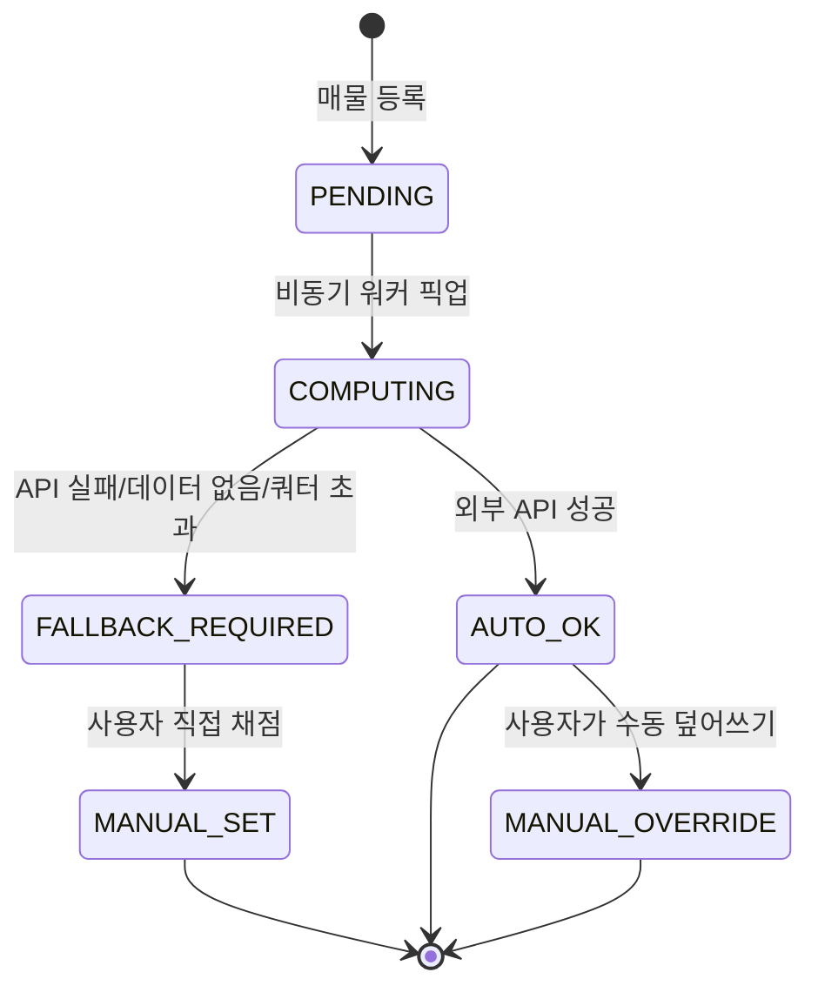

`effective_score` 결정 우선순위: `manual_score` > `auto_score`. UI에서 자동/수동/폴백을 배지로 구분 표시하고, 폴백 사유(`fallback_reason`)를 툴팁으로 노출합니다.

### 5.5 국토부 실거래가 — 참고 표기 전용 (채점 미반영)

**`RTMSDataSvcAptTradeDev`(매매) / `RTMSDataSvcAptRent`(전월세)** 를 매물 상세 화면(M2)에 **참고용 카드**로만 노출합니다. 채점(`PRICE`)에는 반영하지 않습니다 — 실거래가는 계약 시점 가격이라 현재 호가보다 며칠~몇 달 늦고, 이미 `PRICE`는 호가·예산상한 기준 절대평가로 확정했기 때문에(Session 5.2.1) 두 기준을 섞으면 산식이 다시 모순됩니다.

**조회 조건**: 법정동코드(5자리) + 계약년월(YYYYMM) + 단지명·전용면적 유사도로 필터링. 붙여넣기로 확보한 `address_jibun`에서 법정동코드를 역매핑해야 하므로, **법정동코드 참조 테이블**(행정안전부 공개 데이터, 약 4만 건)을 시드 데이터로 적재합니다.

**M2 표시 위치**: 가격 정보 하단에 접이식 카드.

```
최근 실거래 (동일 단지·유사 면적)
┌─────────────────────────────┐
│ 2026.07  12억 9,250   2층    │
│ 2026.06  14억 4,000   7층 ★최고 │
│ 2026.06  12억 5,000   2층  최저│
└─────────────────────────────┘
호가 15억 vs 최근 실거래 12.9억 → 괴리 +16.3%
```

**동기화**: 등록 시 1회 조회 + 캐시(Redis, TTL 7일). 국토부 API는 월 단위 갱신이라 실시간 폴링이 불필요합니다. 매물 상세를 열 때마다 API를 부르지 않고, 캐시 미스일 때만 호출합니다.

### 5.6 등록 시 API 호출량

매물 1건 등록 시 외부 호출 추정:

| 대상 | 호출 수 | 붙여넣기 파싱 후 |
|---|---|---|
| 지오코딩 | 1 | 1 (지번주소 → 좌표) |
| 지하철역 반경검색 | 1 | **0** — 역별 도보시간이 텍스트에 있음 |
| 학교·보육 | 2 | 1 — 초등은 확보, 중학교·보육만 |
| 편의시설 6종 | 6 | 6 |
| 공원·산·하천 | 3 | 3 |
| 대중교통 경로 (사용자 N명) | N | N |
| **합계 (N=2)** | 약 15회 | **약 13회 (필수는 3회)** |

`STATION`·`PARKING`·`AGE`·`FLOOR`·`MOVE_IN`은 **외부 API 없이 파싱만으로 채점됩니다.** 즉 자동 채점 11개 항목 중 5개가 API 장애와 무관하게 동작합니다.

사용자 추가 시마다 전체 매물 × 1회 재계산이 필요합니다. 가중치 변경은 외부 호출 없이 재계산 가능하도록 원점수를 저장해 둡니다.

---

## 6. 인증 · 세션

### 6.1 최초 부팅 시나리오

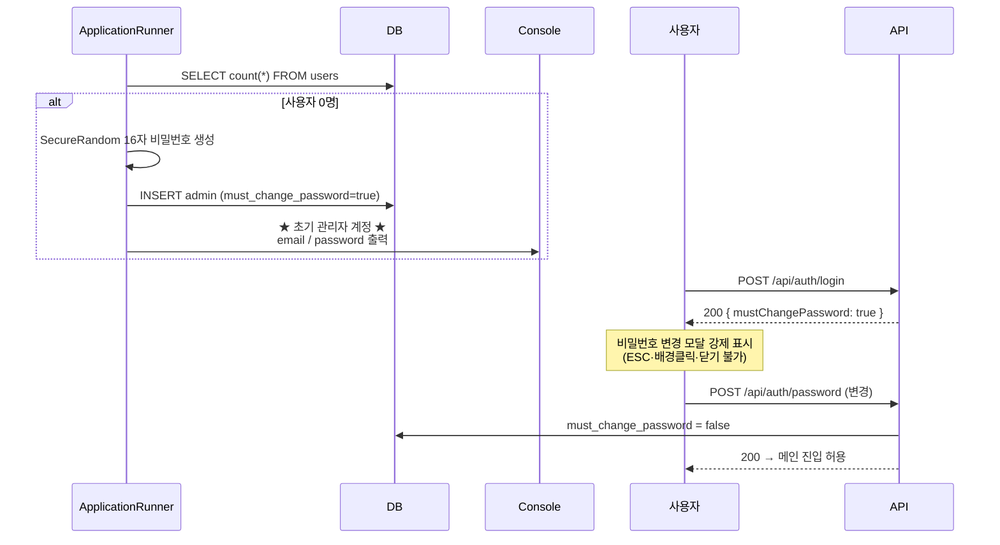

**강제화 구현**: `must_change_password=true`인 세션은 서버 인터셉터가 `/api/auth/password`와 `/api/auth/logout`을 제외한 **모든 API를 403으로 차단**합니다. 프론트에서 모달만 띄우는 건 우회 가능하므로 서버 차단이 필수입니다.

### 6.2 세션 정책

| 항목 | 값 |
|---|---|
| 저장소 | **Spring Session Data Redis** (Session 2.1.1에서 단일 세션 저장소로 확정) |
| Idle Timeout | 30분 |
| 갱신 | 모든 인증 API 요청 시 sliding renewal |
| 만료 예고 | 남은 3분 시점에 경고 모달 (연장 / 로그아웃) |
| 쿠키 | `HttpOnly`, `SameSite=Lax`, 운영은 `Secure` |
| CSRF | Spring Security CSRF 토큰, shell의 `<meta>`에 심어 fetch 헤더로 전달 |

### 6.3 사용자 활성/비활성

`enabled = false`인 계정은 **로그인 자체가 불가능**합니다. Spring Security의 `UserDetails.isEnabled()`를 그대로 활용하면 `DisabledException`이 발생하므로 별도 분기가 필요 없습니다.

| 항목 | 처리 |
|---|---|
| 로그인 시도 | `403 { code: "ACCOUNT_DISABLED" }` — 존재 여부는 노출하지 않음 |
| **접속 중 비활성화** | `SessionRegistry` / `SpringSessionBackedSessionRegistry`로 해당 principal의 세션 전량 즉시 만료 |
| 권한 | **활성 사용자는 전원 매물 등록·수정·채점 가능.** 등록 권한에 별도 역할 게이트 없음 |
| ADMIN 전용 | 사용자 CRUD, 활성/비활성 토글, 가중치 설정 |
| 안전장치 | 자기 자신 비활성화 불가 · 마지막 활성 ADMIN 비활성화 불가 |
| 데이터 | 비활성 사용자가 등록한 매물과 작성한 의견은 **보존**. 작성자 표기는 `닉네임(비활성)` |

**비활성화는 삭제의 대체 수단으로 쓰는 것을 권합니다.** Session 16-I10에서 지적한 "삭제 시 총점이 흔들리는 문제"가 비활성화로 자연스럽게 해결됩니다. 다만 채점 반영 여부는 별도 정책이 필요합니다(Session 16-I13).

**SPA 특유의 문제**: XHR이 401을 받았을 때 로그인 페이지 HTML이 리다이렉트로 돌아오면 JSON 파싱이 깨집니다. `AuthenticationEntryPoint`를 커스터마이즈해 `/api/**`는 항상 `401 JSON`을 반환하도록 하고, 프론트 fetch 래퍼가 401을 감지해 로그인 모달을 띄웁니다.

---

### 6.4 Admin에 의한 사용자 비밀번호 리셋 (D24, 신규)

회원가입·이메일 발송이 없는 폐쇄형 구조이므로, 사용자가 비밀번호를 잊으면 **Admin이 강제로 리셋**하는 경로만 존재합니다.

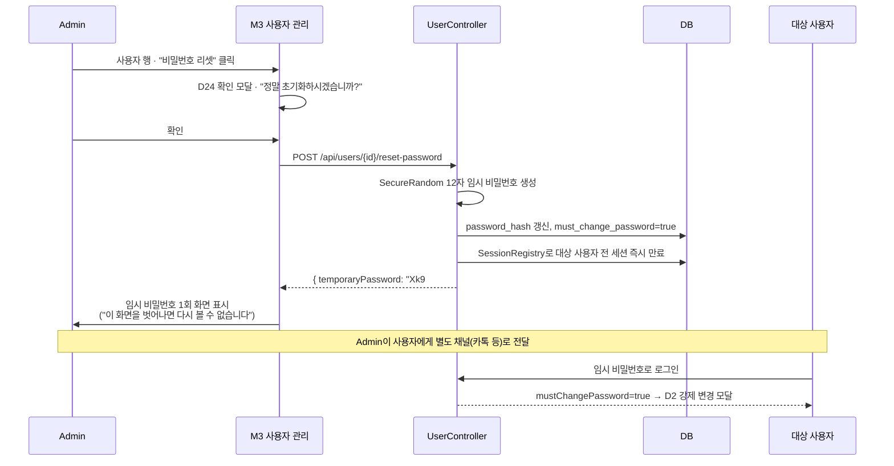

**설계 원칙**

1. **임시 비밀번호는 응답 바디로 딱 1회만 반환합니다.** DB에는 해시만 저장하고, 조회 API로 재확인할 수 없습니다. 화면에 표시된 값을 Admin이 복사해 직접 전달합니다.
2. **리셋 즉시 기존 세션을 전량 종료합니다.** 비밀번호를 잊었다는 건 보통 기기를 잃어버렸거나 계정 문제가 있다는 신호이므로, 리셋 시점에 열려 있는 세션(다른 기기 포함)을 모두 끊는 것이 안전합니다.
3. **`must_change_password=true`가 자동으로 붙습니다.** Session 6.1의 최초 부팅 시나리오와 동일한 강제 변경 모달(D2)을 재사용하므로 별도 UI를 새로 만들 필요가 없습니다.
4. **자기 자신은 이 경로를 쓸 수 없습니다.** Admin이 본인 비밀번호를 잊으면 `/me`의 일반 비밀번호 변경(현재 비번 필요)만 가능하고, 그마저 잊으면 DB 직접 수정 또는 애플리케이션 재기동 시 사용자 0명 조건이 아니므로 **부트스트랩도 재발동하지 않습니다** — Session 16-I31 참조.

**UX 디테일**

- 리셋 버튼은 사용자 행의 `⋮` 메뉴 안에 배치(오조작 방지) — 삭제 버튼과 시각적으로 분리
- 임시 비밀번호 표시 화면에 **"복사" 버튼**과 함께 QR 코드는 넣지 않습니다(전달 채널이 카톡 등 텍스트이므로 QR은 과함)
- 표시 화면을 벗어나기 전 "전달을 완료하셨나요?" 재확인 없이 바로 닫히게 둡니다 — 막는다고 안전해지지 않고 조작만 늘어남

## 7. 화면 정의

### 7.1 Main Frame (5개)

| # | 라우트 | 이름 | 구성 |
|---|---|---|---|
| M1 | `/` | 메인 (매물 비교) | 좌 리스트 3 : 우 지도 7 |
| M2 | `/properties/:id` | 매물 상세 | 우측 슬라이드 패널 (지도 위 오버레이) |
| M3 | `/admin/users` | 사용자 관리 | Admin 전용, 테이블 |
| M4 | `/admin/criteria` | 평가 기준·가중치 | Admin 전용, 드래그 정렬 |
| M5 | `/me` | 내 프로필 | 닉네임·직장 위치·비밀번호 |
| M6 | `/admin/settings` | 시스템 설정 | Admin 전용, 탭: Slack/배치/채점/대출 |
| M7 | `/itinerary` | **임장 플래너** | 좌 시간표 3 : 우 지도 7 (Session 10) |

**M1 상세 레이아웃**

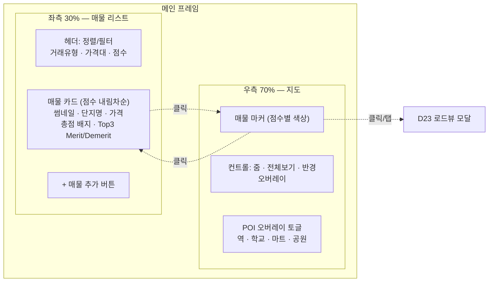

- 최초 진입: 전 매물을 포함하는 `LatLngBounds`로 `map.setBounds()`
- 리스트 클릭: 해당 매물로 `panTo()` + zoom 17 + InfoWindow
- 지도 마커 클릭: 리스트 해당 카드로 스크롤 + 하이라이트
- **지도 마커 클릭/탭 → D23 로드뷰 모달** (아래 7.3)

### 7.3 로드뷰 모달 (D23, 신규)

마커를 누르면 InfoWindow 대신(또는 InfoWindow의 "로드뷰 보기" 버튼으로) 전체 화면 모달이 뜹니다.

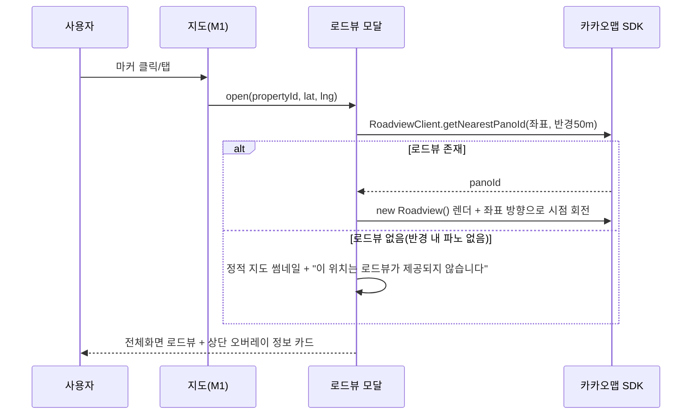

**레이아웃**
- 배경: 카카오 `Roadview` 컴포넌트 전체화면 (드래그로 시점 회전·이동 가능)
- **상단 오버레이(top layer)**: 반투명 카드 — 단지명·동, 거래유형·가격, 총점 배지, 층/향, 입주가능일. 매물 리스트 카드와 동일 정보를 축약
- 우상단: 닫기(X), "매물 상세로 이동" 버튼
- 좌하단: 나침반 + "매물 방향으로" 버튼(파싱된 `direction` 값으로 시점 자동 회전) + "위치가 다른가요? 지도에서 직접 지정" 버튼(Session 16-I34)

**구현 메모**
- 카카오맵 JS SDK `kakao.maps.RoadviewClient`로 최근접 파노라마 ID를 조회하고, 반경 내 파노가 없으면(신축·골목 안쪽 등) 실패를 정상 케이스로 처리 — 에러 토스트가 아니라 "로드뷰 미제공" 안내
- 모바일에서는 로드뷰 자체가 무거우므로(WebGL) 저사양 기기 대응으로 정적 파노 썸네일 우선 로드 후 인터랙티브 전환 옵션 제공
- 좌표 정확도가 파싱된 지오코딩 결과에 의존하므로, 지번주소 지오코딩이 부정확하면 엉뚱한 건물의 로드뷰가 뜰 수 있음 — Session 16-I34

### 7.2 Modal (16개)

| # | 모달 | 트리거 | 권한 | 비고 |
|---|---|---|---|---|
| D1 | 로그인 | 비인증 접근 | ALL | 배경 `backdrop-filter: blur(8px)`, 닫기 불가 |
| D2 | 비밀번호 강제 변경 | `mustChangePassword` | ALL | ESC·배경클릭 차단, 서버에서도 차단 |
| D3 | 세션 만료 경고 | 잔여 3분 | ALL | 연장 / 로그아웃 |
| D4 | 사용자 생성 | M3 | ADMIN | 닉네임·이메일·비번·직장명·직장좌표 |
| D5 | 사용자 수정 | M3 | ADMIN | |
| D6 | 사용자 삭제 확인 | M3 | ADMIN | 해당 사용자 채점 데이터 처리 방식 선택 |
| D7 | 직장 위치 지정 | D4/D5/M5 | ALL | **지도 임베드 + 주소검색 + 핀 드래그** |
| D8 | 매물 추가 방식 선택 | M1 `+` | ALL | URL 등록 / 수기 입력 분기 |
| D9 | **붙여넣기 등록** | D8 | ALL | 3-Step: 텍스트 입력 → 프리뷰(원문 대조) → 사진. 모바일은 URL만 DRAFT 저장 |
| D10 | 매물 수기 등록·수정 | D8, M2 | ALL | 탭: 기본 / 거래 / 건물 / 중개인 / 사진 |
| D11 | 중개인 관리 | D10 | ALL | 1:N 추가·삭제, 기존 중개인 검색 재사용 |
| D12 | 사진 업로드 | D10 | ALL | 도면 1장 + 실사 N장, 드래그 정렬, EXIF 회전 보정 |
| D13 | 사진 뷰어(라이트박스) | M2 | ALL | 스와이프, 핀치 줌 |
| D14 | 평가 채점 | M2 | ALL | 항목별 슬라이더, 자동/수동 배지, 폴백 사유 |
| D15 | 가중치·우선순위 설정 | M4 | ADMIN | 드래그 정렬 → 실시간 순위 프리뷰 |
| D16 | 대출 한도 시뮬레이션 | M2 | ALL | 소득·현금·생애최초 여부 입력 → 한도·필요현금·월상환 |
| D17 | 매물 삭제 확인 | M1, M2 | ALL | |
| D18 | 재채점 진행 | 가중치 변경·사용자 추가 | ADMIN | 진행률 + 실패 항목 요약 |
| D19 | 사용자 활성/비활성 확인 | M3 | ADMIN | 세션 강제 종료 경고, 채점 반영 여부 선택 |
| D20 | 매물 점검 이력 | M2 | ALL | 일별 판정 로그, 오탐 시 "판매중으로 되돌리기" |
| D21 | 판매완료 알림 확인 | 로그인 시 신규 감지 | ALL | 전날 감지된 판매완료 매물 요약 |
| D22 | Slack 연결 테스트 | M6 | ADMIN | 토큰·채널 검증 후 테스트 메시지 발송 |
| D23 | **로드뷰 모달** | M1 지도 마커 클릭/탭 | ALL | 전체화면 카카오 로드뷰 + 상단 정보 오버레이 (Session 7.3) |
| D24 | **임시 비밀번호 리셋** | M3 사용자 행 | ADMIN | 확인 → 임시 비번 생성 → 화면 표시(1회) + 세션 강제 종료 |

> D1~D3은 시스템 모달(닫기 제한), D4~D18은 일반 모달. 모바일에서는 D8~D16을 **full-screen sheet**로 전환합니다.

---

## 8. REST API 명세 (요약)

| Method | Path | 설명 | 권한 |
|---|---|---|---|
| POST | `/api/auth/login` | 로그인 | ALL |
| POST | `/api/auth/logout` | 로그아웃 | AUTH |
| POST | `/api/auth/password` | 비밀번호 변경 | AUTH |
| GET | `/api/auth/session` | 세션 상태·잔여시간 | AUTH |
| GET | `/api/users` | 사용자 목록 | ADMIN |
| POST | `/api/users` | 사용자 생성 | ADMIN |
| PUT/DELETE | `/api/users/{id}` | 수정·삭제 | ADMIN |
| PATCH | `/api/users/{id}/status` | 활성/비활성 토글 | ADMIN |
| POST | `/api/users/{id}/reset-password` | 임시 비밀번호 리셋 (1회 반환) | ADMIN |
| PUT | `/api/users/me/workplace` | 내 직장 좌표 | AUTH |
| GET | `/api/properties` | 목록 (정렬·필터·점수 포함) | AUTH |
| POST | `/api/properties` | 수기 등록 | AUTH |
| POST | `/api/properties/parse-preview` | **붙여넣기 텍스트 파싱 (미저장, 프리뷰)** | AUTH |
| POST | `/api/admin/properties/reparse` | 저장된 원문으로 일괄 재파싱 | ADMIN |
| GET/PUT/DELETE | `/api/properties/{id}` | 상세·수정·삭제 | AUTH |
| POST | `/api/properties/{id}/images` | 이미지 업로드 (multipart) | AUTH |
| PUT | `/api/properties/{id}/scores` | 수동 채점 | AUTH |
| POST | `/api/properties/{id}/rescore` | 자동 재채점 트리거 | AUTH |
| GET/POST/DELETE | `/api/properties/{id}/opinions` | Merit/Demerit | AUTH |
| POST | `/api/properties/{id}/loan-estimate` | 대출 시뮬레이션 | AUTH |
| PATCH | `/api/properties/{id}/status` | 판매완료 ↔ 판매중 수동 전환(오탐 복구) | AUTH |
| GET | `/api/properties/{id}/check-logs` | 생존 점검 이력 | AUTH |
| POST | `/api/admin/listing-check/run` | 배치 수동 실행 | ADMIN |
| GET | `/api/admin/settings` | 시스템 설정 조회 (SECRET 마스킹) | ADMIN |
| PUT | `/api/admin/settings` | 시스템 설정 변경 | ADMIN |
| POST | `/api/admin/settings/slack/test` | Slack 연결 테스트 발송 | ADMIN |
| GET | `/api/admin/notifications` | 알림 발송 이력 | ADMIN |
| GET/PUT | `/api/criteria/weights` | 가중치 조회·설정 | GET:AUTH / PUT:ADMIN |
| GET | `/api/geo/search` | 주소·장소 검색 프록시 | AUTH |

**API 키는 전량 서버 보관.** 카카오·ODsay 호출은 반드시 백엔드 프록시를 경유합니다(지도 SDK용 JS 키만 클라이언트 노출).

---

## 9. 매물 수집 — 붙여넣기 파싱

### 9.1 방식 결정

검토 결과 **네이버 부동산 매물 상세 화면의 텍스트를 붙여넣어 파싱**하는 방식을 채택합니다. 실측 결과 48개 필드가 파싱되고 실패 0건이었습니다.

| 방식 | 판정 | 근거 |
|---|---|---|
| 네이버 공개 API | ✕ 불가 | 부동산 매물 API가 존재하지 않음 (Session 3.3) |
| 서버 크롤링 | △ 보조 | CSR 렌더링·봇 차단·약관 리스크 |
| **텍스트 붙여넣기** | **○ 채택** | 사용자 브라우저가 렌더한 결과를 그대로 사용 |
| 수기 입력 | ○ 폴백 | 파싱 실패 필드만 |

### 9.2 파싱으로 확보되는 필드

| 그룹 | 필드 |
|---|---|
| 식별 | 단지명, 동, **매물번호(`naverArticleNo`)** |
| 거래 | 거래유형, 매매가/보증금/월세, 평당가, 융자금, 관리비 |
| 면적·구조 | 공급면적, 전용면적, 해당층/총층, 방/욕실, 향, 복층여부 |
| 입주 | 입주가능일 유형, 입주가능일(초순/중순/하순 → 5/15/25일 추정) |
| 단지 | 지번주소, 사용승인일, 연차, 세대수, 현관구조, 난방, **주차 세대당 대수**, 용적률/건폐율, 관리사무소 전화, 건설사 |
| 중개사 | 성명, 사무소명, 전화(유선·휴대), 등록번호 |
| 비용 | 취득세, 재산세, 중개보수 상한·요율, 관리비 월평균 |
| 대출 | 규제지역 구분, LTV 비율, 대출 한도, **KB시세** |
| 입지 | 배정 초등학교명·거리·도보시간, **지하철역별 거리·도보시간** |

**`kbPrice`(KB시세)는 반드시 별도 저장해야 합니다.** 대출 한도는 호가가 아니라 KB시세 기준으로 산출됩니다. 실측 사례에서 호가 15억 / KB시세 13.5억으로 1.5억 차이가 났고, 이를 구분하지 않으면 대출 계산이 전부 틀립니다.

### 9.3 파싱 로직

**전략: 거대 정규식이 아니라 "라벨 인접성"**

네이버는 `라벨 \n 값` 구조를 일관되게 사용합니다. 라벨을 찾아 다음 유효 라인을 읽는 방식이 레이아웃 변경에 훨씬 강합니다 — 한 필드가 깨져도 나머지는 살아남습니다.

```java
public interface FieldExtractor<T> {
    String key();
    ParseResult<T> extract(TextDocument doc);
}

public record ParseResult<T>(
    T value,
    Confidence confidence,   // EXACT | DERIVED | MISSING
    String rawSnippet,       // 원문 근거 — 프리뷰 하이라이트용
    String note              // "초순 → 5일로 추정" 등
) {}
```

| 계층 | 방법 | 예 |
|---|---|---|
| 1 | 라벨 인접 (`after("전용면적")`) | 기본 정보·단지 정보 대부분 |
| 2 | 중복 라벨 + 값 패턴 (`afterMatching("중개 보수", "만원\|억")`) | 섹션 헤더와 라벨이 같은 문자열일 때 |
| 3 | 전역 정규식 (`MULTILINE` 필수) | 거래유형·가격·KB시세 |
| 4 | 블록 반복 파싱 | 지하철역 목록, 실거래 이력 |
| 5 | 실패 → `MISSING` 기록 | 프리뷰에서 사용자 입력 유도 |

**금액 파싱은 전용 유틸로 분리합니다.** `15억`, `13억 5,000만원`, `4,950만원`, `17만 4,081원`이 모두 다른 형태입니다.

```java
static Long toWon(String raw) {   // "13억 5,000만원" → 1,350,000,000
    // (\d+)억 + ([\d,]+)만 + ([\d,]+)원 조합
}
```

**필수 원칙 세 가지**

1. **실패를 조용히 넘기지 않는다.** 정규식 미스매치 시 예외를 던지지 않고 `MISSING`으로 기록해 프리뷰에 노출합니다. 실측 중 `Pattern.MULTILINE` 누락으로 거래유형과 매매가가 **에러 없이 사라지는** 사고가 있었습니다.
2. **원문을 보존한다.** `raw_paste_text`에 붙여넣은 텍스트를 그대로 저장하고 `parser_version`을 기록합니다. 파서를 개선하면 저장된 원문으로 **일괄 재파싱**할 수 있습니다 (Session 16-I25 참조).
3. **실제 복사 샘플을 fixture로 고정한다.** 매물 유형별(매매/전세/월세, 집주인확인/일반, 아파트/오피스텔) 실제 텍스트를 `src/test/resources/fixtures/`에 넣고 회귀 테스트를 돌립니다. 네이버 레이아웃 변경은 이 테스트가 빨간불로 알려줍니다.

### 9.4 UI/UX

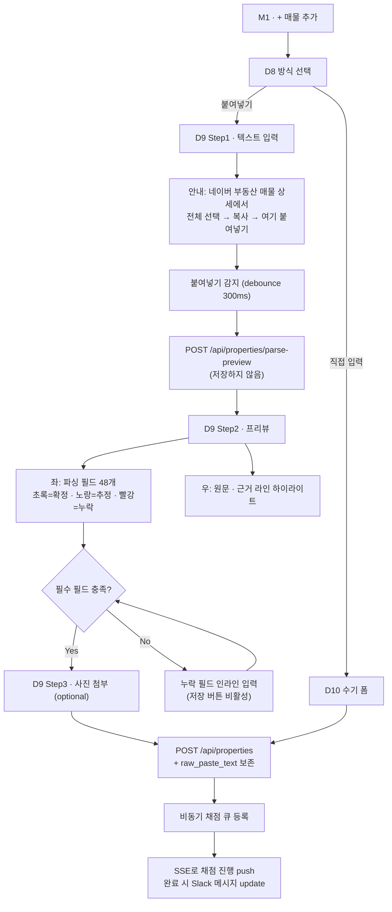

**Step 1 — 입력**

- 화면 대부분을 차지하는 단일 `textarea`. 라벨 없이 placeholder로만 안내
- 붙여넣는 즉시 파싱 (버튼 누르게 하지 않음). 300ms debounce
- 붙여넣은 텍스트가 네이버 매물 상세 형식이 아니면 (`매물번호` 라벨 부재) "매물 상세 화면 텍스트가 아닌 것 같습니다" 경고 후 수기 입력 제안
- **단지 페이지를 붙여넣은 경우를 별도로 감지**해 안내합니다. 사용자가 흔히 혼동하는 지점이고, 단지 페이지에는 동/호·층·향·호가가 없습니다

**Step 2 — 프리뷰 (핵심 화면)**

2단 레이아웃. 좌측은 파싱된 필드, 우측은 원문입니다.

| 상태 | 표시 | 동작 |
|---|---|---|
| `EXACT` | 초록 체크 + 값 | 클릭 시 우측 원문의 근거 라인 하이라이트 |
| `DERIVED` | 노란 배경 + 추정 근거 | "2027년 01월 초순 → 2027-01-05로 추정" 툴팁, 직접 수정 가능 |
| `MISSING` | 빨간 테두리 + 입력 필드 | 필수 필드면 저장 차단 |

- 필드를 클릭하면 우측 원문에서 해당 라인으로 스크롤 + 하이라이트 → **파싱이 맞는지 3초 안에 눈으로 검증**할 수 있습니다
- 상단에 요약 배지: `48개 확정 · 2개 추정 · 0개 누락`
- **입주가능일이 결혼식 데드라인 이후면 즉시 경고 배너.** 실측 사례가 2027년 1월이었고, 이건 다른 조건을 볼 필요 없이 탈락입니다. 등록은 허용하되 눈에 띄게 표시합니다
- 지하철 도보시간·초등학교 거리가 파싱되면 "역세권 53점 / 교육 25점(초등 확인)" 같은 **예상 점수를 미리 보여줍니다**

**Step 3 — 사진**

도면 1장 + 실사 N장. 붙여넣기로는 사진이 안 오므로 이 단계만 수동입니다. 건너뛰기 허용.

**모바일 제약 — 실질적으로 PC/iPad 전용 기능입니다**

iPhone에서 네이버 앱의 매물 상세 텍스트를 전체 선택·복사하는 것은 사실상 불가능합니다(앱 공유 기능은 링크만 제공). 따라서:

- 모바일에서는 **`DRAFT` 상태로 URL만 저장**하는 경로를 제공합니다. 임장 현장에서 URL만 던져두고, 귀가 후 PC에서 텍스트를 붙여 완성합니다
- `DRAFT` 매물은 리스트에 별도 섹션으로 표시하고 채점하지 않습니다
- 모바일 D9는 URL 입력 + 메모만 받는 축소 폼으로 전환합니다

### 9.6 모바일 DRAFT 등록 (확정 — Full 붙여넣기 지원)

**모바일에서도 D9 Full 플로우를 그대로 제공합니다.** iOS Safari(네이버 앱 아님)에서 네이버 부동산 웹 버전에 접속하면 텍스트 선택·복사가 가능하므로, "모바일=축소 입력"으로 단정하지 않고 **PC와 동일한 3-Step**을 모바일 레이아웃(Session 10 Bottom Sheet)으로 제공합니다.

**DRAFT는 별개의 빠른 경로로 유지합니다.** 중개사와 대화 중이라 텍스트를 복사할 여유가 없는 상황을 위한 **탈출구**입니다.

| | 경로 A: DRAFT (긴급) | 경로 B: Full 붙여넣기 (모바일도 지원) |
|---|---|---|
| 트리거 | M1 `+` → "빠른 저장" | M1 `+` → "붙여넣기로 등록" |
| 필수 입력 | 원본 URL + 메모 | 텍스트 전체 (D9 Step 1~3, PC와 동일 UI) |
| 소요 | 약 10초 | PC와 동일 — iOS Safari 기준 약 1~2분 |
| 결과 | `is_draft = true` | `is_draft = false`, 즉시 채점 큐 등록 |

**모바일 D9 레이아웃 차이**

- Step 1의 `textarea`는 `min-height: 40vh`, 키보드 표시 시 자동 스크롤
- Step 2 프리뷰는 좌우 분할이 아니라 **탭 전환**(파싱 결과 / 원문 대조)으로 바뀝니다 — 화면 폭이 부족하므로
- `paste` 이벤트가 iOS Safari에서 `textarea` 포커스 없이는 불안정하므로, textarea를 탭하면 자동 포커스 + "여기를 길게 눌러 붙여넣기" 안내 오버레이를 표시
- 네이버 앱 인앱 브라우저는 클립보드 API 제약이 있어 **"Safari에서 열기" 안내 배너**를 조건부로 노출 (User-Agent로 감지)

**승격 플로우 (DRAFT → 정식)**: 리스트의 "작성 중" 항목 클릭 → D9 Step 1로 진입(URL 유지) → 텍스트 붙여넣기 → 프리뷰 확인 → 저장 시 `is_draft = false` 전환 + 채점 큐 등록. PC·모바일 어느 쪽에서도 승격 가능합니다.

### 9.7 파서 취약 지점

| 위험 | 완화 |
|---|---|
| 네이버 레이아웃 변경 | fixture 회귀 테스트 + 라벨 인접 전략 + 원문 보존 후 재파싱 |
| 라벨 중복 (`위치`가 단지·중개사 양쪽에 등장) | 섹션 경계를 먼저 잡고 그 안에서 탐색 |
| 전화번호 연결 (`02-312-9595010-2272-6242`) | 정규식 `(0\d{1,2}-\d{3,4}-\d{4})` 반복 매치로 분리 |
| 월세 `5,000/80` 형태 | `/` 분리 후 보증금·월세 각각 파싱 |
| 오피스텔·빌라 등 다른 유형 | 필드 집합이 다름. 유형별 fixture 필수 |
| 초순/중순/하순 | 5/15/25일로 추정하고 `DERIVED` 표시 |

---

## 10. 임장 동선 최적화 (신규)

### 10.1 사용자 플로우

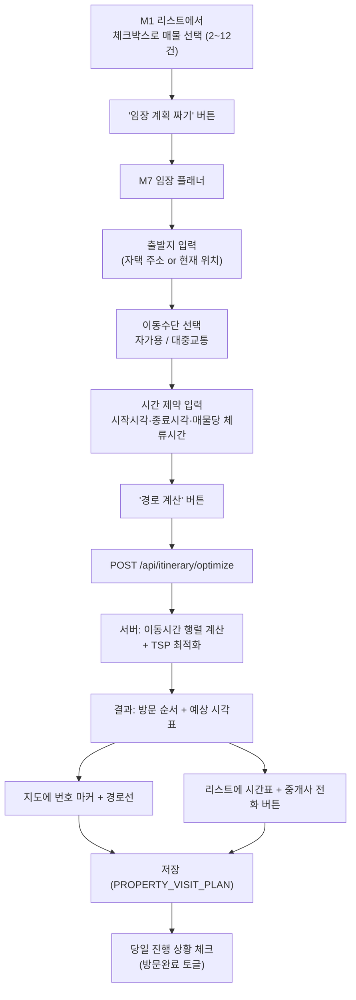

**가정 명시** (요구사항에 없던 값은 아래 기본값으로 확정하고 설정 가능하게 둡니다)

| 항목 | 기본값 | 근거 |
|---|---|---|
| 매물당 체류시간 | 25분 | 이전 대화의 실측 임장 스케줄과 유사 |
| 매물 간 최소 간격 | 이동시간 그대로 (버퍼 없음) | 사용자가 여유를 원하면 시작시각을 늦게 잡음 |
| 중개사 영업시간 | 09:00~19:00 | 매물의 실제 영업시간 데이터가 없으므로 통상값 가정 |
| 이동수단 기본값 | 대중교통 | Session 3.2에서 ODsay를 이미 채택했으므로 재사용 |
| 최대 매물 수 | 12건 (하드 캡) | Session 16-I38 정책 확정 |

### 10.2 데이터 모델

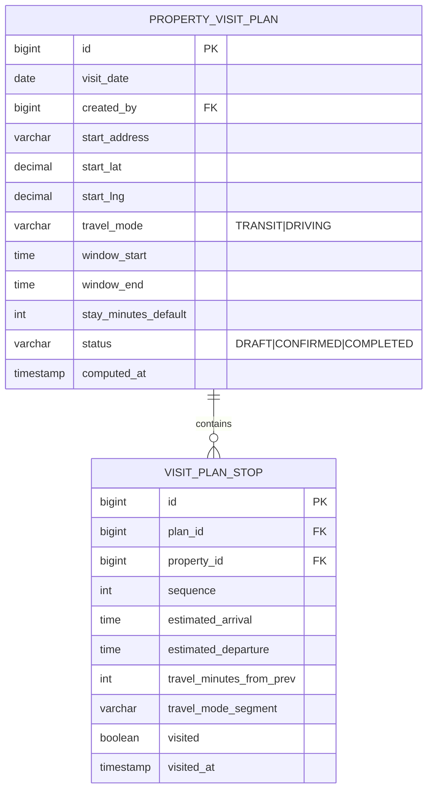

### 10.3 최적화 알고리즘 — Held-Karp (정확해)

매물 수가 실질적으로 2~12건 범위이므로, 근사 알고리즘이 아니라 **정확한 TSP 해**를 씁니다.

**왜 정확해로 확정할 수 있는가**: Held-Karp 동적계획법의 시간복잡도는 `O(n² × 2ⁿ)`입니다. n=12(Session 16-I38에서 확정한 하드 캡)일 때 약 144 × 4096 ≈ 59만 연산으로, 서버에서 수십 밀리초 안에 끝납니다. **12건 상한이 정책으로 고정되었으므로 근사 알고리즘 분기는 두지 않습니다** — 항상 정확해를 반환합니다.

```java
public class ItineraryOptimizer {

    /** stops[0]은 출발지(가상 노드, 방문 대상 아님) */
    public List<Integer> solve(int[][] travelMinutes) {
        int n = travelMinutes.length;   // n ≤ 13 (매물 12 + 출발지 1), 서비스 계층에서 상한 보장
        int full = 1 << n;
        double[][] dp = new double[full][n];
        int[][] parent = new int[full][n];
        for (double[] row : dp) Arrays.fill(row, Double.MAX_VALUE);
        dp[1][0] = 0;  // 출발지에서 시작, 출발지만 방문한 상태

        for (int mask = 1; mask < full; mask++) {
            for (int u = 0; u < n; u++) {
                if ((mask & (1 << u)) == 0 || dp[mask][u] == Double.MAX_VALUE) continue;
                for (int v = 0; v < n; v++) {
                    if ((mask & (1 << v)) != 0) continue;
                    int next = mask | (1 << v);
                    double cost = dp[mask][u] + travelMinutes[u][v];
                    if (cost < dp[next][v]) {
                        dp[next][v] = cost;
                        parent[next][v] = u;
                    }
                }
            }
        }
        // 전체 방문 상태 중 최소 비용 종점 역추적
        return backtrack(dp, parent, full - 1);
    }
}
```

**왕복이 아니라 편도**입니다 — 마지막 매물에서 귀가하는 경로는 최적화 대상에 넣지 않습니다(굳이 출발지로 돌아올 필요가 없으므로). `dp[full-1][end]`가 최소인 `end`를 찾아 역추적하면 됩니다.

**시간 제약(영업시간·window)은 2단계로 분리**합니다. 1단계는 순수 이동시간 합이 최소인 순서를 Held-Karp으로 구하고, 2단계는 그 순서에 시각을 배치하면서 `window_start`~`window_end`를 벗어나는지만 검증합니다. 순서와 스케줄링을 함께 최적화하는 진짜 TSP-TW는 훨씬 복잡한데, 매물이 12건 이하인 개인용 앱에서 그 복잡도는 과합니다. 검증에서 실패하면 "이 순서로는 19시를 넘깁니다 — 매물을 줄이거나 시작을 당기세요"라고 안내하고 순서 자체는 그대로 보여줍니다.

### 10.4 이동시간 행렬 계산

`n`개 매물 + 출발지 = `n+1`개 노드, 필요한 쌍은 `(n+1) × n`개(자기 자신 제외, 방향성 있음 — 대중교통은 A→B와 B→A 소요시간이 다를 수 있음).

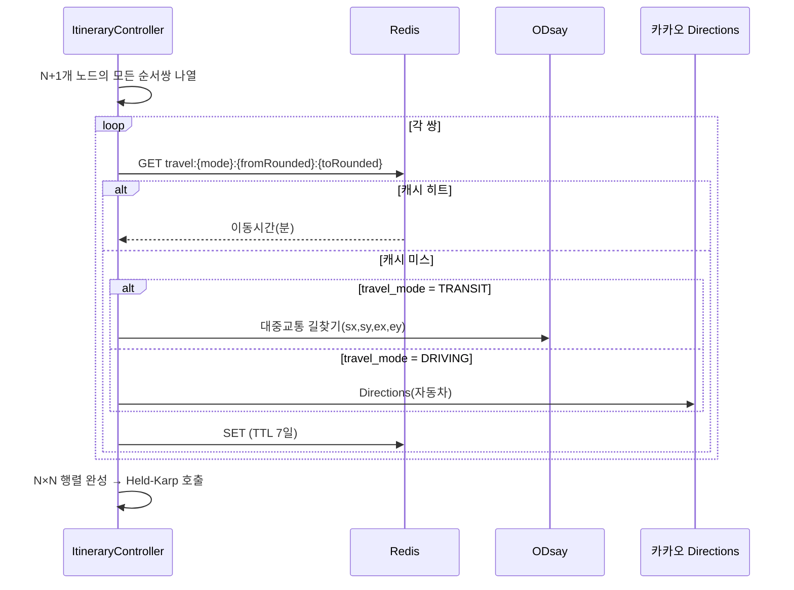

- N=8이면 최대 56회 API 호출인데, **Redis 캐시(좌표 100m 반올림 키, TTL 7일)로 실질 호출은 재계산 시 대부분 캐시 히트**가 됩니다. 매물 목록이 자주 바뀌지 않는 임장 계획 특성상 재사용률이 높습니다
- 병렬 호출로 지연을 줄입니다 (`CompletableFuture.allOf`), ODsay 쿼터(Session 16-I9)를 고려해 동시성은 5로 제한
- 대중교통 소요시간에는 환승 대기시간이 포함되므로, 자가용보다 변동성이 큽니다 — 계산 시점의 스냅샷이라는 점을 UI에 명시

### 10.5 UI — M7 임장 플래너 (신규 Main Frame)

지도·리스트 좌우 분할은 M1과 동일 구조를 재사용하되, 우측 지도에 **경로선과 순번 마커**가 추가됩니다.

```
┌─────────────────────┬───────────────────────────┐
│ 좌측 30%              │ 우측 70% — 지도              │
│                      │                            │
│ [출발지: 우리집 ▾]     │     ①━━━━②                 │
│ [대중교통 ▾] [09:00~19:00]│      ┃                  │
│ [경로 재계산]           │      ③━━━━④━━━━⑤          │
│                      │                            │
│ ① 09:00 평창동삼성래미안  │  번호 마커 + 폴리라인 경로     │
│    체류 25분→ 이동 32분  │                            │
│ ② 09:57 홍제삼성래미안    │                            │
│    ☎ 02-730-1248     │                            │
│    ☐ 방문완료          │                            │
│ ③ 10:40 ...          │                            │
└─────────────────────┴───────────────────────────┘
```

- 매물 카드마다 **중개사 전화번호를 원터치로 걸 수 있는 버튼** — Session 9.2에서 확보한 `agentPhones`를 그대로 사용
- 순서를 드래그로 수동 조정할 수 있게 하되, 수동 조정 시 시간표는 재계산하지만 **순서 자체를 다시 최적화하지는 않습니다**(사용자 의도 존중)
- 방문 완료 체크 시 `VISIT_PLAN_STOP.visited=true` — 다음 매물까지 남은 시간이 실시간으로 갱신되어 늦어지는지 한눈에 보입니다
- 인쇄/PDF 내보내기: 현장에서 데이터 없이도 볼 수 있도록 (선택 기능)

### 10.6 API

| Method | Path | 설명 |
|---|---|---|
| POST | `/api/itinerary/optimize` | 매물 ID 목록 + 제약 → 최적 순서 계산 (미저장, 프리뷰) |
| POST | `/api/itinerary/plans` | 계획 저장 |
| GET | `/api/itinerary/plans/{id}` | 계획 조회 |
| PATCH | `/api/itinerary/plans/{id}/stops/{stopId}` | 순서 수동 조정 · 방문완료 토글 |
| POST | `/api/itinerary/plans/{id}/recompute` | 이동시간 재계산(교통 상황 변화 반영) |

### 10.7 이동수단 투트랙 — 자가용 / 대중교통 (확정)

동일한 임장 계획에 두 이동수단이 섞이지 않습니다. 계획을 만들 때 `travel_mode`(`DRIVING` | `TRANSIT`)를 하나 고르면 **그 계획 전체가 그 수단으로 계산**됩니다.

| | 자가용 (DRIVING) | 대중교통 (TRANSIT) |
|---|---|---|
| 이동시간 소스 | 카카오 Directions API | ODsay 대중교통 길찾기 |
| 소요시간 특성 | 교통 상황에 따라 변동, 비교적 안정적 | 배차 간격·환승 대기 포함, 변동성 큼 |
| 부가 정보 | 예상 통행료·유류비 (카카오 응답에 포함) | 환승 횟수·도보 구간 |
| 주차 고려 | **필요** — Session 10.8.1 | 불필요 |
| UI 표시 | 경로선(Kakao Directions 폴리라인) | 경로선 + 환승 아이콘 |

**두 수단을 한 계획에서 섞지 않는 이유**: 자가용은 방문 후 다시 차로 이동하지만 대중교통은 도보 구간이 끼어 체류시간 산정 기준이 달라집니다. 매물 A는 대중교통, B는 도보 5분 거리라 걸어서 이동 같은 혼합은 Held-Karp의 비용 행렬을 이질적으로 만들어 최적해의 의미가 흐려집니다. 대신 **같은 매물 집합으로 두 계획을 각각 만들어 비교**할 수 있게 합니다 — "오늘은 차로 갈까, 대중교통으로 갈까"를 계획 두 개 띄워놓고 소요시간 합계로 비교하면 됩니다.

#### 10.8.1 자가용 추가 고려사항

- **주차 정보 표시**: Session 9.2에서 파싱한 `parking_per_household`(세대당 주차대수)를 매물 카드에 노출 — 방문객 주차 가능 여부의 참고 지표(정확한 방문객 주차 대수는 아님)
- **왕복 유류비 합산**: 카카오 Directions가 구간별 유류비를 반환하므로 계획 하단에 "예상 총 유류비" 표시 (선택 정보, 의사결정에 영향 없음)
- **정체 시간대**: 카카오 Directions는 실시간 교통 반영 옵션이 있으나, Session 10.4의 캐시(TTL 7일)와는 상충합니다 — **자가용 계획은 캐시를 쓰지 않고 매번 실시간 조회**로 예외 처리합니다. 대중교통은 배차 패턴이 상대적으로 안정적이라 캐시를 유지합니다

#### 10.8.2 ERD 갱신

`PROPERTY_VISIT_PLAN.travel_mode`는 이미 Session 10.2에 있던 필드를 그대로 사용합니다. `VISIT_PLAN_STOP.travel_mode_segment`는 항상 계획의 `travel_mode`와 동일하므로 향후 혼합 계획을 지원하지 않는 한 중복 필드입니다 — 현재는 이력 추적용으로 유지합니다.

### 10.8 이슈

**I37. 이동시간 시점 의존성 · [확정 — 수동 재계산 + 이동수단 투트랙]**
자동 재계산은 넣지 않고 수동 "재계산" 버튼으로 확정합니다. 대신 **이동수단을 자가용/대중교통 투트랙으로 분리**합니다(Session 10.8).

**I38. 하루 매물 수 상한 · [확정 — 12건 하드 캡]**
근사 알고리즘 폴백을 없애고 **하루 12건을 정책상 상한으로 고정**합니다. M7에서 13건째를 선택하려 하면 체크박스가 비활성화되고 "하루 임장은 최대 12건입니다"를 표시합니다. Session 10.3의 근사 알고리즘 분기(`n > 12`)는 이제 도달하지 않는 경로이므로 코드에서 제거합니다 — 죽은 코드를 남기지 않습니다.

---

## 11. 반응형 전략

| 브레이크포인트 | 대상 | 레이아웃 |
|---|---|---|
| `≥1280px` | PC | 리스트 30% : 지도 70% 좌우 분할 |
| `768~1279px` | iPad | 리스트 40% : 지도 60%, 리스트 접기 토글 |
| `<768px` | iPhone | **탭 전환** (리스트 ⇄ 지도) 또는 지도 위 **Bottom Sheet** (peek 30% → 확장 85%) |

- CSS Grid + `clamp()` 기반, 프레임워크 없이 구현 가능
- 지도 컨테이너 리사이즈 시 `map.relayout()` 호출 필수
- 터치: 마커 탭 → Bottom Sheet 자동 확장
- iOS Safari `100vh` 문제 → `100dvh` 사용

---

## 12. 매물 생존 확인 배치 (판매완료 감지)

### 11.1 스케줄

```java
@Scheduled(cron = "0 0 9 * * *", zone = "Asia/Seoul")
```

대상은 **`source_url`이 존재하고** `listing_status IN ('ACTIVE','UNREACHABLE')`이며 `is_draft = false`인 매물입니다. 붙여넣기(`PASTE`)로 등록해도 원본 URL을 함께 받으므로 포함되며, 순수 수기 입력 매물만 제외됩니다.

### 11.2 처리 흐름

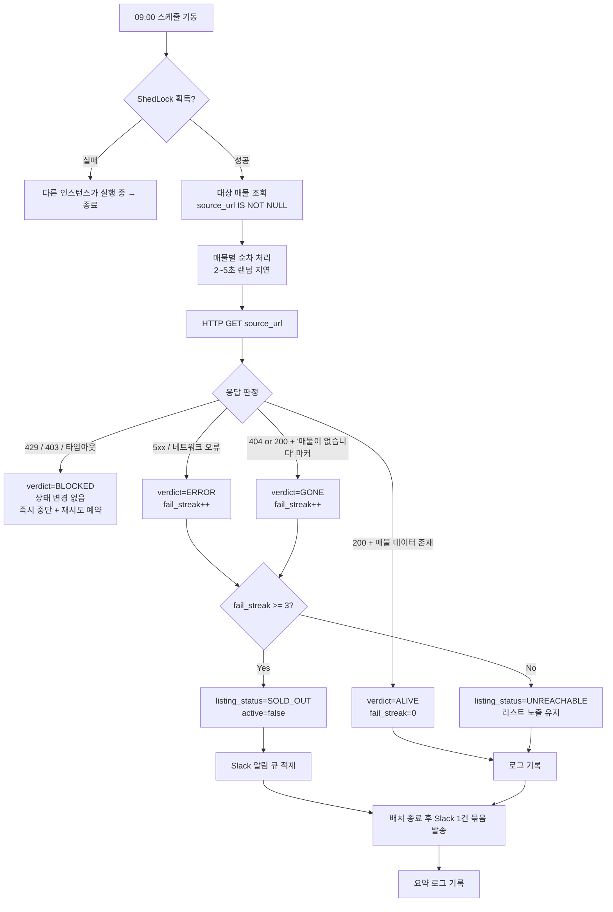

### 11.3 판정 로직 — 여기가 가장 어렵습니다

**네이버페이 부동산은 삭제된 매물에도 HTTP 404를 주지 않습니다.** CSR SPA이므로 껍데기 HTML은 200으로 정상 반환되고, "존재하지 않는 매물입니다" 문구는 JS 실행 후에야 DOM에 나타납니다. 단순히 상태코드만 보면 **모든 매물이 영원히 살아있는 것으로 판정**됩니다.

판정 순서를 다음과 같이 둡니다.

| 단계 | 방법 | 신뢰도 |
|---|---|---|
| 1 | 내부 JSON 엔드포인트 호출 (`articleNo` 기반) → 응답 코드·`body.result` 확인 | 높음 / 스펙 변경 위험 |
| 2 | HTML 내 초기 상태 JSON(`__NEXT_DATA__` 등) 추출 후 매물 객체 존재 확인 | 중간 |
| 3 | 렌더 후 텍스트 마커 탐지 (Playwright) | 높음 / 무겁고 차단 위험 |
| 4 | 전부 실패 → `UNREACHABLE` 로 두고 사용자에게 수동 확인 요청 | — |

**1~3단계 모두 네이버 구현 변경에 취약합니다.** 판정 로직을 `ListingAliveChecker` 인터페이스로 분리하고 전략을 교체 가능하게 두세요. 그리고 **판정 근거 문자열(`evidence`)을 반드시 로그에 남겨야** 파서가 깨졌을 때 원인을 추적할 수 있습니다.

### 11.4 오탐 방지 규칙

판매완료 오판정은 실제 후보를 리스트에서 지워버리므로, 살아있는 매물을 죽었다고 하는 쪽(false positive)이 훨씬 치명적입니다.

- **3일 연속 `GONE` 판정 시에만** `SOLD_OUT` 확정. 1~2일차는 `UNREACHABLE`로 두고 리스트에 그대로 노출
- `403/429`(봇 차단)는 **fail_streak을 올리지 않고** 즉시 배치 중단. 차단당한 상태에서 계속 두드리면 전 매물이 판매완료로 뒤집힙니다
- 파싱 실패(마커도 데이터도 못 찾음)는 `GONE`이 아니라 `ERROR`
- 한 번의 배치에서 **전체 매물의 50% 이상이 `GONE`** 이면 자체 오류로 간주하고 전량 롤백 + 관리자 알림 (서킷 브레이커)
- 사용자가 D20에서 언제든 수동 복구 가능

### 11.5 Slack 알림

알림은 배치 전용이 아니라 **애플리케이션 공통 기능**입니다. 상세 설계는 Session 12로 분리했습니다. 배치가 발행하는 이벤트는 다음과 같습니다.

| 이벤트 | 발행 시점 | 멘션 |
|---|---|---|
| `LISTING_SOLD_OUT` | 3일 연속 GONE 확정 시, 배치 종료 후 1건으로 묶음 | 총점 1~3위 매물이면 `@channel` |
| `BATCH_BLOCKED` | 403/429 감지로 배치 중단 | `@here` |
| `BATCH_CIRCUIT_OPEN` | 서킷 브레이커 발동(50% 이상 GONE) | `@here` |
| `BATCH_SUMMARY` | 매 회차 종료 (정상 시에도 1줄) | 없음 |

### 11.6 판매완료 매물의 취급

| 항목 | 처리 |
|---|---|
| 리스트 | 기본 숨김. "판매완료 포함" 토글로 회색 처리 노출 |
| 지도 | 회색 마커, 기본 비표시 |
| **상대평가** | **`PRICE` min-max 계산에서 제외.** 포함하면 매물이 하나 빠질 때마다 전 매물 가격 점수가 흔들립니다 (Session 16-I6과 직결) |
| 데이터 | 삭제하지 않고 보존 — "이 가격대는 이렇게 빠지는구나"라는 시세 감각 자료가 됩니다 |
| 재채점 | 트리거하지 않음 |

---

## 13. 알림 (Slack) · 시스템 설정

### 12.1 알림 이벤트

| 이벤트 | 트리거 | 묶음 발송 | 멘션 |
|---|---|---|---|
| `PROPERTY_CREATED` | 매물 등록 완료 (수기·URL·붙여넣기 공통) | ✕ 즉시 | 없음 |
| `LISTING_SOLD_OUT` | 판매완료 확정 | ○ 배치당 1건 | Top3면 `@channel` |
| `BATCH_BLOCKED` | 봇 차단 감지 | ✕ | `@here` |
| `BATCH_CIRCUIT_OPEN` | 서킷 브레이커 발동 | ✕ | `@here` |
| `BATCH_SUMMARY` | 배치 종료 | ✕ | 없음 |

**모두 동일 채널로 발송**하며, 채널은 시스템 설정값입니다.

### 12.2 발송 아키텍처

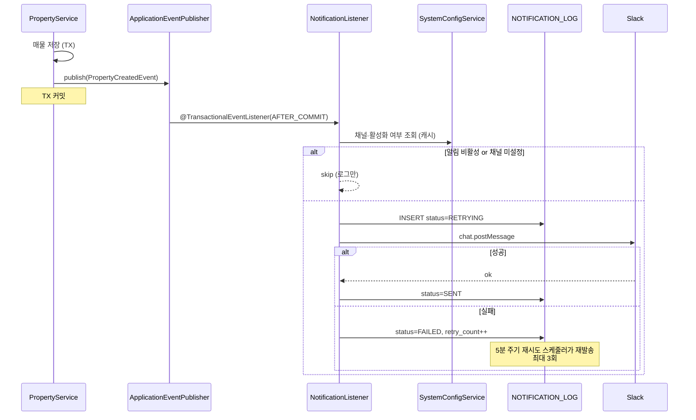

**설계 원칙 세 가지**

1. **`AFTER_COMMIT` 이벤트로 분리.** 매물 저장 트랜잭션 안에서 Slack을 호출하면 Slack 장애가 매물 등록 실패로 이어집니다. 커밋 후 별도 처리해야 합니다.
2. **알림 실패가 업무를 막지 않는다.** `NOTIFICATION_LOG`에 남기고 재시도하되, 사용자에게는 매물 등록 성공으로 응답합니다.
3. **`@Async` + 스레드풀 분리.** 알림용 `TaskExecutor`를 채점 워커와 분리해 서로 영향을 주지 않게 합니다.

### 12.3 메시지 포맷

**매물 등록**

```
:house_with_garden: 새 매물이 등록되었습니다

*독립문삼호 101동*  매매 13억 5,000만원
전용 84.93㎡(25.7평) · 7/15층 · 남동향
3호선 무악재역 도보 11분 · 1995년 준공

등록: 윤선 · 방금 전
총점 74.2 (전체 3위)   [매물 보기]
```

- 총점은 자동 채점 완료 전이면 `채점 중`으로 표기하고, 채점 완료 시 **동일 메시지를 `chat.update`로 갱신**하는 편이 알림 2건보다 낫습니다
- `source_url`이 있으면 원본 링크를 함께 첨부

**판매완료**

```
:house: 판매완료 감지 (2026-08-25 09:00)

• 상계동양메이저 104동  8.5억 매매  (3일 연속 미확인)
  등록: 윤선 · 총점 82.4 (1위)  ← @channel

• 홍제청구3차 301동  10.2억 매매
  등록: 혜미 · 총점 61.0 (5위)

점검 30건 / 정상 27 · 판매완료 2 · 오류 1
```

### 12.4 Slack 연동 — Incoming Webhook (확정)

**Incoming Webhook + `application.yaml` 정의**로 확정합니다.

```yaml
slack:
  enabled: true
  webhook-url: ${SLACK_WEBHOOK_URL}      # 환경변수 주입
  notify:
    property-created: true
    sold-out: true
  mention-top-n: 3
```

**트레이드오프를 명시해 둡니다.** Webhook URL은 생성 시점에 채널이 고정 바인딩되므로 **채널은 런타임에 변경할 수 없습니다.** 채널을 바꾸려면 Slack에서 Webhook을 새로 발급받아 yaml을 수정하고 **재배포**해야 합니다. 개인용 앱에서 채널이 바뀔 일이 거의 없다는 판단이면 합리적인 선택입니다.

이 결정에 따라 `SYSTEM_CONFIG` 테이블의 Slack 항목은 제거하고, **배치·채점·대출 파라미터만** DB에 남깁니다. URL은 `${SLACK_WEBHOOK_URL}` 환경변수로 주입해 yaml에 평문으로 남기지 않습니다.

### 12.5 시스템 설정 (`SYSTEM_CONFIG`)

Slack 관련 항목은 `application.yaml`로 이동했습니다(Session 12.4). DB에는 런타임 조정이 실제로 필요한 값만 둡니다.

| Key | Category | Type | 기본값 | 설명 |
|---|---|---|---|---|
| `batch.listingCheck.enabled` | BATCH | BOOL | `false` | |
| `batch.listingCheck.cron` | BATCH | STRING | `0 0 9 * * *` | |
| `batch.listingCheck.failThreshold` | BATCH | INT | `3` | 판매완료 확정 연속 횟수 |
| `batch.listingCheck.autoDisable` | BATCH | BOOL | `false` | 초기엔 알림만 (Session 16-I14) |
| `scoring.weightCurve` | SCORING | STRING | `ARITHMETIC` | 우선순위→가중치 변환 방식 |
| `scoring.floorPeak` | SCORING | INT | `15` | 층수 최고점 임계값 (Session 5.3) |
| `loan.regulation.profile` | LOAN | STRING | `2025-10-15` | 규제 파라미터 세트 |

**설계 메모**
- `SECRET` 타입은 조회 API에서 `xoxb-****...abc`로 마스킹하고, 저장 시 애플리케이션 레벨 암호화(Jasypt 등) 적용
- 캐시(`@Cacheable`) + 변경 시 `@CacheEvict`. 매 알림마다 DB를 치지 않게 함
- **부팅 시 `application.yml` 값으로 시드**하고, 이후에는 DB가 우선. 환경변수 우선 오버라이드 옵션도 둠(운영 사고 복구용)
- 변경 이력은 `updated_by` / `updated_at`으로 최소한만 추적
- `batch.listingCheck.cron`을 런타임에 바꾸려면 `@Scheduled` 고정 cron이 아니라 `SchedulingConfigurer` + `Trigger`로 구현해야 합니다

### 12.6 설정 화면

새 Main Frame **M6 `/admin/settings`** (ADMIN 전용). 카테고리별 탭(배치 / 채점 / 대출)으로 구성합니다. Slack은 yaml 관리이므로 설정 화면에서는 **현재 연동 상태 표시 + 테스트 발송 버튼**만 제공합니다. Webhook 오설정은 실제로 쏴봐야만 알 수 있습니다.

---

## 14. 배포 · 운영

### 13.1 환경

| 항목 | 값 |
|---|---|
| 도메인 | `https://cena.furaiki-lifelog.com` |
| TLS | Let's Encrypt (Caddy 권장 — 자동 갱신 내장) |
| 구조 | Reverse Proxy(Caddy/nginx) → Spring Boot(8080) → PostgreSQL |
| 프로파일 | `local` / `prod` |

### 13.2 HTTPS 도입 시 필수 설정

리버스 프록시 뒤에 두면 Spring이 자기 스킴을 `http`로 오인해 리다이렉트·쿠키가 깨집니다.

```yaml
server:
  forward-headers-strategy: framework   # X-Forwarded-* 신뢰
  servlet:
    session:
      cookie:
        secure: true
        http-only: true
        same-site: lax
```

**카카오맵 JS 키에 도메인을 등록해야 합니다.** 카카오 개발자 콘솔의 플랫폼 → Web 사이트 도메인에 `https://cena.furaiki-lifelog.com`을 추가하지 않으면 지도가 렌더되지 않습니다. 로컬 개발용 `http://localhost:8080`도 함께 등록해 두세요.

### 13.3 PostgreSQL · MongoDB 사용 범위

**PostgreSQL 단일 사용을 권합니다.** 반정형 데이터(`parse_confidence`, `path_summary`, `payload`)는 JSONB로 충분하고, 인덱싱·트랜잭션·조인이 한 곳에서 끝납니다. 2인용 앱에 DB 두 개를 운영하면 백업 경로도 두 개가 됩니다.

MongoDB를 굳이 쓰신다면 후보는 다음 두 개입니다.

| 대상 | Mongo가 나은 이유 | 그래도 Postgres로 충분한 이유 |
|---|---|---|
| `raw_paste_text` | 대용량 텍스트, 조인 불필요 | TEXT + TOAST 자동 압축 |
| `LISTING_CHECK_LOG` | append-only, 일 30건 누적 | 연 1만 건 — 파티셔닝도 불필요 |

공간 연산(하천·공원 거리 계산)이 필요해지면 **PostGIS**가 답이고, 이건 Mongo로 대체되지 않습니다.

### 13.4 백업

12월 입주까지 4개월간 쌓이는 임장 기록이 날아가면 복구 수단이 없습니다.

- `pg_dump` 일 1회 + 이미지 디렉터리 rsync → 다른 물리 위치
- 최소 7일치 보관
- **Slack 알림에 백업 성공/실패를 포함**하면 별도 모니터링이 필요 없습니다

---

## 15. 개발 로드맵

| 단계 | 범위 | 산출물 |
|---|---|---|
| **P1** | 인증·세션·Admin 부트스트랩, 사용자 CRUD **+ 활성/비활성 + 비밀번호 리셋** | M3·M5, D1~D7, D19, D24 |
| **P2** | 매물 수기 CRUD, 지도 연동, 리스트-지도 동기화 **+ 로드뷰 모달** | M1·M2, D8·D10~D13, D23 |
| **P3** | 채점 엔진 (MANUAL 먼저) + 가중치·정렬 | M4, D14·D15 |
| **P4** | AUTO 채점 (카카오 POI → ODsay 순) | D18 |
| **P5** | **붙여넣기 파서 + D9 프리뷰 UI (PC·모바일 공통)** | D9 |
| **P6** | **시스템 설정 + Slack 알림 (매물 등록)** | M6, D22 |
| **P7** | **생존 확인 배치 + 판매완료 알림** | D20·D21 |
| **P8** | 대출 계산기 **+ 국토부 실거래가 참고 카드** | D16 |
| **P9** | **임장 동선 최적화 (Held-Karp + 이동시간 행렬)** | M7 (Session 10) |
| **P10** | 반응형 마감·성능 | — |
| **P11** | HTTPS 배포 · 백업 자동화 | — |

P6(설정·알림)을 P7(배치)보다 앞에 둡니다. 배치의 결과 통로가 Slack이므로 알림이 먼저 동작해야 배치를 검증할 수 있고, 매물 등록 알림은 배치 없이도 즉시 가치가 있습니다. P7은 P5(파싱)와 같은 파서 자산을 공유하므로 그 뒤에 붙입니다.

**P4를 P3보다 뒤에 둔 이유**: 자동 채점 없이도 앱은 완전히 동작합니다. 외부 API 의존이 가장 큰 부분을 뒤로 미뤄야 앞 단계가 막히지 않습니다.

---

## 16. 이슈 및 결정 필요 사항

### I1. SPA와 Mustache · **[확정 — Alpine.js]**
Mustache는 App Shell(레이아웃·로그인 셸) 전용으로 한정하고, 클라이언트 렌더링은 **Alpine.js**로 처리합니다. `x-data`/`x-for`/`x-show`로 리스트·모달·폼을 선언적으로 다루고, 빌드 도구 없이 CDN 한 줄로 끝나므로 Shell-SPA 구조와 잘 맞습니다. 상태는 `Alpine.store()`로 전역 관리하고, 매물 목록·현재 선택·세션 정보를 여기에 둡니다.

### I2. 네이버 부동산 크롤링 — 법적·기술적 리스크 · **[중대]**
- **법적**: 네이버 이용약관은 자동화 수집을 금지하며 `robots.txt`도 차단합니다. 개인 학습용 소규모 사용은 현실적으로 문제되기 어렵지만, **설계 문서에 "합법"이라고 쓸 수 없는 영역**입니다. 서비스로 공개하거나 대량 수집하면 리스크가 실재합니다.
- **기술적**: 네이버페이 부동산은 CSR(클라이언트 렌더링) SPA입니다. `Jsoup`으로 HTML을 받아도 **매물 데이터가 들어있지 않습니다.** 내부 JSON API를 호출해야 하는데 이는 비공개 스펙이라 예고 없이 바뀌고, 토큰·User-Agent 검증에 걸립니다. Playwright 헤드리스는 무겁고 차단 위험이 큽니다.
- **권고**: 기본은 수기 입력, URL은 "가능하면 채워주는" 보조 기능으로 격하. 또는 **네이버 앱의 "공유하기" 텍스트를 붙여넣으면 정규식으로 파싱**하는 방식이 훨씬 안정적이고 리스크가 낮습니다.

### I3. 층수 채점 · **[확정 — Session 5.3]**
밴드 표기는 저 30 / 중 65 / 고 100, 숫자 표기는 1층 0점 → 15층 100점 선형, **16층 이상은 0점**으로 확정했습니다. 남은 부작용은 I27.

<details><summary>원 이슈 기록</summary>
요구사항에 두 규칙이 함께 있습니다.
- "1층과 **최고층**은 가장 낮은 점수" (숫자층)
- "고/중/저 표기라면 **고가 최고점**" (밴드)

20층 아파트의 20층은 첫 규칙에선 최저점, 둘째 규칙에선 "고"라 최고점이 됩니다. **같은 매물이 데이터 표기 방식에 따라 0점도 100점도 됩니다.** 어느 쪽을 정책으로 삼을지 결정이 필요합니다. (제안: 밴드값도 "중"을 최고점으로 통일하거나, 밴드 데이터는 자동 채점 대상에서 제외하고 수동 채점으로 폴백)
</details>

### I4. "도보 N분"의 정의 · **[결정 필요]**
<cite index="78-1">ODsay 무료 API의 도보 시간은 직선거리 기반입니다.</cite> 실제 도보 경로 API는 유료이고, 국내에서 무료로 쓸 수 있는 도보 경로 엔진이 마땅치 않습니다.
- 옵션 A: 직선거리 × 1.3(우회계수) ÷ 67m/분 — 간단, 무료, 오차 있음
- 옵션 B: OSRM 자체 호스팅 + OSM 데이터 — 정확, 인프라 부담
- **권고: A로 시작.** 언덕(홍제·창신 사례)은 어차피 어떤 API도 반영 못 하므로, 사용자 수동 보정 여지를 남기는 편이 낫습니다.

### I5. "탐방로가 조성된 산", "산책로가 조성된 하천", "헬스장" 판정 불가 · **[대안 필요]**
POI 카테고리로 나오지 않는 개념입니다.
- 산: 카카오 `AT4`(관광명소) + 이름에 "산/봉" 포함 필터 → 정확도 낮음. **대안: 산림청 등산로 데이터셋(공공데이터포털) 1회 적재**
- 하천: **국가하천망 shapefile** 적재 후 PostGIS 거리 계산
- 헬스장: 카테고리 없음 → 키워드 검색 "헬스" (프랜차이즈 누락 다수)
- **권고**: 녹색환경·운동시설은 **HYBRID**로 지정하고, 자동 결과를 초안으로만 쓰고 사용자 확정을 받으세요.

### I6. 가격 채점 · **[확정 — Session 5.2.1]**
사용자별 `available_budget` 합계를 예산 상한으로 삼는 **절대평가**로 확정했습니다. 채점 기준은 호가, 대출 산정은 KB시세. 남은 확인은 I28(예산 필드의 정의).

<details><summary>원 이슈 기록</summary>
"비쌀수록 감점"을 상대평가(리스트 내 min-max)로 하면, **싼 매물 하나를 추가하는 것만으로 기존 매물 점수가 전부 바뀝니다.** 대안:
- 절대 기준: 예산 상한 대비 (`100 × (1 − 가격/예산상한)`) — 안정적, 예산 입력 필요
- 평당가 기준: 면적 왜곡 제거 — 넓은 집이 유리해지는 편향 제거
- **권고: 평당가 기준 + 예산 상한 절대평가.** 매매/전세/월세는 스케일이 완전히 달라 **거래유형별로 분리 채점**해야 합니다.
</details>

### I7. 거래유형 분리 · **[확정 — 대카테고리 분리]**
매매와 전세를 **별도 순위표**로 운영합니다. M1 상단 탭으로 전환하고 `PRICE` 정규화·정렬을 카테고리 내부에서만 수행합니다. 통합 순위는 제공하지 않습니다.

### I8. 대출 한도 자동화의 한계 · **[제약 명시]**
개인 한도를 주는 공개 API는 없습니다. 자체 계산은 **DSR에 반영될 기존 대출(신용대출·마이너스통장·할부)을 앱이 알 수 없어** 과대 추정됩니다. 시뮬레이션 결과에 "은행 가심사 필요" 문구를 상시 노출하고, 사용자가 기존 대출 원리금을 직접 입력하는 필드를 두세요.

### I9. 외부 API 쿼터 · **[운영]**
사용자 N명 × 매물 M건 = `N×M` 대중교통 호출. 사용자 3명·매물 30건이면 90회이며, 사용자 1명 추가 시 30회가 추가됩니다. ODsay 무료 플랜 한도를 초과할 수 있습니다.
- 좌표 반올림(약 100m) 기반 캐시 키로 중복 제거
- 채점 결과 TTL 30일, 수동 갱신 버튼 제공
- Rate limiter + 지수 백오프 필수

### I10. 사용자 삭제 시 채점 데이터 · **[정책 필요]**
사용자를 지우면 그가 매긴 `COMFORT` 점수와 그의 직장 기준 `COMMUTE` 점수가 사라져 전 매물 총점이 변합니다. **Soft delete + 점수 보존**을 권합니다.

### I11. 동시 편집 충돌 · **[낮음]**
2명이 같은 매물을 동시에 수정할 수 있습니다. `@Version` 낙관적 락 + "다른 사용자가 수정했습니다" 안내면 충분합니다.

### I13. 비활성 사용자의 채점을 총점에 반영할 것인가 · **[결정 필요]**
비활성 사용자의 `COMFORT` 점수와 그의 직장 기준 `COMMUTE` 점수를 계속 반영할지 정해야 합니다.
- **반영**: 총점이 흔들리지 않지만, 더 이상 이 집에 살 사람이 아닌 사람의 통근시간이 순위를 좌우함
- **제외**: 논리적으로 맞지만 비활성화 순간 전 매물 순위가 재편됨
- **권고**: D19에서 **비활성화 시 선택하게** 하세요. "이 사용자의 평가를 순위에 계속 반영할까요?" 기본값은 *제외*가 맞습니다. 어느 쪽이든 `USER_CRITERION_SCORE` 데이터는 삭제하지 말고 필터링만 하세요.

### I14. 판매완료 오탐이 진짜 위험입니다 · **[중대]**
살아있는 매물을 죽었다고 판정하면 후보에서 사라지고, 그 사이 다른 사람이 계약합니다. 반대로 죽은 매물을 살아있다고 두는 건 임장 전화 한 통 낭비에 그칩니다. **비대칭이 매우 큽니다.**
Session 11.4의 3일 유예·서킷 브레이커·수동 복구를 전부 넣어야 합니다. 초기 2주는 **자동 비활성화를 끄고 Slack 알림만** 보내면서 판정 정확도를 관찰한 뒤 켜는 것을 권합니다.

### I15. 네이버는 삭제 매물에 404를 주지 않습니다 · **[중대]**
Session 11.3에 상술했습니다. "페이지가 없음"으로 판정하겠다는 전제 자체가 성립하지 않습니다. 내부 JSON API나 렌더 후 마커 탐지가 필요하고, 둘 다 네이버 구현 변경에 취약합니다.
**현실적 대안**: 매물 페이지가 아니라 **단지 매물 목록**을 받아 `articleNo`가 목록에 남아 있는지 확인하는 방식이 개별 페이지 판정보다 안정적일 수 있습니다. 요청 수도 줄어듭니다(단지당 1회).

### I16. 배치가 크롤링 리스크를 상시화합니다 · **[법적]**
Session 16-I2의 크롤링 리스크는 "매물 등록할 때 한 번"이었지만, 이제 **매일 자동으로 접속**하게 됩니다. 접근 패턴이 규칙적이라 봇으로 탐지되기 훨씬 쉽고, 약관 위반의 지속성 측면에서도 성격이 다릅니다.
- 최소한: `User-Agent` 명시, 매물 간 2~5초 랜덤 지연, 09:00 정각이 아닌 **09:00±10분 랜덤**, 30건 이하 유지
- 차단 감지 시 즉시 중단하고 24시간 백오프
- 개인용·소규모 전제를 벗어나면 이 기능은 재검토 대상입니다

### I17. 스케줄러 중복 실행 · **[운영]**
인스턴스를 2개 이상 띄우면 09:00에 배치가 동시에 돕니다. 크롤링에서는 요청량이 배로 늘어 차단 위험이 커집니다. **ShedLock**(`shedlock-spring` + JDBC) 적용을 권합니다. 단일 인스턴스 운영이면 당장은 불필요하지만, 나중에 넣기보다 처음에 넣는 편이 쌉니다.

### I18. Slack 연동 방식 · **[확정 — Webhook + yaml]**
Incoming Webhook을 `application.yaml`에 정의하고 URL은 환경변수로 주입합니다. 채널 변경 시 재배포가 필요하다는 제약을 수용합니다. 상세는 Session 12.4.

<details><summary>원 이슈 기록</summary>
Session 12.4에 상술했습니다. Webhook URL은 채널에 고정 바인딩되므로 "채널을 설정에서 변경"이 불가능합니다. **Bot Token + `chat.postMessage`** 로 가야 요구사항이 충족됩니다. 대신 Slack 앱 생성·`chat:write` 스코프 부여·채널 초대라는 초기 설정 단계가 늘어납니다. Webhook으로 가되 "채널 = URL 교체"로 타협할지 결정이 필요합니다.
</details>

### I19. 매물 등록 알림의 타이밍 · **[결정 필요]**
등록 직후에는 자동 채점이 아직 안 끝나 총점이 없습니다.
- 옵션 A: 등록 즉시 발송, 총점은 `채점 중` → 완료 시 `chat.update`로 갱신 (**권고**)
- 옵션 B: 채점 완료까지 대기 후 1건 발송 — 실패 시 알림이 영영 안 감
- 옵션 C: 2건 발송 — 알림 소음

### I20. 시크릿을 DB에 두는 것 · **[보안]**
Slack Bot Token을 `SYSTEM_CONFIG`에 저장하면 DB 덤프·백업 파일에 평문으로 남습니다. 최소한 Jasypt 등 애플리케이션 레벨 암호화를 적용하고, 조회 API에서는 항상 마스킹하세요. 개인용 규모라면 **토큰만 환경변수, 채널만 DB**로 나누는 절충도 합리적입니다 — 요구사항의 "채널은 설정 항목"은 그대로 충족됩니다.

### I21. 알림 소음 · **[운영]**
활성 사용자 전원이 매물을 등록할 수 있으므로, 임장 다녀온 날 저녁에 매물 10건을 몰아 넣으면 Slack에 10건이 쏟아집니다. **60초 내 동일 사용자의 연속 등록은 1건으로 묶는 디바운스**를 넣거나, `slack.notify.propertyCreated`를 끄고 일일 요약만 보내는 옵션을 두세요.

### I22. 호가와 KB시세 중 무엇으로 채점할 것인가 · **[결정 필요]**
실측 사례에서 호가 15억 / KB시세 13.5억으로 1.5억이 벌어졌습니다.
- `PRICE` 채점: 실제 지불액인 **호가** 기준이 맞습니다
- `LOAN` 계산: 은행이 보는 **KB시세** 기준이 맞습니다
- 추가 지표로 **호가/시세 괴리율**을 두면 "거품이 낀 매물"을 걸러낼 수 있습니다. 실측 사례는 +11%로 상당히 높습니다

### I23. 모바일 DRAFT · **[확정 — 도입]**
iPhone 네이버 앱에서는 매물 상세 텍스트 전체 복사가 사실상 불가능하므로, 모바일에서는 URL + 메모만 받아 `is_draft = true`로 저장합니다. 상세는 Session 9.6.

### I24. 원문 텍스트 DB 저장 · **[확정 — 저장]**
이 앱은 **완전 폐쇄형 프라이빗 앱**(계정은 Admin이 생성, 외부 공개·배포 없음)이라는 전제로 `raw_paste_text`를 저장합니다. 파서 개선 후 일괄 재파싱에 쓰는 것이 목적입니다. 공개 서비스로 전환할 계획이 생기면 이 항목은 재검토 대상입니다.

<details><summary>원 이슈 기록</summary>
붙여넣으신 텍스트 하단에 네이버파이낸셜의 저작권 문구가 명시돼 있습니다 — 게시 정보의 무단 복제·배포·전송을 금지하며, 특히 "반복적이거나 특정 목적을 위한 체계적인 것"을 포함한다고 적혀 있습니다.
`raw_paste_text`를 DB에 축적하는 것은 형식상 이 문구에 닿습니다. 개인 2인이 자기 참고용으로 쓰는 범위와 서비스로 공개·배포하는 것은 성격이 다르지만, **설계 문서에 "문제없음"이라고 쓸 수는 없는 영역**입니다.
- 옵션 A: 원문 저장하되 **외부 공개 없음** 전제, 파서 개선 후 재파싱하면 즉시 폐기 (**권고**)
- 옵션 B: 원문 미저장 — 파서 개선 시 사용자가 다시 붙여넣어야 함
- 어느 쪽이든 이 앱을 공개 서비스로 전환할 계획이 생기면 재검토 대상입니다
</details>

### I25. 파서 버전 관리 · **[설계 확정]**
`parser_version`을 저장하고, 파서 개선 시 `POST /api/admin/properties/reparse`로 구버전 매물을 일괄 재파싱합니다. 재파싱 결과가 기존 값과 다르면 **덮어쓰지 않고 diff를 보여준 뒤 사용자 승인**을 받으세요. 사용자가 수기로 보정한 값을 파서가 되돌리면 안 됩니다.

### I27. 층수 채점의 부작용 두 가지 · **[인지 필요]**
Session 5.3 규칙을 그대로 구현하면 다음이 발생합니다.
- **15층 → 16층 절벽**: 100점에서 0점으로 떨어집니다. 20층 건물의 16층과 1층이 동점입니다.
- **저층 건물 불리**: 5층 건물의 최상층(5층)이 14.3점입니다. `floor_total`을 쓰지 않기로 했기 때문인데, 후보에 5층 이하 빌라·나홀로 아파트가 들어오면 구조적으로 밀립니다.

의도한 결과라면 그대로 갑니다. 완화하려면 `scoring.floorPeak`(기본 15)을 조정하거나, 16층 이상을 0점이 아니라 30점 정도로 두는 방법이 있습니다.

### I28. `available_budget`의 정의 · **[확정 — 현금만, 부채 제외]**

**동원 가능 현금만**으로 확정합니다. 대출 가능액을 포함하지 않습니다.

이 경우 Session 5.2.1의 `PRICE = 100 × (1 − 호가/예산상한)` 산식이 **그대로 쓰이면 사실상 모든 매물이 0점 근처로 붕괴합니다.** 두 분 현금 합계가 5억이고 후보가 8~10억대이므로, 산식을 다음과 같이 조정합니다.

```
예산상한(채점용) = available_budget 합계 + 예상 대출한도

예상 대출한도 = MIN(호가 × LTV비율, 대출총액상한)
             (LTV비율·상한은 regulation_param — Session 3.4)
```

즉 **채점용 예산상한은 매물마다 달라집니다.** 대출한도가 호가에 연동되기 때문입니다(LTV 40% 기준 호가가 높을수록 대출한도도 커짐). 이렇게 하면:

- `available_budget`은 사용자가 입력하는 **순수 현금** 값 그대로 유지 (요구사항 그대로)
- 대출 계산은 `LoanCalculator`(Session 3.4)가 이미 갖고 있는 로직을 `PriceScorer`가 재사용
- 필요 현금이 `available_budget`을 초과하는 매물은 자동으로 낮은 점수를 받되, 0점 붕괴는 피함

**주의**: 이 방식은 규제 파라미터(LTV·DSR)가 채점 결과에 개입한다는 뜻입니다. 정부가 LTV를 바꾸면 재채점 없이도 다음 조회 시 점수가 달라질 수 있어, `PROPERTY_SCORE.computed_at`과 별개로 **규제 변경 시점을 감사 로그에 남겨야** "왜 점수가 바뀌었지"에 답할 수 있습니다 (Session 16-I35).

### I29. 우선순위 → 가중치 변환식 · **[확정 — 등차 0.2]**

```
weight(rank) = 3.0 − (rank − 1) × 0.2      # rank 1(최우선)~12(BUILDING_COUNT 추가로 12개)
```

| 순위 | 1 | 2 | 3 | 6 | 9 | 12 |
|---|---|---|---|---|---|---|
| 가중치 | 3.0 | 2.8 | 2.6 | 2.0 | 1.4 | 0.8 |

`scoring.weightCurve = ARITHMETIC_02`로 저장하고, 다른 커브(`ARITHMETIC_01`·`GEOMETRIC`)는 코드에 남겨두되 기본값만 이걸로 고정합니다. 나중에 실제 순위가 이상하면 설정값만 바꾸면 됩니다.

### I30. 기존 엑셀 10건 이관 · **[확정 — 이관 안 함]**
마이그레이션 스크립트를 만들지 않습니다. 앱 완성 후 필요한 매물만 붙여넣기로 재등록합니다.

### I31. Admin 본인 비밀번호 분실 · **[확정 — DB 직접 수정]**
일반 사용자는 D24(Admin 리셋)로 해결됩니다. Admin 본인이 분실하면 이메일 발송을 붙이지 않으므로 **DB 직접 수정**만이 경로입니다(운영자가 서버에 접근 가능하다는 전제). 부트스트랩은 `users` 테이블이 비어 있을 때만 재발동하므로 이 경우엔 적용되지 않습니다 — 별도 CLI나 관리 스크립트는 만들지 않습니다.

### I33. K-apt 연동 · **[확정 — 도입 안 함]**
`BUILDING_COUNT`(단지 동수)는 K-apt가 아니라 **수기 입력**으로 확정했습니다(Session 5.2.2). K-apt API는 이 설계 전체에서 사용하지 않습니다. 세대수·준공·주차·난방은 붙여넣기로, 동수는 수기로 확보합니다.

### I34. 로드뷰 좌표 정확도 · **[확정 — 보정 버튼 도입]**
D23 로드뷰 모달에 보정 버튼을 넣습니다. 사용자가 핀을 옮기면 그 좌표를 PROPERTY.lat/lng에 덮어쓰고 재지오코딩하지 않습니다. 버튼은 로드뷰 화면 좌하단, 나침반 옆에 배치합니다(Session 7.3 레이아웃 갱신).

### I35. 규제 파라미터 변경 감사 · **[확정 — 단순 타임스탬프]**
regulation_param 테이블에 updated_by / updated_at만 추가합니다. 별도 이력 테이블이나 diff 뷰는 만들지 않습니다. 마지막 변경 시점만 M6 설정 화면에 표시합니다.

### I36. 이미지 저장 · **[확정 — 로컬 볼륨]**
로컬 볼륨으로 확정합니다. S3 등 외부 스토리지는 쓰지 않습니다. 원본은 장변 1920px로 리사이즈해 저장하고 썸네일(320px)을 함께 생성합니다. 백업은 Session 13.4의 rsync 대상에 이미지 디렉터리를 포함합니다.

---

## 17. 부록: 패키지 구조 (제안)

```
com.example.homefinder
├── config/          SecurityConfig, SessionConfig, AsyncConfig, CacheConfig
├── auth/            controller, service, dto
├── user/            entity, repository, service, controller
├── property/        entity, repository, service, controller, dto
│   ├── image/
│   └── agent/
├── scoring/
│   ├── engine/      ScoringEngine, ScoreNormalizer
│   ├── criterion/   PriceScorer, CommuteScorer, FloorScorer, ... (전략 패턴)
│   └── worker/      ScoringWorker, RescoreJob
├── ingest/
│   ├── parser/      NaverListingTextParser, FieldExtractor 구현체 N개
│   ├── money/       WonConverter
│   └── IngestService, ParsePreviewController
├── external/
│   ├── kakao/       KakaoLocalClient, KakaoGeocodingClient, KakaoRoadviewClient
│   ├── odsay/       OdsayTransitClient
│   └── molit/       RealTransactionClient (참고 카드 전용)
├── loan/            LoanCalculator, RegulationParamService
├── itinerary/       ItineraryOptimizer(Held-Karp), TravelMatrixService, PlanController
├── notification/    SlackClient, NotificationListener, NotificationRetryJob
├── setting/         SystemConfigService, ConfigCache, SettingController
├── batch/           ListingCheckJob, ListingAliveChecker, CircuitBreaker
└── web/             ViewController (Mustache shell)
```

`scoring.criterion` 아래 각 항목을 `Scorer` 인터페이스 구현체로 두면, 항목 추가가 클래스 하나 추가로 끝납니다.

```java
public interface CriterionScorer {
    String code();
    ScoringType type();
    ScoreResult score(Property property, ScoringContext ctx);
}
```

`ScoringContext`에 사용자 목록·리스트 전체 통계·규제 파라미터를 담아 넘기면, 상대평가 항목(`PRICE`)과 절대평가 항목을 동일 인터페이스로 처리할 수 있습니다.
