# 부동산 평가 애플리케이션 설계서 (v0.1 Draft)

> **문서 목적**: 요구사항을 구현 가능한 수준으로 구체화하고, 기술 선택의 근거와 미해결 이슈를 명시한다.
> **작성일**: 2026-08-24 · **최종 갱신**: 2026-08-31 (I1~I146)
> **스택**: Java 25 / Spring Boot 4.1.x / Mustache / PostgreSQL / Alpine.js

---

## 0. 이 문서를 읽는 법

**두 겹으로 되어 있습니다.**

| 장 | 성격 | 읽는 법 |
|---|---|---|
| 1~15장 | **처음 세운 설계** | 그때의 판단이다. 이후 뒤집힌 곳이 있다 |
| **16장 (I1~I146)** | **결정 이력** | <b>여기가 현행입니다.</b> 뒤 번호가 앞 번호를 이긴다 |

> **충돌하면 큰 번호가 맞습니다.** 앞 장을 지우지 않는 이유는 <b>왜 바뀌었는지</b>가
> 남아야 같은 실수를 되풀이하지 않기 때문입니다. 뒤집힌 곳에는 `→ I94` 처럼
> 이긴 결정을 달아 두었습니다.

**코드 주석의 `(설계 I117)` 표기는 16장의 해당 항목을 가리킵니다.**
무엇을 했는지는 코드에 있고, **왜 그렇게 했는지**가 거기 있습니다.

### 크게 뒤집힌 것들

| 처음 | 지금 | 결정 |
|---|---|---|
| 2인 전용 | **그룹 단위** (1인 1그룹 · 초대 코드) | I87~I91 |
| 로그인 = 이메일 | 로그인 = `login_id`, 이메일 폐지 | I74 |
| 거래유형에 월세 포함 | 매매·전세만 | I94 |
| Slack Webhook = 환경변수 | **DB · 그룹마다 다름** | I96 |
| 채점 12개 항목 | **14개** (AI 추천도 · 비교 우위 추가) | I59 · I61 |
| 스트레스 금리 = 고정값 | 한국은행 ECOS로 산출 | I116 |
| 실거래 1개월 조회 | 12개월 | I98 · I108 |

---

## 1. 요약

| 항목 | 결정 |
|---|---|
| 아키텍처 | Mustache로 App Shell 1회 렌더 + **Alpine.js** 기반 클라이언트 렌더링 (Shell-SPA) |
| 지도 | **카카오맵 JS SDK 단일 스택** 권장 / 네이버 클라우드 Maps는 차선 (Session 3.1) |
| 대중교통 | **ODsay LAB 대중교통 길찾기 API** |
| POI 채점 | 카카오 로컬 REST API (카테고리 그룹코드 기반 반경 검색) |
| 매물 수집 | **네이버 매물 상세 텍스트 붙여넣기 파싱** — 48필드 실측 검증. 크롤링은 생존 확인 배치에만 (Session 9) |
| 대출 한도 | 외부 API 없음 → **자체 계산 엔진 + 규제 파라미터 테이블** (Session 3.4) |
| 참고 시세 | 국토부 실거래가 API — **참고 표기 전용**, 채점에는 미반영 (Session 3.3, 5.6) |
| DB | **PostgreSQL** 단일 (JSONB, PostGIS 옵션) + **Redis** (세션 미러·캐시) — local은 **H2DB + 메모리 캐시** (Session 2.3) |
| 영속화 | **jOOQ** (type-safe SQL DSL) — 코드 생성기(jooq-codegen) 미사용, 테이블/필드 수동 정의 (Session 2.4) |
| 아키텍처 | **저장소는 포트 없이 jOOQ 직접 사용**, 외부 연동·캐시·세션만 포트로 격리 (Session 2.5) |
| 배포 | `https://halley.furaiki-lifelog.com` · 리버스 프록시 + Let's Encrypt |
| 인증 | **Spring Session Data Redis**, 30분 idle timeout, sliding expiration |
| 알림 | Slack **Incoming Webhook**, URL은 `application.yaml` 정의 (Session 13.4) |
| 설정 | `SYSTEM_CONFIG` 테이블 + Admin 화면(M6), 부팅 시 yml 시드 |
| 화면 | Main Frame 7개 + Modal 24개 (Session 7, 10) |

---

## 2. 아키텍처

### 2.1 전체 구성

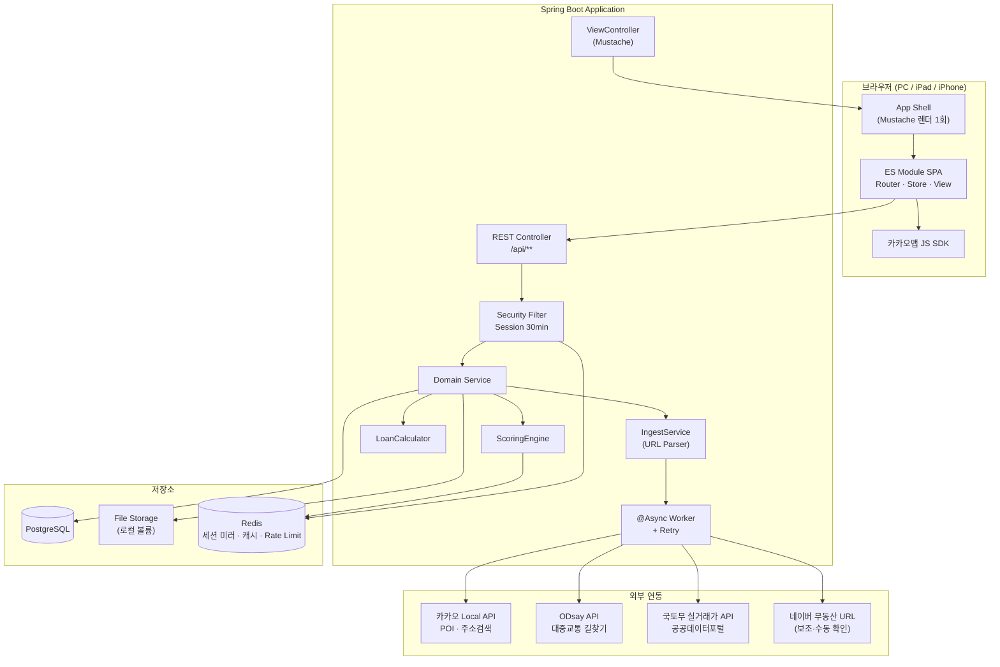

### 2.1.1 Redis 사용처

**Postgres 단일 + Redis 보조** 구성입니다. Redis는 영속 저장소가 아니라 성능·휘발성 계층으로만 씁니다.

| 용도 | 대체 시 | TTL |
|---|---|---|
| Spring Session 백엔드 | 재기동 시에도 세션 유지, Postgres 부하 없이 조회 | 30분 idle |
| 카카오 POI · ODsay 경로 캐시 | 없으면 매번 외부 API 재호출 | 30일 |
| 로그인 시도 Rate Limit | 없으면 무제한 시도 허용 | 15분 |
| Slack 알림 디바운스 락(Session 16-I21) | 없으면 등록 알림이 개별 발송됨 | 60초 |

Redis 장애 시 세션은 JDBC로 폴백 가능하도록 `SessionRepository` 구현을 이중화하지 않고 **Redis를 단일 세션 저장소로 확정**합니다(단순성 우선). 캐시 계층 장애는 API 재호출로 흡수되어 기능 저하 없이 느려지기만 합니다.

### 2.2 SPA와 Mustache의 공존 전략

요구사항에 `Mustache`와 `SPA`가 동시에 명시되어 있으나 이 둘은 원래 상충한다(전자는 서버 렌더, 후자는 클라이언트 렌더). 절충안:

| 레이어 | 담당 | 렌더링 위치 |
|---|---|---|
| `layout.mustache` | HTML skeleton, CSS/JS 번들 링크, CSRF 토큰, 부트스트랩 JSON | **서버** (최초 1회) |
| `login-shell.mustache` | 비로그인 시 블러 배경 + 로그인 모달 | **서버** |
| 매물 리스트 / 지도 / 상세 / 모달 | `<template>` 태그 + `mustache.js` | **클라이언트** |

**핵심**: `.mustache` 파일을 서버(`Mustache.java`)와 클라이언트(`mustache.js`)가 **공유**한다. 빌드 시 `src/main/resources/templates/partials/*.mustache`를 JS 번들로 인라인시켜 동일 문법을 양쪽에서 사용. 이렇게 하면 "Mustache로 개발"이라는 요구를 지키면서 SPA 동작을 얻는다.

라우팅은 History API 기반 클라이언트 라우터를 쓰고, 서버는 `/`, `/admin/**` 등 모든 경로에서 동일 shell을 반환한다.

### 2.3 개발 환경 분리 (local / live)

개발·운영 환경을 두 프로파일로 분리합니다. 영속화·캐시·세션 계층의 구현체가 환경에 따라 달라지며, 이는 헥사고널 아키텍처(Session 2.5)의 **outbound adapter 교체**로 처리합니다.

| 구분 | `local` | `live` |
|---|---|---|
| 목적 | 로컬 개발·단위 테스트 | 운영 배포 |
| RDB | **H2DB** (인메모리 `jdbc:h2:mem:halley`) | **PostgreSQL** |
| 캐시 | **메모리 캐시** (`ConcurrentMapCacheManager`) | **Redis** |
| 세션 | 인메모리 `HttpSession` | Spring Session Data Redis |
| Rate Limit | 메모리 (선택) | Redis |
| 이미지 저장 | 로컬 디렉터리 | 로컬 볼륨 (동일) |

- POI·경로·실거래가 캐시(2.1.1)와 세션 저장소를 각각 `CachePort`·세션 저장소 port로 추상화해, local은 메모리 어댑터, live는 Redis 어댑터를 붙입니다. **프로파일별로 어댑터 빈만 갈아끼우므로 도메인·애플리케이션 코드는 환경을 모릅니다.**
- `application-local.yaml` / `application-live.yaml`로 접속 정보를 주입합니다. DB 스키마는 H2와 PostgreSQL이 호환되는 표준 SQL 범위로 관리하고, **JSONB·PostGIS 등 PostgreSQL 전용 기능은 port 뒤에 격리**합니다.

### 2.4 영속화 — jOOQ (코드 생성 없음)

**ORM 대신 jOOQ**를 사용합니다. jOOQ는 ORM이 아니라 type-safe SQL DSL이므로, SQL을 직접 작성하면서 컴파일 타임 타입 체크를 얻습니다.

- **jOOQ 코드 생성기(`jooq-codegen`)와 DSL 빌드 설정은 사용하지 않습니다.** 빌드 시 DB 스키마로부터 `Tables`/`Records` 클래스를 생성하는 codegen 없이, 테이블·필드 참조를 코드에 **수동 정의**해서 씁니다. 스키마가 바뀌면 코드의 테이블 정의만 고치면 되므로 local(H2)/live(PostgreSQL) 이중 스키마 관리와도 맞습니다.
- 매핑은 수동(DTO/record ↔ jOOQ `Record`)으로 하며, `parse_confidence`·`path_summary`·`payload` 같은 JSON 컬럼은 jOOQ JSON 바인딩(`org.jooq.JSON` + Jackson 변환)으로 처리합니다.
- 영속화 코드는 `adapter/outbound/persistence`에 위치하며, 서비스 계층이 jOOQ `Repository` 클래스를 **직접 사용**합니다(저장소 포트 인터페이스 없음 — Session 2.5).

### 2.5 아키텍처 — 영속화는 직접, 외부 연동·캐시·세션만 포트

DB 벤더 차이(local H2 / live PostgreSQL)는 JDBC 드라이버 + jOOQ `SQLDialect` + Spring DataSource가 이미 흡수하므로, **저장소 계층에는 포트 인터페이스를 두지 않습니다.** 서비스가 jOOQ `Repository` 클래스를 직접 사용합니다(단일 구현이 두 DB를 모두 처리 — 16-I40).

포트(port/어댑터)로 격리하는 대상은 **실제로 교체 가능성이 있는 계층**으로 한정합니다.

| 계층 | 처리 | 근거 |
|---|---|---|
| 영속화(DB) | **포트 없음** — 서비스가 `adapter/outbound/persistence/*Repository`(jOOQ) 직접 사용 | H2/PG는 연결·다이얼렉트 차이뿐, 단일 구현 |
| 캐시 | `CachePort` — local=메모리 / live=Redis | 구현체 2개, 교체 실재 |
| 세션 | 세션 저장소 port — local=인메모리 / live=Redis | 구현체 2개 |
| 외부 API | `KakaoLocalPort`·`OdsayTransitPort`·`MinistryPort`·`SlackPort` | 테스트 stub 주입·캐시 래퍼·rate-limit |

- inbound는 REST Controller(`adapter/inbound/web`)가 `application/service`를 호출합니다.
- 도메인(`domain/`)은 프레임워크·DB 무관 순수 모델로 유지합니다(채점 규칙 등 단위테스트 가능).

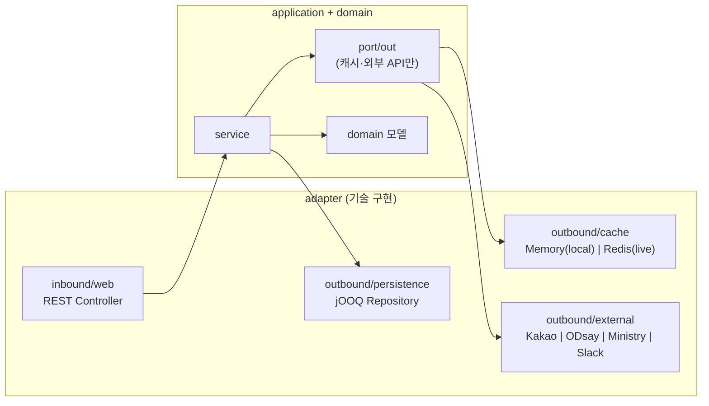

---

## 3. 외부 API 선정

### 3.1 지도 API 비교

| API | 국내 지도 품질 | 지오코딩 | POI 카테고리 검색 | 대중교통 경로 | 도보 경로 | 비용 | 판정 |
|---|---|---|---|---|---|---|---|
| **카카오맵** | 최상 | 우수 | **카테고리 그룹코드 + 반경검색 지원** | ✕ | ✕ | 무료(일 30만) | **1순위** |
| **네이버 클라우드 Maps** | 최상 | 최상 | 약함(지역검색 5건 제한) | ✕ | 자동차만(Directions 5) | 종량제 | 2순위 |
| **Google Maps** | 보통(국내 규제로 제한적) | 보통 | Places API 우수 | 국내 제한적 | **국내 도보/자동차 제한** | 종량제·고가 | 부적합 |
| **Bing Maps** | — | — | — | — | — | — | **탈락** |
| Apple MapKit JS | 보통 | 보통 | 약함 | ✕ | ✕ | 제한적 | 부적합 |

**Bing은 검토 대상에서 제외해야 합니다.** <cite index="55-1">Bing Maps for Enterprise는 이미 deprecated 되었고 무료(Basic) 계정은 전면 종료, 엔터프라이즈 계정도 2028년 6월 30일까지만 사용 가능합니다.</cite> <cite index="52-1">Microsoft는 2024년 6월 30일 이후 신규 고객을 받지 않고 있으므로,</cite> 지금 신규 개발에 채택할 수 없습니다. 대체재는 Azure Maps이나 국내 데이터 품질이 떨어집니다.

**Google은 국내 지도 데이터 반출 규제**로 도보·자동차 길찾기와 상세 지도 기능이 제한됩니다. 이 앱은 "도보 20분 이내 편의점" 같은 국내 POI 판정이 핵심이므로 부적합합니다.

**최종 권고: 카카오맵 단일 스택.**
- 이유 1: 지도 표출과 POI 채점을 **한 벤더로 통일**할 수 있다. 카카오 로컬 API 결과를 타사 지도 위에 표출하면 이용약관 위반 소지가 있어, 네이버 지도 + 카카오 POI 조합은 리스크가 있다.
- 이유 2: 카테고리 그룹코드로 요구된 채점 항목을 거의 그대로 커버한다.

| 채점 항목 | 카카오 카테고리 그룹코드 |
|---|---|
| 역세권 | `SW8` 지하철역 |
| 교육 (초·중) | `SC4` 학교 (+ 이름 필터) |
| 교육 (어린이집·유치원) | `PS3` |
| 편의점 | `CS2` (+ 브랜드명 필터) |
| 마트 | `MT1` (+ 브랜드명 필터) |
| 패스트푸드 | `FD6` (+ 브랜드명 필터) |
| 카페 | `CE7` (+ 브랜드명 필터) |
| 문화시설 | `CT1` |
| 운동시설·공원·산 | `AT4` + 키워드 검색 (Session 16-I5) |

> 네이버 부동산 URL 파싱과의 정합성을 최우선한다면 네이버 Maps로 가되, POI 채점은 서버 내부 계산에만 쓰고 지도에 표출하지 않는 방식으로 분리해야 합니다.

### 3.2 대중교통 소요시간

**ODsay LAB `대중교통 길찾기 API`** 채택. <cite index="80-1">출발지 경위도(SX, SY)와 도착지 경위도(EX, EY)만 넘기면 대중교통 경로를 반환하며,</cite> <cite index="74-1">서울/경기 및 6대 광역시를 커버합니다.</cite> 네이버·카카오·구글 모두 국내 대중교통 경로 API를 공개하지 않으므로 사실상 유일한 선택지입니다.

**주의**: <cite index="78-1">무료 API의 도보 거리·시간은 직선거리 기반으로 계산되며, 실제 도보 엔진을 쓰는 경로 계산은 유료 API입니다.</cite> 역세권 채점의 도보 시간도 같은 한계를 갖습니다(Session 16-I4).

### 3.3 매물 데이터 소스

| 방식 | 정확도 | 리스크 | 역할 |
|---|---|---|---|
| **텍스트 붙여넣기 파싱** | **최상 — 48필드 실측** | 낮음 | **기본** (Session 9) |
| 수기 입력 | 최상 | 없음 | 붙여넣기 실패 필드 폴백 |
| 서버 URL 크롤링 | 하 | **높음** (Session 16-I2) | 생존 확인 배치에만 |
| 국토부 실거래가 API | 상 | 없음 | 시세 검증·보정 |
| ~~K-apt 공동주택 기본정보~~ | — | — | **불필요** — 세대수·주차·준공·난방·용적률이 붙여넣기로 확보 |
| 네이버 공개 API | — | — | **부동산 매물 API 부재** |

**현재 매물(호가)을 제공하는 합법적 공개 API는 존재하지 않습니다.** 국토부 실거래가 API는 *과거 체결가*만 제공합니다. 따라서 "URL 붙여넣기 → 자동 등록"은 **초안 생성 + 사용자 확인** 워크플로로 설계하고, 파싱 실패 시 수기 입력으로 자연스럽게 폴백해야 합니다.

### 3.4 대출 한도

**개인별 대출 한도를 반환하는 공개 API는 없습니다.** 금융위원회 `금융상품 한눈에` API로 상품 목록과 금리는 수집 가능하지만, 한도는 소득·DSR·LTV를 조합해 **자체 계산**해야 합니다.

규제가 자주 바뀌므로 **모든 규제 수치를 코드가 아닌 DB 테이블(`regulation_param`)에 둡니다.**

```
LTV비율, 대출총액상한, DSR한도, 스트레스가산금리,
취득세구간, 중개보수요율, 생애최초우대율, 전세보증기관한도
```

> 산출 엔진의 상세 설계(담보가치 추정·방공제·규제 분기·금감원 연동)는
> **[docs/MORTGAGE_ENGINE.md](./MORTGAGE_ENGINE.md)** 와 I64를 따릅니다.

---

## 4. 도메인 모델

```mermaid
erDiagram
    USERS ||--o{ USER_CRITERION_SCORE : rates
    USERS ||--o{ PROPERTY_OPINION : writes
    USERS ||--o{ COMMUTE_RESULT : "has commute to"
    PROPERTY ||--o{ PROPERTY_IMAGE : has
    PROPERTY ||--o{ PROPERTY_AGENT : "brokered by"
    AGENT ||--o{ PROPERTY_AGENT : brokers
    PROPERTY ||--o{ PROPERTY_SCORE : scored
    PROPERTY ||--o{ USER_CRITERION_SCORE : receives
    PROPERTY ||--o{ COMMUTE_RESULT : produces
    PROPERTY ||--o{ PROPERTY_OPINION : about
    PROPERTY ||--o| LOAN_ESTIMATE : estimates
    PROPERTY ||--o{ LISTING_CHECK_LOG : "checked by batch"
    PROPERTY ||--o{ REFERENCE_TRANSACTION : "referenced by"
    CRITERION ||--o{ PROPERTY_SCORE : defines
    CRITERION ||--|| CRITERION_WEIGHT : "weighted by"

    USERS {
        bigint id PK
        varchar login_id UK "로그인 ID (I51)"
        varchar nickname UK
        varchar email UK "폐지됨 → I74 (닉네임으로 대체)
        varchar password_hash
        varchar role "ADMIN | MEMBER"
        varchar workplace_name
        decimal workplace_lat
        decimal workplace_lng
        boolean must_change_password
        bigint annual_income "연소득(원) — DSR (I55)"
        bigint existing_loan "기존 대출 잔액(원)"
        bigint available_budget "보유 현금(원) — 예산상한 합산·자기자본 (I55)"
        bigint annual_income "연소득(원) — DSR (I55)"
        bigint existing_loan "기존 대출 잔액(원) — DSR 차감"
        boolean enabled "활성/비활성"
        timestamp disabled_at
        bigint disabled_by FK
        timestamp created_at
    }

    PROPERTY {
        bigint id PK
        varchar name "단지명"
        varchar dong_ho "동/호"
        varchar deal_type "SALE|JEONSE — MONTHLY는 I94에서 폐지"
        bigint price_deposit "매매가 or 보증금(원)"
        bigint price_monthly "폐지됨 → I94"
        int maintenance_fee
        varchar address_road
        varchar address_jibun
        decimal lat
        decimal lng
        decimal area_supply_m2
        decimal area_exclusive_m2
        varchar floor_raw "7 or 고/중/저"
        int floor_no
        int floor_total
        varchar floor_band "HIGH|MID|LOW"
        varchar room_bath "3/2"
        varchar direction
        int approval_year "사용승인"
        varchar move_in_type "IMMEDIATE|NEGOTIABLE|DATE"
        date move_in_date
        decimal parking_per_household
        int total_households
        varchar heating_type
        int building_count "단지 동수 — 수기 입력"
        bigint kb_price "KB시세 — 대출 산정 기준"
        bigint brokerage_fee "중개보수 상한액(원) — I53"
        numeric brokerage_rate "중개보수 상한 요율(%)"
        bigint acquisition_tax "취득세 합계(원)"
        bigint property_tax "재산세 합계(원)"
        string comprehensive_tax "종합부동산세 — 문구 그대로"
        string school_name "배정 초등학교"
        int school_walk_minutes "초등학교 도보 분"
        string school_source "PASTE | KAKAO"
        string pnu "필지고유번호 19자리 — 공시가격 조회 키 (I54)"
        bigint official_price "공시가격(원)"
        int official_price_year "공시가격 기준연도"
        varchar source_type "MANUAL|PASTE|CRAWL"
        varchar source_url "원본 URL — 생존 확인 배치 대상 (I62)"
        varchar naver_article_no "매물번호"
        text raw_paste_text "원문 보존 → 재파싱용"
        varchar parser_version
        jsonb parse_confidence "필드별 EXACT|DERIVED|MISSING"
        boolean is_draft "모바일 URL만 저장한 미완성"
        varchar listing_status "ACTIVE|SOLD_OUT|UNREACHABLE|ARCHIVED"
        boolean active "리스트 노출 여부"
        timestamp last_checked_at
        int check_fail_streak "연속 실패 횟수"
        timestamp sold_detected_at
        bigint created_by FK
        timestamp created_at
    }

    AGENT {
        bigint id PK
        varchar office_name
        varchar agent_name
        varchar phone
        varchar mobile
        varchar registration_no "등록번호"
        varchar address
        decimal lat
        decimal lng
    }

    PROPERTY_AGENT {
        bigint property_id FK
        bigint agent_id FK
        boolean is_primary
    }

    PROPERTY_IMAGE {
        bigint id PK
        bigint property_id FK
        varchar image_type "FLOOR_PLAN|PHOTO"
        varchar storage_path
        int sort_order
    }

    CRITERION {
        varchar code PK "COMFORT|PRICE|MOVE_IN|COMMUTE|AGE|FLOOR|STATION|EDUCATION|AMENITY|PARKING|GREEN"
        varchar name
        varchar scoring_type "AUTO|MANUAL|HYBRID"
        boolean enabled
    }

    CRITERION_WEIGHT {
        varchar criterion_code PK
        int priority_rank "1=최우선"
        decimal weight "가중치 배수"
        timestamp updated_at
    }

    PROPERTY_SCORE {
        bigint id PK
        bigint property_id FK
        varchar criterion_code FK
        decimal auto_score "0~100, nullable"
        decimal manual_score "0~100, nullable"
        decimal effective_score
        varchar score_source "AUTO|MANUAL|FALLBACK"
        varchar fallback_reason
        timestamp computed_at
    }

    USER_CRITERION_SCORE {
        bigint property_id FK
        bigint user_id FK
        varchar criterion_code FK
        int score "1~5 또는 0~100"
    }

    COMMUTE_RESULT {
        bigint property_id FK
        bigint user_id FK
        int total_minutes
        int transfer_count
        int walk_minutes
        jsonb path_summary
        timestamp fetched_at
    }

    PROPERTY_OPINION {
        bigint id PK
        bigint property_id FK
        bigint user_id FK
        varchar opinion_type "MERIT|DEMERIT"
        varchar content
        int sort_order
    }

    LISTING_CHECK_LOG {
        bigint id PK
        bigint property_id FK
        timestamp checked_at
        int http_status
        varchar verdict "ALIVE|GONE|BLOCKED|ERROR"
        varchar evidence "판정 근거 스니펫"
        int elapsed_ms
        boolean notified
    }

    SYSTEM_CONFIG {
        varchar config_key PK
        varchar config_value
        varchar value_type "STRING|INT|BOOL|SECRET"
        varchar category "SLACK|BATCH|SCORING|LOAN"
        varchar description
        boolean masked "UI 마스킹 여부"
        bigint updated_by FK
        timestamp updated_at
    }

    NOTIFICATION_LOG {
        bigint id PK
        varchar event_type "PROPERTY_CREATED|LISTING_SOLD_OUT|BATCH_ERROR"
        bigint property_id FK
        varchar channel
        varchar status "SENT|FAILED|RETRYING"
        int retry_count
        varchar error_message
        jsonb payload
        timestamp created_at
        timestamp sent_at
    }

    REFERENCE_TRANSACTION {
        bigint id PK
        bigint property_id FK
        varchar deal_type "TRADE|RENT"
        date contract_date
        bigint price
        int floor
        varchar source "MINISTRY_TRADE|MINISTRY_RENT"
        timestamp cached_at
    }

    LOAN_ESTIMATE {
        bigint id PK
        bigint property_id FK
        varchar product_type "MORTGAGE|JEONSE"
        decimal ltv_rate
        bigint ltv_limit
        bigint dsr_limit
        bigint final_limit
        bigint required_cash
        bigint acquisition_tax
        jsonb assumptions
        timestamp computed_at
    }
```

> **`NEARBY_FACILITY`는 테이블이 아닙니다.** 매물 주변 POI는 영속 데이터가 아니라 외부 API 응답 캐시이므로
> `PoiCache`(live=Redis / local=인메모리, TTL 30일)에 담습니다 — Session 16-I44.

### 4.1 부동산 필드 정의 (네이버페이 부동산 기준)

네이버페이 부동산 매물 상세에서 노출되는 항목을 기준으로 정리했습니다.

**거래 정보**
| 필드 | 타입 | 비고 |
|---|---|---|
| 거래 유형 | enum | 매매 / 전세 — **월세는 I94에서 폐지** |
| 매매가·보증금 | bigint | 원 단위 저장, 표시는 억/만원 |
| ~~월세~~ | bigint | **I94에서 폐지** |
| 관리비 | int | 포함 항목 별도 텍스트 |
| 융자금 | bigint | optional |

**면적·구조**
공급면적(㎡), 전용면적(㎡), **전용면적(평) = 전용㎡ ÷ 3.3058 (파생 컬럼)**, 방/욕실 수, 해당층/총층, 방향(기준: 거실 창), 구조(계단식/복도식)

**건물**
단지명, 사용승인일, 총 세대수, 총 동수, 세대당 주차대수, 난방방식, 건폐율/용적률

**입주**
입주가능일 유형(즉시/협의/날짜), 입주가능일

**위치**
도로명주소, 지번주소, 위도, 경도

**중개인 (1:N)**
중개사무소명, 대표자명, 전화번호, 휴대폰, 등록번호, 사무소 주소·좌표

---

## 5. 채점 엔진

### 5.1 정규화 원칙

모든 항목은 **0~100 스케일로 정규화**한 뒤 가중치를 곱합니다. 원점수 스케일이 제각각인 상태로 가중치만 곱하면 비교가 무의미해집니다.

```
TotalScore = Σ(effective_score_i × weight_i) / Σ(weight_i)
```

**대카테고리 분리**: 매매와 전세는 가격 스케일과 대출 구조가 완전히 달라 **별도 순위표**로 운영합니다. M1 리스트 상단에 `매매 / 전세` 탭을 두고, `PRICE` 정규화와 정렬을 카테고리 내부에서만 수행합니다. 카테고리를 섞은 통합 순위는 제공하지 않습니다.

`weight`는 Admin이 정한 우선순위 랭크에서 파생 (예: rank 1 → 2.0, rank 2 → 1.8 … 등차 또는 등비, 설정 가능).

정렬: `TotalScore DESC, name ASC(한글 가나다, `Collator.getInstance(Locale.KOREAN)`)`

### 5.2 항목별 산식

| 코드 | 항목 | 방식 | 산식 |
|---|---|---|---|
| `COMFORT` | 공간의 쾌적함 | MANUAL | 사용자별 1~5 → 평균 → ×20 |
| `PRICE` | 가격 | AUTO | **예산 절대평가.** `100 × (1 − 호가/예산상한)`, 예산상한 = 활성 사용자 `available_budget` 합계. 초과 시 0점 (Session 5.2.1) |
| `MOVE_IN` | 입주시기 | AUTO | 즉시=100, 협의=85, 기준일 이내=`100−(D/기준일)×40`, 기준일 초과=0 |
| `COMMUTE` | 직주근접 | AUTO | 사용자별 소요시간 → `clamp(100−(t−20)×1.43, 0, 100)` (20분↓ 만점, 90분↑ 0점) → **전 사용자 평균** |
| `AGE` | 건물 연식 | AUTO | `clamp(100 − (현재연도−승인연도)×2.5, 10, 100)` (40년 → 10점 하한) |
| `FLOOR` | 층 | AUTO | **확정 규칙 — Session 5.5 참조** |
| `STATION` | 역세권 | AUTO | 최근접역 도보 t분. `t≤5 → 100`, `5<t≤20 → 100×(20−t)/15`, `t>20 → 0` |
| `EDUCATION` | 교육여건 | AUTO | 도보 30분(≈2.0km) 내 초/중/어린이집/유치원 4종 존재 여부 × 25점 |
| `AMENITY` | 편의시설 | AUTO | 도보 20분(≈1.3km) 내 6개 카테고리. 카테고리당 `min(count,3)/3 × 16.67` |
| `PARKING` | 주차 | AUTO | `clamp(세대당대수 / 1.0 × 100, 0, 100)` |
| `GREEN` | 녹색환경 | HYBRID | 공원·산·하천 3종을 **최근접 도보시간**으로 채점. 종류별 `33.3 × clamp((20−t)/15, 0, 1)` (Session 16-I42) |
| `LLM_RECOMMENDATION` | AI 추천도 | AUTO | **LLM이 매물 정보와 구매자 직장 위치를 보고 매긴 0~100점.** 채점 루프에서 호출하지 않고 저장된 값을 쓴다 (I59) |
| `COMPARATIVE_ADVANTAGE` | 비교 우위 추천 | AUTO | **등록 매물 전체를 견준 상대적 우위.** 매물 4개 이상일 때만 산출 (I61) |
| `HOUSEHOLDS` | 세대수 | AUTO | `clamp(세대수 / 350 × 100, 0, 100)` — **350세대 이상은 모두 만점** (Session 16-I49) |

### 5.2.1 가격 채점 — 예산 절대평가

**예산 상한 = 활성 사용자 전원의 `available_budget` 합계.** 상대평가(리스트 내 min-max)를 쓰지 않으므로, 매물을 추가·삭제해도 기존 매물의 가격 점수가 흔들리지 않습니다.

```
score = clamp(100 × (1 − 호가 / 예산상한), 0, 100)
```

| 호가 | 예산 12억 기준 |
|---|---|
| 8.5억 | 29.2 |
| 10억 | 16.7 |
| 12억 | 0.0 |
| 15억 | 0.0 (초과) |

**채점 기준은 호가(`price_deposit`)입니다.** KB시세(`kb_price`)는 대출 한도 산출에만 쓰고 채점에 쓰지 않습니다. 실제로 지불하는 돈은 호가이기 때문입니다.

다만 **호가/시세 괴리율**을 보조 지표로 리스트에 표시합니다. 실측 사례는 15억/13.5억 = **+11.1%** 로, 시세보다 비싸게 부른 매물임을 한눈에 알 수 있습니다.

**가용 예산이 0이면 점수를 매기지 않습니다(MISSING).** 예산상한 = 현금 + 대출한도(호가×LTV)이므로 현금이 0이면 상한이 늘 호가보다 작아 **모든 매물이 0점으로 붕괴**합니다. 0점은 "싸지 않다"는 평가로 읽히지만 실제로는 설정이 빠진 것이므로, 사유(`가용 예산 미설정`)를 남겨 구분합니다 — Session 16-I47.

**재계산 트리거**: 사용자가 `available_budget`을 수정하거나 활성/비활성이 바뀌면 예산 상한이 변하므로 **전 매물 `PRICE` 재계산**이 필요합니다. 외부 API 호출은 없으므로 즉시 처리됩니다.

### 5.2.2 세대수 채점

소규모 단지는 재건축 동의율 확보가 어렵고 환금성이 낮다는 판단을 반영합니다. 적을수록 낮은 점수이고, **350세대 이상은 모두 만점**입니다.

```java
public double scoreHouseholds(int households) {
    if (households >= 350) return 100.0;
    return households * 100.0 / 350.0;
}
```

| 세대수 | 100 | 175 | 300 | 350+ |
|---|---|---|---|---|
| 점수 | 28.6 | 50.0 | 85.7 | 100 |

**데이터 출처는 붙여넣기 파싱입니다**(`total_households`, Session 9.2). 이전에는 `BUILDING_COUNT`(단지 동수)를 수기 입력으로 받았으나, 네이버 상세에 동수 필드가 없어 입력 부담이 있었고 세대수가 같은 판단(단지 규모)을 파싱값만으로 대신할 수 있어 교체했습니다 — Session 16-I49.

### 5.3 층수 채점 확정 규칙

요구사항의 모순(구 I3)을 다음과 같이 확정합니다.

**밴드 표기 (`저`/`중`/`고`)** — 저층만 최저점, 중·고는 동점 최고점

| 표기 | 점수 |
|---|---|
| 고 | 100 |
| 중 | 100 |
| 저 | 0 |

**숫자 표기** — 1~6층은 층이 높을수록 고점, **7층 이상은 전부 동일 최고점**

```java
public double scoreFloor(int floor) {
    if (floor >= 7) return 100.0;             // 고정 임계값
    return (floor - 1) / 5.0 * 100.0;         // 1층 0점 → 6층 100점
}
```

| 층 | 점수 | | 층 | 점수 |
|---|---|---|---|---|
| 1 | 0.0 | | 5 | 80.0 |
| 2 | 20.0 | | 6 | **100.0** |
| 3 | 40.0 | | 7 | **100.0** |
| 4 | 60.0 | | 20 | 100.0 |

`floor_total`은 사용하지 않습니다. 임계값 7은 절대 기준이며 `FloorScorer.FLOOR_PEAK` 상수로 고정합니다. 런타임 설정 키는 두지 않습니다 — Session 16-I41.

> **실측 영향**: 독립문삼호 9/18층은 7층 이상이므로 **100.0점**입니다. 상계동양메이저(저/22)는 밴드 표기로 **0점**입니다.

이전 안(15층 정점·16층 절벽)보다 훨씬 관대한 규칙입니다. 저층(1~6층)만 불리하고, 중층부터는 사실상 층 차이가 순위에 영향을 주지 않습니다. 5층 이하 건물이라도 6층에 가까우면 불리하지 않으므로, 이전 안의 "저층 건물 구조적 불리" 부작용은 사라졌습니다.

### 5.4 AUTO → MANUAL 폴백

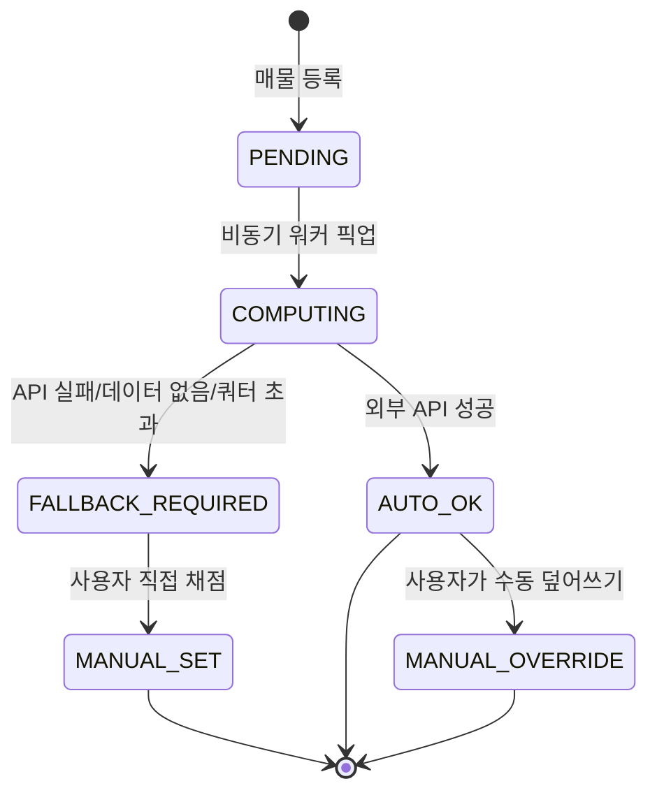

`effective_score` 결정 우선순위: `manual_score` > `auto_score`. UI에서 자동/수동/폴백을 배지로 구분 표시하고, 폴백 사유(`fallback_reason`)를 툴팁으로 노출합니다.

### 5.5 국토부 실거래가 — 참고 표기 전용 (채점 미반영)

**`RTMSDataSvcAptTradeDev`(매매) / `RTMSDataSvcAptRent`(전월세)** 를 매물 상세 화면(M2)에 **참고용 카드**로만 노출합니다. 채점(`PRICE`)에는 반영하지 않습니다 — 실거래가는 계약 시점 가격이라 현재 호가보다 며칠~몇 달 늦고, 이미 `PRICE`는 호가·예산상한 기준 절대평가로 확정했기 때문에(Session 5.2.1) 두 기준을 섞으면 산식이 다시 모순됩니다.

**조회 조건**: 법정동코드(5자리) + 계약년월(YYYYMM) + 단지명·전용면적 유사도로 필터링. 붙여넣기로 확보한 `address_jibun`에서 법정동코드를 역매핑해야 하는데, **참조 테이블 4만 건을 적재하는 대신 카카오 주소검색의 `b_code`를 씁니다**(Session 16-I43).

**M2 표시 위치**: 가격 정보 하단에 접이식 카드.

```
최근 실거래 (동일 단지·유사 면적)
┌─────────────────────────────┐
│ 2026.07  12억 9,250   2층    │
│ 2026.06  14억 4,000   7층 ★최고 │
│ 2026.06  12억 5,000   2층  최저│
└─────────────────────────────┘
호가 15억 vs 최근 실거래 12.9억 → 괴리 +16.3%
```

**동기화**: 등록 시 1회 조회 + 캐시(Redis, TTL 7일). 국토부 API는 월 단위 갱신이라 실시간 폴링이 불필요합니다. 매물 상세를 열 때마다 API를 부르지 않고, 캐시 미스일 때만 호출합니다.

### 5.6 등록 시 API 호출량

매물 1건 등록 시 외부 호출 추정:

| 대상 | 호출 수 | 붙여넣기 파싱 후 |
|---|---|---|
| 지오코딩 | 1 | 1 (지번주소 → 좌표) |
| 지하철역 반경검색 | 1 | **0** — 역별 도보시간이 텍스트에 있음 |
| 학교·보육 | 2 | 1 — 초등은 확보, 중학교·보육만 |
| 편의시설 6종 | 6 | 6 |
| 공원·산·하천 | 3 | 3 |
| 대중교통 경로 (사용자 N명) | N | N |
| **합계 (N=2)** | 약 15회 | **약 13회 (필수는 3회)** |

`STATION`·`PARKING`·`AGE`·`FLOOR`·`MOVE_IN`은 **외부 API 없이 파싱만으로 채점됩니다.** 즉 자동 채점 11개 항목 중 5개가 API 장애와 무관하게 동작합니다.

사용자 추가 시마다 전체 매물 × 1회 재계산이 필요합니다. 가중치 변경은 외부 호출 없이 재계산 가능하도록 원점수를 저장해 둡니다.

---

## 6. 인증 · 세션

### 6.1 최초 부팅 시나리오


**강제화 구현**: `must_change_password=true`인 세션은 서버 인터셉터가 `/api/auth/password`와 `/api/auth/logout`을 제외한 **모든 API를 403으로 차단**합니다. 프론트에서 모달만 띄우는 건 우회 가능하므로 서버 차단이 필수입니다.

**2단계 — 프로필 완성 강제 (I48)**: 비밀번호를 바꾼 뒤에도 **직장 좌표와 가용 예산이 비어 있으면** `PROFILE_SETUP_REQUIRED`로 API를 차단합니다. 이 두 값이 없으면 `COMMUTE`와 `PRICE`가 영원히 미산출로 남기 때문입니다(I47). 프로필 단계에서는 `/api/auth/*`, `/api/users/me`, `/api/users/me/profile`, `/api/geo/search`만 허용해 설정을 마칠 수 있게 합니다. **Admin도 예외가 아닙니다** — Admin 역시 채점에 참여하는 사용자입니다.

### 6.2 세션 정책

| 항목 | 값 |
|---|---|
| 저장소 | **Spring Session Data Redis** (Session 2.1.1에서 단일 세션 저장소로 확정) |
| Idle Timeout | 30분 |
| 갱신 | 모든 인증 API 요청 시 sliding renewal |
| 만료 예고 | 남은 3분 시점에 경고 모달 (연장 / 로그아웃) |
| 쿠키 | `HttpOnly`, `SameSite=Lax`, 운영은 `Secure` |
| CSRF | Spring Security CSRF 토큰, shell의 `<meta>`에 심어 fetch 헤더로 전달 |

### 6.3 사용자 활성/비활성

`enabled = false`인 계정은 **로그인 자체가 불가능**합니다. Spring Security의 `UserDetails.isEnabled()`를 그대로 활용하면 `DisabledException`이 발생하므로 별도 분기가 필요 없습니다.

| 항목 | 처리 |
|---|---|
| 로그인 시도 | `403 { code: "ACCOUNT_DISABLED" }` — 존재 여부는 노출하지 않음 |
| **접속 중 비활성화** | `SessionRegistry` / `SpringSessionBackedSessionRegistry`로 해당 principal의 세션 전량 즉시 만료 |
| 권한 | **활성 사용자는 전원 매물 등록·수정·채점 가능.** 등록 권한에 별도 역할 게이트 없음 |
| ADMIN 전용 | 사용자 CRUD, 활성/비활성 토글, 가중치 설정 |
| 안전장치 | 자기 자신 비활성화 불가 · 마지막 활성 ADMIN 비활성화 불가 |
| 데이터 | 비활성 사용자가 등록한 매물과 작성한 의견은 **보존**. 작성자 표기는 `닉네임(비활성)` |

**비활성화는 삭제의 대체 수단으로 쓰는 것을 권합니다.** Session 16-I10에서 지적한 "삭제 시 총점이 흔들리는 문제"가 비활성화로 자연스럽게 해결됩니다. 다만 채점 반영 여부는 별도 정책이 필요합니다(Session 16-I13).

**SPA 특유의 문제**: XHR이 401을 받았을 때 로그인 페이지 HTML이 리다이렉트로 돌아오면 JSON 파싱이 깨집니다. `AuthenticationEntryPoint`를 커스터마이즈해 `/api/**`는 항상 `401 JSON`을 반환하도록 하고, 프론트 fetch 래퍼가 401을 감지해 로그인 모달을 띄웁니다.

---

### 6.4 Admin에 의한 사용자 비밀번호 리셋 (D24, 신규)

회원가입·이메일 발송이 없는 폐쇄형 구조이므로, 사용자가 비밀번호를 잊으면 **Admin이 강제로 리셋**하는 경로만 존재합니다.

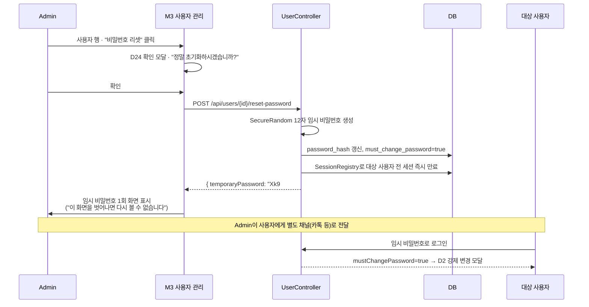

**설계 원칙**

1. **임시 비밀번호는 응답 바디로 딱 1회만 반환합니다.** DB에는 해시만 저장하고, 조회 API로 재확인할 수 없습니다. 화면에 표시된 값을 Admin이 복사해 직접 전달합니다.
2. **리셋 즉시 기존 세션을 전량 종료합니다.** 비밀번호를 잊었다는 건 보통 기기를 잃어버렸거나 계정 문제가 있다는 신호이므로, 리셋 시점에 열려 있는 세션(다른 기기 포함)을 모두 끊는 것이 안전합니다.
3. **`must_change_password=true`가 자동으로 붙습니다.** Session 6.1의 최초 부팅 시나리오와 동일한 강제 변경 모달(D2)을 재사용하므로 별도 UI를 새로 만들 필요가 없습니다.
4. **자기 자신은 이 경로를 쓸 수 없습니다.** Admin이 본인 비밀번호를 잊으면 `/me`의 일반 비밀번호 변경(현재 비번 필요)만 가능하고, 그마저 잊으면 DB 직접 수정 또는 애플리케이션 재기동 시 사용자 0명 조건이 아니므로 **부트스트랩도 재발동하지 않습니다** — Session 16-I31 참조.

**UX 디테일**

- 리셋 버튼은 사용자 행의 `⋮` 메뉴 안에 배치(오조작 방지) — 삭제 버튼과 시각적으로 분리
- 임시 비밀번호 표시 화면에 **"복사" 버튼**과 함께 QR 코드는 넣지 않습니다(전달 채널이 카톡 등 텍스트이므로 QR은 과함)
- 표시 화면을 벗어나기 전 "전달을 완료하셨나요?" 재확인 없이 바로 닫히게 둡니다 — 막는다고 안전해지지 않고 조작만 늘어남

## 7. 화면 정의

### 7.1 Main Frame (7개)

| # | 라우트 | 이름 | 구성 |
|---|---|---|---|
| M1 | `/` | 메인 (매물 비교) | 좌 리스트 3 : 우 지도 7 |
| M2 | `/properties/:id` | 매물 상세 | **모달** (Session 16-I45 — 지도 위 슬라이드 패널에서 변경) |
| M3 | — | 사용자 관리 | Admin 전용 **모달**, 표: ID·닉네임·그룹·역할·보유 현금·연소득·상태 (I51 · 이메일은 I74에서 폐지) |
| M4 | `/admin/criteria` | 평가 기준·가중치 | Admin 전용, 드래그 정렬 |
| M5 | `/me` | 내 프로필 | 닉네임·직장 위치·비밀번호 |
| M6 | — | 시스템 설정 | Admin 전용 **모달**, 섹션: 배치/대출 + Slack 테스트 + 알림 이력 (Session 16-I46) |
| M7 | `/itinerary` | **임장 플래너** | 좌 시간표 3 : 우 지도 7 (Session 10) |

**M1 상세 레이아웃**

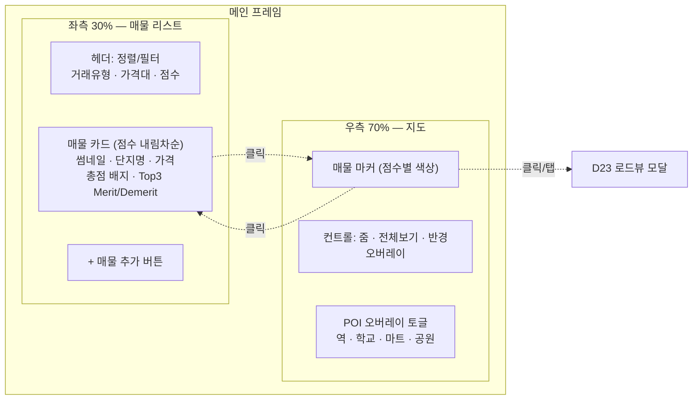

- 최초 진입: 전 매물을 포함하는 `LatLngBounds`로 `map.setBounds()`
- 리스트 클릭: 해당 매물로 `panTo()` + zoom 17 + InfoWindow
- 지도 마커 클릭: 리스트 해당 카드로 스크롤 + 하이라이트
- **지도 마커 클릭/탭 → D23 로드뷰 모달** (아래 7.2)

### 7.2 로드뷰 모달 (D23, 신규)

마커를 누르면 InfoWindow 대신(또는 InfoWindow의 "로드뷰 보기" 버튼으로) 전체 화면 모달이 뜹니다.

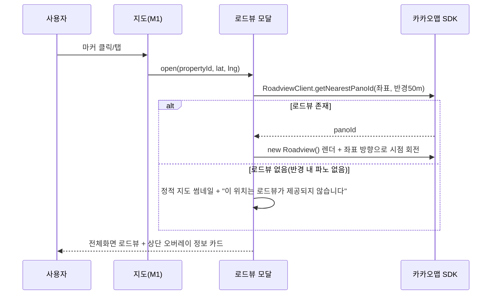

**레이아웃**
- 배경: 카카오 `Roadview` 컴포넌트 전체화면 (드래그로 시점 회전·이동 가능)
- **상단 오버레이(top layer)**: 반투명 카드 — 단지명·동, 거래유형·가격, 총점 배지, 층/향, 입주가능일. 매물 리스트 카드와 동일 정보를 축약
- 우상단: 닫기(X), "매물 상세로 이동" 버튼
- 좌하단: 나침반 + "매물 방향으로" 버튼(파싱된 `direction` 값으로 시점 자동 회전) + "위치가 다른가요? 지도에서 직접 지정" 버튼(Session 16-I34)

**구현 메모**
- 카카오맵 JS SDK `kakao.maps.RoadviewClient`로 최근접 파노라마 ID를 조회하고, 반경 내 파노가 없으면(신축·골목 안쪽 등) 실패를 정상 케이스로 처리 — 에러 토스트가 아니라 "로드뷰 미제공" 안내
- 모바일에서는 로드뷰 자체가 무거우므로(WebGL) 저사양 기기 대응으로 정적 파노 썸네일 우선 로드 후 인터랙티브 전환 옵션 제공
- 좌표 정확도가 파싱된 지오코딩 결과에 의존하므로, 지번주소 지오코딩이 부정확하면 엉뚱한 건물의 로드뷰가 뜰 수 있음 — Session 16-I34

### 7.3 Modal (24개)

| # | 모달 | 트리거 | 권한 | 비고 |
|---|---|---|---|---|
| D1 | 로그인 | 비인증 접근 | ALL | 배경 `backdrop-filter: blur(8px)`, 닫기 불가 |
| D2 | 비밀번호 강제 변경 | `mustChangePassword` | ALL | ESC·배경클릭 차단, 서버에서도 차단 |
| D3 | 세션 만료 경고 | 잔여 3분 | ALL | 연장 / 로그아웃 |
| D4 | 사용자 생성 | M3 | ADMIN | 아이디·닉네임·비번·소속 그룹·직장명·직장좌표·보유 현금·연소득 (I74 · I100) |
| D5 | 사용자 수정 | M3 | ADMIN | |
| D6 | 사용자 삭제 확인 | M3 | ADMIN | 해당 사용자 채점 데이터 처리 방식 선택 |
| D7 | 직장 위치 지정 | D4/D5/M5 | ALL | **지도 임베드 + 주소검색 + 핀 드래그** |
| D8 | 매물 추가 방식 선택 | M1 `+` | ALL | URL 등록 / 수기 입력 분기 |
| D9 | **붙여넣기 등록** | D8 | ALL | 3-Step: 텍스트 입력 → 프리뷰(원문 대조) → 사진. 모바일은 URL만 DRAFT 저장 |
| D10 | 매물 수기 등록·수정 | D8, M2 | ALL | 탭: 기본 / 거래 / 건물 / 중개인 / 사진 |
| D11 | 중개인 관리 | D10 | ALL | 1:N 추가·삭제, 기존 중개인 검색 재사용 |
| D12 | 이미지 업로드 | D10 | ALL | **평면도(1장)·매물사진(N장) 구역 분리**, EXIF 회전 보정, 개별 삭제 (I63) |
| D13 | 사진 뷰어(라이트박스) | M2 | ALL | 스와이프, 핀치 줌 |
| D14 | 평가 채점 | M2 | ALL | 항목별 슬라이더, 자동/수동 배지, 폴백 사유 |
| D15 | 가중치·우선순위 설정 | M4 | ADMIN | 드래그 정렬 → 실시간 순위 프리뷰 |
| D16 | 대출 한도 시뮬레이션 | M2 | ALL | 소득·현금·생애최초 여부 입력 → 한도·필요현금·월상환 |
| D17 | 매물 삭제 확인 | M1, M2 | ALL | |
| D18 | 재채점 진행 | 가중치 변경·사용자 추가 | ADMIN | 진행률 + 실패 항목 요약 |
| D19 | 사용자 활성/비활성 확인 | M3 | ADMIN | 세션 강제 종료 경고, 채점 반영 여부 선택 |
| D20 | 매물 점검 이력 | M2 | ALL | 일별 판정 로그, 오탐 시 "판매중으로 되돌리기" |
| D21 | 판매완료 알림 확인 | 로그인 시 신규 감지 | ALL | 전날 감지된 판매완료 매물 요약 |
| D22 | Slack 연결 테스트 | M6 | ADMIN | 토큰·채널 검증 후 테스트 메시지 발송 |
| D23 | **로드뷰 모달** | M1 지도 마커 클릭/탭 | ALL | 전체화면 카카오 로드뷰 + 상단 정보 오버레이 (Session 7.2) |
| D24 | **임시 비밀번호 리셋** | M3 사용자 행 | ADMIN | 확인 → 임시 비번 생성 → 화면 표시(1회) + 세션 강제 종료 |

> D1~D3은 시스템 모달(닫기 제한), D4~D24는 일반 모달. 모바일에서는 D8~D16을 **full-screen sheet**로 전환합니다.

---

## 8. REST API 명세 (요약)

| Method | Path | 설명 | 권한 |
|---|---|---|---|
| POST | `/api/auth/login` | 로그인 | ALL |
| POST | `/api/auth/logout` | 로그아웃 | AUTH |
| POST | `/api/auth/password` | 비밀번호 변경 | AUTH |
| GET | `/api/auth/session` | 세션 상태·잔여시간 | AUTH |
| GET | `/api/users` | 사용자 목록 | ADMIN |
| POST | `/api/users` | 사용자 생성 | ADMIN |
| PUT/DELETE | `/api/users/{id}` | 수정·삭제 | ADMIN |
| PATCH | `/api/users/{id}/status` | 활성/비활성 토글 | ADMIN |
| POST | `/api/users/{id}/reset-password` | 임시 비밀번호 리셋 (1회 반환) | ADMIN |
| PUT | `/api/users/me/profile` | 내 프로필(닉네임 + 직장 좌표 + 가용 예산) | AUTH |
| GET | `/api/properties` | 목록 (정렬·필터·점수 포함) | AUTH |
| POST | `/api/properties` | 수기 등록 | AUTH |
| POST | `/api/properties/parse-preview` | **붙여넣기 텍스트 파싱 (미저장, 프리뷰)** | AUTH |
| POST | `/api/admin/properties/reparse` | 저장된 원문으로 일괄 재파싱 | ADMIN |
| GET/PUT/DELETE | `/api/properties/{id}` | 상세·수정·삭제 | AUTH |
| POST | `/api/properties/{id}/images` | 이미지 업로드 (multipart) | AUTH |
| PUT | `/api/properties/{id}/scores` | 수동 채점 | AUTH |
| POST | `/api/properties/{id}/rescore` | 자동 재채점 트리거 | AUTH |
| GET/POST/DELETE | `/api/properties/{id}/opinions` | Merit/Demerit | AUTH |
| POST | `/api/properties/{id}/loan-estimate` | 대출 시뮬레이션 | AUTH |
| PATCH | `/api/properties/{id}/status` | 판매완료 ↔ 판매중 수동 전환(오탐 복구) | AUTH |
| GET | `/api/properties/{id}/check-logs` | 생존 점검 이력 | AUTH |
| POST | `/api/admin/listing-check/run` | 배치 수동 실행 | ADMIN |
| GET | `/api/admin/settings` | 시스템 설정 조회 (SECRET 마스킹) | ADMIN |
| PUT | `/api/admin/settings` | 시스템 설정 변경 | ADMIN |
| POST | `/api/admin/settings/slack/test` | Slack 연결 테스트 발송 | ADMIN |
| GET | `/api/admin/notifications` | 알림 발송 이력 | ADMIN |
| GET/PUT | `/api/criteria/weights` | 가중치 조회·설정 | GET:AUTH / PUT:ADMIN |
| GET | `/api/geo/search` | 주소·장소 검색 프록시 | AUTH |

**API 키는 전량 서버 보관.** 카카오·ODsay 호출은 반드시 백엔드 프록시를 경유합니다(지도 SDK용 JS 키만 클라이언트 노출).

---

## 9. 매물 수집 — 붙여넣기 파싱

### 9.1 방식 결정

검토 결과 **네이버 부동산 매물 상세 화면의 텍스트를 붙여넣어 파싱**하는 방식을 채택합니다. 실측 결과 48개 필드가 파싱되고 실패 0건이었습니다.

| 방식 | 판정 | 근거 |
|---|---|---|
| 네이버 공개 API | ✕ 불가 | 부동산 매물 API가 존재하지 않음 (Session 3.3) |
| 서버 크롤링 | △ 보조 | CSR 렌더링·봇 차단·약관 리스크 |
| **텍스트 붙여넣기** | **○ 채택** | 사용자 브라우저가 렌더한 결과를 그대로 사용 |
| 수기 입력 | ○ 폴백 | 파싱 실패 필드만 |

### 9.2 파싱으로 확보되는 필드

| 그룹 | 필드 |
|---|---|
| 식별 | 단지명, 동, **매물번호(`naverArticleNo`)** |
| 거래 | 거래유형, 매매가/보증금, 평당가, 융자금, 관리비 (월세는 I94에서 폐지) |
| 면적·구조 | 공급면적, 전용면적, 해당층/총층, 방/욕실, 향, 복층여부 |
| 입주 | 입주가능일 유형, 입주가능일(초순/중순/하순 → 5/15/25일 추정) |
| 단지 | 지번주소, 사용승인일, 연차, 세대수, 현관구조, 난방, **주차 세대당 대수**, 용적률/건폐율, 관리사무소 전화, 건설사 |
| 중개사 | 성명, 사무소명, 전화(유선·휴대), **위치**, 등록번호 — `agent` 테이블에 저장 (I53) |
| 비용 | 취득세 합계, 재산세 합계, **종합부동산세**, 중개보수 상한·요율, 관리비 **월평균**(상단 요약보다 우선 — I53) |
| 대출 | 규제지역 구분, LTV 비율, 대출 한도, **KB시세** |
| 입지 | 배정 초등학교명·거리·도보시간, **지하철역별 거리·도보시간** |

**`kbPrice`(KB시세)는 반드시 별도 저장해야 합니다.** 대출 한도는 호가가 아니라 KB시세 기준으로 산출됩니다. 실측 사례에서 호가 15억 / KB시세 13.5억으로 1.5억 차이가 났고, 이를 구분하지 않으면 대출 계산이 전부 틀립니다.

### 9.3 파싱 로직

**전략: 거대 정규식이 아니라 "라벨 인접성"**

네이버는 `라벨 \n 값` 구조를 일관되게 사용합니다. 라벨을 찾아 다음 유효 라인을 읽는 방식이 레이아웃 변경에 훨씬 강합니다 — 한 필드가 깨져도 나머지는 살아남습니다.

```java
public interface FieldExtractor<T> {
    String key();
    ParseResult<T> extract(TextDocument doc);
}

public record ParseResult<T>(
    T value,
    Confidence confidence,   // EXACT | DERIVED | MISSING
    String rawSnippet,       // 원문 근거 — 프리뷰 하이라이트용
    String note              // "초순 → 5일로 추정" 등
) {}
```

| 계층 | 방법 | 예 |
|---|---|---|
| 1 | 라벨 인접 (`after("전용면적")`) | 기본 정보·단지 정보 대부분 |
| 2 | 중복 라벨 + 값 패턴 (`afterMatching("중개 보수", "만원\|억")`) | 섹션 헤더와 라벨이 같은 문자열일 때 |
| 3 | 전역 정규식 (`MULTILINE` 필수) | 거래유형·가격·KB시세 |
| 4 | 블록 반복 파싱 | 지하철역 목록, 실거래 이력 |
| 5 | 실패 → `MISSING` 기록 | 프리뷰에서 사용자 입력 유도 |

**금액 파싱은 전용 유틸로 분리합니다.** `15억`, `13억 5,000만원`, `4,950만원`, `17만 4,081원`이 모두 다른 형태입니다.

```java
static Long toWon(String raw) {   // "13억 5,000만원" → 1,350,000,000
    // (\d+)억 + ([\d,]+)만 + ([\d,]+)원 조합
}
```

**필수 원칙 세 가지**

1. **실패를 조용히 넘기지 않는다.** 정규식 미스매치 시 예외를 던지지 않고 `MISSING`으로 기록해 프리뷰에 노출합니다. 실측 중 `Pattern.MULTILINE` 누락으로 거래유형과 매매가가 **에러 없이 사라지는** 사고가 있었습니다.
2. **원문을 보존한다.** `raw_paste_text`에 붙여넣은 텍스트를 그대로 저장하고 `parser_version`을 기록합니다. 파서를 개선하면 저장된 원문으로 **일괄 재파싱**할 수 있습니다 (Session 16-I25 참조).
3. **실제 복사 샘플을 fixture로 고정한다.** 매물 유형별(매매/전세/월세, 집주인확인/일반, 아파트/오피스텔) 실제 텍스트를 `src/test/resources/fixtures/`에 넣고 회귀 테스트를 돌립니다. 네이버 레이아웃 변경은 이 테스트가 빨간불로 알려줍니다.

### 9.4 UI/UX

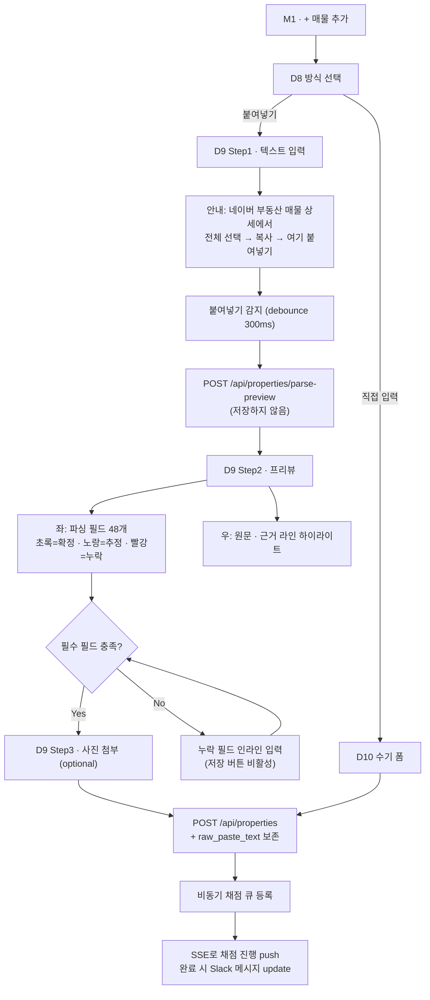

**Step 1 — 입력**

- 화면 대부분을 차지하는 단일 `textarea`. 라벨 없이 placeholder로만 안내
- 붙여넣는 즉시 파싱 (버튼 누르게 하지 않음). 300ms debounce
- 붙여넣은 텍스트가 네이버 매물 상세 형식이 아니면 (`매물번호` 라벨 부재) "매물 상세 화면 텍스트가 아닌 것 같습니다" 경고 후 수기 입력 제안
- **단지 페이지를 붙여넣은 경우를 별도로 감지**해 안내합니다. 사용자가 흔히 혼동하는 지점이고, 단지 페이지에는 동/호·층·향·호가가 없습니다

**Step 2 — 프리뷰 (핵심 화면)**

2단 레이아웃. 좌측은 파싱된 필드, 우측은 원문입니다.

| 상태 | 표시 | 동작 |
|---|---|---|
| `EXACT` | 초록 체크 + 값 | 클릭 시 우측 원문의 근거 라인 하이라이트 |
| `DERIVED` | 노란 배경 + 추정 근거 | "2027년 01월 초순 → 2027-01-05로 추정" 툴팁, 직접 수정 가능 |
| `MISSING` | 빨간 테두리 + 입력 필드 | 필수 필드면 저장 차단 |

- 필드를 클릭하면 우측 원문에서 해당 라인으로 스크롤 + 하이라이트 → **파싱이 맞는지 3초 안에 눈으로 검증**할 수 있습니다
- 상단에 요약 배지: `48개 확정 · 2개 추정 · 0개 누락`
- **입주가능일이 결혼식 데드라인 이후면 즉시 경고 배너.** 실측 사례가 2027년 1월이었고, 이건 다른 조건을 볼 필요 없이 탈락입니다. 등록은 허용하되 눈에 띄게 표시합니다
- 지하철 도보시간·초등학교 거리가 파싱되면 "역세권 53점 / 교육 25점(초등 확인)" 같은 **예상 점수를 미리 보여줍니다**

**Step 3 — 사진**

도면 1장 + 실사 N장. 붙여넣기로는 사진이 안 오므로 이 단계만 수동입니다. 건너뛰기 허용.

**모바일 제약 — 실질적으로 PC/iPad 전용 기능입니다**

iPhone에서 네이버 앱의 매물 상세 텍스트를 전체 선택·복사하는 것은 사실상 불가능합니다(앱 공유 기능은 링크만 제공). 따라서:

- 모바일에서는 **`DRAFT` 상태로 URL만 저장**하는 경로를 제공합니다. 임장 현장에서 URL만 던져두고, 귀가 후 PC에서 텍스트를 붙여 완성합니다
- `DRAFT` 매물은 리스트에 별도 섹션으로 표시하고 채점하지 않습니다
- 모바일 D9는 URL 입력 + 메모만 받는 축소 폼으로 전환합니다

### 9.5 모바일 DRAFT 등록 (확정 — Full 붙여넣기 지원)

**모바일에서도 D9 Full 플로우를 그대로 제공합니다.** iOS Safari(네이버 앱 아님)에서 네이버 부동산 웹 버전에 접속하면 텍스트 선택·복사가 가능하므로, "모바일=축소 입력"으로 단정하지 않고 **PC와 동일한 3-Step**을 모바일 레이아웃(Session 10 Bottom Sheet)으로 제공합니다.

**DRAFT는 별개의 빠른 경로로 유지합니다.** 중개사와 대화 중이라 텍스트를 복사할 여유가 없는 상황을 위한 **탈출구**입니다.

| | 경로 A: DRAFT (긴급) | 경로 B: Full 붙여넣기 (모바일도 지원) |
|---|---|---|
| 트리거 | M1 `+` → "빠른 저장" | M1 `+` → "붙여넣기로 등록" |
| 필수 입력 | 원본 URL + 메모 | 텍스트 전체 (D9 Step 1~3, PC와 동일 UI) |
| 소요 | 약 10초 | PC와 동일 — iOS Safari 기준 약 1~2분 |
| 결과 | `is_draft = true` | `is_draft = false`, 즉시 채점 큐 등록 |

**모바일 D9 레이아웃 차이**

- Step 1의 `textarea`는 `min-height: 40vh`, 키보드 표시 시 자동 스크롤
- Step 2 프리뷰는 좌우 분할이 아니라 **탭 전환**(파싱 결과 / 원문 대조)으로 바뀝니다 — 화면 폭이 부족하므로
- `paste` 이벤트가 iOS Safari에서 `textarea` 포커스 없이는 불안정하므로, textarea를 탭하면 자동 포커스 + "여기를 길게 눌러 붙여넣기" 안내 오버레이를 표시
- 네이버 앱 인앱 브라우저는 클립보드 API 제약이 있어 **"Safari에서 열기" 안내 배너**를 조건부로 노출 (User-Agent로 감지)

**승격 플로우 (DRAFT → 정식)**: 리스트의 "작성 중" 항목 클릭 → D9 Step 1로 진입(URL 유지) → 텍스트 붙여넣기 → 프리뷰 확인 → 저장 시 `is_draft = false` 전환 + 채점 큐 등록. PC·모바일 어느 쪽에서도 승격 가능합니다.

### 9.6 파서 취약 지점

| 위험 | 완화 |
|---|---|
| 네이버 레이아웃 변경 | fixture 회귀 테스트 + 라벨 인접 전략 + 원문 보존 후 재파싱 |
| 라벨 중복 (`위치`가 단지·중개사 양쪽에 등장) | 섹션 경계를 먼저 잡고 그 안에서 탐색 |
| 전화번호 연결 (`02-312-9595010-2272-6242`) | 정규식 `(0\d{1,2}-\d{3,4}-\d{4})` 반복 매치로 분리 |
| 월세 `5,000/80` 형태 | `/` 분리 후 보증금·월세 각각 파싱 |
| 오피스텔·빌라 등 다른 유형 | 필드 집합이 다름. 유형별 fixture 필수 |
| 초순/중순/하순 | 5/15/25일로 추정하고 `DERIVED` 표시 |

---

## 10. 임장 동선 최적화 (신규)

### 10.1 사용자 플로우

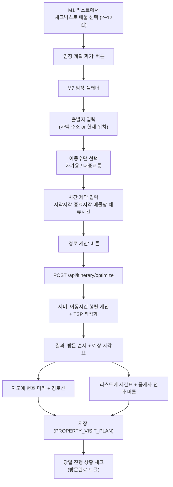

**가정 명시** (요구사항에 없던 값은 아래 기본값으로 확정하고 설정 가능하게 둡니다)

| 항목 | 기본값 | 근거 |
|---|---|---|
| 매물당 체류시간 | 25분 | 이전 대화의 실측 임장 스케줄과 유사 |
| 매물 간 최소 간격 | 이동시간 그대로 (버퍼 없음) | 사용자가 여유를 원하면 시작시각을 늦게 잡음 |
| 중개사 영업시간 | 09:00~19:00 | 매물의 실제 영업시간 데이터가 없으므로 통상값 가정 |
| 이동수단 기본값 | 대중교통 | Session 3.2에서 ODsay를 이미 채택했으므로 재사용 |
| 최대 매물 수 | 12건 (하드 캡) | Session 16-I38 정책 확정 |

### 10.2 데이터 모델

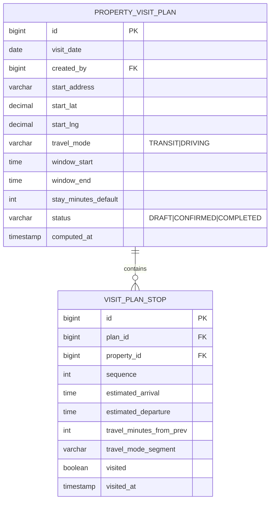

### 10.3 최적화 알고리즘 — Held-Karp (정확해)

매물 수가 실질적으로 2~12건 범위이므로, 근사 알고리즘이 아니라 **정확한 TSP 해**를 씁니다.

**왜 정확해로 확정할 수 있는가**: Held-Karp 동적계획법의 시간복잡도는 `O(n² × 2ⁿ)`입니다. n=12(Session 16-I38에서 확정한 하드 캡)일 때 약 144 × 4096 ≈ 59만 연산으로, 서버에서 수십 밀리초 안에 끝납니다. **12건 상한이 정책으로 고정되었으므로 근사 알고리즘 분기는 두지 않습니다** — 항상 정확해를 반환합니다.

```java
public class ItineraryOptimizer {

    /** stops[0]은 출발지(가상 노드, 방문 대상 아님) */
    public List<Integer> solve(int[][] travelMinutes) {
        int n = travelMinutes.length;   // n ≤ 13 (매물 12 + 출발지 1), 서비스 계층에서 상한 보장
        int full = 1 << n;
        double[][] dp = new double[full][n];
        int[][] parent = new int[full][n];
        for (double[] row : dp) Arrays.fill(row, Double.MAX_VALUE);
        dp[1][0] = 0;  // 출발지에서 시작, 출발지만 방문한 상태

        for (int mask = 1; mask < full; mask++) {
            for (int u = 0; u < n; u++) {
                if ((mask & (1 << u)) == 0 || dp[mask][u] == Double.MAX_VALUE) continue;
                for (int v = 0; v < n; v++) {
                    if ((mask & (1 << v)) != 0) continue;
                    int next = mask | (1 << v);
                    double cost = dp[mask][u] + travelMinutes[u][v];
                    if (cost < dp[next][v]) {
                        dp[next][v] = cost;
                        parent[next][v] = u;
                    }
                }
            }
        }
        // 전체 방문 상태 중 최소 비용 종점 역추적
        return backtrack(dp, parent, full - 1);
    }
}
```

**왕복이 아니라 편도**입니다 — 마지막 매물에서 귀가하는 경로는 최적화 대상에 넣지 않습니다(굳이 출발지로 돌아올 필요가 없으므로). `dp[full-1][end]`가 최소인 `end`를 찾아 역추적하면 됩니다.

**시간 제약(영업시간·window)은 2단계로 분리**합니다. 1단계는 순수 이동시간 합이 최소인 순서를 Held-Karp으로 구하고, 2단계는 그 순서에 시각을 배치하면서 `window_start`~`window_end`를 벗어나는지만 검증합니다. 순서와 스케줄링을 함께 최적화하는 진짜 TSP-TW는 훨씬 복잡한데, 매물이 12건 이하인 개인용 앱에서 그 복잡도는 과합니다. 검증에서 실패하면 "이 순서로는 19시를 넘깁니다 — 매물을 줄이거나 시작을 당기세요"라고 안내하고 순서 자체는 그대로 보여줍니다.

### 10.4 이동시간 행렬 계산

`n`개 매물 + 출발지 = `n+1`개 노드, 필요한 쌍은 `(n+1) × n`개(자기 자신 제외, 방향성 있음 — 대중교통은 A→B와 B→A 소요시간이 다를 수 있음).

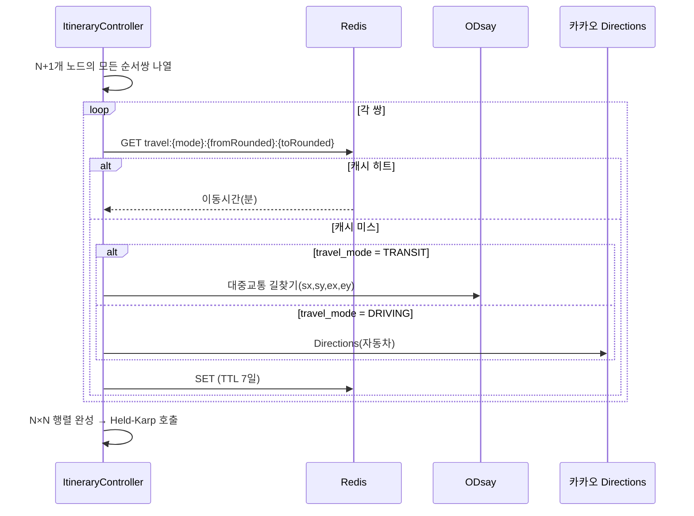

- N=8이면 최대 56회 API 호출인데, **Redis 캐시(좌표 100m 반올림 키, TTL 7일)로 실질 호출은 재계산 시 대부분 캐시 히트**가 됩니다. 매물 목록이 자주 바뀌지 않는 임장 계획 특성상 재사용률이 높습니다
- 병렬 호출로 지연을 줄입니다 (`CompletableFuture.allOf`), ODsay 쿼터(Session 16-I9)를 고려해 동시성은 5로 제한
- 대중교통 소요시간에는 환승 대기시간이 포함되므로, 자가용보다 변동성이 큽니다 — 계산 시점의 스냅샷이라는 점을 UI에 명시

### 10.5 UI — M7 임장 플래너 (신규 Main Frame)

지도·리스트 좌우 분할은 M1과 동일 구조를 재사용하되, 우측 지도에 **경로선과 순번 마커**가 추가됩니다.

```
┌─────────────────────┬───────────────────────────┐
│ 좌측 30%              │ 우측 70% — 지도              │
│                      │                            │
│ [출발지: 우리집 ▾]     │     ①━━━━②                 │
│ [대중교통 ▾] [09:00~19:00]│      ┃                  │
│ [경로 재계산]           │      ③━━━━④━━━━⑤          │
│                      │                            │
│ ① 09:00 평창동삼성래미안  │  번호 마커 + 폴리라인 경로     │
│    체류 25분→ 이동 32분  │                            │
│ ② 09:57 홍제삼성래미안    │                            │
│    ☎ 02-730-1248     │                            │
│    ☐ 방문완료          │                            │
│ ③ 10:40 ...          │                            │
└─────────────────────┴───────────────────────────┘
```

- 매물 카드마다 **중개사 전화번호를 원터치로 걸 수 있는 버튼** — Session 9.2에서 확보한 `agentPhones`를 그대로 사용
- 순서를 드래그로 수동 조정할 수 있게 하되, 수동 조정 시 시간표는 재계산하지만 **순서 자체를 다시 최적화하지는 않습니다**(사용자 의도 존중)
- 방문 완료 체크 시 `VISIT_PLAN_STOP.visited=true` — 다음 매물까지 남은 시간이 실시간으로 갱신되어 늦어지는지 한눈에 보입니다
- 인쇄/PDF 내보내기: 현장에서 데이터 없이도 볼 수 있도록 (선택 기능)

### 10.6 API

| Method | Path | 설명 |
|---|---|---|
| GET·PUT | `/api/itinerary/start-location` | 출발지 조회·캐시 (TTL 7일 — Session 16-I52) |
| POST | `/api/itinerary/optimize` | 매물 ID 목록 + 제약 → 최적 순서 계산 (미저장, 프리뷰) |
| POST | `/api/itinerary/plans` | 계획 저장 |
| GET | `/api/itinerary/plans/{id}` | 계획 조회 |
| PATCH | `/api/itinerary/plans/{id}/stops/{stopId}` | 순서 수동 조정 · 방문완료 토글 |
| POST | `/api/itinerary/plans/{id}/recompute` | 이동시간 재계산(교통 상황 변화 반영) |

### 10.7 이동수단 투트랙 — 자가용 / 대중교통 (확정)

동일한 임장 계획에 두 이동수단이 섞이지 않습니다. 계획을 만들 때 `travel_mode`(`DRIVING` | `TRANSIT`)를 하나 고르면 **그 계획 전체가 그 수단으로 계산**됩니다.

| | 자가용 (DRIVING) | 대중교통 (TRANSIT) |
|---|---|---|
| 이동시간 소스 | 카카오 Directions API | ODsay 대중교통 길찾기 |
| 소요시간 특성 | 교통 상황에 따라 변동, 비교적 안정적 | 배차 간격·환승 대기 포함, 변동성 큼 |
| 부가 정보 | 예상 통행료·유류비 (카카오 응답에 포함) | 환승 횟수·도보 구간 |
| 주차 고려 | **필요** — Session 10.7.1 | 불필요 |
| UI 표시 | 경로선(Kakao Directions 폴리라인) | 경로선 + 환승 아이콘 |

**두 수단을 한 계획에서 섞지 않는 이유**: 자가용은 방문 후 다시 차로 이동하지만 대중교통은 도보 구간이 끼어 체류시간 산정 기준이 달라집니다. 매물 A는 대중교통, B는 도보 5분 거리라 걸어서 이동 같은 혼합은 Held-Karp의 비용 행렬을 이질적으로 만들어 최적해의 의미가 흐려집니다. 대신 **같은 매물 집합으로 두 계획을 각각 만들어 비교**할 수 있게 합니다 — "오늘은 차로 갈까, 대중교통으로 갈까"를 계획 두 개 띄워놓고 소요시간 합계로 비교하면 됩니다.

#### 10.7.1 자가용 추가 고려사항

- **주차 정보 표시**: Session 9.2에서 파싱한 `parking_per_household`(세대당 주차대수)를 매물 카드에 노출 — 방문객 주차 가능 여부의 참고 지표(정확한 방문객 주차 대수는 아님)
- **왕복 유류비 합산**: 카카오 Directions가 구간별 유류비를 반환하므로 계획 하단에 "예상 총 유류비" 표시 (선택 정보, 의사결정에 영향 없음)
- **정체 시간대**: 카카오 Directions는 실시간 교통 반영 옵션이 있으나, Session 10.4의 캐시(TTL 7일)와는 상충합니다 — **자가용 계획은 캐시를 쓰지 않고 매번 실시간 조회**로 예외 처리합니다. 대중교통은 배차 패턴이 상대적으로 안정적이라 캐시를 유지합니다

#### 10.7.2 ERD 갱신

`PROPERTY_VISIT_PLAN.travel_mode`는 이미 Session 10.2에 있던 필드를 그대로 사용합니다. `VISIT_PLAN_STOP.travel_mode_segment`는 항상 계획의 `travel_mode`와 동일하므로 향후 혼합 계획을 지원하지 않는 한 중복 필드입니다 — 현재는 이력 추적용으로 유지합니다.

### 10.8 이슈

**I37. 이동시간 시점 의존성 · [확정 — 수동 재계산 + 이동수단 투트랙]**
자동 재계산은 넣지 않고 수동 "재계산" 버튼으로 확정합니다. 대신 **이동수단을 자가용/대중교통 투트랙으로 분리**합니다(Session 10.7).

**I38. 하루 매물 수 상한 · [확정 — 12건 하드 캡]**
근사 알고리즘 폴백을 없애고 **하루 12건을 정책상 상한으로 고정**합니다. M7에서 13건째를 선택하려 하면 체크박스가 비활성화되고 "하루 임장은 최대 12건입니다"를 표시합니다. Session 10.3의 근사 알고리즘 분기(`n > 12`)는 이제 도달하지 않는 경로이므로 코드에서 제거합니다 — 죽은 코드를 남기지 않습니다.

---

## 11. 반응형 전략

| 브레이크포인트 | 대상 | 레이아웃 |
|---|---|---|
| `≥1280px` | PC | 리스트 30% : 지도 70% 좌우 분할 |
| `768~1279px` | iPad | 리스트 40% : 지도 60%, 리스트 접기 토글 |
| `<768px` | iPhone | **탭 전환** (리스트 ⇄ 지도) 또는 지도 위 **Bottom Sheet** (peek 30% → 확장 85%) |

- CSS Grid + `clamp()` 기반, 프레임워크 없이 구현 가능
- 지도 컨테이너 리사이즈 시 `map.relayout()` 호출 필수
- 터치: 마커 탭 → Bottom Sheet 자동 확장
- iOS Safari `100vh` 문제 → `100dvh` 사용

---

## 12. 매물 생존 확인 배치 (판매완료 감지)

### 12.1 스케줄

```java
@Scheduled(cron = "0 0 9 * * *", zone = "Asia/Seoul")
```

대상은 **`source_url`이 존재하고** `listing_status IN ('ACTIVE','UNREACHABLE')`이며 `is_draft = false`인 매물입니다. 붙여넣기(`PASTE`)로 등록해도 원본 URL을 함께 받으므로 포함되며, 순수 수기 입력 매물만 제외됩니다.

### 12.2 처리 흐름

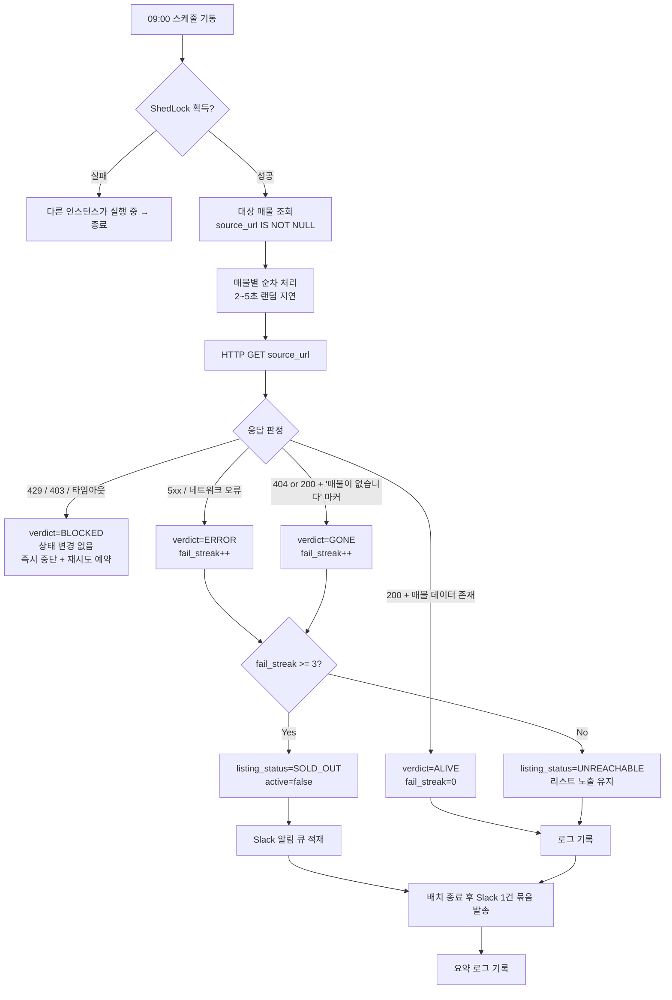

### 12.3 판정 로직 — 여기가 가장 어렵습니다

**네이버페이 부동산은 삭제된 매물에도 HTTP 404를 주지 않습니다.** CSR SPA이므로 껍데기 HTML은 200으로 정상 반환되고, "존재하지 않는 매물입니다" 문구는 JS 실행 후에야 DOM에 나타납니다. 단순히 상태코드만 보면 **모든 매물이 영원히 살아있는 것으로 판정**됩니다.

판정 순서를 다음과 같이 둡니다.

| 단계 | 방법 | 신뢰도 |
|---|---|---|
| 1 | 내부 JSON 엔드포인트 호출 (`articleNo` 기반) → 응답 코드·`body.result` 확인 | 높음 / 스펙 변경 위험 |
| 2 | HTML 내 초기 상태 JSON(`__NEXT_DATA__` 등) 추출 후 매물 객체 존재 확인 | 중간 |
| 3 | 렌더 후 텍스트 마커 탐지 (Playwright) | 높음 / 무겁고 차단 위험 |
| 4 | 전부 실패 → `UNREACHABLE` 로 두고 사용자에게 수동 확인 요청 | — |

**1~3단계 모두 네이버 구현 변경에 취약합니다.** 판정 로직을 `ListingAliveChecker` 인터페이스로 분리하고 전략을 교체 가능하게 두세요. 그리고 **판정 근거 문자열(`evidence`)을 반드시 로그에 남겨야** 파서가 깨졌을 때 원인을 추적할 수 있습니다.

### 12.4 오탐 방지 규칙

판매완료 오판정은 실제 후보를 리스트에서 지워버리므로, 살아있는 매물을 죽었다고 하는 쪽(false positive)이 훨씬 치명적입니다.

- **3일 연속 `GONE` 판정 시에만** `SOLD_OUT` 확정. 1~2일차는 `UNREACHABLE`로 두고 리스트에 그대로 노출
- `403/429`(봇 차단)는 **fail_streak을 올리지 않고** 즉시 배치 중단. 차단당한 상태에서 계속 두드리면 전 매물이 판매완료로 뒤집힙니다
- 파싱 실패(마커도 데이터도 못 찾음)는 `GONE`이 아니라 `ERROR`
- 한 번의 배치에서 **전체 매물의 50% 이상이 `GONE`** 이면 자체 오류로 간주하고 전량 롤백 + 관리자 알림 (서킷 브레이커)
- 사용자가 D20에서 언제든 수동 복구 가능

### 12.5 Slack 알림

알림은 배치 전용이 아니라 **애플리케이션 공통 기능**입니다. 상세 설계는 Session 13으로 분리했습니다. 배치가 발행하는 이벤트는 다음과 같습니다.

| 이벤트 | 발행 시점 | 멘션 |
|---|---|---|
| `LISTING_SOLD_OUT` | 3일 연속 GONE 확정 시, 배치 종료 후 1건으로 묶음 | 총점 1~3위 매물이면 `@channel` |
| `BATCH_BLOCKED` | 403/429 감지로 배치 중단 | `@here` |
| `BATCH_CIRCUIT_OPEN` | 서킷 브레이커 발동(50% 이상 GONE) | `@here` |
| `BATCH_SUMMARY` | 매 회차 종료 (정상 시에도 1줄) | 없음 |

### 12.6 판매완료 매물의 취급

| 항목 | 처리 |
|---|---|
| 리스트 | 기본 숨김. "판매완료 포함" 토글로 회색 처리 노출 |
| 지도 | 회색 마커, 기본 비표시 |
| **가격 채점** | **영향 없음.** `PRICE`는 리스트 내 min-max 상대평가가 아니라 예산상한 기준 절대평가이므로(Session 5.2.1), 매물이 빠져도 나머지 매물의 가격 점수가 흔들리지 않습니다 (Session 16-I6) |
| 데이터 | 삭제하지 않고 보존 — "이 가격대는 이렇게 빠지는구나"라는 시세 감각 자료가 됩니다 |
| 재채점 | 트리거하지 않음 |

---

## 13. 알림 (Slack) · 시스템 설정

### 13.1 알림 이벤트

| 이벤트 | 트리거 | 묶음 발송 | 멘션 |
|---|---|---|---|
| `PROPERTY_CREATED` | 매물 등록 완료 (수기·URL·붙여넣기 공통) | ✕ 즉시 | 없음 |
| `LISTING_SOLD_OUT` | 판매완료 확정 | ○ 배치당 1건 | Top3면 `@channel` |
| `BATCH_BLOCKED` | 봇 차단 감지 | ✕ | `@here` |
| `BATCH_CIRCUIT_OPEN` | 서킷 브레이커 발동 | ✕ | `@here` |
| `BATCH_SUMMARY` | 배치 종료 | ✕ | 없음 |

**모두 동일 채널로 발송**하며, 채널은 시스템 설정값입니다.

### 13.2 발송 아키텍처

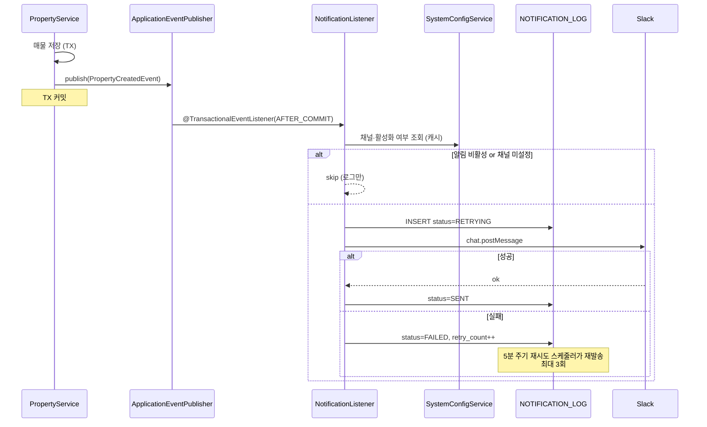

**설계 원칙 세 가지**

1. **`AFTER_COMMIT` 이벤트로 분리.** 매물 저장 트랜잭션 안에서 Slack을 호출하면 Slack 장애가 매물 등록 실패로 이어집니다. 커밋 후 별도 처리해야 합니다.
2. **알림 실패가 업무를 막지 않는다.** `NOTIFICATION_LOG`에 남기고 재시도하되, 사용자에게는 매물 등록 성공으로 응답합니다.
3. **`@Async` + 스레드풀 분리.** 알림용 `TaskExecutor`를 채점 워커와 분리해 서로 영향을 주지 않게 합니다.

### 13.3 메시지 포맷

**매물 등록**

```
:house_with_garden: 새 매물이 등록되었습니다

*독립문삼호 101동*  매매 13억 5,000만원
전용 84.93㎡(25.7평) · 7/15층 · 남동향
3호선 무악재역 도보 11분 · 1995년 준공

등록: 윤선 · 방금 전
총점 74.2 (전체 3위)   [매물 보기]
```

- 총점은 자동 채점 완료 전이면 `채점 중`으로 표기하고, 채점 완료 시 **동일 메시지를 `chat.update`로 갱신**하는 편이 알림 2건보다 낫습니다
- `source_url`이 있으면 원본 링크를 함께 첨부

**판매완료**

```
:house: 판매완료 감지 (2026-08-25 09:00)

• 상계동양메이저 104동  8.5억 매매  (3일 연속 미확인)
  등록: 윤선 · 총점 82.4 (1위)  ← @channel

• 홍제청구3차 301동  10.2억 매매
  등록: 혜미 · 총점 61.0 (5위)

점검 30건 / 정상 27 · 판매완료 2 · 오류 1
```

### 13.4 Slack 연동 — Incoming Webhook (확정)

**Incoming Webhook + `application.yaml` 정의**로 확정합니다.

> **⚠ 이 절은 I96에서 뒤집혔습니다.** Webhook URL은 이제 환경변수가 아니라
> **DB(`user_group.slack_webhook_url`)** 에 있습니다 — 그룹마다 다른 채널로 보내야 하기
> 때문입니다. 아래는 그렇게 바뀌기 전의 기록입니다. `slack.enabled`와 `notify.*`는 그대로입니다.

```yaml
slack:
  enabled: true
  webhook-url: ${SLACK_WEBHOOK_URL}      # I96에서 DB로 이동
  notify:
    property-created: true
    sold-out: true
  mention-top-n: 3
```

**트레이드오프를 명시해 둡니다.** Webhook URL은 생성 시점에 채널이 고정 바인딩되므로 **채널은 런타임에 변경할 수 없습니다.** 채널을 바꾸려면 Slack에서 Webhook을 새로 발급받아 yaml을 수정하고 **재배포**해야 합니다. 개인용 앱에서 채널이 바뀔 일이 거의 없다는 판단이면 합리적인 선택입니다.

이 결정에 따라 `SYSTEM_CONFIG` 테이블의 Slack 항목은 제거하고, **배치·채점·대출 파라미터만** DB에 남깁니다. URL은 `${SLACK_WEBHOOK_URL}` 환경변수로 주입해 yaml에 평문으로 남기지 않습니다.

### 13.5 시스템 설정 (`SYSTEM_CONFIG`)

Slack 관련 항목은 `application.yaml`로 이동했습니다(Session 13.4). DB에는 런타임 조정이 실제로 필요한 값만 둡니다.

| Key | Category | Type | 기본값 | 설명 |
|---|---|---|---|---|
| `batch.listingCheck.enabled` | BATCH | BOOL | `false` | |
| `batch.listingCheck.cron` | BATCH | STRING | `0 0 9 * * *` | |
| `batch.listingCheck.failThreshold` | BATCH | INT | `3` | 판매완료 확정 연속 횟수 |
| `batch.listingCheck.autoDisable` | BATCH | BOOL | `false` | 초기엔 알림만 (Session 16-I14) |
| `loan.regulation.profile` | LOAN | STRING | `2025-10-15` | 규제 파라미터 세트 |

**설계 메모**
- `SECRET` 타입은 조회 API에서 `xoxb-****...abc`로 마스킹하고, 저장 시 애플리케이션 레벨 암호화(Jasypt 등) 적용
- 캐시(`@Cacheable`) + 변경 시 `@CacheEvict`. 매 알림마다 DB를 치지 않게 함
- **부팅 시 `application.yml` 값으로 시드**하고, 이후에는 DB가 우선. 환경변수 우선 오버라이드 옵션도 둠(운영 사고 복구용)
- 변경 이력은 `updated_by` / `updated_at`으로 최소한만 추적
- **`SCORING` 카테고리는 두지 않습니다.** 채점 상수(층수 임계값·가중치 커브)는 코드에만 두기로 확정했습니다 — Session 16-I41
- `batch.listingCheck.cron`을 런타임에 바꾸려면 `@Scheduled` 고정 cron이 아니라 `SchedulingConfigurer` + `Trigger`로 구현해야 합니다

### 13.6 설정 화면

새 Main Frame **M6 `/admin/settings`** (ADMIN 전용). 카테고리별 탭(배치 / 채점 / 대출)으로 구성합니다. Slack은 yaml 관리이므로 설정 화면에서는 **현재 연동 상태 표시 + 테스트 발송 버튼**만 제공합니다. Webhook 오설정은 실제로 쏴봐야만 알 수 있습니다.

---

## 14. 배포 · 운영

### 14.1 환경

| 항목 | 값 |
|---|---|
| 도메인 | `https://halley.furaiki-lifelog.com` |
| TLS | Let's Encrypt (Caddy 권장 — 자동 갱신 내장) |
| 구조 | Reverse Proxy(Caddy/nginx) → Spring Boot(8080) → PostgreSQL |
| 프로파일 | `local` / `live` (Session 2.3) |

### 14.2 HTTPS 도입 시 필수 설정

리버스 프록시 뒤에 두면 Spring이 자기 스킴을 `http`로 오인해 리다이렉트·쿠키가 깨집니다.

```yaml
server:
  forward-headers-strategy: framework   # X-Forwarded-* 신뢰
  servlet:
    session:
      cookie:
        secure: true
        http-only: true
        same-site: lax
```

**카카오맵 JS 키에 도메인을 등록해야 합니다.** 카카오 개발자 콘솔의 플랫폼 → Web 사이트 도메인에 `https://halley.furaiki-lifelog.com`을 추가하지 않으면 지도가 렌더되지 않습니다. 로컬 개발용 `http://localhost:8080`도 함께 등록해 두세요.

### 14.3 PostgreSQL · MongoDB 사용 범위

**PostgreSQL 단일 사용을 권합니다.** 반정형 데이터(`parse_confidence`, `path_summary`, `payload`)는 JSONB로 충분하고, 인덱싱·트랜잭션·조인이 한 곳에서 끝납니다. 소수 사용자 앱에 DB 두 개를 운영하면 백업 경로도 두 개가 됩니다.

MongoDB를 굳이 쓰신다면 후보는 다음 두 개입니다.

| 대상 | Mongo가 나은 이유 | 그래도 Postgres로 충분한 이유 |
|---|---|---|
| `raw_paste_text` | 대용량 텍스트, 조인 불필요 | TEXT + TOAST 자동 압축 |
| `LISTING_CHECK_LOG` | append-only, 일 30건 누적 | 연 1만 건 — 파티셔닝도 불필요 |

공간 연산(하천·공원 거리 계산)이 필요해지면 **PostGIS**가 답이고, 이건 Mongo로 대체되지 않습니다.

### 14.4 백업

12월 입주까지 4개월간 쌓이는 임장 기록이 날아가면 복구 수단이 없습니다.

- `pg_dump` 일 1회 + 이미지 디렉터리 rsync → 다른 물리 위치
- 최소 7일치 보관
- **Slack 알림에 백업 성공/실패를 포함**하면 별도 모니터링이 필요 없습니다

---

## 15. 개발 로드맵

| 단계 | 범위 | 산출물 |
|---|---|---|
| **P1** | 인증·세션·Admin 부트스트랩, 사용자 CRUD **+ 활성/비활성 + 비밀번호 리셋** | M3·M5, D1~D7, D19, D24 |
| **P2** | 매물 수기 CRUD, 지도 연동, 리스트-지도 동기화 **+ 로드뷰 모달** | M1·M2, D8·D10~D13, D23 |
| **P3** | 채점 엔진 (MANUAL 먼저) + 가중치·정렬 | M4, D14·D15 |
| **P4** | AUTO 채점 (카카오 POI → ODsay 순) | D18 |
| **P5** | **붙여넣기 파서 + D9 프리뷰 UI (PC·모바일 공통)** | D9 |
| **P6** | **시스템 설정 + Slack 알림 (매물 등록)** | M6, D22 |
| **P7** | **생존 확인 배치 + 판매완료 알림** | D20·D21 |
| **P8** | 대출 계산기 **+ 국토부 실거래가 참고 카드** | D16 |
| **P9** | **임장 동선 최적화 (Held-Karp + 이동시간 행렬)** | M7 (Session 10) |
| **P10** | 반응형 마감·성능 | — |
| **P11** | HTTPS 배포 · 백업 자동화 | — |

P6(설정·알림)을 P7(배치)보다 앞에 둡니다. 배치의 결과 통로가 Slack이므로 알림이 먼저 동작해야 배치를 검증할 수 있고, 매물 등록 알림은 배치 없이도 즉시 가치가 있습니다. P7은 P5(파싱)와 같은 파서 자산을 공유하므로 그 뒤에 붙입니다.

**P4를 P3보다 뒤에 둔 이유**: 자동 채점 없이도 앱은 완전히 동작합니다. 외부 API 의존이 가장 큰 부분을 뒤로 미뤄야 앞 단계가 막히지 않습니다.

---

## 16. 이슈 및 결정 필요 사항

### I1. SPA와 Mustache · **[확정 — Alpine.js]**
Mustache는 App Shell(레이아웃·로그인 셸) 전용으로 한정하고, 클라이언트 렌더링은 **Alpine.js**로 처리합니다. `x-data`/`x-for`/`x-show`로 리스트·모달·폼을 선언적으로 다루고, 빌드 도구 없이 CDN 한 줄로 끝나므로 Shell-SPA 구조와 잘 맞습니다. 상태는 `Alpine.store()`로 전역 관리하고, 매물 목록·현재 선택·세션 정보를 여기에 둡니다.

### I2. 네이버 부동산 크롤링 — 법적·기술적 리스크 · **[중대]**
- **법적**: 네이버 이용약관은 자동화 수집을 금지하며 `robots.txt`도 차단합니다. 개인 학습용 소규모 사용은 현실적으로 문제되기 어렵지만, **설계 문서에 "합법"이라고 쓸 수 없는 영역**입니다. 서비스로 공개하거나 대량 수집하면 리스크가 실재합니다.
- **기술적**: 네이버페이 부동산은 CSR(클라이언트 렌더링) SPA입니다. `Jsoup`으로 HTML을 받아도 **매물 데이터가 들어있지 않습니다.** 내부 JSON API를 호출해야 하는데 이는 비공개 스펙이라 예고 없이 바뀌고, 토큰·User-Agent 검증에 걸립니다. Playwright 헤드리스는 무겁고 차단 위험이 큽니다.
- **권고**: 기본은 수기 입력, URL은 "가능하면 채워주는" 보조 기능으로 격하. 또는 **네이버 앱의 "공유하기" 텍스트를 붙여넣으면 정규식으로 파싱**하는 방식이 훨씬 안정적이고 리스크가 낮습니다.

### I3. 층수 채점 · **[확정 — Session 5.3]**
밴드 표기는 **저 0 / 중·고 100(동점)**, 숫자 표기는 1층 0점 → 6층 100점 선형이고 **7층 이상은 전부 100점 동점**으로 확정했습니다. `floor_total`은 쓰지 않습니다. 부작용 정리는 I27.

<details><summary>원 이슈 기록 (초안: 저 30 / 중 65 / 고 100, 15층 정점·16층 이상 0점 — 폐기)</summary>
요구사항에 두 규칙이 함께 있습니다.
- "1층과 **최고층**은 가장 낮은 점수" (숫자층)
- "고/중/저 표기라면 **고가 최고점**" (밴드)

20층 아파트의 20층은 첫 규칙에선 최저점, 둘째 규칙에선 "고"라 최고점이 됩니다. **같은 매물이 데이터 표기 방식에 따라 0점도 100점도 됩니다.** 어느 쪽을 정책으로 삼을지 결정이 필요합니다. (제안: 밴드값도 "중"을 최고점으로 통일하거나, 밴드 데이터는 자동 채점 대상에서 제외하고 수동 채점으로 폴백)
</details>

### I4. "도보 N분"의 정의 · **[확정 — 직선×1.3÷67, README 참조]**
<cite index="78-1">ODsay 무료 API의 도보 시간은 직선거리 기반입니다.</cite> 실제 도보 경로 API는 유료이고, 국내에서 무료로 쓸 수 있는 도보 경로 엔진이 마땅치 않습니다.
- 옵션 A: 직선거리 × 1.3(우회계수) ÷ 67m/분 — 간단, 무료, 오차 있음
- 옵션 B: OSRM 자체 호스팅 + OSM 데이터 — 정확, 인프라 부담
- **권고: A로 시작.** 언덕(홍제·창신 사례)은 어차피 어떤 API도 반영 못 하므로, 사용자 수동 보정 여지를 남기는 편이 낫습니다.

### I5. "탐방로가 조성된 산", "산책로가 조성된 하천", "헬스장" 판정 불가 · **[대안 필요]**
POI 카테고리로 나오지 않는 개념입니다.
- 산: 카카오 `AT4`(관광명소) + 이름에 "산/봉" 포함 필터 → 정확도 낮음. **대안: 산림청 등산로 데이터셋(공공데이터포털) 1회 적재**
- 하천: **국가하천망 shapefile** 적재 후 PostGIS 거리 계산
- 헬스장: 카테고리 없음 → 키워드 검색 "헬스" (프랜차이즈 누락 다수)
- **권고**: 녹색환경·운동시설은 **HYBRID**로 지정하고, 자동 결과를 초안으로만 쓰고 사용자 확정을 받으세요.

### I6. 가격 채점 · **[확정 — Session 5.2.1]**
사용자별 `available_budget` 합계를 예산 상한으로 삼는 **절대평가**로 확정했습니다. 채점 기준은 호가, 대출 산정은 KB시세. 남은 확인은 I28(예산 필드의 정의).

<details><summary>원 이슈 기록</summary>
"비쌀수록 감점"을 상대평가(리스트 내 min-max)로 하면, **싼 매물 하나를 추가하는 것만으로 기존 매물 점수가 전부 바뀝니다.** 대안:
- 절대 기준: 예산 상한 대비 (`100 × (1 − 가격/예산상한)`) — 안정적, 예산 입력 필요
- 평당가 기준: 면적 왜곡 제거 — 넓은 집이 유리해지는 편향 제거
- **권고: 평당가 기준 + 예산 상한 절대평가.** 매매/전세/월세는 스케일이 완전히 달라 **거래유형별로 분리 채점**해야 합니다.
</details>

### I7. 거래유형 분리 · **[확정 — 대카테고리 분리]**
매매와 전세를 **별도 순위표**로 운영합니다. M1 상단 탭으로 전환하고 `PRICE` 정규화·정렬을 카테고리 내부에서만 수행합니다. 통합 순위는 제공하지 않습니다.

### I8. 대출 한도 자동화의 한계 · **[제약 명시]**
개인 한도를 주는 공개 API는 없습니다. 자체 계산은 **DSR에 반영될 기존 대출(신용대출·마이너스통장·할부)을 앱이 알 수 없어** 과대 추정됩니다. 시뮬레이션 결과에 "은행 가심사 필요" 문구를 상시 노출하고, 사용자가 기존 대출 원리금을 직접 입력하는 필드를 두세요.

### I9. 외부 API 쿼터 · **[운영]**
사용자 N명 × 매물 M건 = `N×M` 대중교통 호출. 사용자 3명·매물 30건이면 90회이며, 사용자 1명 추가 시 30회가 추가됩니다. ODsay 무료 플랜 한도를 초과할 수 있습니다.
- 좌표 반올림(약 100m) 기반 캐시 키로 중복 제거
- 채점 결과 TTL 30일, 수동 갱신 버튼 제공
- Rate limiter + 지수 백오프 필수

### I10. 사용자 삭제 시 채점 데이터 · **[확정 — 데이터 보존]**
사용자를 지우면 그가 매긴 `COMFORT` 점수와 그의 직장 기준 `COMMUTE` 점수가 사라져 전 매물 총점이 변합니다. **Soft delete + 점수 보존**을 권합니다.

### I11. 동시 편집 충돌 · **[낮음]**
2명이 같은 매물을 동시에 수정할 수 있습니다. `@Version` 낙관적 락 + "다른 사용자가 수정했습니다" 안내면 충분합니다.

### I13. 비활성 사용자의 채점을 총점에 반영할 것인가 · **[확정 — I10과 동일, 계속 반영]**
비활성 사용자의 `COMFORT` 점수와 그의 직장 기준 `COMMUTE` 점수를 계속 반영할지 정해야 합니다.
- **반영**: 총점이 흔들리지 않지만, 더 이상 이 집에 살 사람이 아닌 사람의 통근시간이 순위를 좌우함
- **제외**: 논리적으로 맞지만 비활성화 순간 전 매물 순위가 재편됨
- **권고**: D19에서 **비활성화 시 선택하게** 하세요. "이 사용자의 평가를 순위에 계속 반영할까요?" 기본값은 *제외*가 맞습니다. 어느 쪽이든 `USER_CRITERION_SCORE` 데이터는 삭제하지 말고 필터링만 하세요.

### I14. 판매완료 오탐이 진짜 위험입니다 · **[중대]**
살아있는 매물을 죽었다고 판정하면 후보에서 사라지고, 그 사이 다른 사람이 계약합니다. 반대로 죽은 매물을 살아있다고 두는 건 임장 전화 한 통 낭비에 그칩니다. **비대칭이 매우 큽니다.**
Session 12.4의 3일 유예·서킷 브레이커·수동 복구를 전부 넣어야 합니다. 초기 2주는 **자동 비활성화를 끄고 Slack 알림만** 보내면서 판정 정확도를 관찰한 뒤 켜는 것을 권합니다.

### I15. 네이버는 삭제 매물에 404를 주지 않습니다 · **[중대]**
Session 12.3에 상술했습니다. "페이지가 없음"으로 판정하겠다는 전제 자체가 성립하지 않습니다. 내부 JSON API나 렌더 후 마커 탐지가 필요하고, 둘 다 네이버 구현 변경에 취약합니다.
**현실적 대안**: 매물 페이지가 아니라 **단지 매물 목록**을 받아 `articleNo`가 목록에 남아 있는지 확인하는 방식이 개별 페이지 판정보다 안정적일 수 있습니다. 요청 수도 줄어듭니다(단지당 1회).

### I16. 배치가 크롤링 리스크를 상시화합니다 · **[법적]**
Session 16-I2의 크롤링 리스크는 "매물 등록할 때 한 번"이었지만, 이제 **매일 자동으로 접속**하게 됩니다. 접근 패턴이 규칙적이라 봇으로 탐지되기 훨씬 쉽고, 약관 위반의 지속성 측면에서도 성격이 다릅니다.
- 최소한: `User-Agent` 명시, 매물 간 2~5초 랜덤 지연, 09:00 정각이 아닌 **09:00±10분 랜덤**, 30건 이하 유지
- 차단 감지 시 즉시 중단하고 24시간 백오프
- 개인용·소규모 전제를 벗어나면 이 기능은 재검토 대상입니다

### I17. 스케줄러 중복 실행 · **[운영]**
인스턴스를 2개 이상 띄우면 09:00에 배치가 동시에 돕니다. 크롤링에서는 요청량이 배로 늘어 차단 위험이 커집니다. **ShedLock**(`shedlock-spring` + JDBC) 적용을 권합니다. 단일 인스턴스 운영이면 당장은 불필요하지만, 나중에 넣기보다 처음에 넣는 편이 쌉니다.

### I18. Slack 연동 방식 · **[확정 — Webhook + yaml]**
Incoming Webhook을 `application.yaml`에 정의하고 URL은 환경변수로 주입합니다. 채널 변경 시 재배포가 필요하다는 제약을 수용합니다. 상세는 Session 13.4.

<details><summary>원 이슈 기록</summary>
Session 13.4에 상술했습니다. Webhook URL은 채널에 고정 바인딩되므로 "채널을 설정에서 변경"이 불가능합니다. **Bot Token + `chat.postMessage`** 로 가야 요구사항이 충족됩니다. 대신 Slack 앱 생성·`chat:write` 스코프 부여·채널 초대라는 초기 설정 단계가 늘어납니다. Webhook으로 가되 "채널 = URL 교체"로 타협할지 결정이 필요합니다.
</details>

### I19. 매물 등록 알림의 타이밍 · **[확정 — 등록 즉시, 등록자·위치·매물 포함]**
등록 직후에는 자동 채점이 아직 안 끝나 총점이 없습니다.
- 옵션 A: 등록 즉시 발송, 총점은 `채점 중` → 완료 시 `chat.update`로 갱신 (**권고**)
- 옵션 B: 채점 완료까지 대기 후 1건 발송 — 실패 시 알림이 영영 안 감
- 옵션 C: 2건 발송 — 알림 소음

### I20. 시크릿을 DB에 두는 것 · **[보안]**
Slack Bot Token을 `SYSTEM_CONFIG`에 저장하면 DB 덤프·백업 파일에 평문으로 남습니다. 최소한 Jasypt 등 애플리케이션 레벨 암호화를 적용하고, 조회 API에서는 항상 마스킹하세요. 개인용 규모라면 **토큰만 환경변수, 채널만 DB**로 나누는 절충도 합리적입니다 — 요구사항의 "채널은 설정 항목"은 그대로 충족됩니다.

### I21. 알림 소음 · **[운영]**
활성 사용자 전원이 매물을 등록할 수 있으므로, 임장 다녀온 날 저녁에 매물 10건을 몰아 넣으면 Slack에 10건이 쏟아집니다. **60초 내 동일 사용자의 연속 등록은 1건으로 묶는 디바운스**를 넣거나, `slack.notify.propertyCreated`를 끄고 일일 요약만 보내는 옵션을 두세요.

### I22. 호가와 KB시세 중 무엇으로 채점할 것인가 · **[결정 필요]**
실측 사례에서 호가 15억 / KB시세 13.5억으로 1.5억이 벌어졌습니다.
- `PRICE` 채점: 실제 지불액인 **호가** 기준이 맞습니다
- `LOAN` 계산: 은행이 보는 **KB시세** 기준이 맞습니다
- 추가 지표로 **호가/시세 괴리율**을 두면 "거품이 낀 매물"을 걸러낼 수 있습니다. 실측 사례는 +11%로 상당히 높습니다

### I23. 모바일 DRAFT · **[확정 — 도입]**
iPhone 네이버 앱에서는 매물 상세 텍스트 전체 복사가 사실상 불가능하므로, 모바일에서는 URL + 메모만 받아 `is_draft = true`로 저장합니다. 상세는 Session 9.5.

### I24. 원문 텍스트 DB 저장 · **[확정 — 저장]**
이 앱은 **완전 폐쇄형 프라이빗 앱**(계정은 Admin이 생성, 외부 공개·배포 없음)이라는 전제로 `raw_paste_text`를 저장합니다. 파서 개선 후 일괄 재파싱에 쓰는 것이 목적입니다. 공개 서비스로 전환할 계획이 생기면 이 항목은 재검토 대상입니다.

<details><summary>원 이슈 기록</summary>
붙여넣으신 텍스트 하단에 네이버파이낸셜의 저작권 문구가 명시돼 있습니다 — 게시 정보의 무단 복제·배포·전송을 금지하며, 특히 "반복적이거나 특정 목적을 위한 체계적인 것"을 포함한다고 적혀 있습니다.
`raw_paste_text`를 DB에 축적하는 것은 형식상 이 문구에 닿습니다. 개인 2인이 자기 참고용으로 쓰는 범위와 서비스로 공개·배포하는 것은 성격이 다르지만, **설계 문서에 "문제없음"이라고 쓸 수는 없는 영역**입니다.
- 옵션 A: 원문 저장하되 **외부 공개 없음** 전제, 파서 개선 후 재파싱하면 즉시 폐기 (**권고**)
- 옵션 B: 원문 미저장 — 파서 개선 시 사용자가 다시 붙여넣어야 함
- 어느 쪽이든 이 앱을 공개 서비스로 전환할 계획이 생기면 재검토 대상입니다
</details>

### I25. 파서 버전 관리 · **[설계 확정]**
`parser_version`을 저장하고, 파서 개선 시 `POST /api/admin/properties/reparse`로 구버전 매물을 일괄 재파싱합니다. 재파싱 결과가 기존 값과 다르면 **덮어쓰지 않고 diff를 보여준 뒤 사용자 승인**을 받으세요. 사용자가 수기로 보정한 값을 파서가 되돌리면 안 됩니다.

### I27. 층수 채점의 부작용 · **[해소 — 7층 동점 규칙으로 확정]**
초안(15층 정점·16층 이상 0점)에는 두 가지 부작용이 있었습니다.
- **15층 → 16층 절벽**: 100점에서 0점으로 떨어져 20층 건물의 16층과 1층이 동점
- **저층 건물 불리**: `floor_total`을 쓰지 않으므로 5층 건물의 최상층이 14.3점

Session 5.3의 확정 규칙(1~6층 선형, **7층 이상 전부 100점 동점**)에서는 **둘 다 발생하지 않습니다.** 절벽 구간이 없고, 6층에 가까울수록 점수가 높아 저층 건물도 구조적으로 밀리지 않습니다. 남은 특성은 "중층 이상은 층 차이가 순위에 영향을 주지 않는다"는 것이며, 이는 의도된 결과입니다.

### I28. `available_budget`의 정의 · **[확정 — 현금만, 부채 제외]**

**동원 가능 현금만**으로 확정합니다. 대출 가능액을 포함하지 않습니다.

이 경우 Session 5.2.1의 `PRICE = 100 × (1 − 호가/예산상한)` 산식이 **그대로 쓰이면 사실상 모든 매물이 0점 근처로 붕괴합니다.** 두 분 현금 합계가 5억이고 후보가 8~10억대이므로, 산식을 다음과 같이 조정합니다.

```
예산상한(채점용) = available_budget 합계 + 예상 대출한도

예상 대출한도 = MIN(호가 × LTV비율, 대출총액상한)
             (LTV비율·상한은 regulation_param — Session 3.4)
```

즉 **채점용 예산상한은 매물마다 달라집니다.** 대출한도가 호가에 연동되기 때문입니다(LTV 40% 기준 호가가 높을수록 대출한도도 커짐). 이렇게 하면:

- `available_budget`은 사용자가 입력하는 **순수 현금** 값 그대로 유지 (요구사항 그대로)
- 대출 계산은 `LoanCalculator`(Session 3.4)가 이미 갖고 있는 로직을 `PriceScorer`가 재사용
- 필요 현금이 `available_budget`을 초과하는 매물은 자동으로 낮은 점수를 받되, 0점 붕괴는 피함

**주의**: 이 방식은 규제 파라미터(LTV·DSR)가 채점 결과에 개입한다는 뜻입니다. 정부가 LTV를 바꾸면 재채점 없이도 다음 조회 시 점수가 달라질 수 있어, `PROPERTY_SCORE.computed_at`과 별개로 **규제 변경 시점을 감사 로그에 남겨야** "왜 점수가 바뀌었지"에 답할 수 있습니다 (Session 16-I35).

### I29. 우선순위 → 가중치 변환식 · **[확정 — 등차 0.2]**

```
weight(rank) = 3.0 − (rank − 1) × 0.2      # rank 1(최우선)~12(12개 항목)
```

| 순위 | 1 | 2 | 3 | 6 | 9 | 12 |
|---|---|---|---|---|---|---|
| 가중치 | 3.0 | 2.8 | 2.6 | 2.0 | 1.4 | 0.8 |

구현은 `WeightCurve.weightFor(rank)` 상수 산식 하나입니다. 다른 커브(등차 0.1·등비)는 만들지 않고, 커브를 바꿔야 하면 이 메서드를 고칩니다 — 런타임 설정 키는 두지 않습니다(I41).

### I30. 기존 엑셀 10건 이관 · **[확정 — 이관 안 함]**
마이그레이션 스크립트를 만들지 않습니다. 앱 완성 후 필요한 매물만 붙여넣기로 재등록합니다.

### I31. Admin 본인 비밀번호 분실 · **[확정 — DB 직접 수정]**
일반 사용자는 D24(Admin 리셋)로 해결됩니다. Admin 본인이 분실하면 이메일 발송을 붙이지 않으므로 **DB 직접 수정**만이 경로입니다(운영자가 서버에 접근 가능하다는 전제). 부트스트랩은 `users` 테이블이 비어 있을 때만 재발동하므로 이 경우엔 적용되지 않습니다 — 별도 CLI나 관리 스크립트는 만들지 않습니다.

### I33. K-apt 연동 · **[확정 — 도입 안 함]**
K-apt API는 이 설계 전체에서 사용하지 않습니다. 세대수·준공·주차·난방은 모두 붙여넣기로 확보합니다. 단지 규모 채점은 수기 입력이던 동수 대신 파싱값인 **세대수**(`HOUSEHOLDS`)로 확정했습니다 — Session 16-I49.

### I34. 로드뷰 좌표 정확도 · **[확정 — 보정 버튼 도입]**
D23 로드뷰 모달에 보정 버튼을 넣습니다. 사용자가 핀을 옮기면 그 좌표를 PROPERTY.lat/lng에 덮어쓰고 재지오코딩하지 않습니다. 버튼은 로드뷰 화면 좌하단, 나침반 옆에 배치합니다(Session 7.2 레이아웃 갱신).

### I35. 규제 파라미터 변경 감사 · **[확정 — 단순 타임스탬프]**
regulation_param 테이블에 updated_by / updated_at만 추가합니다. 별도 이력 테이블이나 diff 뷰는 만들지 않습니다. 마지막 변경 시점만 M6 설정 화면에 표시합니다.

### I36. 이미지 저장 · **[확정 — 로컬 볼륨]**
로컬 볼륨으로 확정합니다. S3 등 외부 스토리지는 쓰지 않습니다. 원본은 장변 1920px로 리사이즈해 저장하고 썸네일(320px)을 함께 생성합니다. 백업은 Session 14.4의 rsync 대상에 이미지 디렉터리를 포함합니다.

### I40. 저장소 포트 제거 · **[확정 — jOOQ 직접 사용]**
DB 벤더 차이(H2/PostgreSQL)는 JDBC 드라이버 + jOOQ `SQLDialect` + Spring DataSource가 흡수하므로, 영속화에는 포트 인터페이스를 두지 않고 서비스가 jOOQ `Repository` 클래스를 직접 사용합니다. 포트는 실제로 교체되는 외부 API·캐시·세션에만 둡니다. (Session 2.5 반영)

### I41. 채점 설정 키 · **[확정 — 제거, 채점 상수는 코드에만]**

`SYSTEM_CONFIG`의 `SCORING` 카테고리 두 키(`scoring.floorPeak`·`scoring.weightCurve`)는 시드·조회만 되고 채점 코드가 읽지 않아, Admin이 값을 바꿔도 점수가 변하지 않는 상태였습니다. 설정 화면이 실제 동작과 다른 값을 보여주는 것이 문제의 본질입니다.

**두 키를 제거합니다.** 층수 임계값 7(I3)과 가중치 커브(I29)는 모두 `[확정]`된 정책이고 자주 바뀌지 않으므로, 조정 경로를 없애 화면과 동작의 불일치를 원천 차단하는 편이 낫습니다. 값을 바꿔야 하면 `FloorScorer.FLOOR_PEAK` / `WeightCurve.weightFor()`를 고치고 재채점합니다.

- `SystemConfigBootstrap.DEFAULTS`에서 두 키를 빼고, **기존 DB에 남은 행은 부팅 시 `OBSOLETE_KEYS`로 삭제**합니다(시드는 테이블이 비어 있을 때만 돌기 때문에, 이미 시드된 환경은 이 경로로만 정리됩니다).
- M6 설정 화면은 카테고리 목록을 조회 결과에서 도출하므로, 남은 `BATCH`·`LOAN`만 렌더됩니다(빈 "채점" 섹션이 생기지 않음).
- `ConfigCategory.SCORING` enum 값은 남겨 둡니다 — 삭제 전 행을 읽어야 하고, 이미 yaml로 옮긴 `SLACK`도 같은 방식으로 유지 중입니다.

**대안(연동)을 택하지 않은 이유**: 설정으로 채점 상수를 바꾸면 **설정 변경이 곧 전 매물 재채점 트리거**가 되어야 하고(Session 5.2.1의 예산 변경과 동일한 문제), 2인용 앱에서 그 복잡도를 감수할 만큼 이 값들이 자주 바뀌지 않습니다.

### I42. 녹색환경 채점 · **[확정 — 존재 여부 → 최근접 도보시간]**

I5의 "AT4 + 키워드 검색" 권고가 구현되지 않아 `GREEN`은 `AT4`(관광명소)만 수집하고 **장소명**에 "공원/산/천"이 들어가는지로 판정하고 있었습니다. 실측 결과 두 가지가 모두 틀렸습니다.

- `AT4`는 테마거리·도예공방·먹자골목을 돌려주고 공원·하천은 거의 반환하지 않습니다 → 서울 전역에서 사실상 0점
- 장소명 매칭은 "떡산 롯데백화점", "산과맥주", "달빛어린이공원 개방화장실"을 녹지로 잡습니다

**수집** — 카카오 `category_name`으로 분류해 `nearby_facility.sub_category`에 `PARK`·`MOUNTAIN`·`RIVER`로 저장하고, 셋 중 어디에도 해당하지 않는 결과는 버립니다.

| 종류 | 수집 경로 | 근거 |
|---|---|---|
| 공원 | 키워드 `공원` | `여행 > 공원` — AT4에는 거의 없음 |
| 하천 | 키워드 `하천` | `여행 > 관광,명소 > 하천` — 오탐 0건 |
| 산 | 키워드 `산` + `AT4` 필터, **그리고** `AT4` 카테고리 검색 | 키워드 단독은 오탐 대부분, AT4 카테고리는 페이지당 15건이라 산이 잘림(광화문 실측: AT4 단독 0건 → 필터 병용 시 녹산·북악산·인왕산) |

**산식** — 존재 여부에서 **최근접 도보시간**으로 바꿉니다.

```
종류별 점수 = 33.3 × clamp((20 − t) / 15, 0, 1)     t = 최근접 시설까지 도보 분
```

판정만 고쳤을 때 12개 지역 중 10곳이 100점으로 동점이 되어(서울 2km 반경이면 3종이 대부분 충족) 순위에 기여하지 못했습니다. 5분 이내 만점·20분 이상 0점은 `STATION`과 같은 형태라 두 항목의 산식이 일관됩니다. 수집 반경은 2km를 유지하되, 채점은 도보 20분(≈1.0km)에서 0이 됩니다.

| 지역 | 이전(존재 여부) | 현행(도보시간) |
|---|---|---|
| 광화문 | 100.0 | 64.4 (공원 4분·하천 10분·산 16분) |
| 잠실 | 66.7 | 40.6 (2km 내 산 없음) |
| 송도 | 33.3 | 25.6 (공원만) |

`scoring_type`은 `HYBRID`를 유지합니다 — "탐방로가 조성된 산"·"산책로가 조성된 하천"은 여전히 POI로 판정할 수 없어(I5), 자동 점수는 초안이고 사용자가 확정·수정할 수 있어야 합니다.


### I43. 법정동코드 확보 · **[확정 — 카카오 `b_code` 재사용]**

설계 5.5는 법정동코드 참조 테이블(행정안전부 공개 데이터 약 4만 건)을 시드 적재하기로 했으나, 실제로는 대표 8건만 시드된 상태라 **대부분의 매물에서 실거래가 조회를 시도조차 하지 못하고 있었습니다**(`deriveSigunguCode`가 빈 값 → 호출 생략).

**카카오 주소검색 응답의 `address.b_code`(법정동코드 10자리)를 씁니다.** 이미 쓰고 있는 연동이라 API 키가 늘지 않고, 전국 주소를 커버합니다.

```
서울 종로구 세종로 1-1   → b_code 1111011900 → LAWD_CD 11110
서울 노원구 상계동 771    → b_code 1135010500 → LAWD_CD 11350
부산 해운대구 우동 1408   → b_code 2635010500 → LAWD_CD 26350
```

`LegalDongCodeService.deriveSigunguCode()` 순서: ① `legal_dong_code` 테이블 → ② 카카오 주소검색(실패 시 동까지만 잘라 재조회) → ③ 확보한 코드를 테이블에 캐시. **테이블은 시드 없이 비어 있는 상태로 시작하며 ③으로만 채워집니다** — 기존 시드 8건은 시군구 코드가 5건이나 틀려(마포구를 강남구 `11680`으로 등) 테이블이 카카오보다 우선하는 구조에서 엉뚱한 구의 실거래가를 가져오고 있었으므로 `LegalDongCodeBootstrap`과 함께 제거했습니다. 실거래 결과가 0건이면 `reference_transaction` 캐시가 생기지 않아 상세를 열 때마다 역매핑이 반복되므로, ③의 캐시가 필요합니다.

**행정안전부 API를 쓰지 않은 이유**: `apis.data.go.kr/1741000/StanReginCd`와 `business.juso.go.kr` 모두 생존을 확인했지만, 각각 새 인증키(활용신청·승인)와 새 FeignClient·FallbackFactory가 필요합니다. 카카오로 같은 결과를 얻으므로 연동을 늘리지 않습니다. 키 발급 절차는 나중에 전환할 경우를 대비해 `docs/INTERFACE_MANUAL.md` 5.5.1에 적어 두었습니다.

**한계**: 카카오 장애 시 실거래가 카드가 비게 됩니다. 다만 실거래가는 참고 표기 전용(5.5)이라 채점·순위에는 영향이 없습니다.

### I44. 매물 주변 POI 저장 위치 · **[확정 — `nearby_facility` 테이블 폐지, Redis 캐시 + 버전 키]**

`nearby_facility`는 ERD의 테이블이었지만 실제로는 **카카오 응답의 캐시**입니다. 영속 데이터가 아니고 화면에도 노출되지 않으며(채점 입력으로만 사용), 설계 2.1.1은 이미 "카카오 POI 캐시"를 Redis 용도로 올려두고 있었습니다. 테이블을 없애고 `PoiCache` 포트로 옮깁니다.

| | 결정 |
|---|---|
| 저장소 | `PoiCache` — local `InMemoryPoiCache` / live `RedisPoiCache` (설계 2.5의 프로파일 교체) |
| TTL | **30일** (설계 2.1.1 값 유지) |
| 키 | `poi:v{schemaVersion}:{propertyId}` |
| 테이블 | `nearby_facility` 제거 (schema.sql · ERD · Repository 삭제) |

**핵심은 TTL이 아니라 키의 버전입니다.** 수집 규칙(카테고리·키워드·반경, `sub_category` 분류, 도보시간 환산식)이 바뀌면 `PoiDataService.POI_SCHEMA_VERSION`을 올립니다. 그러면 배포 즉시 옛 캐시가 무시되고 전량 재수집되므로, 규칙 변경 때마다 운영 DB에서 수동으로 지울 필요가 없습니다. 파서의 `parser_version`(I25)과 같은 방식입니다.

**TTL을 짧게 잡지 않은 이유**: 지하철역·학교·공원·하천은 사실상 불변인데 수집 비용은 매물 1건당 외부 호출 13회(카테고리 10 + GREEN 키워드 3)입니다. TTL 1시간이면 매물 30건 기준 시간당 390회를 계속 지불하면서도, 규칙을 바꾼 직후 1시간은 여전히 옛 분류로 채점됩니다 — 비용은 영구적인데 문제는 해결되지 않습니다. 버전 키가 그 문제를 정확히 겨냥합니다.

**현재 버전은 `v2`** 입니다(v1 = AT4만 수집하고 장소명으로 판정하던 규칙, I42 이전).

Redis 장애 시 `RedisPoiCache`는 조회·저장을 조용히 건너뛰고 외부 API를 다시 호출합니다 — 캐시 장애가 채점을 막지 않습니다(설계 2.1.1).

### I45. 매물 상세 표시 방식 · **[확정 — 슬라이드 패널 → 모달]**

7.1의 M2는 "우측 슬라이드 패널(지도 위 오버레이)"이었으나 **모달로 변경**합니다.

- 패널은 지도 위 300px 폭에 고정돼 있어 상세 항목이 늘어나면 좁고, 지도를 가리면서도 지도와 상호작용하지 않았습니다
- 수정(D10)·채점(D14)·대출(D16) 등 상세에서 이어지는 화면이 전부 모달이라, 상세만 패널이면 흐름이 끊깁니다
- 모달은 `.modal`·`.modal-backdrop`·`.modal-card` 구조를 그대로 재사용하므로 스타일이 통일됩니다

`.m2-panel`·`.m2-close`는 제거하고, 재사용 가능한 `.modal-close`를 추가했습니다. 행·배지·액션 스타일(`.m2-rows`·`.m2-row`·`.m2-actions`)은 그대로 씁니다.

**함께 고친 것**: `.modal-card`에 `max-height: 92vh` + 세로 스크롤을 넣었습니다. 매물 등록·수정 폼(D10)은 항목이 많아 화면 높이를 넘으면 제목이 뷰포트 위로 잘려 나가고 있었습니다.

### I46. 시스템 설정 화면 · **[확정 — Main Frame → 모달]**

M6는 별도 Main Frame이었으나 **모달로 변경**합니다. 설정은 매물 비교 흐름과 무관하게 가끔 여는 화면이라 리스트 패널을 통째로 차지할 이유가 없고, 닫으면 보던 매물 목록으로 즉시 돌아옵니다. 라우트(`/admin/settings`)는 쓰지 않습니다 — 이 앱에는 클라이언트 URL 라우터가 없고 뷰 전환은 상단 메뉴로만 이뤄집니다.

**권한**: 메뉴 버튼은 이전부터 `x-show="session.role==='ADMIN'"`로 숨겨져 있었고(MEMBER 계정으로 확인: 매물·임장·프로필만 노출), 여기에 **여는 경로의 가드**를 추가했습니다. `openSettings()`는 `session.role !== 'ADMIN'`이면 아무 것도 하지 않습니다. 서버 측은 `/api/admin/**`가 이미 ADMIN 전용입니다.

설정 표가 들어가므로 `.modal-xwide`(최대 820px)를 추가했습니다.

**상단 메뉴 스타일**: 선택된 항목을 흰 알약(pill)으로 감싸던 것을 각진 건반형으로 바꿨습니다 — 키 사이 얇은 구분선, 선택 시 배경이 살짝 밝아지고 하단에 금색 라인이 깔립니다.

### I47. 채점 결과가 "폴백"으로만 보이던 문제 · **[확정 — 사유를 원인까지 적고 UI에 노출]**

자동 채점이 되지 않을 때 사용자가 **외부 API 장애로 오해**하는 상황이 실제로 발생했습니다. 재현 결과 API는 정상이었고, 원인은 전부 입력 데이터였습니다.

| 증상 | 실제 원인 |
|---|---|
| 편의시설·교육여건·역세권·녹색환경이 모두 미산출 | 매물에 **좌표가 없음**. 주소가 "단지명 101동 1503호" 형태면 카카오 지오코딩이 실패하고, 좌표 없이 등록된 뒤 조용히 넘어갔다 |
| 직주근접 미산출 | 직장 좌표가 설정된 사용자가 없음 |
| 가격이 항상 0점 | 가용 예산 0 → 예산상한이 늘 호가보다 작음 (5.2.1) |
| 층·세대수·연식 미산출 | 해당 필드 미입력 |

**조치**

1. **사유가 원인과 조치를 가리키게 합니다.** `데이터 없음` → `매물 좌표 없음 — 매물 수정에서 주소를 검색해 좌표를 채우세요` / `직장 좌표가 설정된 사용자가 없습니다 — 프로필에서 직장 위치를 지정하세요` / `가용 예산 미설정 — 사용자 관리에서 가용 예산을 입력하세요`. 좌표가 있는데 결과가 없으면 `반경 내 …이 없습니다`로 구분합니다.
2. **가격은 예산 미설정 시 0점 대신 MISSING**으로 둡니다(5.2.1).
3. **채점 모달(D14)을 다시 설계했습니다.** 상단에 총점과 자동/수동/미산출 개수, 그 아래 **막힌 사유를 중복 없이 모은 경고 박스**, 항목마다 점수 게이지·타입 배지·입력칸, 미산출 항목에는 사유를 인라인으로 표시합니다. 저장 버튼은 목록이 길어도 하단에 고정되고, 저장 후 모달을 닫지 않고 갱신된 점수를 보여줍니다.
4. **`CriterionScorer.type()`을 제거**했습니다(I41의 후속). 이 메서드는 어디에서도 호출되지 않으면서 `BUILDING_COUNT`만 `criterion` 테이블(`MANUAL`)과 다른 값(`AUTO`)을 들고 있어 혼란을 줬습니다. AUTO/MANUAL/HYBRID 분류의 단일 출처는 **`criterion` 테이블**입니다.

### I48. 계정 초기 설정 · **[확정 — 비밀번호 + 프로필 2단계 강제, 주소는 우편번호 서비스로]**

**프로필 완성을 강제합니다.** 6.1의 비밀번호 강제 변경만으로는 직장 좌표·가용 예산이 비어 있는 계정이 그대로 통과했고, 그 상태로는 `COMMUTE`·`PRICE`가 계산되지 않습니다(I47). `AccountSetupFilter`가 두 단계를 순서대로 막습니다.

| 단계 | 조건 | 허용 경로 | 응답 코드 |
|---|---|---|---|
| 1 | `must_change_password` | `/api/auth/password`, `/api/auth/logout` | `MUST_CHANGE_PASSWORD` |
| 2 | 직장 좌표·가용 예산 미입력 | + `/api/auth/session`, `/api/users/me`, `/api/users/me/profile`, `/api/geo/search` | `PROFILE_SETUP_REQUIRED` |

완성 판정은 `User.profileComplete()` 한 곳에 둡니다 — 직장명·직장 좌표가 있고 `available_budget > 0`. 예산을 `> 0`으로 요구하는 이유는 0이면 예산상한이 늘 호가보다 작아 가격이 전부 0점이 되기 때문입니다(5.2.1). **Admin도 동일하게 적용됩니다** — 관리자 역시 채점에 참여하는 사용자입니다.

`PUT /api/users/me/workplace`는 예산까지 함께 저장하는 **`PUT /api/users/me/profile`로 대체**했습니다. 세션의 principal에 `profileComplete` 플래그를 두고 저장 시 갱신하는 방식은 `must_change_password`와 같습니다.

**직장 주소 입력은 카카오(다음) 우편번호 서비스**(`postcode.v2.js`)로 바꿨습니다. 키워드 검색으로 직접 주소를 치던 방식은 오타·형식 문제로 지오코딩이 실패하기 쉬웠습니다. 팝업에서 주소를 고르면 그 주소를 `/api/geo/search`로 지오코딩해 좌표까지 자동으로 채우고, 좌표 칸은 읽기 전용으로 둡니다. 별도 API 키가 필요 없는 무료 서비스입니다.

**함께 고친 버그**: `loadUsers()`가 `/api/users` 응답을 `users`가 아니라 `itinPlan`에 넣고 있어(복사 실수) **사용자 관리 화면이 항상 비어 있었습니다.** Admin이 안 보이는 게 아니라 아무도 보이지 않는 상태였습니다.

### I51. 로그인 ID와 이메일 분리 · **[확정]**

`users.email`이 로그인 ID를 겸하고 있어 부트스트랩 관리자 계정은 `email = "admin"`이라는 형태로 저장됐습니다. 이메일 형식도 아니고, 관리자에게 연락처를 받을 자리도 없었습니다.

- `users.login_id`(고유)를 신설하고 **로그인은 이 값으로** 합니다. `email`은 `NOT NULL`을 풀어 연락처 항목이 됩니다.
- 이메일은 **최초 설정 단계에서 강제 입력**합니다(I48의 프로필 완성 조건에 추가). 관리자가 계정을 만들 때 비워 두면 본인이 첫 로그인에서 채웁니다.
- 아이디 중복은 `DuplicateLoginIdException`(`LOGIN_ID_DUPLICATED`)로 구분합니다.
- 사용자 관리(M3)는 설정(M6)과 같이 **모달**로 바꾸고 상단 메뉴에서 설정 왼쪽에 둡니다. 표 항목은 ID·닉네임·이메일·역할·가용 예산·상태이며, 관리 동작(정보 수정·비번 리셋·삭제)은 링크가 아니라 버튼입니다.

### I52. 임장 출발지 캐시 · **[확정 — Redis, TTL 7일]**

출발지는 계획으로 저장되기 전 단계의 입력값이라 영속 대상이 아니지만, 매번 주소를 다시 찾는 것은 번거롭습니다. `StartLocationCache` 포트(local 인메모리 / live Redis, 키 `itin:start:{userId}`, **TTL 7일**)에 사용자별로 담고, 임장 플래너를 열면 채워 넣습니다.

주소 입력은 카카오 우편번호 서비스로 통일했고(I48과 동일), 주소를 고르는 순간 지오코딩 → 좌표 확보 → 캐시 저장까지 한 번에 처리합니다.

| Method | Path | 설명 |
|---|---|---|
| GET | `/api/itinerary/start-location` | 마지막 출발지 (없으면 null) |
| PUT | `/api/itinerary/start-location` | 출발지 캐시 |

### I53. 중개사·비용·초등학교 파싱과 상세 모달 일괄 표시 · **[확정]**

9.2에 "중개사·비용"이 파싱 대상으로 적혀 있었지만 **추출기가 없어 실제로는 전부 비어 있었습니다.** 채웁니다.

- **중개사**는 기존 `agent` / `property_agent` 테이블을 그대로 씁니다. 새 컬럼을 만들지 않습니다.
  등록번호가 중개사무소의 유일 식별자라, 같은 등록번호면 기존 레코드를 갱신하고 대표 중개사로 연결합니다.
- **매물마다 달라지는 값만 `property`에 붙입니다**: `brokerage_fee`·`brokerage_rate`(중개보수 상한액·요율),
  `acquisition_tax`·`property_tax`·`comprehensive_tax`(취득세·재산세·종부세). 종부세는 대부분 "과세대상 아님"이라
  금액이 아닌 **문구 그대로** 저장합니다.
- **관리비는 상세의 `월 평균`을 우선**합니다. 상단 요약(`18만원`)은 반올림된 값이고, 하단 상세의
  `월 평균 23만 4,762원`이 실제 부과액에 가깝습니다. 확신도는 `DERIVED`입니다.
- **초등학교**(`school_name`·`school_walk_minutes`·`school_source`)를 저장합니다. 붙여넣기 원문에 없으면
  등록 커밋 뒤 **비동기로 카카오 `SC4` 반경 2km 최근접 초등학교**를 찾아 채우고 출처를 `KAKAO`로 남깁니다.
- **파싱 취약점 대응**: `위치`는 단지 정보와 중개사 양쪽에 나오는 중복 라벨이고, 전화번호 두 개는
  `02-764-4222010-7407-4222`처럼 줄바꿈 없이 붙어 옵니다. `TextDocument.after(label)`로 구간을 잘라 읽고
  `allMatches(regex)`로 번호를 가릅니다.
- **상세 모달(M2)은 버튼 없이 한 화면**에 기본·비용·입지·중개사·실거래가를 모두 보여줍니다. 중개사·실거래가는
  모달을 열 때 병렬로 읽고, 실패해도 모달은 그대로 뜹니다.
- **매물 카드**에는 등록자 닉네임(`createdByNickname`)을 넣고, 면적은 `㎡ (평)`을 병기합니다(1평 = 3.3058㎡).

### I54. 공시가격 · **[확정 — V-World 개방데이터]**

국토부 실거래가 API(data.go.kr 1613000)에는 공시가격이 없습니다. **V-World 국가공간정보 개방데이터**의
`getApartHousingPriceAttr`(공동주택) · `getIndvdHousingPriceAttr`(개별주택)을 씁니다.

- 조회 키는 법정동코드가 아니라 **PNU(필지고유번호 19자리)** 입니다. API를 하나 더 붙이지 않고
  **카카오 주소검색 응답으로 조립**합니다: `b_code(10) + 산여부(1) + 본번(4) + 부번(4)`.
- **`stdrYear`를 반드시 지정합니다.** 문서상 옵션이지만 빼면 전 연도가 오래된 순으로 나옵니다
  (은마 PNU 실측: `totalCount = 110,600 = 4,424세대 × 25년`, 첫 페이지가 2006년치). 자료가 있는
  가장 최근 연도를 `numOfRows=1`로 먼저 확인한 뒤 그 해만 페이지로 모읍니다(최대 5페이지).
- 같은 필지에 동·호가 모두 나오고 **타입마다 공시가격이 다릅니다.** 전용면적 ±5% → 같은 동 →
  중앙값 순으로 좁힙니다. 같은 면적도 층·향에 따라 달라(실측 은마 84.43㎡: 6.56억 ~ 6.62억)
  첫 건을 집기보다 중앙값이 단지 대표값에 가깝습니다.
- 실거래가와 마찬가지로 **채점에는 반영하지 않습니다**(참고 표시 전용 — 5.5).
- 저장은 `property.pnu` · `official_price` · `official_price_year`. 등록 커밋 뒤 **비동기**로 채웁니다.
- 인증 실패도 HTTP 200으로 오므로 본문 `resultCode`를 먼저 확인합니다. 상세는 `docs/INTERFACE_MANUAL.md` 5.6.

### I55. 연소득·기존 대출액과 대출 모달 자동 계산 · **[확정]**

`users.available_budget`의 뜻을 **보유 현금**으로 확정합니다. 이름은 그대로 두되(마이그레이션 비용 대비 이득이 없음)
문서·화면 문구를 "가용 예산"에서 "보유 현금"으로 바꿉니다. 이 값은 두 곳에 쓰입니다 —
가격 채점의 예산 상한(5.2.1)과 대출 시 자기자본.

- `users.annual_income`·`users.existing_loan`을 신설합니다. 둘 다 `NOT NULL DEFAULT 0`.
- **연소득은 최초 설정의 필수 항목**입니다(I48의 완성 조건에 추가). DSR의 유일한 입력이라
  없으면 대출 한도를 아예 계산할 수 없습니다. **기존 대출액은 대부분 0이라 필수로 보지 않습니다.**
- **DSR은 모든 대출의 원리금을 합쳐 보는 규제**입니다. 기존 대출을 무시하면 한도가 실제보다 높게
  나오므로, 기존 대출의 연간 상환액을 DSR 여력에서 먼저 뺍니다. 기존 대출의 조건은 알 수 없으니
  신규 대출과 같은 금리·기간으로 가정해 추정합니다.
- **대출 모달은 열자마자 결과를 보여줍니다.** `LoanEstimateRequest`의 금액 필드를 비워 보내면
  서버가 로그인 사용자의 프로필로 채웁니다. 매번 같은 값을 다시 치게 하지 않기 위한 것입니다.
- 화면에서 **대출 희망액을 슬라이더로** 줄이면 월 상환액·자기자본·현금 과부족이 따라 움직입니다.
  서버가 월 이율(`monthlyRate`)과 기간(`termMonths`)을 함께 내려주므로 **조정할 때마다 서버를
  부르지 않고** 화면에서 다시 계산합니다.
- 모달 안의 "값 바꿔보기"는 **이 화면에서만 쓰는 임시값**입니다. 프로필은 바뀌지 않습니다 —
  프로필을 바꾸면 전 매물의 가격 점수가 재계산되므로 가정 놀이와 분리해야 합니다.

### I56. 매물 코멘트 · **[확정 — 사람당 한 건, 고쳐 쓰기]**

매물마다 각자의 생각을 남깁니다. `property : property_comment = 1 : N`이되
**사람당 매물 하나에 한 건**(`UNIQUE (property_id, user_id)`)입니다.

둘이 쓰는 앱이라 시간순 스레드보다 **각자의 견해 한 칸**이 맞습니다. 생각이 바뀌면 새 글을 쌓는 대신
자기 글을 고쳐 씁니다 — 매물을 비교할 때 "이 사람은 이 집을 어떻게 봤나"가 한 줄로 읽혀야 하기 때문입니다.

- 목록은 **오래된 순**입니다. 누가 먼저 봤는지가 맥락이 됩니다.
- 응답의 `mine`으로 본인 글을 가르고, 화면은 그 값으로만 수정·삭제 버튼을 답니다.
  서버도 `user_id`를 다시 확인해 남의 글은 `COMMENT_FORBIDDEN`(403)으로 막습니다.
- 아직 안 남겼으면 목록 아래에 입력칸이 열리고, 남겼으면 입력칸 대신 자기 글에 수정·삭제가 붙습니다.
- 지우면 자리가 비므로 다시 쓸 수 있습니다.
- 내용은 1~2000자입니다. `updated_at`이 있으면 화면에 "수정됨"을 답니다.

| Method | Path | 설명 |
|---|---|---|
| GET | `/api/properties/{id}/comments` | 코멘트 목록 (오래된 순) |
| POST | `/api/properties/{id}/comments` | 코멘트 작성 — 이미 있으면 409 |
| PUT | `/api/properties/{id}/comments/{commentId}` | 본인 코멘트 수정 |
| DELETE | `/api/properties/{id}/comments/{commentId}` | 본인 코멘트 삭제 |

### I57. 등록자 배지 · **[확정]**

매물 카드의 등록자를 메타 줄의 텍스트("등록 홍길동")에서 **매물 이름 오른쪽의 배지**로 옮깁니다.
메타 줄은 층·면적·주소가 이미 붙어 있어 사람 이름이 묻혔습니다. 누가 찾아온 매물인지는
비교할 때 먼저 읽히는 정보라 제목 줄에 둡니다.

- 닉네임 첫 글자를 **원형 이니셜**로 앞세웁니다. 글자보다 먼저 "사람"으로 읽힙니다.
- 이름이 길면 **이름이 먼저 줄고 배지는 살아남습니다**(`flex-shrink: 0`, 배지 폭은 40% 상한).
- 상세 모달(M2)도 같은 배지를 쓰되 여백이 넉넉해 한 단계 크게 둡니다.

### I58. LLM 연동 포트 · **[확정 — `LlmPort`, 구현체 Claude]**

LLM 공급자를 `LlmPort`로 추상화합니다. 지금 구현체는 **Claude**(`ClaudeLlmAdapter`) 하나지만,
나중에 Ollama 같은 로컬 모델을 붙일 수 있게 **공급자에 종속된 개념을 포트에 넣지 않습니다** —
프롬프트 캐싱·툴 호출·스트리밍은 포트에 없습니다. 여러 구현이 공존하면 `llm.provider`로 고릅니다.

```java
public interface LlmPort {
    String provider();          // 로그·설정 매칭용
    boolean isEnabled();        // 키가 없으면 false
    LlmResult complete(LlmMessage message);
}
```

- **실패를 예외로 던지지 않습니다.** `LlmResult.failed(cause)`로 돌려주고 호출 측은 `isPresent()`만 봅니다.
  LLM은 없어도 나머지 채점이 돌아야 하는 **보조 입력**이라, 다른 외부 연동의 fallback과 같은 태도입니다.
- `LlmMessage`는 `system`·`user`·`maxTokens`만 담습니다. Claude는 `system`이 최상위 필드고
  Ollama는 메시지 배열의 한 역할이라 **변환은 어댑터가** 맡습니다.
- Claude는 Messages API(`POST /v1/messages`)를 씁니다. 인증은 `x-api-key`, `anthropic-version` 헤더가 필수이며
  응답의 `content` 배열에서 텍스트 블록만 이어 붙입니다.
- 다른 연동과 같이 `FallbackFactory`를 두고, read timeout은 **60초**로 잡습니다(생성에 시간이 걸리고
  비동기 보정에서만 부르므로 화면을 막지 않습니다).

| 설정 키 | 환경변수 | 기본값 |
|---|---|---|
| `llm.enabled` | `LLM_ENABLED` | `true` |
| `llm.provider` | `LLM_PROVIDER` | `claude` |
| `llm.claude.api-key` | `ANTHROPIC_API_KEY` | (없음) |
| `llm.claude.model` | `LLM_CLAUDE_MODEL` | `claude-sonnet-4-5-20250929` |

### I59. AI 추천도 채점 항목 · **[확정]**

매물 정보와 **사용자들의 직장 위치**를 LLM에 던져 0~100의 추천도와 이유를 받아 저장하고,
`LLM_RECOMMENDATION`(AI 추천도) 채점 항목으로 총점에 반영합니다.

- 저장은 `llm_recommendation`(매물당 1건). `score`·`reason`·`model`·`prompt_hash`를 남깁니다.
  **어떤 모델이 매긴 점수인지** 남지 않으면 나중에 값을 해석할 수 없습니다.
- **채점 루프에서 LLM을 부르지 않습니다.** 호출이 느리고 돈이 들어 재채점마다 돌릴 수 없습니다.
  `LlmRecommendationService`가 미리 저장해 둔 값을 `ScoringContext`로 넘기고, `LlmRecommendationScorer`는
  그 값을 그대로 씁니다. 없으면 미산출입니다.
- **입력이 그대로면 다시 부르지 않습니다**(`prompt_hash`). 같은 입력에 같은 답을 다시 사지 않기 위한 것입니다.
  그래서 프롬프트는 **줄 순서가 안정적**이어야 하고(필드 고정 순서, 사용자 id 정렬),
  빈 값은 지어내지 말라는 뜻으로 `정보 없음`을 명시합니다.
- 산출 시점은 **등록 후 비동기 보정의 마지막**입니다(I53). 공시가격·초등학교가 채워진 뒤라야
  프롬프트에 그 값이 실립니다. 이후에는 상세 모달의 "다시 물어보기"로 갱신합니다.
- 응답은 JSON(`{"score": 0~100, "reason": "..."}`)만 내도록 지시하되, 모델이 코드펜스나 설명을
  덧붙이는 경우가 있어 **첫 `{`부터 마지막 `}`까지만** 잘라 읽습니다. 범위를 벗어난 점수는 버립니다.
- `CriteriaBootstrap`은 이제 **빠진 항목만 채웁니다**. 전량 시드 조건이었던 탓에 기존 설치에서는
  새 항목이 영영 뜨지 않았습니다. 나중에 추가된 항목은 기존 순위 **뒤에** 붙어 앞 항목의 가중치를 흔들지 않습니다.

| Method | Path | 설명 |
|---|---|---|
| GET | `/api/properties/{id}/llm-recommendation` | 저장된 추천도 (없으면 204) |
| POST | `/api/properties/{id}/llm-recommendation` | 다시 산출 — 입력이 그대로면 재호출하지 않음 |

### I60. 직장 위치 변경 시 AI 추천도 재추론 · **[확정 — 3곳에서 멈춤]**

AI 추천도(I59)의 입력에 **구매자들의 직장 위치**가 들어갑니다. 사용자가 추가되거나 직장 위치가
바뀌면 그 입력이 달라지므로 추천도를 다시 뽑습니다.

- 재추론 계기: **사용자 생성 · 프로필의 직장 위치 변경 · 관리자의 사용자 수정 · 활성/비활성 전환**.
  예산만 고친 경우에는 부르지 않습니다(`workplaceChanged`로 이름·좌표가 실제로 달라졌는지 확인).
- `WorkplacesChangedEvent`를 커밋 뒤 **비동기**로 처리합니다. 매물 수만큼 LLM을 부르므로
  트랜잭션 안에서 돌릴 수 없습니다.
- **직장 위치 3곳 이상으로 이미 추론한 매물은 건너뜁니다.** 그 정도면 통근 판단에 필요한 정보가
  다 모인 셈이라, 네 번째 사람이 들어왔다고 매물 전체를 다시 물으면 비용만 늘고 점수는 거의
  그대로입니다. 판단 근거로 `llm_recommendation.workplace_count`에 **추론에 실제로 쓰인
  직장 위치 수**를 남깁니다(좌표가 없는 사용자는 세지 않습니다).
- 매물 자체가 바뀐 경우는 이 규칙과 무관합니다 — `prompt_hash`가 달라지므로 평소대로 다시 뽑습니다.
- 재추론된 매물이 하나라도 있을 때만 `rescoreAll()`을 부릅니다. 점수가 안 바뀌었는데 전 매물을
  다시 계산할 이유가 없습니다.

### I61. 비교 우위 분석 · **[확정 — 매물 4개 이상, 백엔드 우선]**

등록된 매물 **전체를 한 번에** LLM에 던져 서로 견주게 하고, 순위와 `비교 우위 추천` 점수를 받습니다.
같은 정보를 봐도 **"이 집이 괜찮은가"(I59 AI 추천도)** 와 **"이 집이 저 집보다 나은가"** 는 다른 질문이라
항목을 따로 둡니다.

- **매물이 4개 미만이면 실행하지 않습니다**(`COMPARATIVE_NOT_ENOUGH_PROPERTIES`, 409).
  둘셋으로는 비교 우위라는 말이 성립하지 않고, 순위를 매겨도 정보가 거의 없습니다.
- **판매완료·초안은 대상에서 뺍니다.** 살 수 없는 집과 견주면 순위가 왜곡됩니다.
- 결과는 `comparative_analysis`(매물당 1건)에 `rank_no`·`score`·`reason`·`model`·`batch_hash`·
  `property_count`로 저장합니다. **`property_count`가 없으면 "몇 개 중 몇 위"가 성립하지 않습니다.**
- **일부 매물만 순위가 매겨지면 결과 전체를 버립니다.** 빠진 매물이 있는 채로 저장하면 순위가 거짓이 됩니다.
- 매물 집합이 그대로면 다시 부르지 않습니다(`batch_hash`). 이번 분석에 없던 매물의 옛 결과는 지웁니다.
- `COMPARATIVE_ADVANTAGE`(비교 우위 추천) 채점 항목으로 총점에 반영합니다. AI 추천도와 마찬가지로
  **채점 루프에서 LLM을 부르지 않고** 저장된 값을 씁니다.
- 실행 후 `rescoreAll()`로 전 매물을 다시 채점합니다 — 순위가 바뀌면 모든 매물의 점수가 함께 움직입니다.

| Method | Path | 설명 |
|---|---|---|
| GET | `/api/properties/comparative-analysis` | 현황(실행 가능 여부·매물 수·저장된 순위) |
| POST | `/api/properties/comparative-analysis` | 분석 실행 — 4개 미만이면 409 |

**화면** — 매물 목록 헤더 오른쪽의 `비교 우위 분석` 버튼으로 엽니다.

- 버튼은 **비교 대상이 최소치에 못 미치면 비활성**입니다. 서버가 다시 검증하지만,
  눌러 놓고 409를 받게 두면 안 됩니다. 비활성 이유는 `title`로 붙입니다 —
  **왜 못 누르는지 안 보이면 고장으로 읽힙니다.**
- 화면의 대상 집계는 서버와 같은 기준(활성·초안 제외)을 씁니다. 최소치 상수는
  `COMPARE_MIN_PROPERTIES = 4`로 서버의 `MIN_PROPERTIES`와 맞춰 둡니다.
- 결과는 순위표로 보여줍니다. 1위 행만 색을 달리해 눈에 먼저 들어오게 합니다.
- 분석 실행 후 매물 목록을 다시 읽습니다 — 순위가 바뀌면 전 매물의 총점이 함께 움직입니다.

### I62. 원본 URL 입력 경로 · **[확정 — `source_url` 하나로 통일]**

`source_url` 하나만 둡니다. "참고 URL"을 별도 컬럼으로 만들 뻔했지만 **같은 개념**입니다 —
둘 다 "이 매물을 다시 보러 갈 주소"이고, 둘로 나누면 어느 칸에 넣어야 할지가 모호해집니다.

**입력 경로에 구멍이 있었습니다.** `source_url`을 받는 화면이 DRAFT 등록 모달 하나뿐이라,
DRAFT를 거치지 않고 **붙여넣기로 바로 등록하면 값이 비었습니다.** 10장의 생존 확인 배치는
`source_url IS NOT NULL`인 매물만 보므로, 그렇게 등록된 매물은 **판매완료가 영영 감지되지
않았습니다.** 설계서 10장은 "붙여넣기로 등록해도 원본 URL을 함께 받는다"고 적혀 있었지만
화면이 그 부분을 구현하지 않은 상태였습니다.

- **붙여넣기 등록 모달**에 원본 URL 칸을 넣습니다. 파싱 결과 격자와 점선으로 구분된
  "직접 입력" 블록입니다 — 붙여넣기 텍스트에는 주소가 없어 파싱되지 않는다는 걸
  화면에서 드러내야 사용자가 빈 칸을 오해하지 않습니다.
- **수기 등록·수정 폼**에도 같은 칸을 넣어 세 경로를 일관되게 맞춥니다.
- 매물 상세(M2)에 링크로 보여줍니다.
- **`http://`·`https://`만 받습니다.** 화면에서 링크로 열리고 배치가 주기적으로 두드리는
  값이라, `javascript:` 같은 스킴이 들어오면 링크를 누르는 순간 스크립트가 도는 통로가 됩니다.

> **주의**: 이 값은 생존 확인 배치의 대상이 됩니다. 네이버 매물 주소가 아닌 링크(블로그·지도 등)를
> 넣으면 배치가 그 페이지를 두드려 판정하므로, 연속 실패 시 매물이 `SOLD_OUT`으로 잘못 바뀔 수
> 있습니다. **원본 매물 페이지만** 넣으세요.

### I63. 평면도·매물사진 분리 업로드 · **[확정]**

이미지 업로드가 **종류를 고르는 드롭다운 + 파일 칸 하나**였습니다. 무엇을 올리는 중인지 화면에
드러나지 않아, 올리고 나서야 종류가 맞는지 알 수 있었습니다. 두 종류를 **구역으로 나눕니다.**

- **평면도** — 매물당 **한 장**입니다(7.1 D12 "도면 1장 + 실사 N장"). 다시 올리면 기존 평면도를
  **대체**합니다(레코드·파일 모두 삭제). 도면이 여러 장 쌓이면 어느 것이 맞는지 알 수 없습니다.
- **매물사진** — 여러 장. 파일 선택에서 **여러 장을 한 번에** 고를 수 있습니다.
- **파일을 고르는 순간 올라갑니다.** 종류가 구역으로 정해져 있으니 "종류 선택 → 파일 선택 →
  업로드 버튼"의 3단계를 1단계로 줄입니다.
- 목록 정렬은 **평면도가 항상 먼저**, 그다음 매물사진(등록순)입니다.
- 이미지마다 **삭제**를 답니다. 잘못 올린 사진을 지울 방법이 없으면 분리 업로드가 반쪽입니다.
  파일 삭제가 실패해도 레코드는 지웁니다 — 화면에 깨진 이미지가 남는 편이 더 나쁩니다.

| Method | Path | 설명 |
|---|---|---|
| POST | `/api/properties/{id}/images` | 업로드 (`file`, `imageType`) |
| GET | `/api/properties/{id}/images` | 목록 (평면도 먼저) |
| DELETE | `/api/properties/{id}/images/{imageId}` | 삭제 |

### I64. 주담대 예상 한도 엔진 · **[확정 — 1단계 구현 완료]**

상세 설계는 **[docs/MORTGAGE_ENGINE.md](./MORTGAGE_ENGINE.md)** 에 있습니다.

`API = 데이터 공급` / `Rule Engine = 규정 판단` / `Calculator = 계산`의 3계층 분리를 채택합니다.
검토 결과 **이 구조의 절반 이상이 이미 구현돼 있습니다** — `regulation_param` 프로파일(3.4),
`LoanCalculator`(LTV·DSR·연금식), 국토부 실거래가·V-World 공시가격 연동. 새로 만드는 것이 아니라
빈 칸을 채우는 작업입니다.

**검토에서 드러난 오차 네 가지** (그대로 구현하면 안 되는 지점):

1. **담보가치는 실거래가가 아니라 KB시세가 먼저입니다.** 은행이 LTV를 매길 때 쓰는 것이 KB시세이고,
   Halley는 이미 `property.kb_price`에 파싱해 두고 있습니다. 실측에서 호가와 1.5억 차이가 났습니다(9.2).
   우선순위는 `KB시세 → 실거래 중앙값 → 공시가격÷현실화율 → 호가`이며, **어느 것을 썼는지 화면에 밝힙니다.**
2. **금감원 금리를 DSR 역산에 그대로 쓰면 한도가 부풀려집니다.** DSR은 스트레스 금리로 계산합니다.
   금감원 금리는 `loan.interestRate`를 대체하고, `loan.stressRate`는 규제 파라미터로 유지합니다.
3. **`min(LTV, DSR, 상품한도)`에 방공제(소액임차보증금 최우선변제금)가 빠져 있습니다.**
   `LTV 한도 = 담보가치 × 비율 − 방공제`이며, 빼먹으면 수천만 원 단위로 높게 나옵니다.
   **지금 산출값의 가장 큰 오차 원인이고, 외부 연동 없이 고칠 수 있습니다.**
4. **기존 부채는 잔액이 아니라 연간 원리금으로 DSR에 들어갑니다.** 종류마다 산정식이 다릅니다.
   현재는 신규와 같은 조건으로 추정 중이며(I55), 종류 입력은 "고급" 접기 영역에 둡니다.

**규제 데이터 소스로 API를 하나 더 두지 않습니다.** 한국에는 규제 파라미터를 기계가 읽을 수 있게
주는 공개 API가 없습니다 — 금융위·금감원은 보도자료(PDF), 규제지역은 국토부 고시, 방공제는 시행령입니다.
크롤링 자동 추출은 **오탐 위험이 이득보다 큽니다**(규제를 잘못 읽으면 한도가 통째로 틀어지는데
알아챌 방법이 없음). 대신 사람이 반영하되 시스템이 안전하게 만듭니다 — 규제가 바뀌면
**새 프로파일을 통째로 추가**하고 활성 프로파일만 전환해, 과거 산출값을 재현할 수 있게 합니다.

**출력에는 반드시** "예상 대출한도이며 실제 금융기관 심사 결과와 다를 수 있습니다"와
담보가치 출처를 함께 표기합니다. 호가로 계산한 값과 KB시세로 계산한 값이 같은 얼굴로 보이면 안 됩니다.

**미확인**: 금감원 API 엔드포인트를 실측하지 못했습니다(`finlife.fss.or.kr`이 개발 환경에서 무응답 —
해외 IP 차단 추정). API 8종에 "주택담보대출상품 API"가 있는 것과 공통 파라미터까지는 문서로 확인했으며,
**구현 전에 실제 응답 한 건으로 필드명을 확정해야 합니다.**

### I65. 실거래로 담보가치 매기기 — 단가·최근성·표본 · **[확정]**

**KB시세가 없는 매물에서** 국토부 실거래로 담보가치를 매깁니다(I64의 2순위). 다만 금액을
그대로 평균 내면 안 됩니다. 세 가지를 보정합니다.

**1. 면적 — 금액이 아니라 단가(원/㎡) 중앙값에 매물 면적을 곱합니다.**

같은 단지라도 59㎡와 84㎡가 섞이면 금액 평균은 뜻이 없습니다. 실제로 이런 일이 벌어지고
있었습니다 — `ReferenceTransactionService.matches()`가 **단지명만 같으면 면적을 보지 않고**
받아들였습니다. 84.98㎡ 매물에 같은 단지의 113㎡ 거래가 참고 카드에 섞여 있었고,
그 값으로 담보가치를 매기면 크게 틀어집니다. 면적을 아는 경우에는 **단지명이 같아도
면적을 함께 봅니다**(±15%).

**2. 시점 — 최근 6개월 거래만 봅니다.**

시세는 반년이면 꽤 움직입니다. 그 안에 거래가 없으면 전체로 넓히되 **건수를 함께 남겨
신뢰도를 낮춥니다.**

**3. 이상치 — 평균이 아니라 중앙값입니다.**

급매나 특수관계 거래 한 건이 평균을 끌어내립니다.

**신뢰도 표시**: 실거래 기반이라도 **표본 3건 미만이면 신뢰할 만하지 않다**고 봅니다
(`CollateralValuation.isReliable()`). 화면은 이 값으로 테두리 색과 배지를 바꿉니다.

**남는 한계** — 실거래가는 **후행지표**입니다. 계약 후 30일 내 신고라 KB시세(주간 갱신)보다
늦습니다. 하락장에서는 실거래가가 높게 남아 한도가 과대 추정될 수 있습니다.
그래서 KB시세가 있으면 언제나 그것을 먼저 씁니다.

**스키마**: `reference_transaction.area_m2`를 신설했습니다. 국토부 응답에 전용면적이 있는데
저장하지 않고 버리고 있어 단가 환산을 할 수 없었습니다.

### I66. 규제지역·주택 보유 수에 따른 LTV 분기 · **[확정]**

LTV 비율이 프로파일의 단일값(`ltv.rate`)이었습니다. 실제로는 **규제지역 구분 × 보유 주택 수**로
갈리고, 생애최초는 별도 우대를 받습니다. 이 판정을 `MortgagePolicy`(순수 함수)로 분리합니다.

**LTV 매트릭스** — `ltv.rate.{지역}.{보유}` 9개 + 생애최초 2개, 모두 규제 파라미터입니다.

| | 무주택 | 1주택 | 다주택 |
|---|---|---|---|
| 비규제지역 | `normal.none` | `normal.one` | `normal.multi` |
| 조정대상지역 | `adjustment.none` | `adjustment.one` | `adjustment.multi` |
| 투기과열지구 | `speculation.none` | `speculation.one` | `speculation.multi` |

생애최초는 **지역·보유와 무관하게** `ltv.rate.firstHome`을 적용하고 `ltv.cap.firstHome`으로
총액을 묶습니다.

**파라미터가 없으면 프로파일 기본 비율로 떨어집니다.** 규정을 모르는 상태에서 0%로 막아 버리면
화면이 고장난 것처럼 보입니다 — 값이 없는 것과 "대출 불가"는 다릅니다.

**LTV 0%인 경우 이유를 남깁니다.** "투기과열지구 다주택 — 주택담보대출이 제한됩니다"처럼
문장으로 돌려줍니다. 숫자만 0이면 버그로 읽힙니다.

**규제지역 판정** — `regulated_area` 테이블(법정동코드 prefix 기준).

- 판정 키는 `property.pnu`(I54)의 앞 10자리입니다. **외부를 부르지 않습니다.**
  pnu가 없을 때만 지번주소로 시군구 코드를 역매핑합니다.
- **법정동(10자리)과 시군구(5자리)를 모두 후보로 봅니다.** 고시는 시군구 단위가 많지만
  일부 동만 지정되기도 합니다. 겹치면 **강한 쪽**을 따릅니다.
- `designated_on`·`released_on`으로 **기준일에 유효한 지정만** 적용합니다. 해제된 지정과
  아직 시작 전인 지정은 무시합니다.
- **지정 정보가 없으면 비규제입니다.** 규제지역인데 등록을 안 해 두면 한도가 높게 나오지만,
  반대로 기본값을 규제로 두면 **전국이 규제지역이 되어** 훨씬 크게 틀립니다.
- 국토부 고시에 공개 API가 없으므로 사람이 관리합니다(I64의 규제 데이터 원칙).
  `note`에 고시 번호를 남겨 **왜 이 값이 들어왔는지** 추적할 수 있게 합니다.

**시드 값은 확인이 필요합니다.** 매트릭스의 기본값(비규제 무주택 70% 등)은 형태를 갖추기 위한
것이며, 현행 고시와 대조해 조정해야 합니다. 부트스트랩 로그에도 그렇게 남깁니다.

### I67. 전세·월세 매물의 대출 분기 · **[확정]**

`ProductType.JEONSE`가 enum에 선언만 되어 있고 **어디서도 쓰이지 않았습니다.**
`LoanEstimateService`가 거래유형과 무관하게 매매 공식을 적용해, **전세 매물의 대출 모달에서
취득세와 방공제가 계산되어 보였습니다** — 둘 다 전세와 무관한 개념입니다.

**계산 구조가 다릅니다.** 전세자금대출은 담보가 집이 아니라 **보증기관(HUG·HF·SGI)의 보증**이라
LTV·담보가치·방공제가 없고, 소유권이 넘어오지 않으므로 **취득세도 없습니다.**

```
매매(주담대)          전세자금대출
──────────────────   ──────────────────────────────
담보가치 × LTV        보증금 × 보증비율
 − 방공제              (보증기관 한도로 상한)
DSR: 원리금            DSR: 이자만
취득세 O               취득세 X
원리금균등 30년        만기일시 2년
```

**DSR에 원금이 들어가지 않습니다.** 전세대출은 만기일시상환이라 매달 이자만 냅니다.
주담대처럼 연금 공식으로 원금까지 상환한다고 보면 **한도가 실제보다 훨씬 낮게** 나옵니다.
원금 한도는 `연간 여력 ÷ 연 이율`로 바로 나옵니다.

- **월세도 전세자금대출로 봅니다.** 보증금에 대한 대출이라 구조가 같습니다.
  월 임차료는 부채가 아니므로 DSR에 넣지 않습니다.
- 조건(`jeonse.guaranteeRate`·`guaranteeCap`·`interestRate`·`termYears`)은 규제 파라미터입니다.
  보증기관·정책마다 다르고 자주 바뀝니다.
- 보증비율이 비면 **0이 아니라 0.8로 떨어집니다.** 0이면 한도가 0이 되어 "대출 불가"로 보이는데,
  그것과 "설정이 없음"은 다릅니다(I66과 같은 원칙).
- 스트레스 금리는 전세대출 DSR에도 얹습니다(I64-2와 같은 이유).

**응답 DTO는 하나로 두되 `productType`이 어느 필드를 읽을지 정합니다.** 한 화면이 두 상품을
다루므로 해당 없는 필드는 null입니다. 화면도 `productType`으로 갈라 매매 전용 입력
(생애최초·MCI·보유주택)과 표시(담보가치·규제지역·취득세)를 전세에서는 감춥니다.

**시드 값 확인 필요**: 보증비율 80%, 보증기관 한도 2.22억은 형태를 갖추기 위한 기본값입니다.
기관·상품별로 다르므로 대조가 필요합니다.

### I68. 규제 파라미터·규제지역 관리 화면 · **[확정]**

규제 수치에 공개 API가 없어 사람이 관리합니다(I64). 그렇다면 **DB에 직접 손대지 않고** 고칠 수
있어야 하고, **왜 그 값이 됐는지**가 남아야 합니다. 설정(M6)에 두 구역을 붙입니다.

**규제 파라미터**

- 활성 프로파일의 값을 표로 편집합니다. **값 형식을 서버가 검증합니다** — 숫자 칸에 글자가
  들어가면 계산이 조용히 기본값으로 떨어져 틀린 답을 내놓는데, 아무도 알아채지 못합니다.
- **바뀐 항목만 저장합니다.** 안 건드린 값까지 갱신하면 `updated_at`이 전부 흐려져
  누가 무엇을 언제 고쳤는지 알 수 없게 됩니다.
- **규제가 바뀌면 값을 덮어쓰지 않고 새 프로파일을 복제해 만듭니다.** 옛 프로파일이 남아야
  과거 산출값을 재현할 수 있습니다(I64). 만들자마자 전환하지 않는 것이 기본입니다 —
  값을 고친 뒤 전환해야 중간 상태로 채점되지 않습니다.
- **LTV·DSR은 가격 채점(PRICE)의 입력**이므로(5.2.1 — 예산 상한 = 현금 + 대출 한도)
  값이 바뀌면 전 매물을 다시 채점합니다. 프로파일 전환도 마찬가지입니다.

**규제지역**

- 법정동코드 prefix로 등록합니다. **5자리(시군구) 또는 10자리(법정동)만** 받습니다 —
  그 사이 길이는 어느 것과도 매칭되지 않아 조용히 무시됩니다.
- `note`에 고시 번호를 남깁니다. **근거가 없으면 나중에 검증할 수 없습니다.**
- 지정일·해제일로 기간을 관리하고 오늘 기준 유효 여부를 표시합니다.
- `NORMAL`로는 등록할 수 없습니다 — 지정이 없는 것과 같은 뜻이라 행을 만들 이유가 없습니다.
- 등록·삭제 시 재채점합니다.

| Method | Path | 설명 |
|---|---|---|
| GET | `/api/admin/regulations` | 활성 프로파일·목록·파라미터 |
| PUT | `/api/admin/regulations/params` | 값 수정 (바뀐 것만) |
| POST | `/api/admin/regulations/profiles` | 프로파일 복제 생성 |
| PUT | `/api/admin/regulations/profiles/{profile}/activate` | 활성 전환 |
| GET · POST | `/api/admin/regulated-areas` | 규제지역 목록·등록 |
| DELETE | `/api/admin/regulated-areas/{id}` | 규제지역 삭제 |

### I69. 토지이용계획 연동 · **[확정 — 규제지역은 여기 없음]**

**규제지역(투기과열지구·조정대상지역)을 API로 얻을 수 있는지 확인했고, 없었습니다.**

**대조 실험으로 확정했습니다.** 처음에는 은마아파트 PNU에 규제지역이 안 나오는 것을 근거로
삼았는데, **강남구가 당시 지정 상태인지 몰랐으므로 근거가 되지 못했습니다** — 지정되지 않은
땅에서 안 나오는 것은 당연합니다. 그래서 **지정된 것이 확실한 필지**로 다시 확인했습니다.

> **화성시 동탄구 청계동 525** (PNU `4159710500105250000`, 24건)
> — 2026-07-01 공고 제2026-883·882호로 **투기과열지구·조정대상지역 양쪽에 지정된** 필지

| 나온 것 | 안 나온 것 |
|---|---|
| **토지거래계약에관한허가구역** (2건) | **투기과열지구** |
| 성장관리권역 · 택지개발지구 · 지구단위계획구역 | **조정대상지역** |
| 제3종일반주거지역 · 자연녹지지역 · 도시지역 | |
| 절대·상대보호구역 · 가축사육제한구역 | |

**같은 부동산 규제인데 토지거래허가구역만 있고 둘은 없습니다.** 성격 차이입니다 —
토지거래허가구역은 *토지 이용 행위*(거래 시 허가)를 제한해 「토지이용규제 기본법」 별표에
등재됩니다. 투기과열지구·조정대상지역은 **금융·세제·청약**을 규제할 뿐 토지 이용을 건드리지
않아 별표 밖입니다. 같은 "규제"라도 계통이 다릅니다.

data.go.kr의 `국토교통부_토지이용규제정보서비스`(15058410)도 **같은 LURIS 원천**이라
결과가 같습니다. 그쪽은 "이 용도지역에서 어떤 행위가 가능한가"를 답하는 **행위제한 조회**라
성격이 더 멉니다.

> **따라서 규제지역은 수동 관리로 확정합니다**(I68). 몇 개 구 수준이고 연 1~2회 고시로 바뀝니다.
> 다만 **고시가 바뀐 것을 모르는 채로 옛 값을 쓰는 위험**은 남으므로 I73에서 감지만 자동화합니다.

**그런데 응답에 매수 판단을 가르는 정보가 있어 별건으로 연동합니다.**

- **토지거래계약에관한허가구역** — 매매에 구청 허가가 필요하고 **실거주 의무**가 붙어
  **전세 끼고 사는 갭투자가 불가능**합니다. 가격 이전에 *살 수 있는지*를 가릅니다.
- **정비구역** — 재건축·재개발 구역. 시세 형성의 핵심 변수입니다.
- 이 둘과 `개발행위허가제한지역`을 **강조 대상**으로 두고, 나머지는 접어서 보여줍니다.

**`cnflcAtNm`(포함/저촉/접함)을 반드시 구분합니다.** 실측에서 용도지역이 제1종·제2종·제3종
일반주거지역 셋으로 나왔는데, 실제 적용되는 것은 **제3종(포함)** 하나이고 1·2종은 옆 필지입니다.
안 가르고 나열하면 *"이 집이 세 용도지역에 걸쳐 있다"* 로 읽힙니다.

| 값 | 뜻 | 적용 |
|---|---|---|
| 포함 | 필지 전체가 그 안에 있음 | **○ 이것만 적용** |
| 저촉 | 일부만 걸침 (도로·공원 계획선) | ✕ |
| 접함 | 인접해 있을 뿐 | ✕ |

- **같은 지역·지구가 관리번호만 달리 반복됩니다.** 실측에서 토지거래허가구역 4번, 일반철도 5번.
  매수자에게는 같은 말이므로 `(코드, 이름, 관계)`로 중복을 제거합니다.
- 저장은 `land_use`(매물당 N건)이며 **통째로 갈아 끼웁니다** — 부분 갱신은 옛 항목이 남아
  거짓이 됩니다.
- 등록 후 비동기 보정에서 1회 조회합니다. 토지이용계획은 거의 바뀌지 않아 이후에는 저장값을 쓰고,
  필요하면 상세 모달에서 다시 받습니다.
- 공시가격(I54)과 같은 V-World 키를 씁니다.

| Method | Path | 설명 |
|---|---|---|
| GET | `/api/properties/{id}/land-use` | 저장된 토지이용계획 |
| POST | `/api/properties/{id}/land-use` | 다시 조회 |

### I83. 파싱 픽스처는 저장소에 두지 않는다 · **[확정]**

붙여넣기 픽스처는 실제 매물 페이지를 그대로 담습니다. 거기에 **공인중개사 성함과 휴대폰
번호**가 들어 있습니다.

```
김덕림
미사강변휴플러스공인중개사사무소
전화
010-2418-2482
```

공개된 영업 정보라도 **실존 인물의 개인정보**입니다. 저장소가 비공개라는 것은 이유가 되지
않습니다 — 비공개 여부는 언제든 바뀌고, 한 번 커밋되면 되돌리기 어렵습니다.

`src/test/resources/fixtures/`를 추적에서 빼고 `.gitignore`에 넣습니다. 로컬에는 남으므로
개발자는 그대로 검증할 수 있습니다.

> **없으면 실패가 아니라 건너뜁니다.** 파일이 없다는 이유로 빨간 실패가 뜨면 진짜 회귀와
> 구분되지 않고, 원인 모를 실패는 결국 무시하게 됩니다. `assumeTrue`로 건너뛰되 왜
> 건너뛰는지와 어떻게 살리는지를 메시지에 남깁니다.

**과거 커밋에는 남아 있습니다.** 지금 지우는 것은 이후 노출을 막을 뿐이고, 이력에서 지우려면
히스토리 재작성과 강제 푸시가 필요합니다. 지금 열려 있는 PR을 깨뜨리므로 별도 판단으로
남깁니다.

`src/test/resources/law/`의 국토부 고시 PDF는 그대로 둡니다 — 공개 행정문서이고 개인정보가
없습니다.

### I82. 전세 붙여넣기 파싱 수정 · **[확정 — 실물로 드러난 버그]**

전세 매물을 붙여넣으면 **가격이 통째로 비었습니다.**

```java
new WonValueExtractor("priceDeposit", true, "매매가", "보증금")
```

실제 페이지는 **`전세가`** 로 적는데 그 라벨이 없었습니다. 기존 전세 픽스처가
`보증금`을 쓰는 <b>단순화된 텍스트</b>라 테스트는 내내 통과했습니다 — 실물이 아닌 샘플로
검증하면 이런 것이 안 잡힙니다.

**같이 드러난 것 셋:**

| 항목 | 증상 |
|---|---|
| `agentName` | `중개사 프로필 이미지` (이미지 대체텍스트) |
| `agentOfficeName` | `김덕림` ← **사람 이름이 사무소명 자리에** |
| `roomBath` · `direction` | `3/2개`, `(거실 기준) 남동향` |

중개사 블록은 **줄 순서에만 기대고 있었습니다.** `중개소` 아래 두 줄을 이름·사무소명으로
읽었는데, 실물에는 이미지 대체텍스트가 한 줄 더 들어와 전부 밀렸습니다.

> **사무소명을 기준점으로 삼습니다.** `…공인중개사사무소`로 끝나는 줄을 찾고 이름은 그
> 바로 앞줄입니다. 순서가 흔들려도 기준점은 흔들리지 않습니다.

표기 흔들림은 `ValueCleaner`로 흡수합니다. **같은 값이 두 모양으로 저장되면** 비교와 표시가
어긋납니다 — 어떤 매물은 `3/2`, 어떤 매물은 `3/2개`로 남습니다.

실물 전세 붙여넣기를 `naver_apt_jeonse_real.txt`로 픽스처에 넣었습니다. 기존
`naver_apt_jeonse.txt`는 손으로 만든 것이라 실제 서식을 대표하지 못했습니다.

### I86. 금액 입력칸에 읽기 도움말 · **[확정]**

자릿수가 많은 금액은 눈으로 세기 어렵습니다 — `150000000`이 1억 5천인지 15억인지 한눈에
들어오지 않습니다. 부동산 앱에서 자릿수를 한 번 잘못 세면 **판단 전체가 어긋납니다.**

치는 동안 입력칸 <b>위에</b> 되읽어 줍니다.

```
보유 현금 (원)
1억 5,000만원          ← 입력할 때마다 갱신
[ 150000000        ]
```

표시는 `fmtWon`을 그대로 씁니다 — 화면 다른 곳과 읽는 방식이 달라지면 안 됩니다.

> **비었거나 0이면 아무것도 띄우지 않습니다.** 아직 안 적은 칸에 `0원`이 떠 있으면 이미
> 입력한 것처럼 보입니다.

보유 현금·연소득·기존 대출액·매매가/보증금·월세·관리비 — 금액을 받는 14곳 전부에 붙입니다.

### I89. 초대·가입·탈퇴 · **[확정 — 2단계]**

#### 초대 코드

숫자와 영문 대소문자 8자리입니다(규칙 8). **코드를 기본키로 둡니다** — 살아 있는 코드끼리
겹치지 않아야 하는데, 만들기 전에 확인하는 방식은 <b>두 사람이 동시에 같은 코드를 뽑는
경우를 놓칩니다.</b> 삽입이 실패하면 다시 뽑습니다.

`SecureRandom`을 씁니다. 코드 하나를 맞히면 남의 그룹에 들어가 그 그룹의 매물을 전부 보게
됩니다 — 예측 가능한 난수를 쓸 자리가 아닙니다.

**헷갈리는 글자를 뺐습니다** — `0·O·o`, `1·l·I`. 사람이 옮겨 적는 값이고, 잘못 적으면 왜
안 되는지 알기 어렵습니다.

유효기간은 24시간이고(규칙 9), **쓰는 즉시 버립니다** — 남겨 두면 하루 동안 누구나 더
들어올 수 있습니다. 전달은 앱이 하지 않습니다(규칙 10).

> **트랜잭션 함정 하나를 만났습니다.** 만료된 코드를 지우고 예외를 던졌더니 <b>삭제가 함께
> 되돌아갔습니다.</b> `@Transactional` 안이라 롤백된 것입니다. 만료 정리는 다음 발급 때
> `deleteExpired`가 맡습니다. 테스트가 잡았습니다.

#### 그룹을 옮길 때

원래 그룹에 아무도 남지 않으면 **그룹과 그 매물이 함께 사라집니다**(규칙 4). 되돌릴 수
없으므로 화면에서 미리 경고하고, <b>혼자 남은 경우는 문구를 따로</b> 씁니다 — "매물이 모두
삭제되며 되돌릴 수 없습니다".

#### 회원가입

로그인 모달에서 넘어갑니다(규칙 13). **가입과 동시에 새 그룹이 생깁니다**(규칙 14) — 그룹
없는 회원은 아무것도 못 하는 상태이기 때문입니다. 이름은 무작위 한국어이고
(`포근한 보금자리`) 나중에 누구나 바꿉니다.

가입은 **MEMBER만** 됩니다. 관리자를 스스로 만들 수 있으면 안 됩니다.

#### 탈퇴

비밀번호를 다시 받습니다 — 되돌릴 수 없고, 자리를 비운 사이 남이 눌러 버리는 것을 막아야
합니다. **매물·코멘트·쾌적함 점수는 그룹이 살아 있는 한 남습니다**(규칙 15). 함께 보던
사람에게는 여전히 필요한 자료입니다.

**admin은 탈퇴할 수 없습니다.** 마지막 관리자가 실수로 나가면 그룹과 회원을 관리할 사람이
없어지고, 되돌릴 방법이 앱 안에 없습니다.

#### 닉네임 중복 확인

가입과 프로필 수정 양쪽에서 확인합니다(규칙 17). **자기 닉네임은 그대로 둘 수 있어야** 하므로
본인은 중복에서 제외합니다.

### I90. admin의 그룹 관리 · **[확정 — 3단계]**

admin은 그룹을 만들고, 회원을 만들 때 <b>어느 그룹에 넣을지 고릅니다</b>(규칙 12).
비워 두면 그 회원만의 새 그룹이 만들어집니다 — 그룹 없는 회원이 생기지 않게 합니다.

**그룹 목록 API는 관리자 경로에만 둡니다**(`/api/admin/groups`). 회원은 다른 그룹이 있는지도
알 수 없어야 하므로(규칙 7) `/api/groups` 쪽에는 목록이 없습니다.

#### 매물 카드의 그룹 badge

admin에게만 붙습니다(규칙 5). **회원에게는 `groupName`이 아예 실려 오지 않습니다** —
숨기는 것을 화면에 맡기면 응답에는 남아 있어 개발자 도구로 보입니다.

회원에게 붙여도 전부 같은 값이라 쓸모가 없고, 무엇보다 <b>다른 그룹이 있다는 사실 자체를
알려서는 안 됩니다.</b>

등록자 badge와 나란히 서므로 톤을 달리해 둘을 구분합니다.

#### 등록자 이름은 스냅샷을 먼저 본다

`nicknameOf(property)`가 `created_by_nickname`을 먼저 봅니다(I88). 탈퇴하면 users 행이
사라져 조회로는 알 수 없고, 그때 <b>카드에서 등록자가 통째로 비어</b> 버립니다.

### I91. 채점 입력과 LLM 프롬프트도 그룹으로 좁힌다 · **[확정 — 그룹 마무리]**

매물 <b>조회</b>는 막았지만(I87) 매물을 <b>평가하는 입력</b>이 여전히 전 사용자를 훑고
있었습니다. 화면에는 안 보이는 누수라 더 조용합니다.

| 새던 곳 | 증상 |
|---|---|
| `ScoringService.buildContext` | 보유 현금 합계에 **남의 그룹 사람 현금**이 섞임 → 가격 점수가 틀림 |
| 〃 | 통근 계산이 **남의 그룹 사람 직장**까지 돌림 → 점수 왜곡 + 외부 API 낭비 |
| `LlmRecommendationService.activeBuyers` | **남의 직장 주소가 LLM 프롬프트로 나감** |
| `ComparativeAnalysisService.targets` | **남의 그룹 매물이 순위와 프롬프트에 들어감** |

> 가장 무거운 것은 **프롬프트로 나가는 쪽**입니다. 외부 서비스로 나간 것은 되돌릴 수 없습니다.

#### 세션이 아니라 매물의 그룹으로 좁힌다

채점은 <b>배경 보정에서도 돕니다</b>(I84) — 그때는 로그인 사용자가 없습니다. 세션으로
좁히면 배경 경로에서 전부 빈 목록이 되어 점수가 통째로 사라집니다.

```java
userRepository.findByGroupId(property.groupId())   // 매물의 그룹
```

비교 우위 분석은 <b>여러 매물을 한 줄로 세우는</b> 작업이라 기준이 될 매물이 없습니다.
여기만 세션의 그룹을 씁니다. admin은 그룹이 없어 대상이 비고, 그건 맞는 동작입니다 —
어느 그룹의 순위를 매길지 정해지지 않습니다.

#### 회귀 테스트

두 가지를 고정했습니다. 다른 그룹에 **900억을 가진 사람**을 두고 우리 가격 점수가 만점이
되지 않는지, 다른 그룹에 매물 넷을 두고 우리 비교 분석이 <b>실행 가능으로 바뀌지 않는지</b>.
숫자만 보면 정상으로 보이는 종류의 버그라 값으로 못 박아 둡니다.

### I93. 용어를 화면에서 설명한다 — MCI/MCG · **[확정]**

`MCI/MCG 가입` 체크박스 하나가 **한도를 5,500만원 좌우하는데**, 이름만으로는 무엇인지 알 수
없었습니다. 뜻을 모르면 켜지도 끄지도 못하고, <b>모르는 채로 켜면 한도가 실제보다 높게</b>
나옵니다.

물음표를 눌러 펴는 설명을 붙였습니다. 항상 펴 두면 결과 숫자를 가립니다.

> **방공제**부터 설명합니다. 집이 경매로 넘어가면 소액 세입자가 은행보다 먼저 보증금 일부를
> 돌려받고(주택임대차보호법), 은행은 그 위험만큼 대출에서 미리 뺍니다. **MCI·MCG는 그 위험을
> 보험사·보증기관이 대신 떠안는 상품**이라, 가입하면 방공제가 빠지지 않습니다.

**경고를 함께 둡니다.** 전세·월세를 낀 집은 가입이 안 되거나 제한되는데, 모르고 켜면 한도가
부풀려집니다 — <b>은행에서 가입 가능하다고 확인받은 경우에만</b> 켜라고 적었습니다.

LTV 카드의 `방공제 −5,500만원`에도 `(소액임차보증금)`을 붙였습니다. 금액만 보이면 왜 빠지는지
알 수 없습니다.

### I96. Slack 웹훅을 그룹에 귀속시킨다 · **[확정]**

알림도 그룹 경계를 지켜야 합니다. **전역 웹훅 하나로 보내면 우리 매물이 남의 채널에 뜹니다.**

`user_group.slack_webhook_url`에 그룹마다 둡니다. **선택입니다** — 비워 두면 알림이 나가지
않습니다. <b>전역 주소로 흘려보내지 않습니다.</b> 그게 곧 누수입니다.

#### 무엇을 알리는가

| 이벤트 | |
|---|---|
| 매물 등록 | 함께 보는 사람이 바로 안다 |
| **매물 삭제** | 왜 사라졌는지 알아야 한다 |
| **코멘트 등록** | 누가 의견을 남겼다 |
| **쾌적함 평가** | 총점이 달라진다 |
| 판매완료 감지 | 배치가 찾아낸 것 |

**시스템·배치 알림은 두지 않습니다.** 웹훅이 그룹마다 있으므로 그룹과 무관한 일은 <b>보낼
곳이 없습니다.</b> 전역 `slack.webhook-url`을 없앴습니다.

#### 판매완료는 그룹별로 나눠 보낸다

배치는 전 그룹 매물을 훑습니다. 예전에는 **한 메시지에 담아** 보냈는데, 그러면 우리 매물이
남의 채널에 뜹니다. 그룹으로 묶어 각자에게 보냅니다.

#### 알림은 커밋 뒤에 나간다

`@TransactionalEventListener(AFTER_COMMIT)`입니다. 저장이 끝나기 전에 보내면 <b>롤백된 일을
알리게</b> 됩니다.

**매물 삭제는 이름과 그룹을 이벤트에 실어 보냅니다** — 커밋 뒤에는 이미 매물이 없어 조회로는
어느 그룹이었는지도, 무엇이었는지도 알 수 없습니다.

**코멘트·쾌적함 알림을 LLM 재질의보다 먼저** 보냅니다. 재질의는 수십 초가 걸리는데 그동안
알림이 묶여 있으면 "방금 남긴 코멘트"가 한참 뒤에 뜹니다.

#### 웹훅 주소는 로그에 남기지 않는다

그 주소를 아는 사람은 누구나 그 채널에 글을 쓸 수 있어 <b>비밀번호에 가깝습니다.</b>
실패 로그에도 원인만 남기고 주소는 찍지 않습니다.

주소를 잘못 넣어도 알림이 조용히 안 갈 뿐이라, 그룹 설정에 **테스트 발송** 버튼을 뒀습니다.

### I97. 스트레스 DSR을 규제에 맞춘다 · **[확정]**

#### 먼저 — 월 상환액이 틀려 있었다

```java
final double monthlyRate = (interestRate + stressRate) / 12.0;
...
monthlyPaymentOf(finalLimit, monthlyRate, months)   // 월 상환액 표시
```

**스트레스 금리를 월 상환액에도 쓰고 있었습니다.** 규제는 스트레스 금리를 <b>DSR 한도를
역산할 때만</b> 씁니다 — 실제로 내는 돈은 실금리 기준입니다. 화면의 월 상환액이 실제보다
높게 나왔습니다.

> 한도는 보수적으로 잡는 것이 맞지만, **월 상환액까지 부풀릴 이유는 없습니다.**
> 그건 사용자가 매달 실제로 낼 돈입니다.

이제 둘을 나눠 보여 줍니다.

```
월 상환액  1,532,000원
  30년 원리금균등
  4.61% · 은행 28개 상품 변동 중앙값 (2026년 8월 공시)
  한도 산정은 6.11% (스트레스 DSR · 변동금리)
```

#### 금리유형이 스트레스를 가른다

스트레스 DSR은 **금리가 오를 위험만큼** 한도를 줄이는 규제입니다. 그 위험은 금리유형마다
다른데, 지금까지는 유형과 무관하게 가산금리 하나를 더했습니다 — <b>고정금리를 골라도
스트레스가 붙어</b> 한도가 실제보다 낮게 나왔습니다.

| 금리유형 | 가중치 |
|---|---|
| 변동금리 | 100% |
| 혼합형(고정 후 변동) | 60% |
| 주기형 | 30% |
| **고정금리** | **0% — 붙지 않는다** |

```
실효 스트레스 = 기준 스트레스 금리 × 단계 적용률 × 금리유형 가중치
```

**단계 적용률**(`loan.stressApplyRatio`)도 파라미터로 뒀습니다. 규제가 단계적으로 올라와
2025년 7월부터 100%입니다.

**금리유형을 안 주면 변동으로 봅니다** — 모르면 보수적인 쪽입니다.

#### 남은 것

**기준 스트레스 금리는 여전히 사람이 넣습니다**(`loan.stressRate`, 하한 1.5%로 시드).
실제 규제식은 `clamp(과거 5년 최고 가계대출금리 − 현재 금리, 1.5%, 3.0%)`인데, 과거 금리
시계열이 필요합니다. 한국은행 ECOS로 자동화할 수 있지만 <b>분기마다 한 번 바뀌는 값</b>이라
자동화 이득이 크지 않아 뒤로 미뤘습니다.

### I98. 실거래 조회 기간 · **[확정 — 실물로 드러난 문제]**

참고 실거래가 **대부분 비어 있었습니다.** 오류가 아니라 조회 범위였습니다.

```java
final String month = YearMonth.now().format("yyyyMM");   // 이번 달만
ministryReferencePort.fetchTrades(lawdCd, month);
```

국토부 API는 `DEAL_YMD` 하나만 받아 **그 한 달치**를 줍니다. 이번 달만 물었으니 거의 늘
비어 있는 게 당연했습니다 —

- **신고 지연**: 계약 후 30일 이내 신고이고 공개는 그 뒤라, 이번 달 계약은 대부분 아직 없습니다
- **한 단지의 한 달 거래는 원래 0건이 흔합니다.** 같은 면적대까지 좁히면 더 드뭅니다

#### 앞뒤가 안 맞고 있었다

```
CollateralValuator.RECENT_MONTHS = 6          ← 6개월 거래를 보겠다
ReferenceTransactionService                    ← 1개월치만 받아온다
CollateralValuation.MIN_RELIABLE_SAMPLES = 3   ← 3건은 있어야 신뢰
```

**담보가치는 6개월치를 기대하는데 수집은 1개월만** 했습니다. 그래서 실거래 기반 담보가치가
사실상 성립하지 않고 늘 공시가격이나 호가로 떨어졌습니다(I65의 우선순위가 무의미했습니다).

#### 고친 것

`ministry.reference.lookback-months`(기본 12)만큼 **달마다 한 번씩** 부릅니다.
이 값이 그대로 호출 횟수입니다 — 처음 24로 잡았다가 보정이 너무 느려져 12로 줄였습니다(I108).
**이번 달은 건너뜁니다** — 신고 지연 때문에 물어 봐야 빈 응답입니다.

매물당 한 번 돌고 결과는 저장되므로(캐시) 등록 시점의 비용입니다. 등록 직후 비동기 보정에서
이미 트리거됩니다(I53).

> **비었을 때 얼마나 찾아본 것인지 화면에 말합니다** — `최근 12개월 동안 같은 단지·면적의
> 거래내역이 없습니다`. "없습니다"만 뜨면 조회를 못 한 것인지 정말 없는 것인지 알 수 없습니다.

로그에도 남깁니다 — 받아온 게 없는 것과 필터에 걸러진 것은 다른 상황입니다.

### I99. 모달 층위와 금액 도움말 자리 · **[확정]**

#### 모달이 여는 순서와 무관하게 깔렸다

`.modal`이 전부 `z-index: 50`이었습니다. 같으면 **문서에서 뒤에 있는 쪽이 위로** 올라옵니다 —
여는 순서와 무관하게 정해집니다. 사용자 관리 목록에서 `계정 생성`을 눌러도 새 모달이
목록 뒤에 깔렸습니다. 마크업에서 `showUserForm`이 `showUsers`보다 앞에 있었기 때문입니다.

**층을 나눕니다.**

| | z-index | |
|---|---|---|
| `.modal-detail` | 45 | 상세 — 다른 모달이 그 위에 열린다 |
| `.modal` | 50 | 기본 |
| `.modal-stacked` | 60 | **다른 모달 위에서 여는 것** |
| `.modal-top` | 70 | **확인 대화상자** — 무엇 위에서 열리든 맨 앞 |

확인 대화상자도 같은 문제였습니다. 목록·설정 모달보다 마크업이 앞에 있어, 거기서 부른
`사용자 삭제` 확인이 뒤에 깔렸습니다.

#### 금액 도움말을 칸 오른쪽으로

라벨과 입력칸 <b>사이</b>에 끼워 뒀더니 둘이 벌어져 한 덩어리로 읽히지 않았습니다.
칸 오른쪽에 나란히 두고 **입력칸을 절반 폭**으로 줄였습니다.

```
보유 현금 (원)
[ 150000000    ]  1억 5,000만원
```

금액은 자릿수가 많아도 숫자 입력이라 칸이 좁아도 불편하지 않습니다.

### I101. 숫자 칸이 휠에 반응해 값이 바뀌던 것 · **[확정 — 실물로 드러난 버그]**

보유 현금 **550,000,000이 549,999,997로 저장돼 있었습니다.** 정확히 세 칸 내려간 값입니다.

`type="number"`는 <b>포커스된 상태에서 마우스 휠에 반응</b>합니다. 페이지를 스크롤하다
커서가 그 칸 위에 있으면 값이 <b>조용히</b> 오르내립니다 — 화면에 아무 신호도 없고,
자릿수가 많아 눈으로 알아채기도 어렵습니다.

> **금액과 좌표를 다루는 앱입니다.** 한 자리가 틀리면 가격 점수도 대출 한도도 통째로
> 어긋납니다. 그런데 틀렸다는 사실이 드러나지 않습니다.

포커스된 숫자 칸 위에서 휠이 돌면 <b>포커스를 놓습니다.</b> 값을 되돌리는 방식은
사용자가 의도한 변경까지 되돌릴 수 있어, 휠이 스크롤로만 동작하게 하는 편이 맞습니다.

화면 전체(숫자 칸 34곳)에 한 번에 겁니다 — 칸마다 붙이면 새로 추가할 때 빠뜨립니다.

### I102. 프로필의 그룹 표시 · **[확정]**

프로필에 그룹이 <b>안 보인다</b>는 지적이 있었습니다. 마크업은 있었지만 `x-show="myGroup"`이라
값이 없으면 <b>행 자체가 사라졌습니다.</b>

> **숨기면 세 가지가 구분되지 않습니다** — admin이라 그룹이 없는 것인지, 조회가 실패한
> 것인지, 아직 안 받아온 것인지. 화면에는 똑같이 아무것도 없습니다.

행을 늘 보여 주고 상태를 말합니다.

```
그룹   포근한 보금자리 · 2명
그룹   없음 (관리자는 그룹에 속하지 않습니다)
그룹   불러오지 못했습니다
```

그리고 그룹 정보를 <b>프로필을 열 때마다</b> 받습니다. 로그인할 때 한 번만 받으면 그 사이
그룹을 옮겼을 때 옛 이름이 남습니다.

### I103. 프로필 저장이 그룹을 지우던 것 · **[확정 — 실물로 드러난 버그]**

관리자가 그룹을 지정해 만든 회원이 로그인하면 <b>`속한 그룹이 없습니다`</b>가 뜨고 아무것도
못 했습니다.

```java
new User(user.id(), user.loginId(), nickname, null, ...)
                                              ↑ groupId
```

`updateProfile`이 그룹을 <b>`null`로 덮어쓰고</b> 있었습니다. 첫 로그인의 프로필 확인
단계에서 저장하는 순간 그룹이 사라졌습니다 — I87에서 `groupId`를 넣을 때 이 자리를
빠뜨렸습니다.

> **필드가 54개, 18개인 레코드를 손으로 나열하면 이런 일이 납니다.** 순서 하나가 틀려도
> 컴파일은 통과하고, 값만 조용히 사라집니다. `User` 재조립 지점을 전부 훑어 확인했고
> 회귀 테스트로 못 박았습니다.

`update()`도 같은 종류였습니다 — `profileConfirmed`를 `false`로 덮어, 관리자가 정보를
고칠 때마다 사용자가 프로필을 <b>다시 확인</b>해야 했습니다.

#### 관리자가 그룹을 바꿀 수 있게

수정 화면에 그룹 선택이 없었습니다. 생성할 때만 고를 수 있어, 한 번 잘못 넣으면 <b>고칠
방법이 앱 안에 없었습니다.</b>

- **비워 두면 그대로 둡니다.** 수정 화면에서 지금 그룹을 미리 골라 두면, 손대지 않았는데
  같은 그룹으로 "옮기는" 요청이 나갑니다
- 목록에 **그룹 열**을 넣었습니다. 누가 어느 그룹인지 안 보이면 옮길 판단을 할 수 없습니다
- 옮겨서 원래 그룹이 비면 <b>그 그룹과 매물이 함께 사라집니다</b>(규칙 4). 화면에 경고를 답니다

### I104. 그룹 생성 규칙 · **[확정 — 실물로 드러난 버그]**

**주변을 클릭할 때마다 그룹이 만들어졌습니다.** 버튼이 `<label>` 안에 있었기 때문입니다 —
라벨을 누르면 브라우저가 그 안의 컨트롤로 클릭을 넘깁니다. 첫 컨트롤이 버튼이었습니다.

> `<label>`은 <b>입력칸 하나에 이름을 붙이는 태그</b>입니다. 버튼이나 목록을 담으면 클릭이
> 엉뚱하게 전달됩니다. `<div>`로 바꿨습니다.

#### 세 가지 규칙

| | |
|---|---|
| 이름을 넣으면 | 그 이름으로 만든다 |
| 비우면 | 무작위 한국어로 짓는다 |
| **이름 중복** | **금지** — 같은 이름이 둘이면 회원을 넣을 때 어느 쪽인지 가릴 수 없다 |
| **회원 0명 그룹** | **2개까지** — 빈 그룹은 쓸모가 없는데 쌓이면 목록이 못 쓰게 된다 |

**서버가 막습니다.** 화면에서 버튼을 잠그는 것만으로는 부족합니다 — 두 사람이 동시에 누르면
빠져나갑니다.

무작위 이름도 겹칠 수 있어 다시 뽑고, 조합이 다 쓰였으면 번호를 붙입니다 — <b>만들지
못하는 것보다 낫습니다.</b>

빈 그룹은 목록에서 점선 테두리로 구분합니다. 상한이 걸리는 대상이 무엇인지 보여야 합니다.

#### 보유 현금은 한 행을 쓴다

라벨이 길어 두 줄이 되는데 옆에 연소득이 붙어 있었습니다. 한 행을 통째로 쓰게 하고,
그 안에서 <b>입력칸이 행을 채우고 도움말이 오른쪽 끝</b>에 서도록 했습니다.

### I105. 주소 검색이 멈추던 원인 셋 · **[확정 — 실물로 드러난 버그]**

#### 1. Alpine이 `_dragIndex`에서 터졌다

```
Uncaught ReferenceError: _dragIndex is not defined
```

가중치 드래그에 쓰는 값인데 <b>메서드에서만 대입하고 데이터에 선언하지 않았습니다.</b>
Alpine은 선언된 것만 프록시에 올리므로, 템플릿이 대입 전에 읽으면 던집니다. 한 번 던지면
그 뒤 바인딩이 멈춰 <b>주소를 골라도 화면이 안 바뀝니다.</b>

#### 2. 세션이 끊겨도 아무 말이 없었다

`/api/geo/search`가 401을 주는데 화면에는 아무 반응이 없었습니다. `request()`가 401을
그냥 흘려보내 <b>호출이 조용히 실패</b>했습니다.

> 401이면 로그인 모달을 띄우고 <b>왜 안 되는지 말합니다.</b> "아무 반응이 없다"가
> 사용자에게 가장 나쁜 상태입니다.

#### 3. 필터와 화면이 서로 다른 기준으로 막았다

I100에서 게이트를 `profileConfirmed`로 바꿨는데 <b>`AccountSetupFilter`는 여전히
`profileComplete()`를 봤습니다.</b> 확인을 마쳐도 API가 계속 403을 줄 수 있는 상태였습니다.

**그리고 admin이 이 흐름에 걸려 있었습니다.** admin은 직장도 보유 현금도 없어
`profileComplete()`가 영영 false입니다 — 관리 작업 자체가 막힙니다. 직장·현금은 <b>매물을
보는 사람의 값</b>이고 admin은 어느 그룹에도 속하지 않으므로, admin은 이 흐름에서 뺍니다.

#### 역할 선택 제거

사용자 추가 화면에서 관리자 계정을 만들 수 있었습니다. 관리자는 부트스트랩으로만 생기면
충분하고, 화면에 두면 <b>실수로 만들 수 있습니다.</b> 항상 회원으로 만듭니다.

### I106. 배경 보정이 격리 길목에 막히던 것 · **[확정 — 실물로 드러난 버그]**

`ReferenceTransactionService.getReferences()`는 그룹 격리 길목(`PropertyAccessGuard`)을 탑니다.
그런데 등록 직후 보정은 <b>로그인 사용자가 없는 배경 스레드</b>에서 돕니다 — 길목이 매번 막았고,
그래서 <b>실거래가가 등록 시 한 번도 채워지지 않았습니다.</b>

배경 전용 `prefetch(propertyId)`를 따로 둡니다. 이미 인가된 매물 번호로 도는 것이라
다시 확인할 대상이 아닙니다.

> **규칙**: 길목을 타는 메서드를 배경 작업에서 부르지 않습니다. 부를 일이 생기면
> 길목 없는 경로를 따로 만듭니다. 길목은 <b>사람이 부른 요청</b>에만 걸립니다.

보정은 외부 API를 수십 번 부르는데(공시가격 페이징 최대 15회, 실거래 12개월치,
POI·통근), 끝에 한 줄만 남기면 어디서 막혔는지 알 수 없습니다. 단계마다 소요 시간을 남기고
<b>한 단계가 터져도 다음 단계는 돌게</b> 했습니다 — AI 추천도가 이 사슬의 맨 끝이라
앞이 조용히 죽으면 함께 사라졌습니다.

---

### I107. H2 인메모리 DB가 통째로 사라지던 것 · **[확정 — 실물로 드러난 버그]**

```
Table "property" not found (this database is empty)
```

local 프로파일의 H2 URL에 `DB_CLOSE_DELAY=-1`이 빠져 있었습니다. H2 인메모리 DB는
<b>마지막 커넥션이 닫히는 순간 스키마째 사라집니다.</b> HikariCP가 커넥션을 수명(기본 30분)만큼
쓰고 교체하는데, 그 틈에 전부 닫히면 그 뒤 모든 질의가 터집니다.

기동 직후에는 멀쩡하다가 <b>한참 뒤에 갑자기 전부 깨지는</b> 모양이라 원인을 짚기 어렵습니다.
코드가 아니라 시간이 방아쇠입니다.

AI 추천도 요청은 <b>보낸 사실 자체</b>를 `log.info`로 남깁니다. 응답이 수십 초 걸리므로
이 줄이 없으면 "안 나온다"가 호출 전인지 응답 대기인지 가릴 수 없습니다.
프롬프트 전문은 `debug`로 남겨, 엉뚱한 답이 나왔을 때 무엇을 보냈는지 확인합니다.

---

### I108. 보정 단계를 동시에 돌린다 · **[확정]**

보정이 외부 API를 <b>한 줄로</b> 부르고 있었습니다. 매물 한 건에 80회 안팎이 순차로 돌아
느린 날은 몇 분이 걸렸고, AI 추천도는 그 줄의 맨 끝이라 앞이 밀리는 만큼 그대로 늦어졌습니다.

**서로의 결과를 쓰지 않는 넷을 가상 스레드로 동시에 돌립니다** — 초등학교 · 공시가격 ·
실거래가 · 토지이용계획. 토지이용계획은 PNU가 필요하지만 없으면 스스로 주소로 지오코딩하므로
공시가격이 PNU를 채워 주기를 기다릴 필요가 없습니다.

**뒤엣것은 여전히 순서가 있습니다.** 자동 채점 항목이 다 채워진 뒤라야 점수가 맞고(I84),
채점이 끝난 뒤라야 AI 프롬프트에 그 값들이 실립니다.

#### 저장은 한 번만

초등학교와 공시가격은 각각 바뀐 매물을 돌려주는데, <b>건드리는 칸이 겹치지 않습니다</b> —
학교 쪽은 학교 칸만, 공시가격 쪽은 PNU·공시가격 칸만 바꿉니다. 그래서 둘을 합쳐 한 번만
저장합니다. 각자 저장하면 뒤엣것이 앞엣것을 통째로 덮어씁니다.

#### 세마포어로 동시 실행 수를 묶는다

가상 스레드는 값이 싸서 수천 개도 만들 수 있지만 <b>그 끝에 붙은 외부 API는 그렇지 않습니다.</b>
매물을 여러 건 연달아 등록하면 카카오·V-World·국토부에 요청이 몰려 429가 돌아옵니다.
그래서 스레드가 아니라 <b>동시 실행 수</b>를 묶습니다(`enrichment.max-concurrency`, 기본 400).
넘어선 작업은 거절되지 않고 자리가 날 때까지 기다립니다.

> 세마포어는 <b>애플리케이션 전체가 하나를 나눠 씁니다.</b> 매물마다 새로 만들면
> 동시 등록 건수만큼 상한이 곱해져 제한이 없는 것과 같아집니다.

**아직 순차인 곳**: 실거래가 12개월은 한 달씩 차례로 부릅니다. 공시가격 페이징도
`totalCount`를 먼저 봐야 해서 첫 호출 뒤에야 나머지를 알 수 있습니다.

---

### I109. 진행 표시를 호출 시점이 아니라 보정 시작 시점에 켠다 · **[확정 — 실물로 드러난 버그]**

AI 추천도 진행 표시는 `LlmJobCache`의 RUNNING 마커로 켜지는데, 그 마커를 <b>LLM 호출 직전</b>에
찍고 있었습니다. AI 추천도는 보정 사슬의 맨 끝이라 그전까지 수십 초가 흐릅니다.

그동안 화면은 <b>"아직 산출되지 않았습니다"</b>를 띄웠고, 그러면 `llmPending`이 false라
<b>폴링도 시작하지 않았습니다</b> — 뒤늦게 결과가 나와도 모달을 다시 열기 전엔 보이지 않았습니다.
등록 직후 상세를 연 사람에게는 <b>영영 산출되지 않는 것처럼 보입니다.</b>

마커를 <b>보정이 시작될 때</b> 찍고, 보정이 끝났는데도 결과가 없으면(키 미설정·호출 실패) 끕니다.
켜 둔 채 두면 화면이 영영 돕니다.

---

### I110. 보정을 두 단계로 나눈다 · **[확정]**

보정 전부를 배경으로 돌리니 등록 직후 화면이 <b>거의 빈 점수</b>를 보여주고, 몇 초 뒤에
소리 없이 바뀌었습니다. 사용자는 그 사이에 무엇이 도는지 알 수 없었습니다.

#### 앞 단계 — 등록 요청이 기다린다

초등학교 · 토지이용계획 · 채점. 셋은 <b>서로의 결과를 쓰지 않아</b> 가상 스레드로 동시에 돕니다.
채점은 초등학교 칸도 공시가격도 읽지 않고 POI와 가격·대출만 봅니다(`EducationScorer`는
`ctx.nearbyFacilities()`를, `PriceScorer`는 `priceDeposit`을 봅니다).

여기까지 끝나야 응답을 돌려주므로 <b>화면에 실제 점수가 실려 옵니다.</b> 그동안 등록 모달은
`저장 중입니다… 학교·규제·점수를 확인하고 있습니다`와 진행 막대를 띄웁니다.

> **등록 트랜잭션 안에서 돌지는 않습니다.** 외부 API를 부르는 동안 DB 커넥션을 붙잡으면
> 동시 등록 몇 건에 풀이 마르고, 카카오가 죽었다고 매물 등록 자체가 되돌아갑니다 —
> 외부 연동 실패가 본 기능을 막지 않는다는 원칙(12.2)에 어긋납니다. 등록은 이미 커밋된
> 뒤이고, 앞 단계가 실패해도 값이 비는 것 외에 부작용이 없습니다.

#### 뒤 단계 — 응답을 준 뒤 배경에서

실거래가 · 공시가격 · AI 추천도. 느리고(공시가격은 페이징 최대 15회, 실거래는 12개월)
당장 없어도 화면이 성립하는 것들입니다.

**AI 추천도는 공시가격 뒤에 옵니다.** 프롬프트에 `공시가격(원)` 줄이 들어가기 때문입니다.
셋을 나란히 돌리면 첫 판단이 공시가격을 '정보 없음'으로 본 채 나오고, <b>그 뒤로 다시 물을
계기가 없습니다</b> — 재질의는 쾌적함·코멘트가 바뀔 때만 걸립니다(I78).
실거래가는 프롬프트에 없으므로 나란히 돌려도 됩니다.

```
[등록 요청]  초등학교 ∥ 토지이용계획 ∥ 채점   → 응답
[배경]       실거래가 ∥ (공시가격 → AI 추천도)
```

#### 뒤 단계를 이벤트로 띄우지 않는다

커밋 직후 `AFTER_COMMIT` 이벤트로 띄우면 요청이 기다리는 앞 단계와 <b>겹쳐 돕니다.</b>
그러면 AI가 채점 전 상태를 봅니다. 그래서 앞 단계를 마친 뒤 가상 스레드로 직접 넘깁니다.

---

### I111. 채점 저장이 자동 채점을 통째로 뭉개던 것 · **[확정 — 실물로 드러난 버그]**

쾌적함 하나만 매기고 저장했는데 <b>모든 항목이 수동 채점으로 바뀌고 산출 근거가 사라졌습니다.</b>

원인은 I76과 화면의 조합입니다. 채점 모달은 칸을 <b>추정값으로 미리 채워 둡니다</b>('추정값 확정'
버튼을 없앤 뒤로). 저장하면 화면은 <b>칸에 있는 값을 전부</b> 보냈고, 서버는 그것을 전부
수동 점수로 저장했습니다. 사람이 손대지 않은 항목까지 사람이 매긴 값이 된 것입니다.

세 겹으로 막습니다.

1. **서버가 규칙을 지킵니다.** AUTO 항목에 이미 자동 점수가 있으면 수동 값을 <b>무시합니다.</b>
   화면이 낡았거나 다른 경로로 들어와도 자동 채점이 뭉개지면 안 됩니다.
2. **화면이 보낼 것을 가립니다.** 모달을 연 시점의 값을 남겨 두고 <b>달라진 항목만</b> 보냅니다.
3. **칸을 잠급니다.** 이미 자동 채점된 항목은 입력 칸 대신 `자동으로 채점된 항목입니다`를 띄웁니다.

> **잠그지 않는 것**: HYBRID(교육여건·녹색환경)는 사람이 고치라고 만든 것입니다.
> AUTO라도 <b>산출에 실패해 값이 없으면</b> 사람이 채울 수 있어야 합니다 — 그렇지 않으면
> 조회 한 번 실패한 항목이 영영 빈칸으로 남습니다.

---

### I112. 모달은 열 때 다시 읽고 닫을 때 비운다 · **[확정 — 실물로 드러난 버그]**

사용자 추가 화면의 `소속 그룹` 드롭다운이 <b>그 화면에서 방금 만든 그룹만</b> 보여 줬습니다.
`/api/admin/groups`는 멀쩡했습니다 — 화면이 <b>세션 확인 때 한 번</b> 읽은 게 전부였고,
초기 설정(비밀번호·프로필)이 남아 있으면 그 호출을 통째로 건너뛰어 목록이 빈 채로 남았습니다.

한 번 읽고 계속 쓰는 값은 <b>언제 낡았는지 아무도 모릅니다.</b> 그래서 규칙을 둡니다.

> **모달을 열 때 그 모달이 쓰는 데이터를 다시 읽고, 닫을 때 비웁니다.**
> 비우지 않으면 다음에 연 대상의 자리에 이전 값이 잠깐 비칩니다.

- 사용자 추가·수정 → 그룹 목록을 다시 읽습니다
- 채점 모달 → 목록에 실린 값이 아니라 `GET /api/properties/{id}`로 지금 값을 읽습니다.
  보정·AI가 배경에서 채우고 있어 목록을 받아 둔 시점과 지금이 다릅니다
- 상세 모달 → 닫을 때 AI 추천·토지이용계획·진행 표시까지 비우고 폴링을 멈춥니다
- 사용자 목록 → 닫을 때 비웁니다

---

### I113. 매물 수정도 AI 재질의를 건다 · **[확정]**

수정 화면에 <b>세대당 주차 칸이 아예 없었습니다.</b> 그런데 수정 요청은 매물을 통째로
덮어쓰므로, 화면이 안 보내는 칸은 <b>지워졌습니다</b> — 주차뿐 아니라 동/호 · 방/욕실 ·
난방 · KB시세 · 중개보수 · 세금이 수정할 때마다 조용히 사라지고 있었습니다.

주차는 칸을 만들고, 나머지는 화면이 <b>받은 값을 그대로 되돌려 보냅니다</b>(`carry`).
칸이 없다는 것과 값을 지우겠다는 것은 다릅니다.

#### 바뀌었으면 다시 묻는다

면적 · 층 · 가격 · 주차가 그대로 프롬프트에 실리므로(I59), 고쳐 놓고 옛 판단을 두면 안 됩니다.

> **무엇이 바뀌었는지 항목을 손으로 나열하지 않습니다.** 그 목록은 필드가 늘 때마다
> 조용히 낡습니다 — 이 프로젝트에서 필드 나열을 손으로 관리하다 여러 번 당했습니다(I87·I103).
> 레코드끼리 통째로 비교하면(`existing.equals(updated)`) 새 필드도 저절로 걸립니다.

실제로 호출할지는 <b>프롬프트 해시</b>가 가립니다(I59). 프롬프트에 안 실리는 칸만
바뀌었으면 해시가 같아 호출 없이 끝납니다. 별도 캐시를 두지 않은 이유입니다 —
해시는 이미 "LLM이 보는 것"을 정확히 담고 있고, 필드 목록보다 정확합니다.

수정 알림은 보내지 않습니다. 등록·삭제와 달리 함께 보는 사람에게 알릴 일이 아니라고 봤습니다.

---

### I114. 대출 모달의 세 가지 · **[확정]**

#### MCI/MCG를 기본으로 켠다

꺼져 있으면 방공제 5,500만원이 빠진 한도가 첫 화면에 뜹니다 — <b>실제보다 낮게</b> 보여
"은행보다 적게 나온다"는 오해를 부릅니다. 대부분 가입하므로 켠 상태로 엽니다.
모달을 열 때부터 켜 두므로 <b>호출은 한 번</b>입니다.

#### 그룹 합산 보유 현금을 병기한다

한도 산식에는 <b>내 현금만</b> 들어갑니다 — 대출은 개인 명의로 나오고 남의 현금이
내 LTV·DSR을 늘려 주지 않습니다. 하지만 이 앱은 그룹이 현금을 모아 집을 사려고 만든
것이라, 화면에 둘 다 보여야 "왜 내 현금 기준으로 부족하다고 나오는가"를 오해 없이 읽습니다.

#### 금액 칸은 `type="text"`다

`type="number"`는 휠에 반응해 값이 조용히 바뀝니다 — 550000000이 549999997이 된 적이
있습니다(I101). 그때는 휠을 막았지만 근본은 타입이었습니다. `inputmode="numeric"`으로
모바일 숫자판은 유지하고, 입력마다 숫자 외 문자를 걸러 냅니다. <b>DOM 값도 함께 바꿉니다</b> —
모델만 고치면 화면에 걸러지기 전 글자가 잠깐 남습니다.

폭은 절반으로 되돌립니다(I104에서 행을 채우게 했던 것). 금액은 자릿수가 많아도 좁은 칸에서
읽기 어렵지 않고, 남은 자리는 `1억 1,200만원` 도움말이 씁니다.

---

### I115. 모달은 기다리는 동안 기다린다고 말한다 · **[확정]**

live(PostgreSQL)가 로컬(H2 인메모리)보다 눈에 띄게 느립니다. 모달을 열면 응답이 올 때까지
<b>화면에 아무 일도 일어나지 않아</b> 눌린 건지 알 수 없었습니다.

모달마다 진행 막대를 답니다 — `데이터 로딩 중입니다…`.
상세 · 채점 · 대출 · 코멘트 · 사진 · 사용자 목록 · 사용자 추가(그룹 목록), 일곱 곳입니다.

#### 바로 켜지 않는다

응답이 **250ms 안에** 오면 막대를 아예 띄우지 않습니다. 빠른 응답에도 켜면 번쩍였다
사라져 오히려 어수선합니다. `withLoading(key, fn)` 한 곳에서 이 판단을 합니다 —
`finally`에서 반드시 끕니다. 호출이 실패했는데 막대가 남으면 영영 도는 것처럼 보입니다.

#### 먼저 열고 나중에 채운다

채점 모달은 <b>응답을 받은 뒤에 열고 있었습니다.</b> 그러면 막대를 달아도 보일 틈이
없습니다 — 모달 자체가 아직 없으니까요. 목록에 실린 값으로 <b>즉시 그리고</b>, 새 값이
오면 갈아 끼웁니다.

> 기다리는 사이에 닫았거나 다른 매물로 옮겨 갔으면 덮어쓰지 않습니다.
> 늦게 도착한 응답이 지금 보고 있는 화면을 밀어내면 안 됩니다.

#### 막대는 하나다

`.ai-progress`라는 이름으로 AI 분석에만 쓰던 것을 `.progress-strip`으로 바꿨습니다.
이미 '저장 중'에도 쓰고 있었으니 이름이 사실과 달랐습니다. 진행률을 그리지 않고
흐르기만 하는 것은 그대로입니다 — 가짜 퍼센트는 남은 시간을 잘못 읽게 합니다.

---

### I116. 스트레스 금리를 한국은행 통계로 산출한다 · **[확정 — I97 3단계]**

기준 스트레스 금리를 <b>사람이 넣은 고정값</b>(하한 1.5%)으로 두고 있었습니다. 규제식은
과거 5년 시계열이 필요해 미뤄 뒀던 것을 ECOS 연동으로 자동화합니다.

```
기준 스트레스 금리 = clamp(과거 5년 최고 가계대출금리 − 현재 금리, 1.5%, 3.0%)
```

#### 통계와 항목

`121Y006`(예금은행 대출금리, 신규취급액 기준)에서 <b>`BECBLA03` 가계대출</b>을 씁니다.
규제 문구가 말하는 게 '가계대출 금리'입니다. 한 통계 안에 대출평균·기업대출·주택담보대출이
섞여 오므로 `ITEM_CODE1`으로 걸러야 합니다 — 안 거르면 기업대출 금리가 들어옵니다.

> 항목 코드는 프로퍼티(`ecos.item-code.household-loan`)입니다. 한국은행이 체계를 바꾸면
> 배포 없이 설정만 고칩니다. 더 좁게 보려면 `BECBLA0302`(주택담보대출)도 있습니다.

#### 단위는 경계에서 통일한다

ECOS는 `"5.04"`처럼 <b>퍼센트</b>로 줍니다(`UNIT_NAME: 연%`). 어댑터에서 100으로 나눠
소수로 담습니다. 여기서 통일하지 않으면 계산 어딘가에서 <b>100배 어긋납니다.</b>

#### 못 받으면 아무것도 하지 않는다

조회 실패·자료 부족이면 <b>기존 값을 그대로 둡니다.</b> 0으로 떨어뜨리면 스트레스가 사라져
한도가 실제보다 넉넉하게 나옵니다 — <b>조용히 낙관적으로 틀리는 쪽</b>이라 가장 위험합니다.
항목 코드가 안 맞아 한 건도 못 고르면 경고를 남깁니다. 빈 목록만 돌려주면 원인을 못 찾습니다.

#### 주기와 근거

월 1회(매월 1일 04:45) + 기동 시 1회. 재료가 월별 통계라 그보다 자주 볼 이유가 없고,
배포 직후 다음 1일까지 옛 값으로 계산하면 규제와 다른 한도가 나옵니다.
`ApplicationRunner`지만 <b>가상 스레드로 비켜서</b> 돕니다 — 여기서 던지면 앱이 안 뜹니다.

산출 근거를 대출 모달에 그대로 띄웁니다:
`한국은행 ECOS 기준 — 최고 5.50% (2023-01) − 현재 3.40% (2024-01), 60개월치`.
한도를 좁히는 숫자라 출처가 없으면 검증할 수 없습니다(I81과 같은 이유).

---

### I117. 같은 컬럼이 dialect마다 다른 타입으로 온다 · **[확정 — 실물로 드러난 버그]**

```
java.lang.ClassCastException: class org.jooq.JSONB cannot be cast to class org.jooq.JSON
    at LoanEstimateRepository.map(LoanEstimateRepository.java:89)
```

live(PostgreSQL)는 `jsonb`, local(H2)은 `json`입니다. 필드를 `Field<JSON>`으로 못 박아 둬서
live에서만 터졌습니다 — <b>로컬에서는 절대 재현되지 않습니다.</b>

읽을 때는 타입을 못 박지 않습니다(`Field<Object>` 짝을 두고 `toJsonNode(Object, …)`가
`JSON` · `JSONB` · `String`을 모두 받습니다). 쓰기는 그대로 둡니다 — 운영에서 이미 잘 돌고 있어
건드릴 이유가 없습니다.

> **교훈**: local과 live의 스키마가 다른 지점은 <b>타입을 좁히면 안 됩니다.</b> 대상은
> `parse_confidence` · `path_summary` · `payload` · `assumptions` 넷 전부였습니다.

---

### I118. 쾌적함은 내 점수와 그룹 점수가 다르다 · **[확정 — 실물로 드러난 버그]**

내가 아직 안 매겼는데 <b>남이 매기면 나도 매긴 것처럼</b> 보였습니다.

`COMFORT`는 사람마다 `user_criterion_score`에 따로 저장되지만, 채점 응답에는
<b>그룹 평균×20</b>만 실려 있었습니다. 화면은 그 값으로 게이지를 채우고, "아직 평가 없음"
안내는 `effectiveScore == null`일 때만 띄웠습니다 — 남이 매기는 순간 조건이 깨집니다.

응답에 `myScore`를 더합니다. 화면은 <b>내가 매겼는지</b>로 가릅니다.

```
게이지 · 다른 사용자 평균  →  그룹의 값
입력 칸 · 평가 안내        →  내 값 (myScore)
```

> 데이터는 멀쩡했습니다(`(property, user, code)` 유니크). <b>보여 주는 쪽만</b> 그룹 값과
> 내 값을 구분하지 않았습니다. 저장 구조가 맞다고 화면이 맞는 것은 아닙니다.

---

### I119. 미산출은 이유를 말해야 한다 · **[확정 — 실물로 드러난 버그]**

직장 좌표를 넣었는데도 직주근접이 미산출이었습니다. 원인을 알 수 없었던 이유는
`CommuteDataService`가 <b>못 구한 이유를 하나도 남기지 않고</b> `null`을 돌려줬기 때문입니다.

세 갈래를 각각 남깁니다.

| 상황 | 로그 |
|---|---|
| 직장 좌표 없음 | `workplace not set` |
| ODsay 키 미설정 | `ODsay key not configured` |
| 경로 없음·거절 | `transit not computed` |

키 미설정을 알아채려면 포트에 `isEnabled()`가 필요합니다 — 전에는 키가 없어도
"경로가 없다"와 똑같이 보였습니다.

#### 재산출 버튼

미산출은 대개 <b>그때 조회가 실패한 것</b>이고, 실패는 저장하지 않으므로 다시 채점하면
다시 시도합니다. 채점 모달의 미산출 항목 옆에 `재산출`을 둡니다 — 직장 좌표를 넣은 뒤
매물을 다시 등록할 필요가 없습니다. <b>이미 점수가 있으면 버튼은 안 보입니다.</b>

---

### I120. 모르는 것과 만료된 것은 다르다 · **[확정 — 실물로 드러난 버그]**

임시 비밀번호 변경 화면이 <b>조금 있으면 로그인 화면으로 바뀌었습니다.</b>

```js
this.sessionExpiresAt = body.expiresInSeconds != null
    ? Date.now() + body.expiresInSeconds * 1000 : 0;   // ← 0 = 1970년
```

만료까지 남은 시간을 <b>모를 때 0을 넣었습니다.</b> `tickSession`은 15초마다
`sessionExpiresAt - Date.now() <= 0`을 보고 로그아웃시키므로, 값을 모르면
<b>15초 만에</b> 세션이 끊깁니다. "조금 있으면"의 정체입니다.

`null`로 두고, `null`이면 <b>아무 판단도 하지 않습니다.</b>

> 값이 없다는 뜻으로 0·빈 문자열 같은 <b>유효해 보이는 값</b>을 넣으면, 그 값이
> 계산에 섞여 엉뚱한 판단을 만듭니다. 여기서는 '아주 오래전에 만료됨'이 됐습니다.

---

### I121. 임장 완료는 쾌적함으로 안다 · **[확정]**

쾌적함은 <b>직접 가 보지 않으면 매길 수 없는</b> 항목입니다. 그러니 점수가 있다는 것은
임장을 다녀왔다는 뜻입니다 — 따로 '다녀옴' 칸을 두면 사람이 또 눌러야 합니다.

매물 카드의 매매가 앞에 `🚩 임장완료` 배지를 답니다. 채점 저장 뒤에는 목록을 다시 읽으므로
<b>바로 반영됩니다.</b> 다른 사람이 매긴 것도 채점 판 번호 폴링(I85)이 잡아 옵니다.

프로필 확인 화면의 배경도 로그인·비밀번호 화면과 같은 `halley.png`로 맞춥니다.
초기 설정은 세 화면이 이어지는 하나의 흐름이라 결이 같아야 합니다.

---

### I122. 모달은 배경 클릭으로 닫지 않는다 · **[확정]**

긴 폼을 채우다 옆을 잘못 누르면 <b>입력이 통째로 사라졌습니다.</b> 배경 클릭으로 닫는 것을
막습니다. 대신 <b>Esc</b>를 남겨 빠른 탈출은 그대로 둡니다.

겹쳐 뜬 모달은 <b>위에 있는 것부터</b> 닫습니다. 아래 것을 먼저 닫으면 위에 뜬 모달만
배경 없이 남습니다.

> **초기 설정(비밀번호·프로필)은 Esc로도 안 닫힙니다.** 끝내야 넘어갈 수 있는 화면이라
> 빠져나가면 아무것도 못 하는 상태가 됩니다.

작은 추가 메뉴는 배경 클릭을 남겼습니다 — 잃을 입력이 없습니다.

#### 목록도 기다린다고 말한다

목록이 오기 전에 <b>`아직 등록된 매물이 없습니다`</b>가 떴습니다. 정말 없는 것과
아직 안 온 것이 같은 화면이었습니다. 진행 막대를 띄우고, 빈 안내는 <b>다 받은 뒤에만</b> 보입니다.

---

### I123. 그룹 정보는 화면으로 둔다 · **[확정]**

그룹을 바꾸는 자리가 <b>프로필 화면 안에</b> 묻혀 있었습니다. 구성원 목록과 초대 코드까지
함께 보는 자리라 좁은 상자에 넣지 않고 <b>화면 하나</b>로 뺍니다(`view === 'group'`).
헤더의 그룹명 배지를 누르면 들어갑니다 — 모달이 아닙니다.

**합계가 먼저 옵니다.** 이 앱은 그룹이 현금을 모아 집을 사려고 만든 것이라,
개인 금액보다 <b>그룹 보유 현금</b>과 <b>관심 매물 수</b>가 위에 놓입니다.

#### 응답을 따로 둔 이유

`GroupDetailResponse`를 `GroupResponse`와 분리했습니다. 관리자 목록(`listAll`)은 그룹이
여러 개라 구성원과 매물 수까지 담으면 <b>그룹 수만큼 조회가 늘어납니다.</b>
화면 하나 때문에 목록 API를 무겁게 만들 이유가 없습니다.

구성원은 <b>열람만</b> 하고, 담는 값은 닉네임·직장·보유 현금까지입니다.
**연소득과 기존 대출은 넣지 않습니다** — 현금은 함께 모으는 돈이라 공유할 이유가 있지만
소득은 그렇지 않습니다.

#### 곁가지 — 로그인 응답에 남은 세션 시간이 없었다

`getSession(false)`로 읽는데 <b>로그인 응답 시점에는 세션이 아직 없습니다.</b>
그래서 항상 null이 나갔고, 세션 경고가 영영 뜨지 않았습니다(그리고 I120의 방아쇠였습니다).
`getSession(true)`로 바꿔 만들어서 답합니다 — 어차피 다음 요청에서 만들어질 세션입니다.

> 실측으로 확인했습니다: 고치기 전 `expiresInSeconds: null` → 고친 뒤 `1799`.

---

### I124. 목록의 N+1을 걷어낸다 · **[확정 — 실측]**

매물 목록 한 번에 <b>매물마다</b> 채점·사용자 점수·AI 추천·항목·닉네임·그룹명을 따로 읽고
있었습니다. 매물이 늘면 쿼리도 그만큼 늘어납니다.

| | 매물 3건 | 매물 10건 |
|---|---|---|
| 전 | 28회 | 약 90회 |
| **후** | **8회** | **8회** |

#### 무엇이 중복이었나

- `property_score` — `ensureScored`와 `buildFromPersisted`가 <b>각각</b> 읽었다
- `user_criterion_score` — `othersAverage`와 `othersCount`가 <b>같은 쿼리를 두 번</b>
- `criterion` `findAll()` — 매물마다 14행을 다시 읽었다
- `llm_recommendation` — 낡음 판정 때문에 매물마다
- `users` — 닉네임과 `isAdmin()` 판정 때문에 매물마다

`ListBatch`로 <b>한 번에</b> 모아 넘깁니다. 단건 조회 경로는 그대로 두고
(`batch == null`이면 예전처럼 그때 읽습니다) 목록만 배치를 씁니다.

#### `isAdmin()`이 DB를 치고 있었다

`PropertyAccessGuard.currentUser()`가 호출마다 `userRepository.findById`를 했습니다.
역할은 <b>세션 principal에 이미 있습니다</b> — 실제 접근 통제(`/api/admin/**`)도 같은
principal의 권한으로 걸리므로 여기만 DB를 봐야 할 이유가 없었습니다.

#### 가상 스레드로 병렬 실행하지 않은 이유

동시에 던져도 <b>왕복 횟수는 그대로인 채 커넥션만 더 씁니다.</b> 풀이 기본 10이고
운영 DB는 이미 슬롯이 빠듯해(`remaining connection slots…`) 동시성을 올리면
<b>대기가 늘어납니다.</b> 횟수를 줄이는 쪽이 언제나 낫습니다.

> **처음에 "매물당 46개"라고 쓴 것은 틀렸습니다.** 코드를 읽고 센 값이었고,
> `othersAverage`/`othersCount`가 항목 14개마다 도는 줄 알았지만 실제로는 `COMFORT`에서만
> 쿼리를 던집니다. 실측값은 매물당 약 9개였습니다. <b>세는 것과 재는 것은 다릅니다.</b>

---

### I125. 커넥션 풀은 늘리는 게 아니라 줄인다 · **[확정]**

`application-live.yaml`에 Hikari 설정이 <b>없어 기본값 10</b>이었습니다. 무료 등급
PostgreSQL은 `max_connections`가 20~30 언저리라, 앱 인스턴스가 둘만 돼도 넘칩니다.
실제로 넘겨서 기동이 막혔습니다 — `remaining connection slots are reserved for SUPERUSER`.

```yaml
maximum-pool-size: 5      # DB 한도에 맞춘다
minimum-idle: 1
connection-timeout: 3000  # 오래 매달리지 말고 빨리 실패
```

> **느리다고 풀을 키우면 더 느려집니다.** DB가 감당할 수 있는 동시 실행 수는 정해져
> 있고, 그보다 많은 커넥션은 <b>DB 안에서 줄을 섭니다.</b> 줄이 앱 밖에 서면(풀 대기)
> 최소한 어디서 막혔는지 보이지만, DB 안에 서면 전체가 함께 느려집니다.

`connection-timeout`도 중요합니다. 기본 30초를 기다리면 사용자는 <b>화면이 멈췄다</b>고
봅니다. 3초에 실패하고 오류를 보여 주는 편이 정직합니다.

같은 이유로 목록의 N+1을 병렬로 던지지 않았습니다(I124) — 왕복 횟수는 그대로인 채
커넥션만 더 씁니다.

---

### I126. 후속 작업은 '보정 완료' 이벤트로 띄운다 · **[확정 — 설계]**

가격 전망(`docs/PRICE_FORECAST.md`)처럼 <b>보정보다 더 오래 걸리는 후속 작업</b>을
어디서 띄울지 정합니다. 60개월 실거래 조회 + LLM 해석이라 1~2분이 걸립니다.

#### 등록 이벤트로 띄우면 안 된다

`PropertyCreatedEvent`(커밋 직후)는 **요청이 기다리는 앞 단계와 겹칩니다.** I110에서
보정을 그 이벤트에서 떼어낸 것과 같은 이유입니다.

```
커밋 → PropertyCreatedEvent → 후속 작업 시작 ─┐
                                            ├─ 겹친다
       앞 단계(채점) 진행 중 ─────────────────┘
       뒤 단계(공시가격) 진행 중 ──────────────┘
```

- 공시가격이 없는 상태로 지표를 계산합니다
- **같은 공공 API를 뒤 단계와 동시에 두드립니다**

#### 그래서 새 이벤트를 둔다

**`PropertyEnrichedEvent`** — 보정 뒤 단계(`enrichRest`)가 끝날 때 발행합니다.

```java
// PropertyEnrichmentService.enrichRest() 끝
llmRecommendationService.clearPendingIfUnresolved(propertyId);
eventPublisher.publishEvent(new PropertyEnrichedEvent(propertyId));
```

> **`@TransactionalEventListener`가 아니라 `@EventListener`입니다.** 보정은 이미 커밋된
> 뒤 배경에서 도는 작업이라 <b>묶일 트랜잭션이 없습니다.</b> `AFTER_COMMIT`을 걸면
> 트랜잭션 밖에서 발행된 이벤트가 <b>조용히 버려집니다</b> — 아무 로그도 남지 않습니다.

#### 왜 체이닝이 아니라 이벤트인가

`enrichRest()` 끝에서 직접 부르는 방법도 있고 순서는 똑같이 지켜집니다. 그래도 이벤트를
택한 이유는 **결합** 때문입니다.

- 보정 완료에 다른 후속 작업(알림·통계)을 붙일 때 `PropertyEnrichmentService`를 건드리지 않습니다
- 리스너 하나를 빼면 그 작업만 멈춥니다

> **다만 순서 보장은 <b>발행 시점</b>이 책임집니다.** "이벤트니까 알아서 순서가 맞겠지"는
> 틀립니다 — 이벤트를 <b>어디서 쏘는지</b>가 이 설계의 전부입니다.

#### 결과는 폴링으로 화면에 닿는다

`LlmJobCache`와 같은 모양입니다(I72·I109). 진행 표시는 <b>작업이 시작될 때</b> 켜고,
끝났는데 결과가 없으면 끕니다 — 켜 둔 채 두면 화면이 영영 돕니다.

SSE·WebSocket은 쓰지 않습니다. 커넥션 풀을 5로 줄인 마당에(I125) 사용자마다 연결을
붙잡는 구조는 반대 방향이고, 1~2분 걸리는 일에 3초 폴링 지연은 의미가 없습니다.

---

### I127. 판단하는 LLM 호출은 `temperature`를 0으로 · **[확정 — 구현됨]**

> **뒤에 뒤집혔습니다.** 지금 모델은 `temperature`를 받지 않습니다 — [I144](#i144-temperature를-더-보내지-않는다--확정--구현됨) 참고.

`ClaudeLlmAdapter`가 `temperature`를 <b>아예 보내지 않아</b> 공급자 기본값(1.0)으로 돌고
있었습니다. 서술하는 작업(AI 추천도)에는 문제가 없지만, <b>판단하는 작업</b>에는
흔들림이 큽니다 — 가격 전망은 같은 지표에 같은 방향이 나와야 합니다.

`LlmMessage`에 `Double temperature`를 더합니다.

> **null이면 보내지 않습니다.** 0을 기본값으로 삼으면 기존 호출(AI 추천도·비교 우위)의
> 답이 <b>통째로 달라집니다.</b> 값을 더하는 변경이 기존 동작을 바꾸면 안 됩니다.

```java
LlmMessage.deterministic(system, user, maxTokens, model)   // temperature = 0
new LlmMessage(system, user, maxTokens)                    // 기존과 동일 — 안 보냄
```

재현성은 이것만으로 완전하지 않습니다. **프롬프트 해시(I59)** 가 함께 지킵니다 —
입력이 같으면 다시 묻지 않고 저장된 답을 씁니다.

---

### I128. 법정동·월별 실거래 캐시 · **[확정 — 구현됨]**

가격 전망은 실거래를 **60개월** 훑습니다. 국토부 API는 한 달치만 주므로 60번을 부릅니다.
매물마다 60번씩이면 등록이 몇 분씩 걸립니다.

**같은 법정동·같은 달은 매물이 달라도 응답이 같습니다.** 캐시가 크게 듣습니다.

#### `reference_transaction`은 이 캐시가 아니다

```java
.filter(trade -> matches(property, trade))   // 같은 단지 · 면적 ±15%
.limit(MAX_SAVED)                            // 50건
.map(trade -> repo.save(... propertyId ...)) // 키가 매물 번호
```

| | `reference_transaction` | `monthly_trade_cache` |
|---|---|---|
| 키 | 매물 번호 | **(법정동코드, 년월)** |
| 내용 | 단지·면적 맞는 것만 | **원본 그대로** |
| 개수 | 50건까지 | 제한 없음 |
| 재사용 | 그 매물에서만 | **같은 법정동의 모든 매물** |

#### 거래를 JSON 배열 하나로 담는다

행마다 한 건씩 넣으면 한 달에 수백 행, 60개월이면 수만 행입니다.
<b>통째로 읽고 통째로 쓰는</b> 용도라 쪼갤 이유가 없습니다.

> **읽을 때 타입을 못 박지 않습니다**(I117). live는 `jsonb`, local은 `json`입니다.

#### 빈 달도 저장한다

거래가 없는 달을 저장하지 않으면 <b>"아직 안 받은 달"과 구분되지 않아</b> 매번 다시 부릅니다.
`trade_count = 0`으로 남깁니다.

#### 과거 달은 다시 받지 않는다

국토부 신고에는 지연이 있어 **최근 몇 달만** 다시 받고, 그 이전은 그대로 씁니다.
60개월 중 57개월은 한 번 받으면 끝입니다.

---

### I129. 가상 스레드 게이트를 둘로 나눈다 · **[확정 — 구현됨]**

가격 전망은 한 매물에 실거래를 **60번** 던지는데, 보정은 매물당 몇 번입니다.
<b>같은 줄에 세우면 전망 하나가 다른 매물의 보정을 전부 밀어냅니다.</b>

| 게이트 | 상한 | 쓰는 곳 |
|---|---|---|
| `enrichmentGate` (`@Primary`) | 400 | 등록 후 보정 (I108) |
| `forecastGate` | **6** | 가격 전망 |

전망 쪽이 훨씬 좁은 이유는 **공공 API에 60건을 한꺼번에 던지면 429가 오기** 때문입니다.
<b>가상 스레드는 값이 싸지만 그 끝에 붙은 API는 값이 비쌉니다.</b>

`VirtualThreadGate`에서 `@Component`를 떼고 `VirtualThreadGateConfig`에서 두 빈을 만듭니다.
기존 주입 지점이 그대로 돌도록 보정용에 `@Primary`를 답니다.

#### 수집기는 매물을 모른다

`ForecastTradeCollector`는 <b>법정동코드만</b> 받습니다. 실거래 카드
(`ReferenceTransactionService`)와 목적이 다릅니다.

| | 실거래 카드 | 전망 수집기 |
|---|---|---|
| 기간 | 12개월 | **60개월** |
| 거르기 | 단지·면적 ±15% | **거르지 않는다** |
| 저장 | 매물별 50건 | **법정동·월별 원본** (I128) |

**거르는 일은 지표 계산이 맡습니다.** 캐시에 걸러 담으면 같은 법정동의 다른 매물이
재사용하지 못합니다.

#### 과거 달은 다시 받지 않는다

`forecast.refetch-recent-months`(기본 3)개월만 `refetch-after-hours`(기본 24)마다 다시 받고,
그 이전은 한 번 받으면 끝입니다. **60개월 중 57개월이 그렇습니다.**

한 달이 실패해도 나머지는 저장합니다 — 실패한 달만 다음 실행에서 다시 받습니다.

---

### I130. 실거래 추세 지표 · **[확정 — 구현됨]**

가격 전망의 첫 지표입니다. **코드가 계산합니다** — LLM에게 산술을 시키지 않습니다(2.2).

```
최근 = median(최근 3개월, 같은 단지·면적대)
직전 = median(그 앞 3개월)
변동률 = (최근 − 직전) / 직전
```

#### 평균이 아니라 중앙값

한 단지 한 면적대의 3개월 거래는 흔히 3~10건입니다. **대형 평형 한 건이 섞이면
평균은 통째로 끌려갑니다.**

#### 가장 최근 달은 뺀다

국토부 신고에는 지연이 있어 이번 달은 아직 덜 들어와 있습니다. 그대로 쓰면
<b>표본이 얇은 달</b>을 최근 시세로 읽습니다.

#### 표본 3건 미만이면 내지 않는다

`empty`를 돌려줍니다. **억지로 방향을 주면 없는 신호를 만듭니다.**
빈 것과 0은 다릅니다 — 모르는 것을 0으로 두면 그 값이 계산에 섞입니다.

#### 방향을 단정하지 않는다

이 지표는 <b>요인 하나의 방향</b>을 낼 뿐입니다. 종합 판단은 LLM이 합니다(4.5).
임계값(기본 ±2%)은 <b>요인의 방향</b>을 가르는 데만 쓰고, `regulation_param`으로 조절합니다.

> **면적대는 실거래 카드와 같은 기준(±15%)을 씁니다.** 두 화면이 다른 면적대를 보면
> 사용자가 헷갈립니다.

#### 테스트가 이름과 다른 것을 검증하고 있었다

처음 쓴 테스트 두 개가 <b>구현을 통째로 지워도 통과</b>했습니다.

| 테스트 | 깨뜨린 것 | 결과 |
|---|---|---|
| 면적대가 다른 거래는 세지 않는다 | 면적 필터 제거 | **통과** ← 잡아야 했다 |
| 신고 지연분은 빼고 본다 | `LAG = 0` | **통과** ← 잡아야 했다 |

**원인은 중앙값이 튼튼해서**였습니다. 이상치 한두 건으로는 중앙값이 안 움직이니
걸러지든 말든 결과가 같았습니다. 이상치를 <b>중앙값이 실제로 뒤집힐 만큼</b> 넣도록
고친 뒤 다시 깨뜨려 보니 각각 잡혔습니다.

> **테스트를 쓰고 나면 일부러 깨뜨려 보십시오.** 통과하는 테스트가 무엇을 지키는지는
> 깨뜨려 봐야 압니다. 이 프로젝트에서 <b>중앙값·평균 같은 통계적 방어</b>가 걸린 자리는
> 특히 그렇습니다.

#### 금액 표기를 공용으로

`PriceScorer`가 쓰던 억·만원 포맷터를 `WonFormat`으로 뺐습니다.
**채점 근거와 전망 근거가 같은 금액을 다르게 쓰면 사용자가 다른 값으로 읽습니다.**

---

### I131. 전세가율·금리 국면·용도지역 지표 · **[확정 — 구현됨]**

가격 전망의 요인을 넷으로 늘립니다. **전부 새 연동 없이** 붙였습니다 —
전월세는 국토부 키를 재사용하고, 금리는 ECOS(I116)가 이미 받고 있고,
용도지역은 토지이용계획(I69)이 이미 받아 놓은 35건 안에 있습니다.

| 요인 | 무게 | 재료 |
|---|---|---|
| 실거래 추세 | HIGH | 국토부 매매 (I130) |
| 전세가율 | MEDIUM | 국토부 **전월세** |
| 금리 국면 | MEDIUM | ECOS (I116) |
| 용도지역 | LOW | 토지이용계획 (I69) |

#### 전세는 매매와 같은 캐시를 쓴다 — 키에 종류를 넣는다

같은 서비스의 다른 오퍼레이션이고 <b>응답 모양이 같습니다.</b> 캐시 키에 종류를
넣지 않으면 <b>둘이 서로를 덮어씁니다.</b> `(lawd_cd, deal_ym, deal_type)`.

> **반전세는 어댑터에서 걸러 냅니다.** 월세가 붙으면 보증금이 낮게 잡혀 전세가율을
> 왜곡합니다. 이 앱은 월세를 취급하지 않습니다(I94).

> **돌려주는 `dealAmount`는 보증금입니다** — 매매가가 아닙니다. 모양이 같아
> `ReferenceTrade`를 그대로 쓰지만 뜻이 다릅니다.

#### 면적·이름 기준을 지표끼리 공유한다

`TradeStatCalculator`로 뺐습니다. **전세가율은 매매와 전세를 나누므로 두 쪽 기준이
반드시 같아야 합니다** — 다르면 다른 모집단을 비교하게 됩니다.

#### 금리는 부호가 뒤집힌다

**금리가 내리면 UP입니다.** 매수 여력이 커지기 때문입니다. 실수하기 쉬운 자리라
`directionOf`를 따로 두고 주석을 달았습니다.

임계값은 **0.25%p**(기준금리 한 번의 폭)입니다. 그보다 작은 변화를 국면이라 부르면
잡음을 신호로 만듭니다.

#### 용도지역은 아직 방향을 주지 않는다

**상한만 알고 현재 용적률은 모릅니다.** 건축물대장이 붙어야 여유를 계산할 수 있습니다.
그때까지는 `FLAT`으로 두고 <b>"건축물대장 연동 전이라 미산출"</b>이라고 씁니다.

> **상한만 알고 "여유가 있다"고 말하면 없는 정보를 지어내는 것입니다.**
> 상한을 모르는 용도지역이면 <b>모른다고 씁니다</b> — 임의의 값을 넣지 않습니다.

그래도 요인으로 내는 이유는 LLM에게 <b>맥락</b>이 되기 때문입니다.
준주거와 제1종일반주거는 같은 추세라도 다르게 읽어야 합니다.

#### 포트에 메서드를 더할 때

`MinistryReferencePort.fetchJeonseDeposits`에 <b>기본 구현</b>을 뒀습니다.
이 인터페이스를 람다로 대신하는 테스트가 여럿이라, 메서드를 늘리면 그 전부가 깨집니다
(`OdsayTransitPort.isEnabled`와 같은 이유, I119).

---

### I132. 건축물대장 — 용적률 여유는 연식과 함께 본다 · **[확정 — 구현됨]**

재건축 여력(`조례 상한 − 현재 용적률`)을 <b>추정이 아니라 실측</b>으로 구합니다.
`MINISTRY_API_KEY`를 실거래가와 공유하지만 <b>다른 서비스</b>라 별도 활용신청이 필요합니다.

#### 실호출로 확인했습니다

동탄역시범호반써밋(PNU `4159710500105250000`):

```
vlRatEstmTotArea / platArea × 100 = 111,465.7649 / 64,303 × 100 = 173.34%
vlRat = 173.34        ← 정확히 일치
```

**대장이 계산해 둔 `vlRat`을 그대로 씁니다.** 직접 계산할 이유가 없습니다.

> **실거래가와 달리 JSON입니다.** 같은 기관이라고 같은 형식이 아닙니다 —
> 실거래가는 XML(DOM), 건축물대장은 JSON(Jackson)입니다.

> **총괄표제부(`getBrRecapTitleInfo`)를 씁니다.** 표제부는 동마다 한 행이라
> 대지면적이 <b>동 수만큼 중복</b>되고, 그대로 더하면 용적률이 엉뚱해집니다.

#### `platGbCd`는 PNU와 코드 체계가 다르다

```
PNU:      1 = 대지 · 2 = 산
platGbCd: 0 = 대지 · 1 = 산 · 2 = 블록
```

**그대로 넘기면 엉뚱한 필지를 봅니다.** 조용히 다른 답이 오는 종류라 특히 위험합니다.

#### 여유가 크다고 재건축 호재가 아니다

실측한 그 단지는 **여유가 127%p**(상한 300 − 현재 173)입니다. 그런데 **2015년 준공**입니다.

**신축의 용적률 여유는 재건축과 무관합니다.** "여유를 안 쓰고 지었다"는 뜻일 뿐이고,
재건축은 수십 년 뒤 이야기입니다. 그대로 두면 <b>신축 단지마다 "재건축 여력 큼"</b>이 뜹니다.

그래서 **연식이 기준(`forecast.redevelopment-age-years`, 기본 30년)에 못 미치면
여유를 말하지 않고** 용도지역만 씁니다.

```
30년차 · 여유 120%p   →  UP    "여유 120%p (준공 38년차)"
10년차 · 여유 127%p   →  FLAT  "재건축 논의 시점은 아님"
30년차 · 여유 0%p     →  FLAT  "여유 0%p"
대장 못 받음          →  FLAT  "건축물대장을 못 받아 미산출"
```

> **대장을 못 받으면 근사값으로 채우지 않습니다.** 재건축 사업성은 이 앱에서
> 가장 크게 틀릴 수 있는 숫자입니다.

#### 테스트를 깨뜨려 확인했다

| 깨뜨린 것 | 잡은 테스트 |
|---|---|
| 연식 조건 제거 | `여유가 커도 신축이면 방향을 주지 않는다` |
| `platGbCd` 변환 제거 | `PNU를 쪼개 넘긴다` · `산(山) 필지는 platGbCd가 1이다` |

---

### I133. 코드 예측기 — 합산하지 않고 센다 · **[확정 — 구현됨]**

<b>이것은 결론이 아닙니다.</b> 결론은 LLM이 냅니다(4.5). 이 예측은 <b>눈가림 2차 소견</b>으로,
모달에서 "AI와 규칙 계산이 갈렸습니다"를 말하는 데 씁니다.
**LLM에게는 넘기지 않습니다** — 보여 주면 모델이 끌려가 두 예측이 독립이 아니게 됩니다.

#### 합산하지 않는다

요인을 점수로 합치려면 가중치가 필요한데 <b>그 근거가 없습니다.</b> 합치는 순간
임의의 숫자가 객관적 예측처럼 보입니다. 대신 <b>세어서</b> 정합니다.

```
HIGH 3표 · MEDIUM 2표 · LOW 1표
방향  = 표차가 2 이상일 때만 준다
확신도 = 표가 얼마나 한쪽으로 몰렸는가
```

무게는 <b>순서만</b> 담습니다 — "실거래 추세 한 표가 용도지역 한 표보다 무겁다" 정도입니다.
소수점 가중치를 두지 않은 이유는 <b>그 숫자를 정당화할 방법이 없기</b> 때문입니다.

#### 표차가 1이면 방향을 주지 않는다

HIGH 하나가 MEDIUM 하나를 이기는 정도(3−2=1)는 <b>이겼다고 보기 어렵습니다.</b>
근소한 우위를 방향으로 읽으면 없는 신호를 만듭니다.

#### 방향이 갈리면 확신도가 낮다

<b>갈리는데 확신이 높을 수는 없습니다.</b> 반대 방향 표가 하나라도 섞이면 `LOW`입니다.
FLAT이 많아 지배적이지 않을 때도 마찬가지입니다.

#### 유의사항을 비워 두지 않는다

재료가 없는 것은 늘 있고, 그것을 말하지 않으면 사용자는 <b>이 판단이 모든 것을 봤다고</b>
여깁니다. 정책·수급은 언제나 적고, 지표를 다 못 냈으면 그 사실도 적습니다.

#### 임계값은 전부 `regulation_param`

```
forecast.trend.threshold   0.02
forecast.jeonse.high/low   0.70 / 0.50
forecast.far.제3종일반주거지역  3.0    ← 지자체 조례라 지역마다 다르다 (I132)
```

**깨져 있으면 기본값을 씁니다.** 전망이 통째로 멈추는 것보다 낫습니다 —
임계값은 요인의 방향만 가르고 결론을 정하지 않습니다.

> **매번 읽습니다.** 빈 생성 시점에 굳히면 관리자가 값을 바꿔도 재기동해야 반영됩니다.

---

### I134. LLM이 방향을 정하고, 코드가 못 믿을 것을 걸러 낸다 · **[확정 — 구현됨]**

```
지표 계산 (코드)
      ├──→ 코드 예측   ← LLM에 넘기지 않는다 (앵커링 차단, I133)
      └──→ LLM 판단    ← 결론
```

#### 프롬프트는 한국어다

도메인 용어가 한국어입니다 — `제3종일반주거지역`·`용적률`·`전세가율`을 영어로 옮기면
번역 손실이 생기고, 모델이 한국 제도를 제대로 잡지 못합니다. 출력(`summary`·`caveats`)이
<b>그대로 화면에 나가므로</b> 번역 겹을 두지 않습니다. AI 추천도(I59)와 같은 방식입니다.

> **enum과 JSON 키만 영어입니다.** `ForecastDirection.valueOf()`에 그대로 넣어야 하고,
> 한국어 enum은 공백·조사 변형에 취약합니다.

#### 계산된 값만 준다

**원본 거래 목록을 넣지 않습니다.** 넣으면 모델이 산술을 하게 되고 조용히 틀립니다.
프롬프트에는 이미 계산된 중앙값·변동률·표본 수만 들어갑니다.

#### 지어낸 숫자를 잡는다

프롬프트를 만들 때 <b>거기 등장한 숫자를 전부 모아 둡니다</b>(`allowedNumbers`).
모델이 인용한 숫자가 그 집합에 없으면 <b>지어낸 것</b>이므로 그 요인을 버립니다.

```
프롬프트: "직전 3개월 중앙값 12억 1,000만원 → 최근 11억 4,000만원"
답:      "2027년 착공 예정 8만평 복합단지"   ← 2027·8 은 없다 → 버린다
```

> **한 자리 수는 봐줍니다.** "3개월"·"2건" 같은 말이 자연스럽게 섞이는데 그것까지 막으면
> 멀쩡한 근거가 버려집니다. <b>지어낸 금액·비율을 잡는 것이 목적</b>입니다.

#### 코드가 못 박는 것

| 조건 | 강제 | 왜 |
|---|---|---|
| 실거래 표본 3건 미만 | **UNCERTAIN** | 3건으로는 <b>누구도</b> 알 수 없다 — 판단이 아니라 사실의 문제다 |
| 요인이 전부 걸러짐 | 코드 예측으로 되돌림 | 지어낸 숫자만 인용한 답은 믿을 수 없다 |
| 지표가 하나도 없음 | **부르지 않음** | 재료 없이 물으면 일반론이 온다 |
| `direction`이 enum 밖 | `UNCERTAIN` | 모를 때는 판단하지 않은 것으로 |
| `confidence`가 enum 밖 | `LOW` | 모를 때는 낮게 |
| 요인의 `effect`가 `UNCERTAIN` | `FLAT` | 요인 하나가 '모른다'일 수는 없다 |

#### LLM이 죽어도 지표는 나온다

호출 실패·응답 불가해·요인 전멸 — 어느 경우든 <b>코드 예측으로 되돌아갑니다.</b>
지표를 먼저 만든 이유가 이것입니다.

#### 테스트를 깨뜨려 확인했다

| 깨뜨린 것 | 잡은 테스트 |
|---|---|
| 표본 강제 제거 | `실거래 표본이 3건 미만이면 LLM이 뭐라 하든 UNCERTAIN` |
| 숫자 대조 제거 | `지어낸 숫자만 인용했으면 그 답을 믿지 않는다` 외 1건 |

---

### I135. 전망 저장·이벤트·폴링 · **[확정 — 구현됨]**

보정이 끝나면 `PropertyEnrichedEvent`가 뜨고(I126), 리스너가 가상 스레드로 전망을 냅니다.

```
enrichRest() 끝 → PropertyEnrichedEvent → @EventListener → 가상 스레드
                                                              ↓
                              재료 수집 → 코드 예측 ∥ LLM 판단 → 저장
```

#### 캐시를 새로 만들지 않았다

`LlmJobCache`가 이미 <b>범용 키</b>를 받습니다. AI 추천도가 `rec:{id}`를 쓰므로
전망은 `forecast:{id}`를 씁니다 — TTL·폴백·Redis 장애 처리를 그대로 물려받습니다.
같은 모양의 캐시를 하나 더 만들 이유가 없습니다.

#### 같은 지표면 다시 묻지 않는다

프롬프트 해시(I59)로 가립니다. 저장된 해시와 같으면 <b>LLM을 부르지 않고</b> 저장된 답을
그대로 씁니다. 60개월 조회는 캐시(I128)가 받고, LLM은 해시가 받습니다.

#### 결과가 없어도 200을 준다

```
GET /api/properties/{id}/forecast
  → 결과 있음 : 방향·요인·근거
  → 아직     : {"direction": null, "running": true}
```

**204를 주면 "없다"와 "아직"을 구분할 수 없습니다.** 화면이 폴링을 이어갈지 판단하려면
<b>분석 중인지</b>를 알아야 합니다.

#### 두 예측을 다 저장한다

`direction`(결론=LLM)과 `code_direction`(규칙 기반)을 함께 담습니다.
<b>없으면 사후 검증(구현 10)이 불가능합니다</b> — 어느 쪽이 더 맞았는지 볼 수 없습니다.

#### 실물로 확인했다

매물을 등록하고 로그를 따라갔습니다.

```
[forecast-1] Legal dong code lookup failed (카카오 키 없음)
[forecast-1] Skipping forecast trade collection - no legal dong code. dealType=TRADE
[forecast-1] Skipping forecast LLM call - no indicators. propertyId=1
[forecast-1] Price forecast stored. direction=UNCERTAIN, codeDirection=UNCERTAIN, agreed=true
```

**이벤트 → 가상 스레드 → 수집 → 저장 → API 응답까지 이어집니다.**
키가 없어 지표가 안 나왔을 뿐이고, <b>각 단계가 이유를 남기며</b> UNCERTAIN에 도달했습니다.

---

### I136. 전망 화면 — 화살표 하나와 모달 · **[확정 — 구현됨]**

목록에는 **매물 이름 오른쪽에 화살표 하나만** 답니다. 목록은 여러 매물을 견주는 자리라
전망을 길게 쓰면 다른 정보를 밀어냅니다.

| 예측 | 화살표 | 색 |
|---|---|---|
| `UP` | ▲ | **빨강** |
| `DOWN` | ▼ | **파랑** |
| `FLAT` | ▶ | 검정 |
| `UNCERTAIN` | *(없음)* | — |
| 분석 중 | ◌ | 회색·명멸 |

**한국 관습을 따릅니다** — 상승이 빨강, 하락이 파랑. 서구권과 반대지만 한국 부동산만 다룹니다.
**색만이 아니라 모양도 다릅니다**(▲▼▶) — 색각 이상에서도 방향이 읽힙니다.

> **`UNCERTAIN`은 아무것도 띄우지 않습니다.** 회색 화살표를 두면 "약한 전망"으로 읽히는데
> 실제로는 <b>판단하지 않았다</b>는 뜻입니다. 둘은 다릅니다.

#### 화살표는 오직 LLM 예측만 나타낸다

코드 예측과 갈려도 <b>색을 흐리거나 모양을 바꾸지 않습니다.</b> 신호가 하나여야 읽힙니다.
갈린 사실은 **모달에서 한 문장으로** 말합니다(5.2).

```
갈림  : AI 모델은 상승을 예측했지만 규칙 기반 계산은 횡보였음을 참고하십시오.
일치  : 규칙 기반 계산도 같은 방향입니다.
```

**경고가 아니라 참고입니다.** 코드 임계값은 임의의 값이라 갈렸다는 것이
<b>LLM이 틀렸다는 뜻은 아닙니다.</b> 일치할 때도 한 줄 남깁니다 — 아무 말이 없으면
비교를 안 한 것인지 일치한 것인지 알 수 없습니다.

#### 목록에는 요약만 싣는다

`ScoredPropertyResponse.forecast`에 방향·확신도·진행여부만 담고, <b>요인 상세는 모달에서</b>
따로 받습니다(`GET /api/properties/{id}/forecast`). 요인 전체를 목록에 실으면
매물 수만큼 무거워집니다.

**한 번에 읽습니다.** `findByPropertyIds`로 배치 조회합니다 — 매물마다 따로 부르면
목록의 N+1이 되살아납니다(I124).

> **채점은 전망을 모릅니다.** `ScoringService`는 `forecast`에 null을 넣고, 붙이는 일은
> 컨트롤러가 합니다. 채점의 관심사가 아닙니다.

#### 모달

요인별 근거를 **접지 않고 펼쳐** 둡니다 — 결론만 크게 띄우면 근거를 아무도 안 봅니다.
면책 문구는 <b>항상</b> 있고 접거나 숨기지 않습니다.
배경 클릭으로 닫히지 않습니다(I122). Esc 또는 닫기.

---

### I137. 관련 기사 — 링크 목록으로만 · **[확정 — 구현됨]**

**점수에도 LLM 프롬프트에도 넣지 않습니다.** 제목·날짜·출처·링크만 보여 주고
판단은 사람이 합니다.

| 이유 | |
|---|---|
| 편향 | 부동산 기사는 <b>이해관계자가 만드는 것</b>이 많다 |
| 프롬프트 주입 | 웹 내용을 LLM에 먹이면 <b>신뢰할 수 없는 입력</b>이 된다 |
| 해시 무력화 | 검색 결과가 매번 바뀌어 중복 방지(I59)가 깨진다 |

#### 전망 계산과 분리한다

`GET /api/properties/{id}/news`를 모달이 <b>따로</b> 부릅니다.
**기사가 안 와도 전망은 멀쩡히 뜹니다.** 전망 파이프라인에 끼워 넣으면
검색이 느리거나 실패할 때 전망까지 늦어집니다.

#### 붙이며 알게 된 것

**`pubDate`의 요일을 파싱에 넣으면 안 됩니다.** 요일은 날짜에서 계산할 수 있는
<b>중복 정보</b>인데, 파싱에 넣으면 보낸 쪽 요일이 어긋났을 때 <b>날짜를 통째로 잃습니다.</b>

> 테스트를 쓰다 제가 만든 가짜 데이터의 요일이 틀렸고, 그 때문에 파싱이 실패했습니다.
> <b>테스트 데이터를 고칠 게 아니라 파서를 고칠 자리</b>였습니다 —
> 실제 API가 언제든 같은 일을 할 수 있습니다.

**출처는 `originallink`의 도메인**입니다. `link`는 네이버 뉴스 주소라 어느 언론사가
쓴 기사인지 알 수 없습니다 — <b>그것이 판단의 재료</b>입니다.

**`<b>` 태그와 HTML 엔티티가 섞여 옵니다.** 검색어가 강조돼 오는데 그대로 화면에 넣으면
HTML 주입 통로가 됩니다. 어댑터에서 걷어 냅니다.

#### 검색어는 단지명 + 지역

단지명만이면 동명이 단지가 섞이고, 지역만이면 무관한 기사가 옵니다.
**단지명이 없거나 두 글자 미만이면 검색하지 않습니다** — 아무 기사나 걸리면
사용자가 무관한 것을 이 매물의 정보로 읽습니다.

---

### I138. 전망 이력은 지금부터 쌓는다 · **[확정 — 구현됨]**

`price_forecast`는 매물당 <b>최신 한 건</b>만 들고 덮어씁니다(I135). 그것만으로는
**"3개월 전에 오른다고 했는데 실제로 올랐나"를 볼 수 없습니다** — 그 행이 이미 사라졌습니다.

> I135에 "두 예측을 다 저장하므로 사후 검증이 가능하다"고 적었는데, <b>절반만 맞습니다.</b>
> 같은 시점의 <b>LLM ↔ 코드</b>는 비교되지만, <b>과거 전망 ↔ 나중 실제</b>는 비교할 수 없습니다.

#### 판정 기준을 정하기 전에 쌓기부터 한다

사후 검증(구현 10)은 아직 정할 것이 남아 있습니다.

| 남은 결정 | 왜 지금 못 정하나 |
|---|---|
| "맞았다"의 기준 | 실거래 중앙값이 얼마나 움직여야 UP이 맞은 것인가 — <b>임의로 정하면 안 되는 숫자</b> |
| 표본 하한 | 전망 3건으로 "적중률 67%"를 띄우면 근거 없는 신뢰가 생긴다 |

**그런데 저장만은 지금 넣어야 합니다.** 오늘부터 쌓이지 않으면 그때 <b>과거가 비어 있습니다.</b>
기준은 나중에 바꿀 수 있지만 <b>지나간 시간은 되돌릴 수 없습니다.</b>

#### 테이블을 나눈 이유

한 테이블에 append-only로 쌓고 최신을 골라내는 방법도 있지만,
**최신 조회는 목록(I124)의 뜨거운 경로**입니다. 매번 "매물별 최신 한 건"을 추려야 하고,
그건 방금 N+1을 걷어낸 자리에 다시 짐을 얹는 일입니다.

```
price_forecast          매물당 1행, 덮어쓴다   ← 목록·상세가 본다
price_forecast_history  쌓기만 한다            ← 사후 검증이 본다
```

#### 한 자리에서 같이 쓴다

`upsert()` 하나가 <b>같은 트랜잭션에서</b> 둘 다 씁니다. 서비스가 두 번 부르게 하면
언젠가 한쪽을 빠뜨리고, **빠진 것은 조용히 지나갑니다** — 몇 달 뒤 이력을 열어 봐야
비어 있는 걸 압니다. 컬럼 값도 한 곳(`columns()`)에서 만들어 둘이 어긋나지 않게 했습니다.

**요인과 근거까지 통째로 남깁니다.** 방향만 남기면 "틀렸다"는 알아도
<b>어느 요인이 틀렸는지</b>는 모릅니다 — 요인을 덜어낼 근거가 거기서 나옵니다(6장).

#### 깨뜨려서 확인했다

이력 insert 제거 · 정렬 뒤집기 · 요인 누락 — <b>셋 다 테스트가 잡았습니다.</b>

---

### I139. 스키마 동기화를 테스트가 지킨다 · **[확정 — 구현됨]**

로컬(H2 `schema.sql`)과 운영(`docs/DDL.sql`·`docs/DDL-repair.sql`)이 어긋나도
**아무 테스트도 실패하지 않았습니다.** 테스트는 H2만 보고 돌기 때문입니다.

> 배포하고 나서 {@code relation "system_config" does not exist} 로 알았습니다.
> <b>이미 한 번 겪은 일</b>이라, 다음에도 같은 방식으로 알게 두지 않습니다.

`SchemaSyncTest`가 **실제로 뜬 H2 스키마**를 기준으로 두 DDL 파일을 대조합니다.
SQL을 파싱하는 오른쪽은 근사치지만, **기준이 되는 왼쪽은 근사치가 아닙니다** —
`dsl.meta()`로 진짜 올라간 테이블과 컬럼을 읽습니다.

반대 방향도 봅니다. **DDL.sql에만 있는 테이블**은 테스트가 한 번도 만져 보지 않은
테이블이라는 뜻이라 그것도 실패로 답니다.

#### Gradle 입력에 DDL을 걸었다

처음에 깨뜨려 봤더니 **테스트가 아예 다시 돌지 않았습니다.** `docs/`는 테스트 입력이
아니라 Gradle이 `UP-TO-DATE`로 건너뜁니다 — <b>어긋난 것을 확인할 기회 자체가 없었습니다.</b>

```groovy
inputs.files('docs/DDL.sql', 'docs/DDL-repair.sql')
```

**깨뜨려서 확인했다**: 테이블 누락 · 컬럼 오타 둘 다 잡습니다.
(입력을 걸기 전에는 둘 다 초록불이었습니다.)

#### 지금 상태

테이블 32개, 코드가 읽는 컬럼 전부, 인덱스 29개 — **세 파일이 모두 일치합니다.**
`regulation_param` 시드는 SQL이 아니라 `RegulationParamBootstrap`이 넣으므로
DDL에 없는 것이 정상입니다.

---

### I140. 초당 제한과, 실패를 캐시에 굳히지 않기 · **[확정 — 구현됨]**

운영에서 60개월 수집이 통째로 429를 맞았습니다.

```
LIMITED_NUMBER_OF_SERVICE_REQUESTS_PER_SECOND_EXCEEDS_ERROR
초당 서비스 요청제한 횟수 초과 에러 (returnReasonCode 23)
```

#### 동시 실행 상한으로는 못 막는다

`forecast.max-concurrency=6`이 걸려 있었는데도 났습니다. **재는 것이 다릅니다.**

| | |
|---|---|
| `VirtualThreadGate` | <b>동시에 몇 개</b> |
| 국토부가 세는 것 | <b>1초에 몇 개</b> |

6으로 묶어도 각 호출이 40ms에 끝나면 **초당 150건**이 나갑니다. 로그의 실패 여섯 건이
**40ms 안에** 찍혀 있었습니다 — 상한은 지켜졌고 그럼에도 제한을 넘었습니다.

`RateGate`를 따로 둡니다. 재우는 게 아니라 **자리를 미리 예약**합니다 — 호출자마다
다음 출발 시각을 하나씩 받아 가므로 몇 개가 몰려도 간격이 유지됩니다.
전망(60개월)과 실거래 카드(12개월)가 **같은 키를 쓰므로 게이트도 하나를 나눠 씁니다.**

#### 더 나빴던 것 — 실패가 "거래 0건"으로 굳었다

폴백이 `null`을 주면 어댑터가 **빈 목록**으로 바꿔 돌려줬고, 수집기는 그것을
**"그 달은 거래가 없었다"로 캐시에 담았습니다.** 과거 달은 다시 받지 않으므로(I128)
**한 번 굳으면 영영 구멍**이고, 그 구멍 위에서 중앙값이 계산됩니다.

```
null       조회 실패 (429·타임아웃·키 없음) — 모르는 것
List.of()  그 달에 거래가 없었다          — 아는 것
```

**둘을 구분하지 않은 것이 원인이었습니다.** 포트 계약에 못 박고, 실패한 달은
저장하지 않습니다 — 다음 실행에서 그 달만 다시 받습니다. 코드 주석은 원래
그렇게 한다고 적혀 있었는데, **실제로는 아니었습니다.**

> 이 앱에서 반복되는 버그 종류입니다. <b>조용히, 낙관적인 쪽으로 실패하는 값</b> —
> 규제지역 미확인 → LTV 0.7, 스트레스 금리 0 → 느슨한 한도, 그리고 이번엔
> 표본 없음 → 거래 0건. 셋 다 "모른다"를 "괜찮다"로 바꿔 읽었습니다.

#### 인증키가 운영 로그에 찍히고 있었다

Feign의 예외 메시지에는 **요청 URL이 통째로** 들어갑니다. 공공데이터포털은 인증키를
쿼리 파라미터로 받으므로 **키 원문이 그대로 남았습니다.** 429 로그에서 발견했습니다.

`FallbackCause`가 가립니다. 어느 파라미터였는지는 남깁니다 — 원인 추적에 필요합니다.
**로그는 지우기 어렵고 여러 곳으로 복사됩니다.** 애초에 안 남기는 편이 낫습니다.

#### 깨뜨려서 확인했다

실패를 0건으로 캐시 · 마스킹 제거 · 초당 제한 무력화 — **셋 다 테스트가 잡았습니다.**

---

### I141. ODsay의 거절 사유를 남긴다 · **[확정 — 구현됨]**

직주근접이 안 나오는데 로그에는 이 한 줄뿐이었습니다.

```
No commute for user - transit not computed. propertyId=4, userId=2
```

**"안 됐다"만 있고 "왜"가 없습니다.** I119에서 서비스 쪽은 이유를 남기게 했는데,
정작 이유를 아는 <b>어댑터가 그것을 버리고 있었습니다.</b>

#### 폴백이 뜨지 않는 실패

ODsay는 실패해도 **HTTP 200**에 `error`를 실어 보냅니다. Feign은 성공으로 보므로
`FallbackFactory`가 뜨지 않고, 어댑터는 경로가 없다는 이유로 조용히 미산출을 돌려줬습니다.

```json
{"error":{"code":"-8","msg":"출발지와 도착지가 너무 가깝습니다."}}
```

이제 코드와 메시지를 남깁니다. **힌트도 같이 남깁니다** — 코드만 있으면
결국 문서를 다시 뒤지게 됩니다. `error`는 객체로도 배열로도 오므로 둘 다 읽습니다.

#### 반환값으로는 검증할 수 없었다

처음에 반환값만 보는 테스트를 썼는데, **오류 처리를 통째로 지워도 전부 통과했습니다.**
오류든 경로 없음이든 결과가 똑같이 미산출이기 때문입니다.

> 이 기능의 값어치는 <b>반환값이 아니라 남는 로그</b>입니다.
> 그래서 `ListAppender`로 로그를 붙잡아 검증합니다.

**깨뜨려서 확인했다**: 오류 처리 제거 · 배열 형태 무시 · 힌트 제거 · 경로 없음 로그 제거 —
**넷 다 잡습니다.** (반환값만 보던 판에서는 <b>넷 다 안 잡혔습니다.</b>)

정상 응답에는 아무것도 남기지 않는 것도 봅니다 — 매물마다 경고가 뜨면
로그가 못 쓰게 됩니다.

#### 이름을 잘못 짚어 두 번 버렸다

로그를 붙이고 나서도 `msg=?`만 나왔습니다. **ODsay는 `message`에 담는데 `msg`로 읽었습니다** —
이유를 남기려고 만든 코드가 <b>이유를 또 버렸습니다.</b>

알려진 이름을 차례로 보고, 그래도 없으면 **`error` 노드를 통째로 남깁니다.**
모르는 모양일수록 통째로 남기는 편이 낫습니다 — 골라 담으려다 놓치면
**다음 배포를 기다려야 합니다.**

#### `500`은 "경로 없음"이 아니었다

실물로 확인했습니다. 로그에 찍힌 좌표와 같은 키로 직접 부르니 **경로가 나왔습니다**(55분).
같은 요청이 서버에서만 실패했습니다. 틀린 키로 불러 보니 답이 나왔습니다.

```
{"error":[{"code":"500","message":"[ApiKeyAuthFailed] ApiKey authentication failed."}]}
```

**ODsay의 `500`은 뭉뚱그린 코드입니다.** 인증 실패도 경로 없음도 같은 코드로 옵니다 —
`message` 없이는 구분할 수 없습니다. 제가 붙인 힌트가 "경로 없음"이라고 단정하고 있어서
<b>엉뚱한 데를 파게 만들 뻔했습니다.</b> 단정하지 않도록 고쳤습니다.

> 코드에 뜻을 붙일 때는 <b>그 코드가 한 가지 뜻일 때만</b> 해야 합니다.

---

### I142. 매매가를 눌러 전망을 시킨다 · **[확정 — 구현됨]**

전망은 매물 <b>등록 때</b> 이벤트로 걸립니다(I135). 그러니 **그 기능이 생기기 전에
등록된 매물에는 전망이 영영 없습니다** — 화살표 자리가 계속 비어 있고, 모달을 열 길도
없습니다(화살표가 없으니 누를 것이 없습니다).

**매매가를 누르면 분석합니다.** 방향이 나온 전망(▲▼▶)은 눌리지 않습니다 —
화살표를 눌러 모달로 들어가 '다시 분석'을 쓰면 됩니다.

> **판단 보류(UNCERTAIN)는 눌립니다.** 처음에는 "낸 적 있으면 안 시킨다"로 두었는데,
> UNCERTAIN은 <b>화살표를 안 띄우므로 모달을 열 길이 없습니다</b>(I136).
> 매매가까지 막으면 <b>화면에서 다시 시킬 방법이 아예 없어집니다.</b>

#### `direction`으로는 "낸 적 있는지"를 알 수 없었다

```
결과 없음     → UNCERTAIN
판단 보류     → UNCERTAIN     ← 구분되지 않는다
```

`ForecastSummary.pending()`이 `UNCERTAIN`을 내므로, 화면에서는 <b>"아직 안 물어본 것"과
"모르겠다고 답한 것"이 똑같아 보입니다.</b> 그대로 두면 판단 보류로 끝난 매물의 매매가를
누를 때마다 <b>같은 답이 나올 걸 알면서 다시 묻게</b> 됩니다.

`stored`를 따로 실어 보냅니다. **"모르겠다"도 답입니다.**

#### 응답을 기다리지 않는다

`POST /{id}/forecast/refresh`는 1~2분 걸립니다. 기다리면 화면이 멈춰 <b>눌린 줄도
모릅니다.</b> 바로 진행 표시(◌)를 띄우고 목록을 5초마다 다시 읽습니다 —
서버가 `markRunning`을 걸어 두므로 다음 조회부터 `running`이 옵니다.

#### 누를 수 있는 것만 눌리는 티를 낸다

전부 밑줄을 그으면 <b>어느 것이 눌리는지 알 수 없습니다.</b>
전망이 없는 매물의 매매가에만 점선 밑줄이 붙습니다.

---

### I143. 전망을 매달 다시 낸다 · **[확정 — 구현됨]**

**등록 때 한 번 내고 끝이었습니다.** 실거래는 매달 새로 들어오는데 화살표는 등록 시점
그대로라, 반년 지난 매물의 화살표가 <b>반년 전 시장</b>을 가리킵니다.

사후 검증(구현 10)에도 이것이 필요합니다. 재계산이 없으면 이력(I138)에
**매물당 한 건**만 쌓여 견줄 과거가 생기지 않습니다.

#### 매월 15일인 이유

국토부 신고 기한이 계약 후 30일이라 **월초에는 지난달 자료가 덜 찹니다**
(I129의 신고 지연과 같은 이유). 04:15 — 규제지역(04:00)·공시금리(04:30)와 시간을 벌립니다.

#### 대개 값이 싸다

| | |
|---|---|
| 국토부 | 60개월 중 새로 받을 달은 <b>서너 달</b>뿐 (I128) |
| LLM | 지표가 그대로면 프롬프트 해시가 같아 <b>안 부른다</b> (I59) |

**팔린 매물과 작성 중은 건너뜁니다.** 그 전망은 아무 판단에도 안 쓰이는데
매달 국토부 호출만 늘어납니다.

**게이트를 나눠 씁니다.** 매물 수만큼 한꺼번에 던지면 초당 제한에 걸립니다(I140).
한 매물이 터져도 나머지는 돕니다 — 한 건 때문에 그달 전체를 거를 수 없습니다.

**깨뜨려서 확인했다**: 대상 필터 제거 · 판매완료 미제외 · `stored` 항상 false —
셋 다 테스트가 잡았습니다.

---

### I144. `temperature`를 더 보내지 않는다 · **[확정 — 구현됨]**

전망을 트리거하니 400이 돌아왔습니다.

```
`temperature` is deprecated for this model.
```

I127에서 <b>판단 작업은 `temperature = 0`</b>으로 정했는데, **지금 모델이 그 손잡이를
없앴습니다.** 실물로 확인했습니다 — 같은 요청에서 `temperature`만 빼면 정상 응답이 옵니다.

#### 뜻은 남기고, 기본으로 안 보낸다

`llm.claude.send-temperature`(기본 `false`). `LlmMessage.deterministic()`은 그대로 두고
**어댑터가 뺍니다** — 받는 모델이나 다른 공급자로 내려갈 때 켜면 됩니다.

#### 그럼 "같은 지표에 같은 답"은 무엇이 지키나

**프롬프트 해시(I59)입니다.** 지표가 그대로면 <b>다시 묻지 않고</b> 저장된 답을 씁니다.
`temperature = 0`은 덤이었고, 실제 보증은 처음부터 해시 쪽에 있었습니다.

> 다만 <b>지표가 바뀌면</b> 다시 묻고, 그때 답의 흔들림을 누를 수단은 이제 없습니다.
> 이것은 <b>잃은 것</b>이고, 되찾을 방법은 지금 없습니다.

#### 곁다리로 확인한 것

응답의 **첫 블록이 `thinking`**입니다. 파서는 `type == "text"`만 모으므로 문제없었지만,
`content[0]`을 집는 코드였다면 <b>텍스트를 통째로 놓쳤을 것</b>입니다.

`max_tokens`에 걸려 잘리면 뒤에서 JSON 파싱이 실패하고 **그때는 원인을 못 찾습니다.**
`stop_reason`이 `max_tokens`면 경고를 남깁니다. (지금 예산 1,500은 넉넉합니다 —
실측에서 thinking이 53토큰이었습니다.)

#### 검증되지 않는 단언은 지웠다

thinking 블록을 건너뛰는지 보려 했는데, **thinking 블록에는 `text` 필드가 없어
타입 필터를 지워도 결과가 같았습니다.** 못 잡는 단언을 남겨 두면 <b>지켜지고 있다고
착각하게</b> 됩니다. 실제로 검증되는 것(`text`가 첫 블록이 아니어도 읽는가)만 남기고,
왜 그렇게 했는지 테스트에 적어 뒀습니다.

---

### I145. 실패한 호출을 "물어본 것"으로 세지 않는다 · **[확정 — 구현됨]**

판단 보류를 매매가 클릭으로 다시 시킬 수 있게 열었더니(I142), **눌러도 아무 일이
일어나지 않을 참이었습니다.**

```
LLM 400 실패 → 코드 예측으로 결론 → 그런데 프롬프트 해시는 저장됨
              → 다시 물으면 해시가 같음 → "같은 지표니 안 묻는다"(I59) → 건너뜀
```

**프롬프트가 만들어진 것과 답을 받은 것은 다릅니다.** 키가 없어도, 400을 맞아도,
답이 읽히지 않아도 프롬프트는 남습니다. 그 셋을 "물어봤다"로 세면
<b>일시적 장애가 영구적인 답이 됩니다.</b>

`ForecastVerdict.llmAnswered`를 두고, **답을 받았을 때만** 해시와 모델을 남깁니다.

#### 모델 이름도 비워 둔다

"claude가 냈다"고 적어 두면 사후 검증(구현 10)이 <b>호출 실패를 모델의 판단으로</b>
세게 됩니다 — 적중률이 통째로 틀어집니다. 정리 SQL도 `model IS NULL`로 실패분을 고릅니다.

#### 검증되는 자리로 옮겼다

처음에 `refresh()`를 부르는 통합 테스트를 썼는데, **깨뜨려도 안 잡혔습니다** —
테스트가 만든 매물은 법정동코드가 없어 <b>LLM까지 가지도 못하고</b> 일찍 돌아옵니다.
지나가긴 하는데 아무것도 보지 못하는 테스트였습니다.

판단 규칙을 `hashToStore` · `modelToStore`로 꺼내 직접 겨눕니다. 그러고 나니
**셋 다 잡습니다**: 프롬프트만 보고 해시 남기기 · 실패를 답한 것으로 표시 ·
실패에도 모델 적기.

> `ask()`가 실패할 때 <b>코드 예측을 대신 돌려주던 것</b>이 원인이었습니다.
> 부른 쪽에서 <b>답을 받은 것과 구분할 수 없었습니다.</b> 이제 비어 있음을 돌려주고,
> 코드 예측으로 되돌리는 판단은 부른 쪽이 합니다.

---

### I146. 직접 시킨 일에는 결과를 보여 준다 · **[확정 — 구현됨]**

매매가를 눌러 분석시키고(I142) 2분을 기다렸는데 **화면에 아무 변화도 없었습니다.**

전망이 `UNCERTAIN`으로 끝났기 때문입니다. UNCERTAIN은 화살표를 띄우지 않으므로(I136)
<b>목록에서는 누른 것과 안 누른 것이 똑같아 보입니다.</b>

> **`UNCERTAIN`은 횡보가 아닙니다.** 횡보는 `FLAT`(▶)이고, `UNCERTAIN`은
> <b>"판단할 재료가 모자라다"</b>입니다. 화살표를 안 띄우는 이유가 그것입니다.

#### 화살표 정책은 그대로 둔다

회색 화살표를 두면 '약한 전망'으로 읽힙니다(I136). 그 판단은 여전히 옳습니다 —
<b>목록을 훑어볼 때</b>의 이야기이기 때문입니다.

**하지만 사용자가 직접 시킨 일은 다릅니다.** 눌렀고, 기다렸고, 답을 받을 자격이 있습니다.
분석이 끝나면 **전망 모달을 열어 줍니다** — 거기에 이유가 적혀 있습니다.

```
실거래 표본이 3건 미만이라 방향을 판단하지 않았습니다
```

**보고 있던 모달이 있으면 덮지 않습니다.** 2분 뒤에 열리는 것이라 그사이
사용자가 다른 것을 보고 있을 수 있습니다.

---

### I100. 관리자 계정 생성과 첫 로그인 흐름 · **[확정]**

#### x-if 템플릿이 첫 자식만 렌더링한다

사용자 추가 화면에서 **비밀번호 칸이 사라져 있었습니다.** Alpine의 `x-if` 템플릿은
자식이 여럿이면 <b>첫 번째만 렌더링</b>합니다. 그룹 선택을 그 안 맨 앞에 넣으면서
비밀번호와 역할이 밀려났습니다(I90에서 제가 넣은 것입니다).

각 칸에 `x-show`를 걸어 고쳤습니다 — 격자 배치라 하나로 묶을 수도 없습니다.

#### 직장은 주소 검색으로

위도·경도를 손으로 넣게 두고 있었습니다. 다른 화면은 이미 카카오 주소 검색을 쓰는데
여기만 달랐습니다. **좌표는 주소 바로 아래**에 읽기 전용으로 붙입니다 — 직접 넣는 값이
아니고, 멀리 떨어져 있으면 무엇의 좌표인지 알 수 없습니다.

#### 첫 로그인 두 관문

```
로그인
 ├ mustChangePassword → 비밀번호 변경 (강제)
 └ !profileConfirmed  → 프로필 확인 (미리 채워짐, 그 자리에서 수정)
      └ 앱 진입
```

**관리자가 만든 계정은 비밀번호를 반드시 바꿉니다** — 남이 정한 비밀번호를 그대로 쓰면
안 됩니다. **스스로 가입한 사람은 묻지 않습니다** — 방금 자기가 정했습니다.
(전에는 자가 가입자도 방금 정한 것을 또 바꾸라고 나왔습니다.)

**`profile_confirmed`를 새로 둡니다.** 예전 게이트는 `profileComplete()`라 <b>관리자가 값을
채워 두면 확인 화면이 아예 안 떴습니다.</b> 값이 채워져 있는 것과 본인이 맞다고 한 것은
다릅니다 — 직장이 어디인지, 현금이 얼마인지는 본인만 압니다.

> 확인 화면은 **지금 저장된 값으로 미리 채웁니다.** 빈 화면을 주면 관리자가 넣어 둔 값을
> 본인이 다시 타이핑해야 하고, 원래 값이 뭐였는지 모른 채 덮어씁니다.

프로필을 저장하면 확인한 것으로 표시합니다.

### I94. 월세를 취급하지 않는다 · **[확정]**

이 앱은 집을 **사는** 결정을 돕습니다 — 매매와, 매매 전에 거쳐 가는 전세까지입니다.
월세는 담보도 자산도 아니라 **LTV·DSR·취득세·담보가치가 통째로 의미가 없습니다.**

`DealType.MONTHLY`와 `price_monthly`를 걷어냅니다. 남겨 두면 <b>쓰이지 않는 분기가 계속
따라다니고</b>, 그 분기가 맞는지 아무도 확인하지 않습니다.

> ⚠️ **기존에 월세로 등록된 매물이 있으면 먼저 지워야 합니다.** enum에서 값이 사라져
> 그대로 두면 조회할 때 매핑이 실패합니다. DDL 18장에 확인 쿼리를 남겼습니다.

파서에서도 뺍니다(`MonthlyRentExtractor`, `DealTypeExtractor` 패턴, `FieldLabels`).

### I95. 회원가입 개방 스위치 · **[확정]**

`membership.sign-up.open`으로 회원가입을 열고 닫습니다.

> **화면에서 링크를 숨기는 것만으로는 부족합니다.** 엔드포인트는 그대로 열려 있어 주소를
> 아는 사람은 그냥 가입합니다. <b>막는 일은 서버가 합니다</b> — 화면은 거들 뿐입니다.

로그인 전에 알아야 하는 값이라 세션 응답에 담을 수 없습니다(로그아웃 상태에서 401).
`GET /api/auth/config`를 공개로 두고 거기서 읽습니다 — **공개해도 되는 것만** 담습니다.

**못 받으면 닫힌 것으로 봅니다.** 네트워크가 잠깐 흔들렸다고 가입 링크가 열리면 안 됩니다 —
열어 두는 쪽으로 틀리면 되돌릴 수 없습니다.

닫는 것은 <b>'스스로 가입'뿐</b>입니다. admin의 회원 생성은 그대로 됩니다(규칙 12).

### I92. 기존 부채를 종류별로 센다 · **[확정 — 주담대 로드맵 5단계]**

기존 대출을 <b>전부 30년 주담대</b>로 보고 DSR을 계산하고 있었습니다. 종류마다 산정만기가
다른데 한 덩어리로 보면 **한도가 실제보다 크게 나옵니다.**

```
신용대출 1억  →  30년으로 보면 연 644만원
              →  5년으로 보면 연 2,264만원   (3.5배)
```

| 종류 | DSR 산정만기 | 비고 |
|---|---|---|
| 주택담보대출 | 30년 | |
| **신용대출** | **5년** | 실제 만기와 무관 |
| **마이너스통장** | 5년 | <b>쓴 금액이 아니라 한도 전체</b> — 언제든 다 쓸 수 있다 |
| 전세자금대출 | — | <b>원금 제외, 이자만</b> |
| 기타담보대출 | 8년 | |
| 할부·리스 | 3년 | |

#### 옛 단일 금액을 남기는 이유

`users.existing_loan`을 지우지 않고 <b>폴백으로</b> 씁니다. 버리면 아직 종류를 입력하지 않은
사용자의 부채가 통째로 사라져 <b>한도가 부풀려집니다</b> — 값이 틀리는 것보다 나쁜 방향입니다.

종류별 입력이 하나라도 있으면 <b>그것만</b> 씁니다. 둘을 더하면 같은 빚을 두 번 셉니다.

#### 화면

금액만 보면 왜 이만큼 잡히는지 알 수 없어, 항목마다 <b>산정만기와 연간 부담</b>을 함께
보여 줍니다.

```
신용대출        DSR 5년      연 2,264만원
전세자금대출    이자만        연 1,000만원
```

탈퇴하면 부채는 <b>함께 지웁니다.</b> 매물·코멘트와 달리 남길 이유가 없는 회원 정보입니다
(규칙 16).

### I87. 회원 위에 그룹을 둔다 · **[확정 — 1단계]**

회원과 매물이 **그룹**에 속합니다. 같은 그룹의 회원만 그 매물을 봅니다.

| 규칙 | |
|---|---|
| 회원은 그룹 하나에만 속한다 | `users.group_id` |
| 매물은 등록자의 그룹에 딸린다 | `property.group_id` NOT NULL |
| admin은 어느 그룹에도 속하지 않는다 | `group_id = null`, 전체 조회 |
| **admin은 매물을 등록할 수 없다** | 그룹 없는 매물은 아무도 못 보고 그룹이 사라져도 남는다 |
| 그룹 이름은 그룹의 누구나 바꾼다 | 만든 사람이 나가면 아무도 못 바꾸게 된다(규칙 6 완화) |

#### 격리는 길목 하나로 막는다

**이 앱에서 가장 조용히 깨질 수 있는 규칙입니다.** 매물을 읽는 자리가 스무 곳이 넘는데
각자 그룹을 확인하게 두면 **한 곳만 빠져도 남의 자료가 새고, 샌다는 사실은 어디에도 드러나지
않습니다.** 그래서 사용자 요청에서 출발하는 모든 경로가 `PropertyAccessGuard`를 지납니다.

> **없는 것처럼 답합니다.** 남의 그룹 매물은 403이 아니라 **404**입니다. 403은 "그 번호의
> 매물이 존재하기는 한다"는 사실을 알려 줍니다.

배경 작업(보정·AI·알림)은 이미 인가된 매물 번호로 도는 것이라 길목을 거치지 않습니다 —
거치게 하면 로그인 사용자가 없어 전부 막힙니다.

#### 회원은 반드시 그룹에 속한다

그룹 없는 회원은 매물을 등록할 수도 볼 수도 없어 **아무것도 못 하는 상태**가 됩니다.
그래서 회원을 만들 때 그룹을 보장합니다 — admin이 지정하지 않았으면 새로 만들어 넣고,
이름은 무작위 한국어입니다(`GroupNameGenerator`, 규칙 14).

`AdminCannotOwnPropertyException`과 `NoGroupException`을 <b>나눕니다.</b> admin이라 그룹이
없는 것과 회원인데 그룹이 없는 것은 다른 상황이고, 뭉뚱그리면 왜 막혔는지 알 수 없습니다.

#### 기존 자료

`GroupMigrationBootstrap`이 기본 그룹을 만들어 그룹 없는 회원·매물을 전부 옮깁니다.
**이게 없으면 기동 즉시 아무도 자기 매물을 못 봅니다** — 회원 관점에서는 자료가 사라진
것과 같습니다.

### I88. 닉네임 스냅샷 · **[확정]**

탈퇴하면 <b>닉네임만 남기고 회원 행을 지웁니다</b>(규칙 16). 그런데 매물·코멘트는 남아야
하고(규칙 15) 거기에는 등록자 이름이 보여야 합니다.

users 행을 익명화해 남기는 방법도 있지만, 그러면 **탈퇴자가 닉네임을 영구 점유**해
규칙 17(닉네임 중복 불가)과 부딪힙니다. 같은 이름으로 재가입할 수도 없습니다.

> 그래서 **이름을 값으로 복사해 둡니다** — `property.created_by_nickname`,
> `property_comment.author_nickname`. 표시는 그대로 남고 닉네임은 풀립니다.

`property_opinion`이 `users`를 `ON DELETE CASCADE`로 참조하고 있어 탈퇴하면 의견이 함께
지워졌습니다. 규칙 15와 어긋나므로 제약을 끊었습니다.

### I84. 채점 시점을 정리하고 잠금을 건다 · **[확정 — 실물로 드러난 버그]**

**상세 모달에는 AI 추천이 보이는데 채점 모달에는 없었습니다.** 두 화면이 다른 곳을 읽기
때문입니다 — 상세는 `llm_recommendation`을 직접, 채점은 계산 결과를 담아 둔
`property_score`를 읽습니다.

원인은 **입력이 비동기로 채워지는데 다시 채점하지 않은 것**입니다. 등록 직후 한 번 채점되고,
그 뒤 보정이 공시가격·초등학교를, LLM이 추천도를 채웁니다. 그런데 그때 다시 채점하지 않아
<b>비어 있던 그때의 결과가 그대로 남았습니다.</b>

#### 채점이 도는 시점

| 시점 | 그때 있는 입력 |
|---|---|
| ~~매물 등록 직후~~ | **뺐습니다** — 아무것도 없어 거의 전부 미산출로 나오고 곧 덮어써집니다 |
| **자동 보정 완료** | 공시가격·초등학교·POI·통근·토지이용계획 ✓ / AI 없음 |
| **AI 응답 저장** | 전부 ✓ |
| **수기 채점 저장**(쾌적함 포함) | 저장값 + 사람 점수 |
| 매물 수정 · 수동 재채점 | 저장값 |
| 조회 시 자가 복구 | 저장된 채점이 없거나 낡았을 때만 |

**AI 재채점은 보정 끝이 아니라 값이 저장되는 자리에 둡니다.** 보정 끝에 두면 AI 결과가 안
바뀌었을 때도 매번 다시 채점해 POI·통근 조회까지 딸려 갑니다. 프롬프트 해시가 같으면
거기까지 오지 않습니다(I59).

**AI를 기다리는 동안에도 나머지 점수는 보여야 합니다.** 그래서 보정 완료와 AI 도착을
따로 둡니다.

#### 잠금 (`ScoringLock` — 캐시 포트)

채점 경로가 여럿이 되자 겹쳤습니다. 보정 완료(비동기)와 수기 저장(요청 스레드)이 같은
매물의 `property_score`를 동시에 썼습니다.

> **처음에는 "이미 채점 중이면 건너뛰고 저장값을 반환"으로 만들었다가 고쳤습니다.**
> 그러면 사용자가 방금 매긴 점수가 응답에 안 실립니다 — 테스트가 잡았습니다.
> 지금은 <b>기다립니다</b>(최대 5초). 그래도 안 풀리면 그냥 진행합니다.

**TTL이 반드시 필요합니다.** 잠근 채 앱이 죽으면 그 매물은 영영 다시 채점되지 않습니다.
캐시 장애 시에는 잠근 것으로 치고 통과시킵니다(2.1.1) — 채점이 멈추는 편이 더 나쁩니다.

#### 저장 방식

`property_score`를 **delete-all + insert-all**로 쓰고 있었는데 경로가 겹치자 유니크 제약과
H2 락에 걸려 터졌습니다. **항목마다 upsert** 하고 사라진 항목만 지웁니다 — 순서가 어떻게 되든
마지막 값이 남습니다.

### I85. 채점 변화를 화면에 실시간으로 반영한다 · **[확정 — 판 번호 폴링]**

채점은 **사용자가 보고 있는 동안 뒤에서 두 번 더 바뀝니다**(I84) — 보정이 끝날 때, AI 응답이
올 때. 그때 화면은 등록 시점의 빈 점수를 그대로 들고 있습니다.

**판 번호(`scoreVersion`)를 두고 그것만 확인합니다.**

```
GET /api/properties/score-versions
→ [{"propertyId": 1, "scoreVersion": 3}, ...]
```

목록을 통째로 다시 받아 비교하면 무겁습니다. 번호가 달라진 게 있을 때만 목록을 받습니다.
저장소는 `EditVersionStore`를 재사용하되 <b>키를 나눕니다</b>(`score:`) — 매물 정보를 고치지
않아도 채점은 바뀌므로, 한 키에 섞으면 무엇이 바뀌었는지 구분할 수 없습니다.

**WebSocket이 아니라 폴링인 이유는 I72와 같습니다** — 2인용 앱에 연결을 상주시킬 이유가 없고,
실패해도 다음 주기에 회복됩니다. 3초 주기이고 **탭이 가려져 있으면 쉬었다가 돌아올 때 한 번
맞춥니다** — 안 보이는 화면을 위해 계속 물어볼 이유가 없습니다.

상세·채점 모달이 열려 있으면 그 안의 값도 함께 갈아 끼웁니다. 목록만 바뀌면 열어 둔 모달이
옛 점수를 보여 줍니다.

### I81. 공시 금리를 대출 계산에 연결한다 · **[확정]**

금감원 port·adapter(I77)를 서비스에 붙였습니다. **바꾸는 것은 `interestRate` 하나입니다.**

```
LoanEstimateService.estimate()
  └ MarketRateService.find(MORTGAGE | JEONSE)   ← 캐시 우선
       └ withMarketRate(params, rate)           ← interestRate만 교체
            └ LoanCalculator (변경 없음)
```

**한도 산식은 건드리지 않습니다.** 금감원이 주는 `loan_lmt`는 `"LTV 70% 이내"` 같은
서술 문장이라, 파싱해서 얹으면 규제 파라미터와 **같은 제약이 두 번 걸립니다.**

**`stressRate`도 그대로 둡니다.** DSR은 스트레스 금리로 계산합니다(I64-2) — 시장 금리로
역산하면 한도가 부풀려집니다.

#### 대표 금리를 고르는 법

| 판단 | 이유 |
|---|---|
| 은행(020000)만 | 저축은행·보험은 금리가 크게 높아 섞으면 중앙값이 왜곡된다 |
| 아파트 담보 · 변동금리 | 주담대만. 전세는 담보유형이 없어 거르지 않는다 |
| 상품마다 가장 싼 옵션 하나 | 옵션이 많은 상품이 중앙값을 끌어당기지 않게 |
| **평균이 아니라 중앙값** | 0.5%짜리 특판 하나에 끌려가면 실제와 멀어진다 (I65와 같은 이유) |
| 표본 3건 미만이면 버림 | 대표성이 없으면 시장값이라 부를 수 없다 |

#### 못 받았을 때

기본 금리로 떨어지되 **그 사실을 화면에 밝힙니다.**

```
월 상환액  1,842,000원
  30년 원리금균등
  4.62% · 은행 12개 상품 변동 중앙값 (2026년 1월 공시)
```
```
  5.00% · 기본 금리 4% 적용 중 (공시 금리를 받지 못했습니다)
```

담보가치에 출처를 붙인 것(I65)과 같은 원칙입니다 — **어디서 온 숫자인지 안 보이면 사용자는
검증할 수 없습니다.** 표시 금리는 스트레스 금리를 더한 실제 계산 기준입니다.

#### 언제 부르는가

공시는 월 단위로만 바뀌는데 대출 계산은 매물마다 도는 흔한 동작입니다. **일 허용횟수가 있는
API**(`err_cd = 020`)라 캐시 없이는 금방 한도에 걸립니다. `MarketRateCache`(TTL 1일)를 두고
`MarketRateJob`이 매일 04:30에 갱신합니다 — 규제지역(04:00)과 시간을 벌려 기동 직후 외부
호출이 몰리지 않게 했습니다.

### I80. 외부 API는 https로 부른다 · **[확정 — 실측으로 드러난 버그]**

기동 로그에서 규제지역 적재가 통째로 실패했습니다.

```
Law notice attachment download failed. flSeq=166503271,
  cause=FeignException: [301 Moved Permanently] to [http://www.law.go.kr/flDownload.do]
Regulated area seeding failed - loan limits may be overestimated.
```

**Feign이 쓰는 `HttpURLConnection`은 프로토콜이 바뀌는 리다이렉트를 따라가지 않습니다.**
`http://` → `https://`는 자바가 보안상 자동으로 따라가지 않는 대표적인 경우입니다.
제가 검증할 때 쓴 `curl -L`은 따라갔기 때문에 <b>실측에서도 드러나지 않았습니다.</b>

같은 문제가 금감원에도 있었습니다 — `http://finlife.fss.or.kr`은 307로 넘깁니다.
아직 서비스에 연결하지 않아 겉으로 드러나지 않았을 뿐, 붙이는 순간 첫 호출부터 실패했을
것입니다.

| | 증상 |
|---|---|
| 법제처 `flDownload.do` | 301 → 첨부 PDF 0바이트 → 규제지역 전멸 |
| 금감원 `finlifeapi` | 307 → 상품 0건 |

> **응답에 담겨 오는 링크를 그대로 쓰지 않습니다.** 법제처 `첨부파일링크`는 `http://`로
> 오는데, `flSeq`만 뽑아 **https 베이스로 다시 만듭니다.** 외부가 주는 주소는 언제든
> 프로토콜·호스트가 바뀔 수 있습니다.

기동 로그 덕에 잡혔습니다 — 실패를 조용히 넘기지 않고 ERROR로 남긴 것(I73)이 값을 했습니다.

### I78. 축약 지역명은 정규화로 맞춘다 · **[확정 — LLM 설계 철회]**

I73에서 `화성동탄` → 법정동코드 변환을 LLM에 맡기려 했습니다. **철회합니다.**

**접미사만 떼면 양쪽이 같아집니다.**

```
화성동탄  →  화성동탄  =  화성동탄  ←  화성시 동탄구
과천      →  과천      =  과천      ←  과천시
강남구    →  강남      =  강남      ←  강남구
```

서울은 `구`를 유지하고 경기는 안 하는 것처럼 보이지만, **양쪽 다 `시·군·구`와 공백을 떼면
규칙이 하나**입니다. 실물 고시 2건(각 40곳)에서 **40/40 매칭, 충돌 0**이었습니다.

`중구`처럼 여러 시도에 있는 이름은 정규화하면 겹치지만, 파서가 `서울 중구`로 시도를 붙여
두므로 **시도 범위 안에서만** 찾으면 유일합니다.

> **LLM보다 안전합니다.** LLM은 모르는 지역에 대해 **그럴듯한 틀린 코드**를 만들 수 있습니다.
> 코드가 틀리면 엉뚱한 구가 규제지역이 되고, 그 사실을 알아챌 방법이 없습니다.
> 사전은 없으면 없다고 하고, 그때 "전부 아니면 전무" 로직이 걸려 실패로 남습니다.

**사전은 V-World에서 받습니다.** `legal_dong_code`는 카카오로 채우는 지연 캐시라 기동 시
비어 있는데, 규제지역 적재는 기동 직후에 돕니다
(`SigunguCodeBootstrap` `@Order(10)` → `RegulatedAreaBootstrap` `@Order(20)`).

처음에는 시군구 목록을 CSV로 함께 실었다가 **버렸습니다.** 실측 응답에
`전남광주통합특별시`가 있었습니다 — 광주광역시와 전라남도가 통합된 것을 몰랐고,
알 방법도 없었습니다. **박아 둔 목록은 낡아도 낡은 줄 모르고**, 그 상태로 규제지역이
엉뚱한 코드에 붙습니다. 규제지역을 사람이 관리하면 안 된다고 한 것과 같은 문제입니다.

같은 이유로 **시도 별칭표도 두지 않습니다.** `서울` → `서울특별시` 같은 표를 박아 두면
`전남광주통합특별시`에서 깨집니다. 사전의 시도 이름 중에서 찾되, **여럿에 걸리면 고르지
않습니다** — 잘못 고르면 엉뚱한 시도의 같은 이름 구가 규제지역이 됩니다.

```
GET /ned/data/admCodeList              → 시도 (2자리)
GET /ned/data/admSiList?admCode=41     → 시군구 (5자리), lowestAdmCodeNm = `화성시 동탄구`
```

`admCodeList`는 `admCode`를 줘도 무시하고 시도만 돌려줍니다 — 계층 조회는 `admSiList`입니다.
실측으로 확인했습니다. 기동 시 1 + 17회를 부르지만 **한 번 채우면 다시 부르지 않습니다.**

### I79. AI 추천 재질의를 이벤트로 바꾼다 · **[확정 — 버튼 제거]**

'다시 물어보기' 버튼과 `POST /api/properties/{id}/llm-recommendation`을 없앱니다.
**사용자가 언제 눌러야 하는지 알기 어려웠고, 누르지 않으면 옛 판단이 그대로 남았습니다.**

추천도는 매물 제원만 보고 매기는 값이 아니라 **사용자들이 이 집을 어떻게 보는지**도
재료로 씁니다. 그러니 그 재료가 바뀌면 앱이 알아서 다시 물어야 합니다.

| 트리거 | 발행 지점 |
|---|---|
| 쾌적함 점수 변경 | `ScoringService.applyManualScore` |
| 코멘트 추가·수정·삭제 | `PropertyCommentService` |

**두 재료를 프롬프트에 실었습니다.** 안 실으면 바뀌어도 프롬프트 해시가 같아 다시 묻지 않습니다
— 트리거만 걸고 입력을 안 넣으면 아무 일도 일어나지 않습니다.

```
[구매자들이 직접 매긴 공간의 쾌적함] 1~5점
4, 3 (평균 3.5)

[구매자들이 남긴 코멘트]
- 앨리스: 채광이 생각보다 좋았고 층간소음이 걱정됩니다
```

**커밋 후에, 가상 스레드로 돕니다.** 저장이 끝나기 전에 물으면 방금 쓴 코멘트가 빠진
프롬프트가 나갑니다. 그리고 LLM 응답은 수십 초가 걸리는데 점수를 저장한 사용자를
붙잡아 둘 이유가 없습니다.

> **응답이 오기 전까지 화면에는 이전 값이 그대로 보입니다.** `find()`가 캐시·DB의 저장값을
> 돌려주고, 진행 표시가 함께 붙습니다(I72). 빈 화면이 되지 않습니다.

입력이 그대로면 프롬프트 해시가 같아 실제 호출은 일어나지 않으므로(I59), 트리거를 넓게
걸어도 비용이 늘지 않습니다.

### I77. 금감원 금융상품 공시 연동 · **[확정 — port·adapter까지]**

대출 금리가 지금은 관리 화면에서 손으로 넣은 상수 하나(`loan.interestRate = 0.04`)입니다.
실제로는 **회사·담보유형·상환방식·금리유형마다 다르고 매달 바뀝니다.**

세 API를 붙였습니다 — 주담대·전세자금대출·금융회사.
스펙은 `docs/INTERFACE_MANUAL.md` 5.8, 활용 방안은 `docs/MORTGAGE_ENGINE.md` 6장입니다.

**응답이 두 배열로 나뉘어 옵니다.** `baseList`(기본정보)와 `optionList`(금리)를
`(fin_co_no, fin_prdt_cd)`로 맞물려야 한 상품이 됩니다. 한 상품이 조합마다 다른 금리를 갖기
때문인데, 그래서 **금리를 비교하는 단위는 상품이 아니라 옵션**입니다.

**오류가 HTTP 200 + `err_cd`로 옵니다.** 본문을 봐야 실패를 알고, 인증키 문제(010~013)와
**일 허용횟수 초과(020)** 를 여기서만 구분할 수 있습니다. 후자 때문에 매 계산마다 부르면
안 되고 하루 한 번 배치 + 캐시로 갑니다.

**`loan_lmt`는 쓰지 않습니다.** `"LTV 70% 이내"` 같은 서술 문장이라 파싱해서 한도 계산에
넣으면 규제 파라미터와 **이중으로 적용**됩니다. 바꾸는 것은 `interestRate` 하나입니다.

**DSR 역산은 건드리지 않습니다.** DSR은 스트레스 금리로 계산합니다 — 시장 금리로 바꾸면
한도가 부풀려집니다(I64-2).

> 서비스 계층 연결은 아직입니다. **무엇에 쓸지 정한 뒤 붙입니다** — 어댑터를 먼저 만들고
> 용도를 나중에 맞추면 쓰지도 않는 필드까지 실어 나르게 됩니다.

### I76. 추정값을 기본으로 저장하고, 쾌적함은 남의 평균을 보여 준다 · **[확정]**

**'추정값 확정' 버튼을 없앱니다.** HYBRID 항목은 자동 추정값이 이미 있는데도 버튼을 눌러야
입력칸에 들어갔습니다. 안 누르면 저장되지 않아 **채점하지 않은 것과 같았고**, 버튼의 존재
자체가 "확정해야 하는 무언가"라는 인상을 줬습니다. 추정은 이미 쓰고 있는 값입니다.

> 이제 모달을 열면 **추정값이 입력칸에 채워진 채로** 뜨고, 사용자는 거기서 고쳐 씁니다.
> 그대로 저장하면 추정을 받아들인 것이고, 바꾸면 사람 판단이 이깁니다.

**단 `COMFORT`는 비워 둡니다.** 1~5 척도라 100점 만점 추정값을 넣으면 안 되고, 애초에
사람만 매기는 항목입니다.

**쾌적함에 다른 사용자들의 평균을 함께 보여 줍니다.**

```
다른 사용자들은 평균 4.0점으로 평가했습니다. (1명)
```

쾌적함은 사용자마다 다르게 매기고 **총점에는 평균이 들어갑니다**(`ComfortScorer`). 내 점수만
보이면 왜 총점이 그렇게 나왔는지 알 수 없습니다. **나를 빼고 계산합니다** — "다른 사람은
어떻게 봤나"가 질문인데 내 점수가 섞이면 내가 매긴 값에 끌려갑니다.

저장 구조는 이미 사용자별이었습니다 — `user_criterion_score`의 PK가
`(property_id, user_id, criterion_code)`이고 `ComfortScorer`가 평균 × 20으로 환산합니다.
바뀐 것은 그 구조를 화면에 드러낸 것뿐입니다.

### I75. AI 추천 프롬프트에 주변 시설을 싣는다 · **[확정 — 실측으로 드러난 누락]**

미사강변트래지안에서 모델이 이렇게 답했습니다.

> "도보 기준 지하철역 접근성 정보가 없어 실제 통근 시간 산정에도 한계가 있습니다."

**모델 말이 맞았습니다.** 앱은 미사역 도보 20분을 이미 알고 있었지만 — `StationScorer`가
그 값으로 채점하고 있었습니다 — 프롬프트에는 좌표만 들어가고 주변 시설이 하나도 없었습니다.

> **채점이 쓰는 입력은 모델도 봐야 합니다.** 같은 매물을 두고 서로 다른 근거로 판단하면
> 추천 사유와 채점 결과가 어긋나고, 사용자는 어느 쪽을 믿을지 알 수 없습니다.

`PoiDataService.ensureNearby()`를 프롬프트 생성에 물려 카테고리별로 가까운 것만 싣습니다.

| 항목 | 개수 | 이유 |
|---|---|---|
| 지하철역 | 3 | 통근을 좌우한다. 노선 선택지도 판단 재료다 |
| 학교·학원 | 2 | |
| 생활편의 | 3 | |
| 공원·녹지 | 2 | |

**반경 내에 없으면 비워 두지 않고 `반경 내 없음`이라고 씁니다.** 항목이 아예 빠지면 모델이
정보가 없는 것인지 시설이 없는 것인지 구분하지 못해 지어냅니다.

정렬은 도보시간 → 이름으로 고정합니다. 프롬프트가 흔들리면 해시가 달라져 같은 입력에도
다시 호출됩니다(I59).

### I74. 회원 이메일 폐지 · **[확정]**

이메일은 **받아 두기만 하던 항목**이었습니다. 로그인은 `loginId`로 하고, 알림은 Slack으로
가고(I45), 화면에 표시되는 이름은 닉네임입니다. 어디에도 쓰이지 않으면서 최초 설정에서
필수로 막고 있었습니다 — `profileComplete()`가 이메일을 요구해 넣기 전에는 앱을 못 썼습니다.

**표시 이름은 닉네임이 맡습니다.** 매물 등록자 배지는 이미 `createdByNickname`을 쓰고 있어
바꿀 것이 없었고, 최초 설정에서 이메일 대신 닉네임을 받도록 자리만 바꿨습니다.
`loginId`와 닉네임은 별개이며, 닉네임 중복 검사(`DuplicateNicknameException`)는 그대로 둡니다.

`users.email` 컬럼과 `ux_users_email` 인덱스를 제거합니다(DDL 14장).

### I73. 규제지역 고시 자동 적재 · **[확정 — 구현됨]**

규제지역은 수동 관리인데(I68·I69), **고시가 바뀐 것을 아무도 모르면 옛 값으로 한도를
계산합니다.** 규제지역 여부는 LTV를 통째로 바꾸므로 조용히 틀리면 안 됩니다. 감지만
자동화할 수 있는지 확인했습니다.

**법제처 국가법령정보 API가 됩니다. 인증키 없이도 응답합니다.**

```
GET http://www.law.go.kr/DRF/lawSearch.do?OC=test&target=admrul&type=JSON&query=투기과열지구
  → [현행] 투기과열지구 지정 · 국토교통부 · 20260701 · id=2100000281590
GET http://www.law.go.kr/DRF/lawService.do?OC=test&target=admrul&ID=2100000281590&type=JSON
  → 발령번호 2026-883, 시행일자 20260701, 제개정구분명 "일부개정"
  → 제개정이유내용:
      ㅇ「주택법」제63조의 규정에 따라 투기과열지구 추가 지정
      ㅇ 지정지역 : 경기도 화성시 동탄구, 용인시 기흥구, 구리시
```

조정대상지역도 같습니다(공고 2026-882, `id=2100000281588`).

**한계 — 이것만으로 전체 현황을 만들 수 없습니다.** 두 고시 모두 `일부개정`이고 본문은
**"추가 지정"** 뿐입니다. `조문내용`은 비어 있고 **전체 목록은 첨부 PDF**에 있습니다
(`국토교통부공고제2026-883호(투기과열지구 지정).pdf`). 누적 이력을 재생해야 현황이 나옵니다.

**그런데 첨부 PDF에 전체 현황표가 있습니다.** 실물을 받아 확인했습니다 — `※ 지정 현황`
표가 시도별로 현행 목록을 담고, 투기과열지구·조정대상지역 두 고시의 **서식이 같습니다.**
파서 하나로 각 40건(서울 25개 자치구 + 경기 15곳)을 정확히 읽습니다.

**그래서 사람이 관리하지 않습니다.** 관리자가 상주하는 앱이 아니고, 무엇보다 **실패 방향이
위험합니다** — 규제지역이 비면 `RegulatedAreaService`가 비규제로 판정하고 LTV 0.7이 잡힙니다.
실제가 투기과열지구(0.4)면 한도를 배 가까이 부풀리는데 화면에 아무 표시가 없습니다.

| 시점 | 동작 |
|---|---|
| 기동 시 규제지역 **비어 있음** | 가상 스레드로 비동기 적재 — 기동을 붙잡지 않는다 |
| 기동 시 규제지역 **있음** | 아무것도 안 한다. 손으로 고친 값을 덮으면 수정이 사라진다 |
| 매일 04:00 | 발령일자가 바뀌었으면 **통째로 교체** |

`제개정이유`(추가분)가 아니라 **PDF 현황표를 다시 파싱해 갈아 끼웁니다.** 추가분만 반영하면
해제된 지역이 남아 거짓이 됩니다 — 토지이용계획을 통째로 교체하는 것(I69)과 같은 이유입니다.

**축약 지역명은 문자열 정규화로 맞춥니다**(I78). 처음에는 LLM에 맡기려 했으나 철회했습니다.

> **전부 아니면 전무입니다.** 하나라도 코드로 못 바꾸면 통째로 버립니다. 일부만 넣으면 빠진
> 지역이 비규제로 잡혀 한도를 과대평가하는데, 값이 있으니 맞는 줄 알게 되어 더 위험합니다.

**적재가 미완이거나 실패하면 대출 결과에 `zoneWarning`을 실어 보냅니다.** 조용히 틀리지 않게
하는 것이 이 설계의 목적이므로, 값을 못 믿는 상태 자체가 화면에 드러나야 합니다.

`OC` 파라미터는 인증키가 아니라 이메일 ID입니다. `test`는 시험용이라 언제 막힐지 모르므로
운영에서는 발급받아 씁니다. **키 미설정과 조회 실패는 모두 로그를 남깁니다** — 구분되지 않으면
"규제지역이 왜 안 들어왔지"의 원인을 찾을 수 없습니다.

### I70. 서킷브레이커 이름과 TimeLimiter · **[확정 — 실측으로 드러난 버그]**

브라우저 실측에서 Claude 호출이 **100% 타임아웃**했습니다. 로그를 보고 두 가지가 드러났습니다.

**1. `resilience4j.*.instances.*` 설정이 어느 것에도 붙지 않고 있었습니다.**

```
TimeLimiter 'ClaudeFeignClientmessagesStringStringString' recorded a timeout exception
```

Spring Cloud OpenFeign은 서킷브레이커 ID를 **클래스명 + 메서드 시그니처**로 만듭니다.
`claude-llm`·`kakao-local`·`odsay`처럼 `@FeignClient` name으로 잡아 둔 설정이 **전부 무시되고
기본값으로 돌고 있었습니다.** 클라이언트별로 다르게 잡은 실패율·open 시간이 하나도 적용되지
않은 상태였습니다.

`CircuitBreakerNameResolver` 빈으로 **ID를 FeignClient name으로 고정**합니다. 메서드 시그니처가
ID에 들어가면 파라미터를 하나 늘리는 것만으로도 설정이 조용히 떨어져 나가므로, 그 취약함도 함께 없앱니다.

**2. TimeLimiter를 명시하지 않으면 기본 1초입니다.**

Feign의 `readTimeout: 60000`을 아무리 늘려도 **TimeLimiter가 1초에 먼저 자릅니다.**
로그 타임스탬프도 정확히 1초였습니다(`28.985 → 29.994`). LLM은 생성에 수 초가 걸리므로
이 설정으로는 **한 번도 성공할 수 없었습니다.**

`resilience4j.timelimiter`를 추가하고 각 값을 해당 클라이언트의 `readTimeout`보다 넉넉히 크게
둡니다(기본 15s, Claude 70s). Feign 타임아웃이 실제 제어권을 갖게 하려는 것입니다.

**3. 공시가격 페이지 수집이 조용히 잘리고 있었습니다.**

```
totalCount=8848, collected=5000   (56%)
```

한 필지의 한 해 자료가 **세대 수의 2배**로 나옵니다(은마 4,424세대 → 8,848건). `MAX_PAGES = 5`로
잡아 둔 주석에 "은마 기준 5페이지면 전부 담긴다"고 썼는데 **틀렸습니다.**
잘리면 특정 면적대가 통째로 빠져 엉뚱한 값이 붙을 수 있습니다.

15페이지로 올리고, **그래도 모자라면 WARN을 남깁니다.** 잘린 채로 조용히 넘어가는 것이
값이 틀리는 것보다 나쁩니다.

### I71. 브라우저 실측에서 나온 정확도 수정 세 건 · **[확정]**

**1. 프롬프트에 도로명주소만 주면 모델이 동을 잘못 짚습니다.**

실측에서 Claude가 대치동 매물을 **"강남구 삼성동"** 이라고 했습니다. 주소를
`도로명 우선`(`삼성로 212`)으로만 넘겼기 때문입니다. **단지 식별에는 지번주소가 정확합니다** —
`대치동 316`이면 헷갈릴 여지가 없습니다. AI 추천도(I59)와 비교 우위(I61) 프롬프트 모두
**지번·도로명을 따로** 넣습니다.

**2. 실거래 참고에 다른 단지가 섞이고 있었습니다.**

`matches()`가 면적을 알면 **면적만으로** 판정하고 단지명을 보지 않았습니다. 그래서 같은
법정동의 다른 단지가 통째로 들어왔습니다 — 실측(대치동 84㎡)에서 21억·20.5억과 함께
**9.85억·13억**이 섞였습니다. KB시세가 없을 때 이 값들로 담보가치를 매기면 크게 틀어집니다.

- 단지명이 확인되면 **이름이 맞아야** 하고, 면적도 알면 면적도 맞아야 합니다.
- 표기가 흔들리므로(`은마` / `은마아파트` / `은마아파트(테스트)`) 괄호·`아파트`·공백을 걷어내고
  **한쪽이 다른 쪽을 품는지**로 봅니다. 두 글자 미만은 우연히 걸리므로 판정에서 뺍니다.
- **이름이 다르면 제외합니다.** 참고 카드가 비는 것이 남의 단지 가격을 이 매물 것처럼
  보여주는 것보다 낫습니다.

**3. 기본 모델을 `claude-opus-5`로 올립니다.**

`llm.claude.model`의 기본값을 바꿉니다. 판단의 질이 곧 채점 품질이라 기본을 상위 모델로 둡니다.
응답이 더 느려지지만 **비동기 보정에서만 부르고** TimeLimiter를 70초로 잡아 뒀으므로(I70)
화면을 막지 않습니다. 바꾸려면 `LLM_CLAUDE_MODEL`로 덮어씁니다.

### I72. AI 분석 진행 표시 · **[확정 — 캐시 포트 + 폴링]**

**등록 직후 비동기 보정이 도는 동안 화면에 아무 표시가 없었습니다.** 상세를 열면
"아직 산출되지 않았습니다"만 떠서, 분석 중인지 실패했는지 구분할 수 없습니다.
개발 중 실측에서 저 자신도 이 함정에 빠져 "실패했다"고 잘못 판단했습니다.

**"처음만"의 정의**

```
진행 표시 = 요청이 진행 중  AND  저장된 결과가 아직 없음
```

두 번째 이후에는 저장된 결과가 있으므로 **옛 값을 보여줍니다** — 빈 화면에 진행 표시를 띄울
이유가 없습니다. 요청하신 "처음만"이 별도 플래그 없이 나옵니다. (사용자가 직접 누른
"다시 물어보기"는 버튼 자체가 이미 로딩 상태를 보여줍니다.)

**진행 중 여부는 캐시 포트에 둡니다** — DB에는 그 정보가 없습니다. 결과가 저장되기 *전*의
상태이기 때문입니다.

```
LlmJobCache (port)
  ├ InMemoryLlmJobCache  @Profile("!live")   ← 로컬에서 Redis 불필요
  └ RedisLlmJobCache     @Profile("live")

키   rec:{propertyId} · compare
값   RUNNING  |  DONE(결과 JSON)
TTL  RUNNING 5분 · DONE 1일
```

- **상태와 결과를 한 키에 둡니다.** 따로 두면 폴링 한 번에 두 군데를 봐야 하고
  "진행 중인데 결과도 있는" 어중간한 조합이 생깁니다.
- `RUNNING`의 TTL이 짧은 이유: **앱이 호출 도중 죽었을 때 남는 찌꺼기**입니다. 오래 두면
  화면이 영영 돕니다.
- **캐시는 가속기지 진실이 아닙니다.** 미스가 나면 DB를 보고 캐시를 다시 채웁니다. 캐시가
  비었다고 "결과 없음"으로 답하면 **DB에 멀쩡히 있는 값을 못 산출로** 보여주게 됩니다.
- Redis 장애 시 조용히 건너뜁니다(2.1.1) — DB 조회로 흡수되어 폴링이 조금 무거워질 뿐입니다.

**전달은 폴링입니다 — WebSocket을 쓰지 않습니다.**

전달할 것이 **작은 JSON 한 건, 한 번, 10~30초 안**입니다. WebSocket은 프로토콜·핸드셰이크
인증·재연결 처리와 **새로운 실패 양식**을 함께 들여옵니다. "완료 후 2초 내"와 "즉시"의 차이가
그 값을 하지 못합니다. 이 코드베이스는 이미 세션 만료 확인을 같은 방식으로 하고 있습니다.

**멈추는 조건이 넷 다 있어야 합니다** — 하나라도 빠지면 탭이 열려 있는 동안 계속 두드립니다.

```
① 결과 도착  ② pending=false(실패·미산출)  ③ 모달 닫힘·다른 매물  ④ 60회(2분) 상한
```

**폴링 응답은 결과가 없어도 200입니다.** 204로 본문 없이 주면 화면이 "분석 중"과 "미산출"을
구분할 수 없습니다.

```
{ "pending": true,  "score": null }   분석 중 → 진행 표시
{ "pending": false, "score": 75 }     결과 있음
{ "pending": false, "score": null }   미산출 (LLM 꺼짐·실패)
```

**진행률이 아니라 '움직이고 있다'만 보여줍니다.** 끝나는 시점을 알 수 없는데 퍼센트를 그리면
사용자가 남은 시간을 잘못 읽습니다. `prefers-reduced-motion`에서는 흐름 대신 명멸로 바꿉니다.

비교 우위 분석(I61)도 같은 처리를 받습니다 — 매물이 많으면 더 오래 걸립니다.

---

## 17. 부록: 패키지 구조 (제안)

Session 2.5의 구조를 반영합니다. `domain`(순수 규칙) / `application`(유스케이스) / `adapter`(기술 구현)로 나누고, 저장소는 포트 없이 jOOQ Repository를 직접 사용합니다.

```
banghak.home.halley
├── config/                      SecurityConfig, SessionConfig, AsyncConfig, CacheConfig
├── domain/                      순수 도메인 모델·규칙 (프레임워크·외부 의존 없음)
│   ├── user/
│   ├── property/
│   ├── scoring/
│   │   ├── engine/              ScoringEngine, ScoreNormalizer
│   │   └── criterion/           PriceScorer, CommuteScorer, FloorScorer, ... (전략 패턴)
│   ├── loan/                    LoanCalculator, RegulationParam
│   └── itinerary/               ItineraryOptimizer(Held-Karp)
├── application/
│   ├── port/
│   │   └── out/                 출력 포트 인터페이스 (외부 연동·캐시·세션만)
│   │       └── external/        KakaoLocalPort, OdsayTransitPort, MinistryPort, SlackPort, CachePort
│   ├── service/                 유스케이스 구현 (jOOQ Repository + port 직접 사용)
│   └── dto/                     요청/응답 DTO, Query
├── adapter/
│   ├── inbound/
│   │   └── web/                 REST Controller, ViewController(Mustache shell)
│   └── outbound/
│       ├── persistence/         jOOQ Repository (저장소 포트 없음 — 직접 사용)
│       │   ├── jdbc/            수동 정의 table/field (jOOQ codegen 미사용)
│       │   └── support/         JooqMapping (Record ↔ domain/DTO 변환)
│       ├── cache/               MemoryCacheAdapter(local) / RedisCacheAdapter(live)
│       ├── session/             HttpSession(local) / Spring Session Redis(live)
│       └── external/
│           ├── kakao/           KakaoLocalAdapter, KakaoGeocodingAdapter, KakaoRoadviewAdapter
│           ├── odsay/           OdsayTransitAdapter
│           ├── ministry/           RealTransactionAdapter (참고 카드 전용)
│           └── slack/           SlackWebhookAdapter
├── ingest/                      붙여넣기 파서 (순수 도메인 — 외부 호출 없음)
│   ├── parser/                  NaverListingTextParser, FieldExtractor 구현체 N개
│   └── money/                   WonConverter
├── batch/                       ListingCheckJob, ListingAliveChecker, CircuitBreaker
└── HalleyApplication
```

- `domain.scoring.criterion` 아래 각 항목을 `CriterionScorer` 인터페이스 구현체로 두면, 항목 추가가 클래스 하나 추가로 끝납니다.
- `ScoringWorker`·`RescoreJob`(비동기 채점), `NotificationListener`·`NotificationRetryJob`(알림), `SystemConfigService`(설정)는 `application/service`에 두고, 외부 호출은 port를 통해서만 수행합니다.

```java
public interface CriterionScorer {
    String code();
    ScoringType type();
    ScoreResult score(Property property, ScoringContext ctx);
}
```

`ScoringContext`에 사용자 목록·리스트 전체 통계·규제 파라미터를 담아 넘기면, 상대평가 항목(`PRICE`)과 절대평가 항목을 동일 인터페이스로 처리할 수 있습니다.
