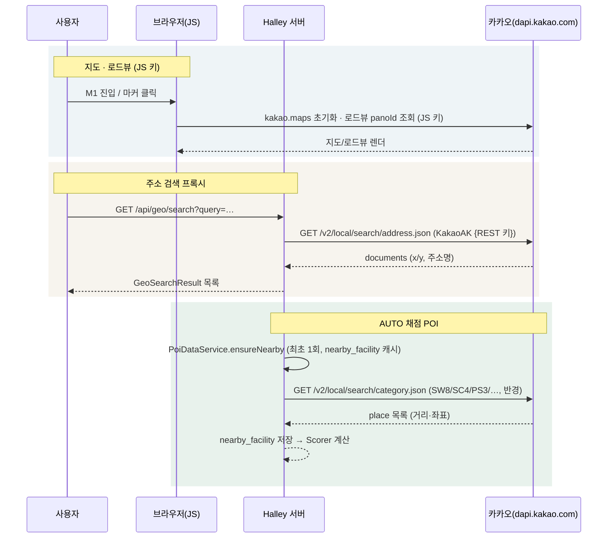
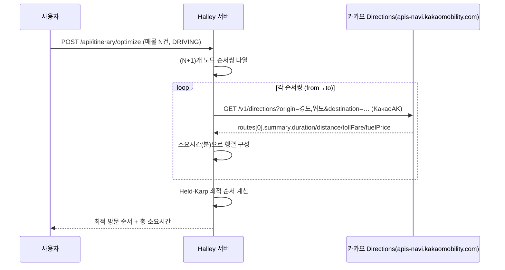
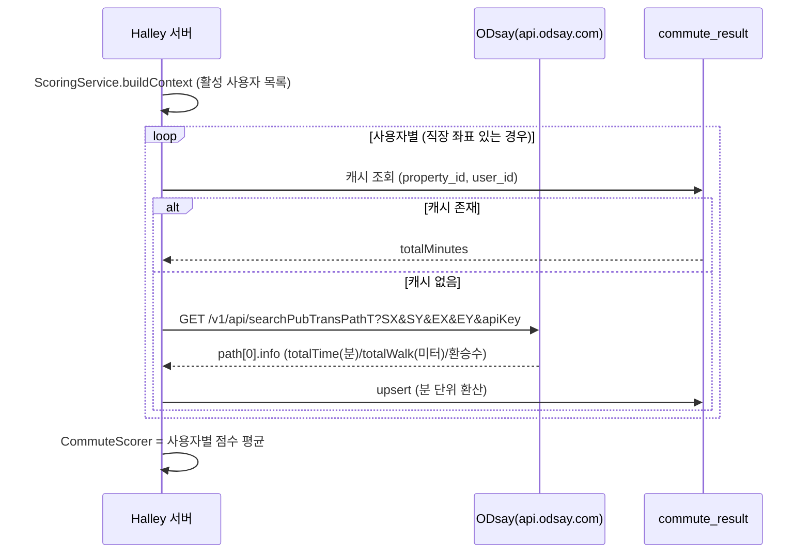
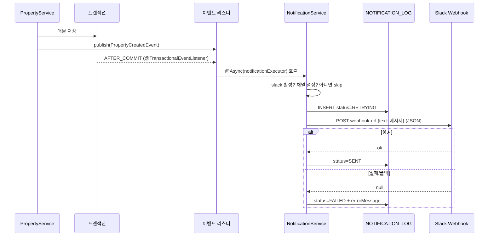
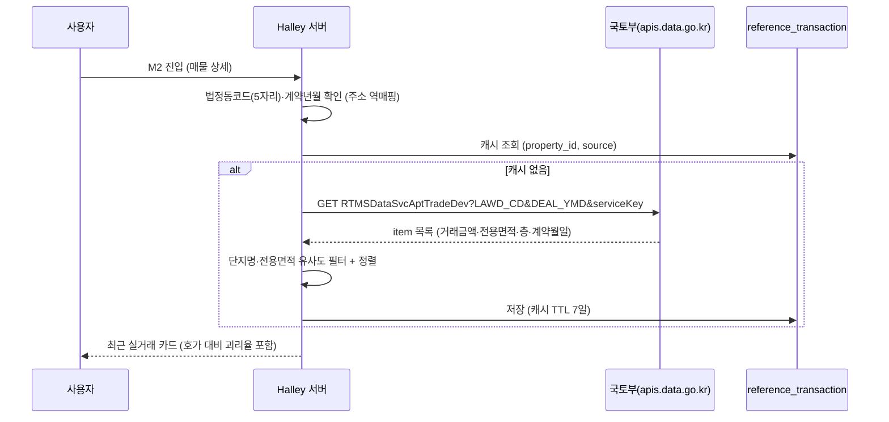
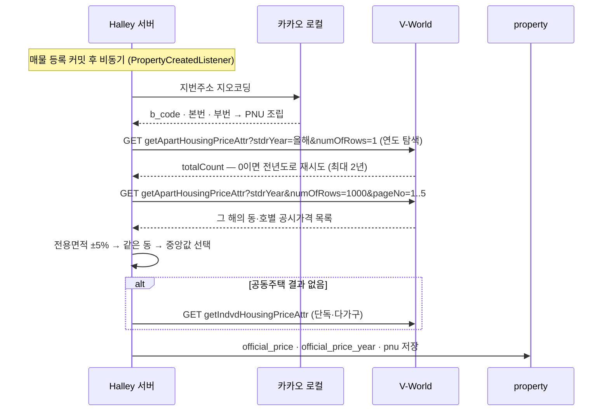

# Halley 외부 인터페이스 매뉴얼

> Halley가 연동하는 **모든 외부 API**(카카오, ODsay, Slack, 국토부, V-World, Claude)의 목적, 키 발급처, 설정 키, 호출 흐름을 정리한 문서입니다.
> 수치는 실제 코드(`src/main/resources/application.yaml`, 각 `@FeignClient`, `config/`)와 정합합니다.
> 인터페이스 아키텍처 원칙은 `docs/DESIGN.md` 2.5(외부 연동은 port/어댑터)를 따릅니다.

---

## 1. 연동 요약

| 연동 | 용도 | 호출 측 | 인증 방식 | 환경변수 | 코드 위치 | 상태 |
|---|---|---|---|---|---|---|
| **카카오맵 JS SDK** | 지도·마커·로드뷰(D23) 렌더링 | 클라이언트(브라우저) | JavaScript 키 | `KAKAO_JS_KEY` | `ViewController` · `app.js` | 사용 중 |
| **카카오 로컬 REST** | 주소→좌표 지오코딩 · POI 반경검색(채점용) | 서버(Feign) | REST 키(`Authorization: KakaoAK …`) | `KAKAO_REST_KEY` | `KakaoLocalFeignClient` | 사용 중 |
| **카카오 Directions** | 자가용 이동시간·경로선(임장 플래너) | 서버(Feign) | REST 키(`KakaoAK`, 재사용) | `KAKAO_REST_KEY` | `KakaoDirectionsFeignClient` | 사용 중 |
| **ODsay** | 대중교통 경로(직주근접 채점) | 서버(Feign) | `apiKey` 쿼리 파라미터 | `ODSAY_API_KEY` | `OdsayTransitFeignClient` | 사용 중 |
| **Slack Incoming Webhook** | 알림(매물 등록 등) | 서버(Feign) | Webhook URL 자체가 인증 | `SLACK_WEBHOOK_URL` | `SlackWebhookClient` | 사용 중(선택) |
| **국토부 실거래가** | 최근 실거래 참고 카드(M2) — **채점 미반영** | 서버(Feign) | 서비스 키(`serviceKey`) | `MINISTRY_API_KEY` | `MinistryReferenceFeignClient` | 사용 중(참고 전용) |
| **V-World 공시가격** | 공동주택·개별주택 공시가격(M2) — **채점 미반영** | 서버(Feign) | 인증키(`key`) | `HOUSING_PRICE_API_KEY` | `VworldHousingPriceFeignClient` | 사용 중(참고 전용) |
| **V-World 토지이용계획** | 토지거래허가구역·정비구역 등(M2) | 서버(Feign) | 인증키(`key`, 공유) | `HOUSING_PRICE_API_KEY` | `VworldLandUseFeignClient` | 사용 중(참고 전용) |
| **Claude (LLM)** | AI 추천도 — **채점 반영** | 서버(Feign) | `x-api-key` 헤더 | `ANTHROPIC_API_KEY` | `ClaudeFeignClient` | 사용 중 |
| **금감원 주담대** | 은행별 금리·기간·상환방식 (대출 계산) | 서버(Feign) | `auth` 쿼리 파라미터 | `FSS_API_KEY` | — | **설계 예정** (5.8) |

> **키 보관 원칙 (설계 8장)**: REST 키·ODsay 키·Webhook URL·국토부 키는 **전량 서버 보관**입니다. 클라이언트에는 카카오 **JS 키만** 노출됩니다. `raw_paste_text`를 포함해 어떤 데이터도 외부로 전송하지 않습니다.

---

## 2. 카카오 (Kakao)

### 2.1 역할

| 기능 | 경로/화면 | 상세 |
|---|---|---|
| 지도 표시 | M1 좌측 지도, D23 로드뷰 | `kakao.maps` (JS SDK, `autoload=false` + `kakao.maps.load`) |
| 주소 검색 프록시 | `GET /api/geo/search` | `GeoController → GeoService → KakaoLocalPort` |
| POI 반경검색 | 채점 엔진 (P4) | `STATION`·`EDUCATION`·`AMENITY`·`GREEN` 채점용 카테고리 검색 |
| POI 키워드검색 | 채점 엔진 (P4) | `GREEN` 공원·하천, 그리고 `AT4` 필터를 건 산 검색 (설계 I42) |
| **법정동코드 조회** | 국토부 실거래가 조회 전 단계 | 주소검색 응답의 `address.b_code`(10자리) 앞 5자리를 `LAWD_CD`로 사용 (설계 I43) |

### 2.2 키 발급 절차

1. [카카오 개발자 콘솔](https://developers.kakao.com) 접속 → 로그인
2. **내 애플리케이션 → 애플리케이션 추가하기** (앱 이름: Halley, 앱 URL 등록)
3. **앱 키** 메뉴에서 두 가지 키를 확보:
   - `JavaScript 키` → `KAKAO_JS_KEY`
   - `REST API 키` → `KAKAO_REST_KEY`
4. **플랫폼 설정** → Web 플랫폼에 도메인 등록 (지도가 렌더되지 않으면 이 단계 누락):
   - `http://localhost:8080`
   - `https://cena.furaiki-lifelog.com`
5. 로컬/운영 각 환경의 환경변수에 주입

### 2.3 설정 키

| application.yaml 키 | 환경변수 | 기본값 | 설명 |
|---|---|---|---|
| `kakao.js-key` | `KAKAO_JS_KEY` | (없음) | JS SDK 앱키, Mustache로 주입 |
| `kakao.rest-key` | `KAKAO_REST_KEY` | (없음) | REST 호출 인증 헤더 `KakaoAK {키}` |
| `kakao.local.base-url` | — | `https://dapi.kakao.com` | 로컬 API 베이스 |

**서킷브레이커/타임아웃**: `kakao-local` connect 3s / read 6s, 실패율 40%, open 15s

### 2.4 호출 흐름



---

## 2.5 카카오 Directions (자가용 — 임장 플래너)

### 2.5.1 역할

**임장 동선 최적화(P9)** 의 자가용 이동시간·경로선·통행료/유류비 조회에 사용합니다. 대중교통 이동시간은 ODsay(3장)가 담당합니다.

| 기능 | 상세 |
|---|---|
| 이동시간 행렬 | 자가용 `DRIVING` 계획의 노드 간 소요시간 (분) |
| 경로선 | 지도 폴리라인용 좌표 경로 (`routes[].path`) |
| 부가 정보 | 예상 통행료·유류비 (`summary.tollFare` / `fuelPrice`) |

### 2.5.2 키 발급

- **카카오 REST 키 재사용** (`KAKAO_REST_KEY`, 2.2에서 발급)
- [카카오모빌리티 Directions API](https://developers.kakao.com/docs/latest/ko/devtalk/directions) 는 별도 앱이 아니라 **카카오 개발자 콘솔 앱의 REST 키**로 호출하며, `apis-navi.kakaomobility.com` 도메인 사용을 위해 해당 API를 활성화합니다.

### 2.5.3 설정 키

| application.yaml 키 | 환경변수 | 기본값 | 설명 |
|---|---|---|---|
| `kakao.directions.base-url` | — | `https://apis-navi.kakaomobility.com` | Directions 베이스 |
| `kakao.rest-key` | `KAKAO_REST_KEY` | (없음) | 로컬 API와 동일한 인증 헤더 |

**서킷브레이커/타임아웃**: `kakao-directions` connect 3s / read 6s, 실패율 40%, open 15s

### 2.5.4 호출 흐름



> **캐시 정책 (설계 10.4·10.8.1)**: 자가용은 실시간 교통을 반영해야 하므로 **캐시를 쓰지 않습니다**. 대중교통(TRANSIT)만 Redis 캐시(TTL 7일)를 사용합니다.

---

## 3. ODsay

### 3.1 역할

**직주근접(`COMMUTE`) 채점** — 활성 사용자의 직장 좌표 ↔ 매물 좌표 간 대중교통 경로를 조회합니다.
`CommuteDataService`가 사용자별 1회 조회하고 `commute_result` 테이블에 캐시합니다(설계 I9).

### 3.2 키 발급 절차

1. [ODsay 오픈 API](https://openapi.odsay.com) 접속 → 회원가입/로그인
2. **API 키 발급** 메뉴에서 무료 키 발급 (대중교통 길찾기 API)
3. 발급받은 키를 `ODSAY_API_KEY` 환경변수로 주입

> **쿼터 주의**: 무료 플랜은 일일 호출 한도가 있습니다. `N명 × M건` 호출이 발생하므로(설계 I9) 캐시와 좌표 반올림으로 절약해야 합니다.

### 3.3 설정 키

| application.yaml 키 | 환경변수 | 기본값 | 설명 |
|---|---|---|---|
| `odsay.api-key` | `ODSAY_API_KEY` | (없음) | 요청 `apiKey` 파라미터 |
| `odsay.base-url` | — | `https://api.odsay.com` | API 베이스 |
| `odsay.transit-path` | — | `/v1/api/searchPubTransPathT` | 경로 조회 엔드포인트 (v1, `T` 포함) |

**서킷브레이커/타임아웃**: `odsay` connect 5s / read 15s, 실패율 30%, open 60s

### 3.4 호출 흐름



---

## 4. Slack

### 4.1 역할

**알림 발송** — 현재는 매물 등록(`PROPERTY_CREATED`) 알림. 판매완료·배치 알림(P7)은 같은 인프라를 확장합니다.
Webhook은 생성 시점에 **채널이 고정**되므로 채널 변경은 새 Webhook 발급 + 재배포가 필요합니다(설계 12.4 확정).

### 4.2 URL 발급 절차

1. [Slack API](https://api.slack.com/apps) → **Create New App** → *From scratch* → 앱 이름/워크스페이스 선택
2. 좌측 **Incoming Webhooks** → 활성화 → **Add New Webhook to Workspace** → 알림을 받을 채널 선택 → **Allow**
3. 생성된 **Webhook URL**을 `SLACK_WEBHOOK_URL` 환경변수로 주입
4. (선택) 알림 활성화: `SLACK_ENABLED=true`, `SLACK_NOTIFY_PROPERTY_CREATED=true`

### 4.3 설정 키

| application.yaml 키 | 환경변수 | 기본값 | 설명 |
|---|---|---|---|
| `slack.enabled` | `SLACK_ENABLED` | `false` | 알림 전체 활성화 |
| `slack.webhook-url` | `SLACK_WEBHOOK_URL` | (없음) | Incoming Webhook URL |
| `slack.notify.property-created` | `SLACK_NOTIFY_PROPERTY_CREATED` | `false` | 매물 등록 알림 여부 |

**서킷브레이커/타임아웃**: `slack-webhook` connect 5s / read 15s(default), 실패율 30%, open 60s

### 4.4 호출 흐름



> **설계 원칙 (설계 12.2)**: `AFTER_COMMIT` + `@Async`로 분리 → Slack 장애가 매물 등록 실패로 이어지지 않고, 사용자에게는 등록 성공으로 응답합니다.

---

## 5. 국토부 (Ministry) — 실거래가 참고

### 5.1 역할

**최근 실거래 참고 카드** — 매물 상세(M2)에 동일 단지·유사 면적의 최근 거래를 참고용으로 표시합니다.
**`PRICE` 채점에는 절대 반영하지 않습니다**(설계 5.5 — 실거래가는 계약 시점 가격이라 호가 기준 채점과 섞지 않음).

| 데이터 | API |
|---|---|
| 아파트 매매 실거래가 | `RTMSDataSvcAptTradeDev` |
| 아파트 전월세 실거래가 | `RTMSDataSvcAptRent` |

### 5.2 키 발급 절차

1. [공공데이터포털 data.go.kr](https://www.data.go.kr) 회원가입/로그인
2. **국토교통부 부동산 실거래가 정보** 검색 → 원하는 API(매매/전월세) **활용신청**
3. **마이페이지 → 데이터 활용 → 서비스 키** 발급
4. `MINISTRY_API_KEY` 환경변수로 주입

> **Encoding·Decoding 어느 형태를 넣어도 됩니다.** 포털은 인증키를 두 형태로 주는데, Encoding 키(`%2F`·`%3D` 포함)를
> 그대로 넘기면 Feign이 `%`를 한 번 더 인코딩해 `403 SERVICE_KEY_IS_NOT_REGISTERED_ERROR`가 납니다.
> `MinistryReferenceAdapter`가 퍼센트 이스케이프를 되돌려 주므로(Base64의 `+`는 보호) 둘 다 동작합니다.

### 5.3 설정 키

| application.yaml 키 | 환경변수 | 기본값 | 설명 |
|---|---|---|---|
| `ministry.service-key` | `MINISTRY_API_KEY` | (없음) | 요청 `serviceKey` 파라미터 |
| `ministry.base-url` | — | `https://apis.data.go.kr/1613000` | API 베이스 |

**서킷브레이커/타임아웃**: `ministry-reference` connect 3s / read 8s, 실패율 40%, open 30s (참고 데이터라 실패해도 치명적이지 않음)

### 5.4 호출 흐름



> **동기화 (설계 5.5)**: 등록 시 1회 조회 + 캐시(Redis TTL 7일). 국토부는 월 단위 갱신이므로 실시간 폴링 불필요. 실거래가는 **참고 표기 전용**입니다.

### 5.5 법정동코드(`LAWD_CD`) 확보 — 카카오 주소검색 재사용

국토부 API는 시군구 5자리 법정동코드를 요구합니다. **별도 API 키 없이 카카오 주소검색으로 해결합니다**(설계 I43).

```
GET /v2/local/search/address.json?query={지번주소}
  → documents[0].address.b_code = "1135010500"   (법정동코드 10자리)
  → 앞 5자리 "11350" 이 LAWD_CD (노원구)
```

`LegalDongCodeService.deriveSigunguCode()`의 순서입니다.

1. `legal_dong_code` 테이블 조회 (부팅 시드 8건 + 아래 3에서 쌓인 캐시)
2. 미적중이면 카카오 주소검색 → `b_code`. 존재하지 않는 번지로 실패하면 **동까지만 잘라** 재조회
3. 확보한 코드를 `legal_dong_code`에 캐시 → 같은 동은 다시 묻지 않음

키가 없거나 외부 장애면 예외를 올리지 않고 빈 값을 반환합니다(실거래가는 참고 정보이므로 — 6.1). 이때
`법정동코드를 찾지 못해 실거래가를 조회하지 않습니다` 로그가 남습니다.

#### 5.5.1 대안 — 행정안전부 API (현재 미사용)

전국 법정동코드를 자체 보유하려면 아래 두 경로가 있습니다. **지금은 쓰지 않습니다**(카카오로 충분하고 키가 하나 늘지 않음).
나중에 카카오 의존을 줄이거나 오프라인 조회가 필요해지면 이 경로로 전환합니다.

| 제공 | 엔드포인트 | 키 발급처 |
|---|---|---|
| 행정안전부 행정표준코드 법정동코드 조회 | `https://apis.data.go.kr/1741000/StanReginCd/getStanReginCdList` | 공공데이터포털 |
| 행정안전부 도로명주소 주소검색 | `https://business.juso.go.kr/addrlink/addrLinkApi.do` | 도로명주소 개발자센터 |

**공공데이터포털(StanReginCd) 키 발급 절차**

1. [공공데이터포털 data.go.kr](https://www.data.go.kr) 회원가입/로그인
2. `행정표준코드` 또는 `법정동코드` 검색 → **행정안전부** 제공 오픈 API **활용신청**
3. **마이페이지 → 데이터 활용 → 개발계정 → 인증키** 확인 (국토부와 **같은 인증키**를 쓰며, 서비스별로 활용신청만 추가하면 됩니다)
4. 승인 후 `serviceKey`·`pageNo`·`numOfRows`·`type=json`·`locatadd_nm` 파라미터로 호출

**도로명주소 개발자센터(juso.go.kr) 키 발급 절차**

1. [도로명주소 개발자센터](https://business.juso.go.kr) 회원가입/로그인
2. **오픈API → 주소검색 API 신청** (사용 URL·용도 기재)
3. 발급된 **승인키(confmKey)** 를 요청 파라미터로 전달

> 두 엔드포인트 모두 생존을 확인했습니다(미등록 키로 호출 시 각각 `SERVICE_KEY_IS_NOT_REGISTERED_ERROR`,
> `승인되지 않은 KEY 입니다` 응답). **응답 필드 구조는 키 발급 후 확인이 필요합니다** — 미검증 상태로 코드에 반영하지 마세요.

---

## 5.6 공시가격 (V-World) — 국가공간정보 개방데이터

### 5.6.1 역할

**공시가격 참고 표시** — 매물 상세(M2)에 국토교통부가 매년 1월 1일 기준으로 공시하는 가격을 보여줍니다.
실거래가와 같이 **`PRICE` 채점에는 반영하지 않습니다**(호가 기준 채점과 섞지 않음 — 설계 5.5).

| 데이터 | 대상 | 엔드포인트 |
|---|---|---|
| 공동주택가격 | 아파트·연립·다세대 | `GET /ned/data/getApartHousingPriceAttr` |
| 개별주택가격 | 단독·다가구 | `GET /ned/data/getIndvdHousingPriceAttr` |

Halley는 **공동주택을 먼저 조회하고, 결과가 없으면 개별주택으로 한 번 더** 봅니다.

### 5.6.2 키 발급 절차

1. [V-World 공간정보 오픈플랫폼](https://www.vworld.kr) 회원가입/로그인
2. **오픈API → 인증키 발급 신청** — 활용 유형과 서비스 URL(도메인)을 입력합니다.
   로컬 개발이면 `http://localhost:8080`으로 신청해 두면 됩니다.
3. 발급된 인증키를 `HOUSING_PRICE_API_KEY` 환경변수로 주입
4. 데이터 목록은 [국가공간정보 개방데이터](https://www.vworld.kr/dtna/dtna_apiSvcFc_s001.do)에서 확인합니다.

> **인증 실패도 HTTP 200으로 옵니다.** 실패는 `{"apartHousingPrices": {"resultCode": "INVALID_KEY", …}}`,
> 성공은 `{"response": {"resultCode": "", "totalCount": "0", …}}` 형태로 **래퍼 이름과 `resultCode`가 둘 다 달라집니다.**
> 정상 응답의 `resultCode`는 **빈 문자열**이므로, 값이 채워져 있고 성공 코드가 아닐 때만 거절로 봅니다.
> `VworldHousingPriceAdapter`가 이를 판별해 실패면 WARN, 자료 없음이면 `totalCount`와 함께 INFO를 남깁니다.

> **`totalCount`가 0이면** 그 필지에 자료가 없거나 PNU가 틀린 것입니다. 도메인 제한이 걸린 키는
> `domain`을 함께 보내지 않으면 0건이 나올 수 있으니 `HOUSING_PRICE_API_DOMAIN`을 확인하세요.

### 5.6.3 설정 키

| application.yaml 키 | 환경변수 | 기본값 | 설명 |
|---|---|---|---|
| `vworld.api-key` | `HOUSING_PRICE_API_KEY` | (없음) | 요청 `key` 파라미터 |
| `vworld.domain` | `HOUSING_PRICE_API_DOMAIN` | (없음) | 키 발급 시 등록한 URL. 비어 있으면 쿼리에서 생략 |
| `vworld.base-url` | — | `https://api.vworld.kr` | API 베이스 |

기동 로그의 `External API key vworld.api-key : set (…)` 줄로 주입 여부를 확인할 수 있습니다(`ExternalApiKeyReporter`).

**서킷브레이커/타임아웃**: `vworld-housing-price` connect 3s / read 8s, 실패율 40%, open 30s

### 5.6.4 요청 파라미터

| 이름 | 필수 | 값 | 비고 |
|---|---|---|---|
| `key` | ○ | 발급 인증키 | |
| `pnu` | ○ | 필지고유번호 19자리 | 아래 5.6.5 |
| `stdrYear` | **실질 필수** | 기준연도(YYYY) | 아래 경고 참조 |
| `format` | | `json` | Halley는 항상 `json` |
| `numOfRows` | | 최대 1000 | Halley는 1000 |
| `pageNo` | | 1 | 대단지는 페이지를 넘겨야 한다 |
| `domain` | | 발급 시 등록한 URL | 설정돼 있을 때만 붙임 |

> ⚠️ **`stdrYear`는 문서상 옵션이지만 빼면 안 됩니다.** 생략하면 그 필지의 **전 연도가 오래된 순으로**
> 나옵니다. 은마아파트 PNU 실측에서 `totalCount = 110,600 = 4,424세대 × 25년`이었고 첫 페이지가
> **2006년치**였습니다. 그대로 쓰면 20년 전 공시가격이 저장됩니다.
>
> Halley는 `numOfRows=1`로 연도별 `totalCount`만 먼저 확인해 **자료가 있는 가장 최근 연도**를 정하고
> (공시는 매년 4월 말이라 연초에는 올해 자료가 없어 최대 2년 거슬러 봅니다), 그 연도만 페이지로 모읍니다.
> 페이지는 최대 5장(5,000건)까지만 받아 호출 폭증을 막습니다.

**응답 필드** (은마아파트 실측)

| 필드 | 값 예시 | 설명 |
|---|---|---|
| `pnu` | `1168010600103160000` | 필지고유번호 |
| `stdrYear` · `stdrMt` | `2026` · `01` | 기준연도·월 |
| `pblntfPc` | `656000000` | **공시가격(원)** — 공동주택 |
| `housePc` | `268000000` | 주택가격(원) — 개별주택 |
| `prvuseAr` | `84.43` | 전용면적(㎡) |
| `dongNm` · `hoNm` · `floorNm` | `27` · `1401` · `14` | 동·호·층 (**동은 숫자만**) |
| `aphusNm` · `aphusSeCodeNm` | `은마` · `아파트` | 단지명·유형 |
| `ldCode` · `ldCodeNm` | `1168010600` · `서울특별시 강남구 대치동` | 법정동 |
| `mnnmSlno` | `316` | 지번 |

### 5.6.5 PNU(필지고유번호) 확보 — 카카오 주소검색 재사용

공시가격 조회 키는 법정동코드가 아니라 **PNU 19자리**입니다. 국토부 API를 하나 더 붙이는 대신
이미 쓰고 있는 **카카오 주소검색 응답으로 조립**합니다(5.5의 `LAWD_CD`와 같은 방식).

```
PNU(19) = b_code(10) + 필지구분(1) + 본번(4, 0채움) + 부번(4, 0채움)
          └ 법정동코드   └ 일반 1 / 산 2
                          └ main_address_no   └ sub_address_no (없으면 0000)
```

예) `서울시 종로구 명륜2가 4` → `b_code=1111014000`, `main=4`, `sub=` → `1111014000100040000`

구현은 `GeoSearchResult.pnu(...)`이며, 넷 중 하나라도 없으면 `null`을 돌려주고 조회를 건너뜁니다.

### 5.6.6 토지이용계획 — 같은 키로 쓰는 다른 서비스 (설계 I69)

`GET /ned/data/getLandUseAttr?pnu=…&key=…&format=json` — **공시가격과 같은 인증키**를 씁니다.

응답의 `field[]` 항목: `prposAreaDstrcCodeNm`(지역·지구명) · `prposAreaDstrcCode`(코드) ·
`cnflcAtNm`(**포함**/저촉/접함) · `pnu` · `manageNo`.

> ⚠️ **투기과열지구·조정대상지역은 이 API에 없습니다.** 실측으로 확인했습니다(설계 I69).
> 규제지역은 관리 화면에서 수동 등록합니다(I68).

> ⚠️ **`cnflcAtNm`을 구분하지 않으면 오해를 만듭니다.** `포함`만 그 필지에 실제로 적용되고
> `저촉`은 일부만 걸치며 `접함`은 인접할 뿐입니다. 실측에서 용도지역이 셋으로 나왔지만
> 실제는 `제3종일반주거지역(포함)` 하나였습니다.

> **같은 항목이 관리번호만 달리 반복됩니다.** 실측에서 토지거래허가구역 4번, 일반철도 5번.
> `(코드, 이름, 관계)`로 중복을 제거하세요.

### 5.6.7 호출 흐름



> 같은 필지라도 **타입마다 공시가격이 다릅니다.** 전용면적을 맞추지 않으면 엉뚱한 값이 붙기 때문에
> ±5% 안의 건을 먼저 찾고, 없으면 면적 차가 가장 작은 건을 씁니다. 같은 면적이라도 층·향에 따라
> 조금씩 달라(실측 은마 84.43㎡: 6.56억 ~ 6.62억) 매물의 동을 우선하고 그중 **중앙값**을 씁니다.
> 공시가격의 `dongNm`은 `27`처럼 숫자만 오므로 매물의 `102동`과는 숫자로 맞춥니다.

---

## 5.7 Claude (LLM) — AI 추천도

### 5.7.1 역할

**AI 추천도** — 매물 정보와 구매자들의 직장 위치를 Anthropic Claude에 보내 0~100의 추천도와
그 이유를 받습니다. 결과는 `llm_recommendation`에 저장되고 `LLM_RECOMMENDATION` 채점 항목으로
총점에 반영됩니다(설계 I59).

공급자는 `LlmPort`로 추상화돼 있어 나중에 Ollama 같은 로컬 모델을 붙일 수 있습니다(설계 I58).

### 5.7.2 키 발급 절차

1. [Anthropic Console](https://console.anthropic.com) 가입/로그인
2. **API Keys → Create Key** 로 키 발급 (`sk-ant-…`)
3. **Billing** 에서 결제 수단 등록 — 무료 크레딧이 없으면 401이 아니라 429/400으로 거절됩니다
4. `ANTHROPIC_API_KEY` 환경변수로 주입

> 키를 넣지 않으면 `LlmPort.isEnabled()`가 false가 되어 **호출 자체를 건너뜁니다.**
> AI 추천도만 미산출로 남고 나머지 채점은 그대로 나옵니다.

### 5.7.3 설정 키

| application.yaml 키 | 환경변수 | 기본값 | 설명 |
|---|---|---|---|
| `llm.enabled` | `LLM_ENABLED` | `true` | 전체 스위치 |
| `llm.provider` | `LLM_PROVIDER` | `claude` | 구현체가 여럿일 때 선택 |
| `llm.claude.api-key` | `ANTHROPIC_API_KEY` | (없음) | `x-api-key` 헤더 |
| `llm.claude.model` | `LLM_CLAUDE_MODEL` | `claude-opus-5` | 판단의 질이 곧 채점 품질이라 상위 모델을 기본으로 둔다 (I71) |
| `llm.claude.base-url` | — | `https://api.anthropic.com` | |

**서킷브레이커/타임아웃**: `claude-llm` connect 5s / **read 60s**, 실패율 40%, open 60s.
생성에 시간이 걸리고 비동기 보정에서만 부르므로 read timeout을 길게 잡아도 화면을 막지 않습니다.

기동 로그의 `External API key llm.claude.api-key : set (…)` 줄로 주입 여부를 확인할 수 있습니다.

### 5.7.4 호출 형식

```
POST https://api.anthropic.com/v1/messages
x-api-key: <ANTHROPIC_API_KEY>
anthropic-version: 2023-06-01
Content-Type: application/json

{"model": "...", "max_tokens": 1024, "system": "...",
 "messages": [{"role": "user", "content": "..."}]}
```

응답의 `content`는 블록 배열이며 `type: "text"`인 블록의 `text`만 이어 붙입니다.
오류는 `{"type": "error", "error": {"message": "..."}}` 형태입니다.

### 5.7.5 비용 관리

- **입력이 그대로면 다시 부르지 않습니다.** 프롬프트의 SHA-256을 `prompt_hash`에 저장해 두고
  같으면 저장된 값을 그대로 씁니다. 매물을 열 때마다 부르면 비용이 선형으로 늘어납니다.
- `max_tokens`는 **1024**로 묶습니다. 점수와 두세 문장이면 충분합니다.
- 호출 시점은 **매물 등록 후 비동기 1회** + 사용자가 "다시 물어보기"를 누를 때뿐입니다.
  재채점(`POST /{id}/rescore`)은 LLM을 부르지 않습니다.

---

## 5.9 법제처 국가법령정보 — 규제지역 고시 (설계 I73)

### 5.9.1 역할

**투기과열지구·조정대상지역을 자동으로 얻는 유일한 경로다.** 토지이용계획 API(5.6)에는 이 둘이
없다는 것을 대조 실험으로 확인했다(I69) — 지정이 확실한 화성시 동탄구 청계동 필지에서
토지거래허가구역은 나오는데 규제지역 둘은 0건이었다.

규제지역이 비면 `RegulatedAreaService`가 비규제로 판정하고 LTV 0.7이 잡힌다. 실제가
투기과열지구(0.4)라면 **한도를 배 가까이 부풀린다.** 사람이 넣기를 잊으면 앱이 조용히 낙관적으로
틀리므로 자동 적재한다.

### 5.9.2 인증

**인증키가 아니라 이메일 ID다.** `hong@korea.kr`이면 `OC=hong`.

| 항목 | 값 |
|---|---|
| 설정 키 | `law.oc` (`LAW_OC`) |
| 발급 | https://open.law.go.kr 에서 신청, 무료·즉시 |
| 시험용 | `OC=test`로도 응답하지만 **언제까지 열려 있을지 보장이 없다** |

`test`로 두면 어느 날 조용히 막히고, 그러면 알림이 안 온다는 사실조차 모르게 된다 —
이 연동이 막으려는 상황과 같은 종류다. 운영에서는 반드시 발급받아 쓴다.

### 5.9.3 호출 형식

규제지역 고시는 법률이 아니라 **행정규칙**이므로 `target=admrul`이다.

**① 목록 — 현행 고시의 일련번호를 얻는다**

```
GET http://www.law.go.kr/DRF/lawSearch.do
    ?OC={oc}&target=admrul&type=JSON&query=투기과열지구
```
```json
{"AdmRulSearch": {"admrul": {
  "행정규칙명": "투기과열지구 지정", "행정규칙일련번호": "2100000281590",
  "발령일자": "20260701", "소관부처명": "국토교통부", "현행연혁구분": "현행"}}}
```
> 결과가 1건이면 배열이 아니라 **객체**로 온다.

**② 본문 — 발령일자·공고번호와 첨부 링크**

```
GET http://www.law.go.kr/DRF/lawService.do
    ?OC={oc}&target=admrul&type=JSON&ID=2100000281590
```
```json
{"AdmRulService": {
  "행정규칙기본정보": {"발령번호": "2026-883", "발령일자": "20260701",
                      "제개정구분명": "일부개정"},
  "첨부파일": {"첨부파일명": "국토교통부공고제2026-883호(투기과열지구 지정).pdf",
              "첨부파일링크": "http://law.go.kr/flDownload.do?flSeq=166503271"}}}
```

**③ 첨부 PDF — 지정 현황표가 여기 있다**

```
GET http://law.go.kr/flDownload.do?flSeq=166503271
```

### 5.9.4 왜 PDF까지 받아야 하는가

**본문만으로는 전체 현황을 알 수 없다.** 현행 고시는 `일부개정`이고 `제개정이유내용`에는
이번에 **추가된 지역만** 있다.

```
ㅇ 지정지역 : 경기도 화성시 동탄구, 용인시 기흥구, 구리시
```

그것만 반영하면 **해제된 지역이 영원히 남는다.** 첨부 PDF의 `※ 지정 현황` 표가 그 시점의
전체 목록이므로, 발령일자가 바뀌면 표를 다시 읽어 **통째로 갈아 끼운다.**

| | 담긴 것 | 쓸 수 있나 |
|---|---|---|
| `제개정이유내용` | 이번 추가분만 | ✕ 해제분이 안 빠진다 |
| 첨부 PDF `지정 현황` | **전체 현황** | ○ |

### 5.9.5 PDF 파싱의 함정

**추출 텍스트가 깨진다.** 한글 문서에서 나온 PDF라 숫자·문장부호가 줄 끝으로 밀린다.

```
실제 표시:  강남구, 서초구, 송파구, 용산구, 성동구,
추출 결과:  강남구 서초구 송파구 용산구 성동구, , , , ,
```

그래서 **구분자를 믿지 않는다.** 부호를 모두 지우고 공백으로 토큰화한 뒤,
시도명(`서울`·`경기`)을 만나면 그 뒤를 해당 시도의 지역으로 본다. 지역명 토큰 자체는
순서까지 온전하다. 실물 고시 2건으로 회귀 테스트를 걸어 뒀다
(`src/test/resources/law/*.pdf`) — 서식이 바뀌면 테스트가 먼저 깨진다.

### 5.9.6 지역명이 축약형이다

고시는 시와 구를 붙여 줄여 쓴다. 어디서 자를지 표시가 없어 규칙으로 풀 수 없다.

| 고시 표기 | 실제 |
|---|---|
| `화성동탄` | 경기도 화성시 동탄구 |
| `성남분당` | 경기도 성남시 분당구 |
| `과천` | 경기도 과천시 (자치구 없음) |
| `강남구` | 서울특별시 강남구 |

시군구 사전을 코드에 박으면 동탄구처럼 **새로 생기는 행정구역**을 따라가지 못하므로
LLM(`llm.claude.model.regulation`, 기본 `claude-sonnet-4-6`)에 맡긴다.

> **전부 아니면 전무다.** 하나라도 코드로 못 바꾸면 통째로 버린다. 일부만 넣으면 빠진 지역이
> 비규제(0.7)로 잡혀 한도를 과대평가하는데, 값이 있으니 맞는 줄 알게 되어 더 위험하다.

### 5.9.7 적재 시점과 실패 처리

| 시점 | 동작 |
|---|---|
| 기동 시 규제지역 **비어 있음** | 가상 스레드로 비동기 적재 |
| 기동 시 규제지역 **있음** | 아무것도 안 한다 (손으로 고친 값을 덮지 않는다) |
| 매일 04:00 | 발령일자가 바뀌었으면 통째로 교체 |

적재 상태는 `regulation_notice.seed_status`에 남고, `READY`가 아니면 대출 결과에
`zoneWarning`이 실려 화면에 경고가 뜬다. **키 미설정과 조회 실패는 모두 로그를 남긴다** —
구분되지 않으면 원인을 찾을 수 없다.

## 5.8 금융감독원 — 주택담보대출 상품·금리 (설계 예정)

> **아직 연동하지 않았습니다.** 설계는 `docs/MORTGAGE_ENGINE.md` 3·6장(로드맵 3단계)을 따릅니다.
> 이 절은 **구현 전 확인해야 할 사항**을 남겨 둔 것입니다.

### 5.8.1 역할

금감원 **금융상품통합비교공시(금융상품 한눈에)** 에서 은행별 주담대 **금리·대출기간·상환방식**을
받아 예상 월 상환액과 총 이자를 실제 시장값으로 계산합니다.

**한도 산식은 바뀌지 않습니다.** 지금은 규제 파라미터의 고정 금리(`loan.interestRate = 0.04`)를
쓰고 있고, 연동은 그 값을 시장 금리 범위로 대체하는 것뿐입니다. 연동 전까지는 관리자가
프로파일에서 조정하면 됩니다.

> ⚠️ **금감원 금리를 DSR 역산에 그대로 쓰면 안 됩니다.** DSR은 스트레스 금리로 계산합니다.
> 금감원 금리는 `loan.interestRate`를 대체하고 `loan.stressRate`는 규제 파라미터로 남깁니다
> (설계 I64-2).

### 5.8.2 키 발급 절차

1. [금융상품 한눈에](https://finlife.fss.or.kr) → **오픈API** → 인증키 신청
2. 발급된 키를 `FSS_API_KEY` 환경변수로 주입 (예정)

### 5.8.3 확인된 것 / 확인 못 한 것

**확인됨** (공식 문서 기준)

- 오픈 API는 **8종**이며 그중 **"주택담보대출상품 API"** 가 존재합니다.
- 공통 요청 파라미터: `auth`(인증키, 필수) · `topFinGrpNo`(권역코드, 필수) · `pageNo`(필수) ·
  `financeCd`(선택)
- 응답은 `baseList`(상품 기본) + `optionList`(금리 옵션) 2단 구조입니다.
- 기본 URL 형태: `https://finlife.fss.or.kr/finlifeapi/{서비스명}.{json|xml}`

**확인 못 함**

- **정확한 서비스명과 응답 필드명.** `finlife.fss.or.kr`이 개발 환경에서 응답하지 않아
  (해외 IP 차단으로 추정) 실제 요청을 보내지 못했습니다.
- 서비스명은 `mortgageLoanProductsSearch`로 널리 알려져 있으나 **실측으로 확인하지 않았습니다.**

> **구현 전에 반드시** 실제 응답 한 건을 받아 필드명을 확정하세요.
> V-World 연동에서 겪은 것처럼(설계 I54), 문서만 보고 만든 파서는 실제 응답과 어긋납니다 —
> 그때도 `stdrYear`를 빼면 20년 전 데이터가 온다는 사실은 실측으로만 드러났습니다.

### 5.8.4 설계 시 유의

- **권역별로 따로 불러야 합니다.** `topFinGrpNo`가 은행(020000)·저축은행·보험 등으로 나뉩니다.
- **페이지네이션이 있습니다.** `pageNo`로 끝까지 돌아야 전체 상품이 모입니다.
- **금리는 자주 바뀌지 않습니다**(공시 주기 월 단위). 매 계산마다 부르지 말고
  **캐시(TTL 1일 이상)** 를 두세요. 다른 연동과 같이 `FallbackFactory`는 필수입니다.
- 금리가 없으면 규제 파라미터의 기본 금리로 떨어뜨립니다 — 대출 계산 자체는 계속 돌아야 합니다.

---

## 6. 공통 · 운영 메모


### 6.1 로컬 개발 시 키 없이 동작하는 방식

| 연동 | 키 없음 → 동작 |
|---|---|
| 카카오 REST | `KakaoApiKeyMissingException`(503) 또는 POI 빈 목록 → 채점 `MISSING` |
| ODsay | `TransitResult.missing()` → `COMMUTE` MISSING |
| V-World | 조회 skip(INFO 로그) → 공시가격 빈 값. 채점 영향 없음 |
| Claude | `isEnabled()=false` → 호출 skip. AI 추천도만 미산출 |
| Slack | `slack.enabled=false`(기본) → 알림 skip |

### 6.2 Feign 공통 규칙 (코딩 규칙)

- 모든 외부 API는 **OpenFeign `@FeignClient`** 로 선언하고, 각 클라이언트마다 **`FallbackFactory`를 필수 구현**
- 타임아웃·서킷브레이커 임계는 **API별로 다르게** 설정(`feign.client.config.<name>` / `resilience4j.circuitbreaker.instances.<name>`)
- ⚠️ **`resilience4j` 인스턴스 이름은 `@FeignClient`의 name과 맞아야 합니다.** 기본 ID는
  `클래스명+메서드시그니처`라 이름으로 잡은 설정이 붙지 않습니다 —
  `FeignSupportConfig`의 `CircuitBreakerNameResolver`가 ID를 name으로 고정합니다 (설계 I70)
- ⚠️ **`resilience4j.timelimiter`를 반드시 명시하세요.** 없으면 기본 1초가 걸려
  Feign `readTimeout`을 늘려도 그 전에 잘립니다. 특히 LLM은 100% 타임아웃합니다 (설계 I70)
- `@EnableFeignClients(basePackages = "banghak.home.halley.adapter.outbound.external")` (`FeignSupportConfig`)

### 6.3 포트/어댑터 목록

| Port | 어댑터 | FeignClient |
|---|---|---|
| `KakaoLocalPort` | `KakaoLocalAdapter` | `KakaoLocalFeignClient` |
| `KakaoDirectionsPort` | `KakaoDirectionsAdapter` | `KakaoDirectionsFeignClient` |
| `OdsayTransitPort` | `OdsayTransitAdapter` | `OdsayTransitFeignClient` |
| `MinistryReferencePort` | `MinistryReferenceAdapter` | `MinistryReferenceFeignClient` |
| `HousingPricePort` | `VworldHousingPriceAdapter` | `VworldHousingPriceFeignClient` |
| `LandUsePort` | `VworldLandUseAdapter` | `VworldLandUseFeignClient` |
| `LlmPort` | `ClaudeLlmAdapter` | `ClaudeFeignClient` |
| `SlackPort` | `SlackWebhookAdapter` | `SlackWebhookClient` |

**캐시 포트** (프로파일로 구현 교체 — 설계 2.5)

| Port | local (`@Profile("!live")`) | live (`@Profile("live")`) | TTL |
|---|---|---|---|
| `PoiCache` | `InMemoryPoiCache` | `RedisPoiCache` | 30일 (키에 수집 규칙 버전 포함 — 설계 I44) |
| `LlmJobCache` | `InMemoryLlmJobCache` | `RedisLlmJobCache` | RUNNING 5분 / DONE 1일 (설계 I72) |
| `TravelTimeCache` | `InMemoryTravelTimeCache` | `RedisTravelTimeCache` | 7일 (TRANSIT만, 설계 10.4) |

> 두 Redis 어댑터 모두 **장애 시 조용히 건너뜁니다**. 캐시가 죽어도 외부 API 재호출로 흡수되어 느려질 뿐 기능은 유지됩니다(설계 2.1.1).

> 이 문서와 코드가 어긋나면 `docs/DESIGN.md`가 최신 확정 사항이므로 그쪽을 따르고 이 문서를 갱신합니다.
