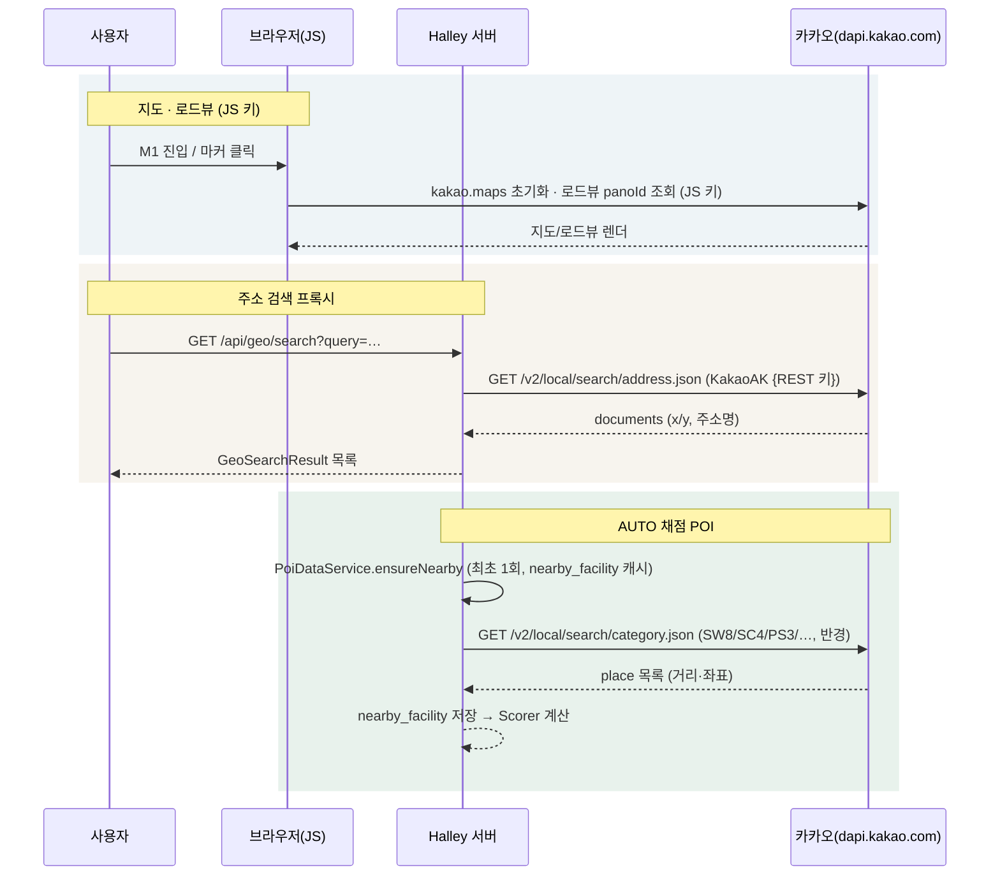
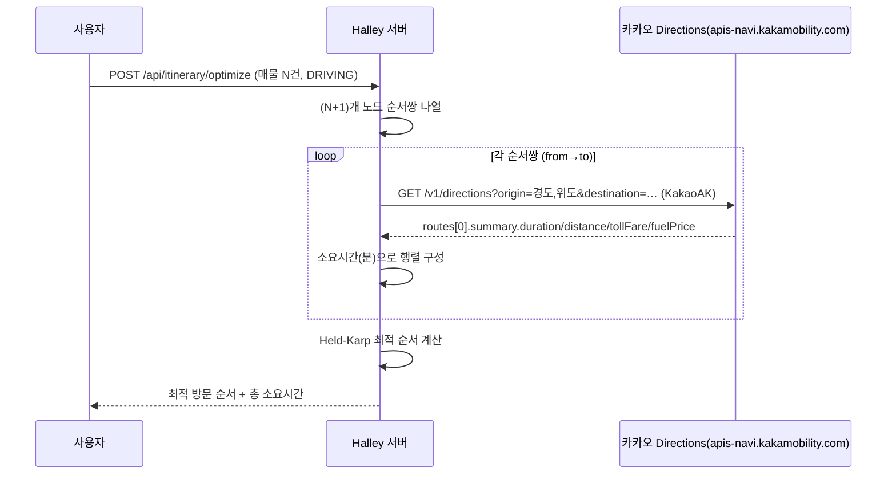
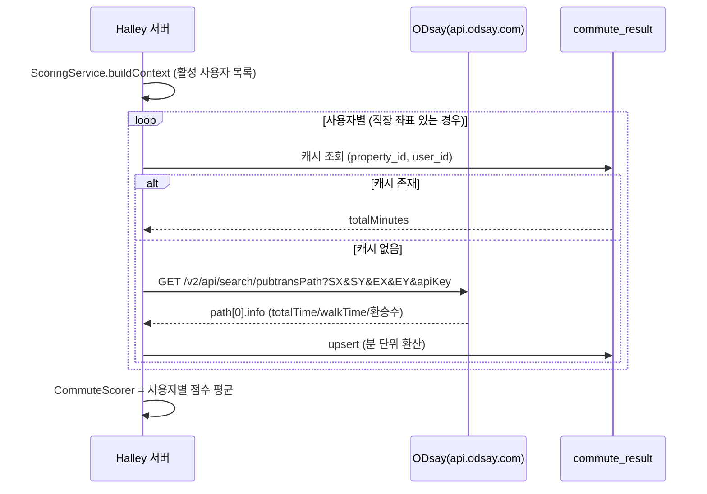
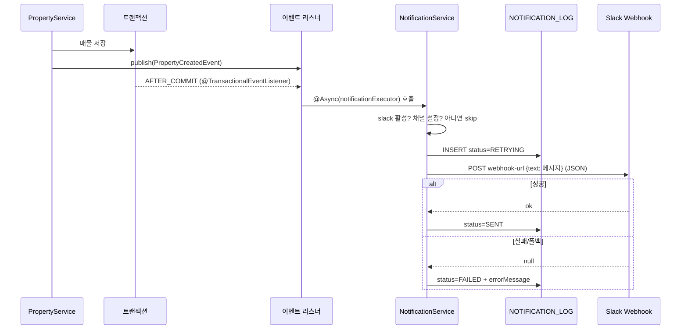
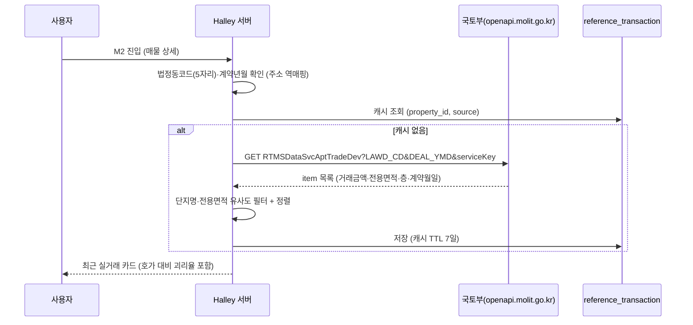

# Halley 외부 인터페이스 매뉴얼

> Halley가 연동하는 **모든 외부 API**(카카오, ODsay, Slack, 국토부)의 목적, 키 발급처, 설정 키, 호출 흐름을 정리한 문서입니다.
> 수치는 실제 코드(`src/main/resources/application.yaml`, 각 `@FeignClient`, `config/`)와 정합합니다.
> 인터페이스 아키텍처 원칙은 `docs/DESIGN.md` 2.5(외부 연동은 port/어댑터)를 따릅니다.

---

## 1. 연동 요약

| 연동 | 용도 | 호출 측 | 인증 방식 | 환경변수 | 코드 위치 | 상태 |
|---|---|---|---|---|---|---|
| **카카오맵 JS SDK** | 지도·마커·로드뷰(D23) 렌더링 | 클라이언트(브라우저) | JavaScript 키 | `KAKAO_JS_KEY` | `ViewController` · `app.js` | 사용 중 |
| **카카오 로컬 REST** | 주소→좌표 지오코딩 · POI 반경검색(채점용) | 서버(Feign) | REST 키(`Authorization: KakaoAK …`) | `KAKAO_REST_KEY` | `KakaoLocalFeignClient` | 사용 중 |
| **카카오 Directions** | 자가용 이동시간·경로선(임장 플래너) | 서버(Feign) | REST 키(`KakaoAK`, 재사용) | `KAKAO_REST_KEY` | `KakaoDirectionsFeignClient` | 사용 중 |
| **ODsay** | 대중교통 경로(직주근접 채점) | 서버(Feign) | `apiKey` 쿼리 파라미터 | `ODSAY_API_KEY` | `OdsayTransitFeignClient` | 사용 중 |
| **Slack Incoming Webhook** | 알림(매물 등록 등) | 서버(Feign) | Webhook URL 자체가 인증 | `SLACK_WEBHOOK_URL` | `SlackWebhookClient` | 사용 중(선택) |
| **국토부 실거래가** | 최근 실거래 참고 카드(M2) — **채점 미반영** | 서버(Feign) | 서비스 키(`serviceKey`) | `MINISTRY_API_KEY` | `MinistryReferenceFeignClient` | 사용 중(참고 전용) |

> **키 보관 원칙 (설계 8장)**: REST 키·ODsay 키·Webhook URL·국토부 키는 **전량 서버 보관**입니다. 클라이언트에는 카카오 **JS 키만** 노출됩니다. `raw_paste_text`를 포함해 어떤 데이터도 외부로 전송하지 않습니다.

---

## 2. 카카오 (Kakao)

### 2.1 역할

| 기능 | 경로/화면 | 상세 |
|---|---|---|
| 지도 표시 | M1 좌측 지도, D23 로드뷰 | `kakao.maps` (JS SDK, `autoload=false` + `kakao.maps.load`) |
| 주소 검색 프록시 | `GET /api/geo/search` | `GeoController → GeoService → KakaoLocalPort` |
| POI 반경검색 | 채점 엔진 (P4) | `STATION`·`EDUCATION`·`AMENITY`·`GREEN` 채점용 카테고리 검색 |

### 2.2 키 발급 절차

1. [카카오 개발자 콘솔](https://developers.kakao.com) 접속 → 로그인
2. **내 애플리케이션 → 애플리케이션 추가하기** (앱 이름: Halley, 앱 URL 등록)
3. **앱 키** 메뉴에서 두 가지 키를 확보:
   - `JavaScript 키` → `KAKAO_JS_KEY`
   - `REST API 키` → `KAKAO_REST_KEY`
4. **플랫폼 설정** → Web 플랫폼에 도메인 등록 (지도가 렌더되지 않으면 이 단계 누락):
   - `http://localhost:8080`
   - `https://cena.furaiki-lifelog.com`
5. 로컬/운영 각 환경의 환경변수에 주입

### 2.3 설정 키

| application.yaml 키 | 환경변수 | 기본값 | 설명 |
|---|---|---|---|
| `kakao.js-key` | `KAKAO_JS_KEY` | (없음) | JS SDK 앱키, Mustache로 주입 |
| `kakao.rest-key` | `KAKAO_REST_KEY` | (없음) | REST 호출 인증 헤더 `KakaoAK {키}` |
| `kakao.local.base-url` | — | `https://dapi.kakao.com` | 로컬 API 베이스 |

**서킷브레이커/타임아웃**: `kakao-local` connect 3s / read 6s, 실패율 40%, open 15s

### 2.4 호출 흐름

---

## 2.5 카카오 Directions (자가용 — 임장 플래너)

### 2.5.1 역할

**임장 동선 최적화(P9)** 의 자가용 이동시간·경로선·통행료/유류비 조회에 사용합니다. 대중교통 이동시간은 ODsay(3장)가 담당합니다.

| 기능 | 상세 |
|---|---|
| 이동시간 행렬 | 자가용 `DRIVING` 계획의 노드 간 소요시간 (분) |
| 경로선 | 지도 폴리라인용 좌표 경로 (`routes[].path`) |
| 부가 정보 | 예상 통행료·유류비 (`summary.tollFare` / `fuelPrice`) |

### 2.5.2 키 발급

- **카카오 REST 키 재사용** (`KAKAO_REST_KEY`, 2.2에서 발급)
- [카카오모빌리티 Directions API](https://developers.kakao.com/docs/latest/ko/devtalk/directions) 는 별도 앱이 아니라 **카카오 개발자 콘솔 앱의 REST 키**로 호출하며, `apis-navi.kakamobility.com` 도메인 사용을 위해 해당 API를 활성화합니다.

### 2.5.3 설정 키

| application.yaml 키 | 환경변수 | 기본값 | 설명 |
|---|---|---|---|
| `kakao.directions.base-url` | — | `https://apis-navi.kakamobility.com` | Directions 베이스 |
| `kakao.rest-key` | `KAKAO_REST_KEY` | (없음) | 로컬 API와 동일한 인증 헤더 |

**서킷브레이커/타임아웃**: `kakao-directions` connect 3s / read 6s, 실패율 40%, open 15s

### 2.5.4 호출 흐름

> **캐시 정책 (설계 10.4·10.8.1)**: 자가용은 실시간 교통을 반영해야 하므로 **캐시를 쓰지 않습니다**. 대중교통(TRANSIT)만 Redis 캐시(TTL 7일)를 사용합니다.

---

## 3. ODsay

### 3.1 역할

**직주근접(`COMMUTE`) 채점** — 활성 사용자의 직장 좌표 ↔ 매물 좌표 간 대중교통 경로를 조회합니다.
`CommuteDataService`가 사용자별 1회 조회하고 `commute_result` 테이블에 캐시합니다(설계 I9).

### 3.2 키 발급 절차

1. [ODsay 오픈 API](https://openapi.odsay.com) 접속 → 회원가입/로그인
2. **API 키 발급** 메뉴에서 무료 키 발급 (대중교통 길찾기 API)
3. 발급받은 키를 `ODSAY_API_KEY` 환경변수로 주입

> **쿼터 주의**: 무료 플랜은 일일 호출 한도가 있습니다. `N명 × M건` 호출이 발생하므로(설계 I9) 캐시와 좌표 반올림으로 절약해야 합니다.

### 3.3 설정 키

| application.yaml 키 | 환경변수 | 기본값 | 설명 |
|---|---|---|---|
| `odsay.api-key` | `ODSAY_API_KEY` | (없음) | 요청 `apiKey` 파라미터 |
| `odsay.base-url` | — | `https://api.odsay.com` | API 베이스 |
| `odsay.transit-path` | — | `/v2/api/search/pubtransPath` | 경로 조회 엔드포인트 |

**서킷브레이커/타임아웃**: `odsay` connect 5s / read 15s, 실패율 30%, open 60s

### 3.4 호출 흐름

---

## 4. Slack

### 4.1 역할

**알림 발송** — 현재는 매물 등록(`PROPERTY_CREATED`) 알림. 판매완료·배치 알림(P7)은 같은 인프라를 확장합니다.
Webhook은 생성 시점에 **채널이 고정**되므로 채널 변경은 새 Webhook 발급 + 재배포가 필요합니다(설계 12.4 확정).

### 4.2 URL 발급 절차

1. [Slack API](https://api.slack.com/apps) → **Create New App** → *From scratch* → 앱 이름/워크스페이스 선택
2. 좌측 **Incoming Webhooks** → 활성화 → **Add New Webhook to Workspace** → 알림을 받을 채널 선택 → **Allow**
3. 생성된 **Webhook URL**을 `SLACK_WEBHOOK_URL` 환경변수로 주입
4. (선택) 알림 활성화: `SLACK_ENABLED=true`, `SLACK_NOTIFY_PROPERTY_CREATED=true`

### 4.3 설정 키

| application.yaml 키 | 환경변수 | 기본값 | 설명 |
|---|---|---|---|
| `slack.enabled` | `SLACK_ENABLED` | `false` | 알림 전체 활성화 |
| `slack.webhook-url` | `SLACK_WEBHOOK_URL` | (없음) | Incoming Webhook URL |
| `slack.notify.property-created` | `SLACK_NOTIFY_PROPERTY_CREATED` | `false` | 매물 등록 알림 여부 |

**서킷브레이커/타임아웃**: `slack-webhook` connect 5s / read 15s(default), 실패율 30%, open 60s

### 4.4 호출 흐름

> **설계 원칙 (설계 12.2)**: `AFTER_COMMIT` + `@Async`로 분리 → Slack 장애가 매물 등록 실패로 이어지지 않고, 사용자에게는 등록 성공으로 응답합니다.

---

## 5. 국토부 (Ministry) — 실거래가 참고

### 5.1 역할

**최근 실거래 참고 카드** — 매물 상세(M2)에 동일 단지·유사 면적의 최근 거래를 참고용으로 표시합니다.
**`PRICE` 채점에는 절대 반영하지 않습니다**(설계 5.5 — 실거래가는 계약 시점 가격이라 호가 기준 채점과 섞지 않음).

| 데이터 | API |
|---|---|
| 아파트 매매 실거래가 | `RTMSDataSvcAptTradeDev` |
| 아파트 전월세 실거래가 | `RTMSDataSvcAptRent` |

### 5.2 키 발급 절차

1. [공공데이터포털 data.go.kr](https://www.data.go.kr) 회원가입/로그인
2. **국토교통부 부동산 실거래가 정보** 검색 → 원하는 API(매매/전월세) **활용신청**
3. **마이페이지 → 데이터 활용 → 서비스 키** 발급 (인코딩 키)
4. `MINISTRY_API_KEY` 환경변수로 주입

### 5.3 설정 키

| application.yaml 키 | 환경변수 | 기본값 | 설명 |
|---|---|---|---|
| `ministry.service-key` | `MINISTRY_API_KEY` | (없음) | 요청 `serviceKey` 파라미터 |
| `ministry.base-url` | — | `http://openapi.molit.go.kr:8081/OpenAPI_ToolInstallPackage/service/rest` | API 베이스 |

**서킷브레이커/타임아웃**: `ministry-reference` connect 3s / read 8s, 실패율 40%, open 30s (참고 데이터라 실패해도 치명적이지 않음)

### 5.4 호출 흐름

> **동기화 (설계 5.5)**: 등록 시 1회 조회 + 캐시(Redis TTL 7일). 국토부는 월 단위 갱신이므로 실시간 폴링 불필요. 실거래가는 **참고 표기 전용**입니다.

---

## 6. 공통 · 운영 메모

### 5.1 로컬 개발 시 키 없이 동작하는 방식

| 연동 | 키 없음 → 동작 |
|---|---|
| 카카오 REST | `KakaoApiKeyMissingException`(503) 또는 POI 빈 목록 → 채점 `MISSING` |
| ODsay | `TransitResult.missing()` → `COMMUTE` MISSING |
| Slack | `slack.enabled=false`(기본) → 알림 skip |

### 5.2 Feign 공통 규칙 (코딩 규칙)

- 모든 외부 API는 **OpenFeign `@FeignClient`** 로 선언하고, 각 클라이언트마다 **`FallbackFactory`를 필수 구현**
- 타임아웃·서킷브레이커 임계는 **API별로 다르게** 설정(`feign.client.config.<name>` / `resilience4j.circuitbreaker.instances.<name>`)
- `@EnableFeignClients(basePackages = "banghak.home.halley.adapter.outbound.external")` (`FeignSupportConfig`)

### 5.3 포트/어댑터 목록

| Port | 어댑터 | FeignClient |
|---|---|---|
| `KakaoLocalPort` | `KakaoLocalAdapter` | `KakaoLocalFeignClient` |
| `OdsayTransitPort` | `OdsayTransitAdapter` | `OdsayTransitFeignClient` |
| `SlackPort` | `SlackWebhookAdapter` | `SlackWebhookClient` |

> 이 문서와 코드가 어긋나면 `docs/DESIGN.md`가 최신 확정 사항이므로 그쪽을 따르고 이 문서를 갱신합니다.
