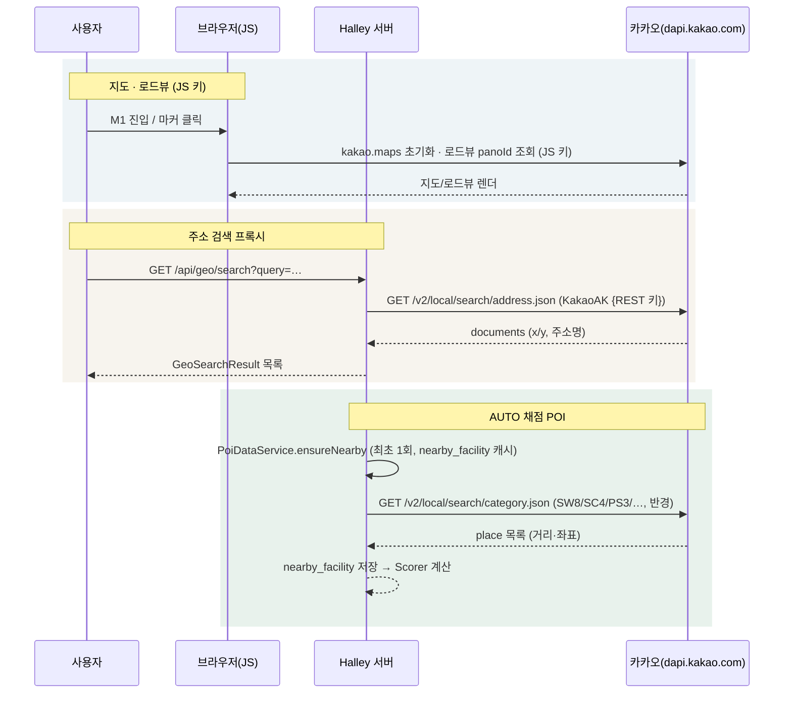
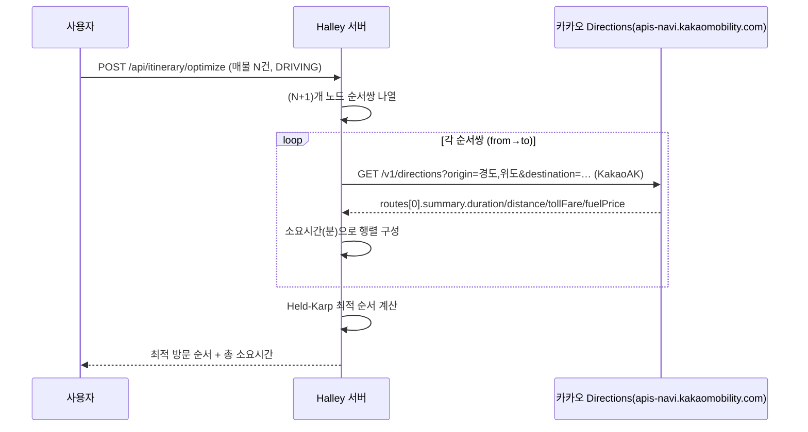
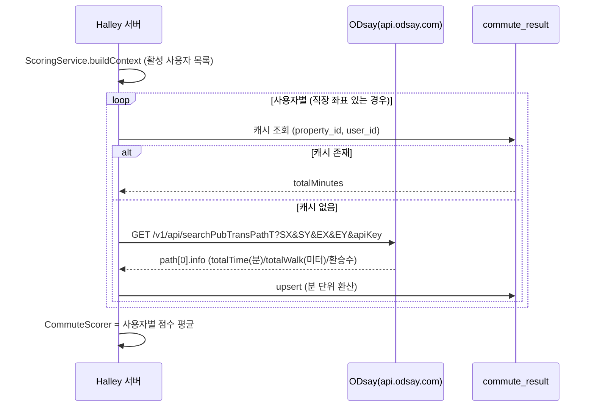
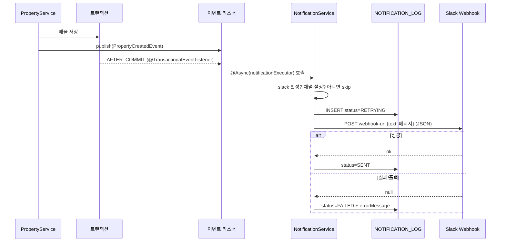
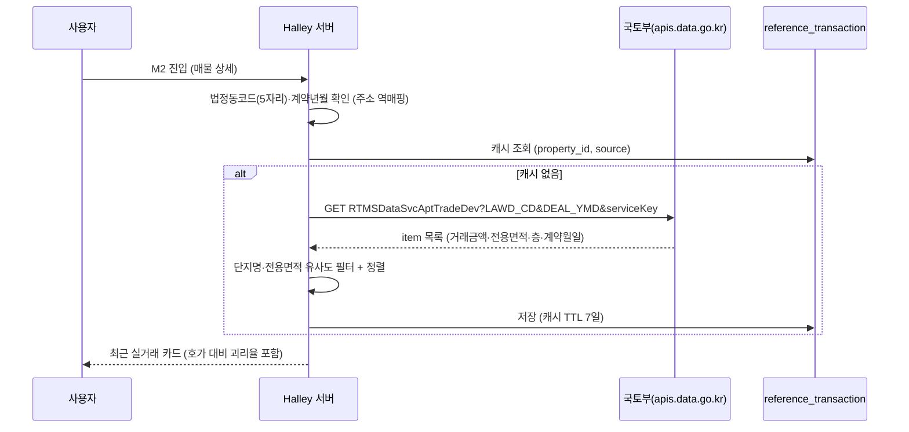
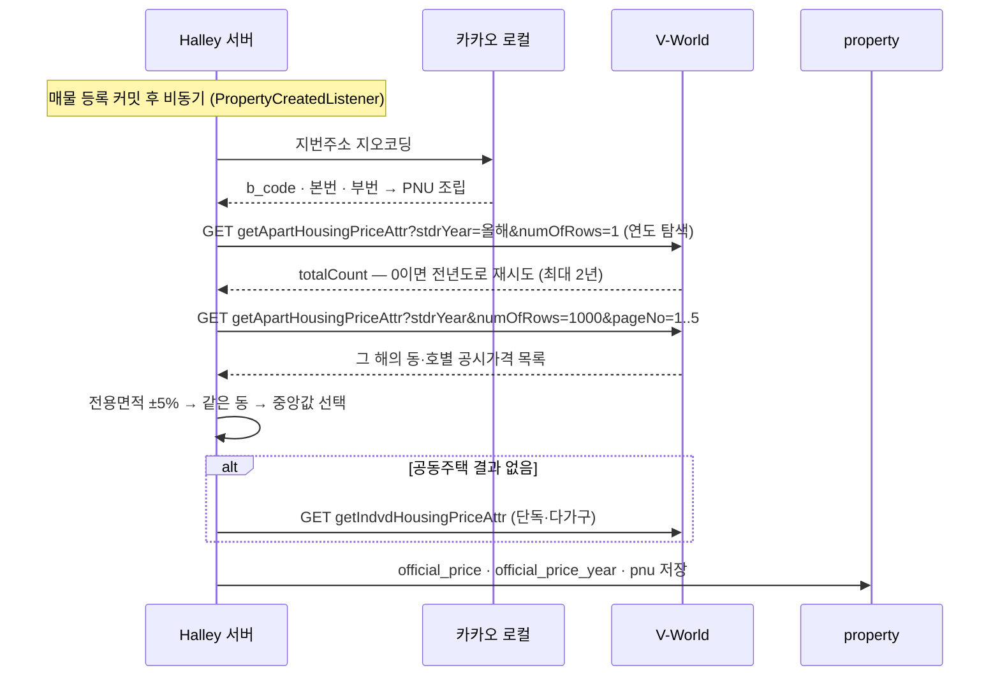

# Halley 외부 인터페이스 매뉴얼

> **최종 갱신**: 2026-09-01 · 연동 15건 사용 중 · 1건 검토 완료(미구현)
> **[구현 예정]** 표시가 붙은 절은 아직 코드가 없습니다 — 규격은 정해졌고 붙이기만 하면 됩니다.

> Halley가 연동하는 **모든 외부 API**(카카오, ODsay, Slack, 국토부, V-World, 법제처, 금감원, 한국은행 ECOS, Claude)의
> 목적, 키 발급처, 설정 키, 호출 흐름을 정리한 문서입니다.
> 수치는 실제 코드(`src/main/resources/application.yaml`, 각 `@FeignClient`, `config/`)와 정합합니다.
> 인터페이스 아키텍처 원칙은 `docs/DESIGN.md` 2.5(외부 연동은 port/어댑터)를 따릅니다.

---

## 1. 연동 요약

| 연동 | 용도 | 호출 측 | 인증 방식 | 환경변수 | 코드 위치 | 상태 |
|---|---|---|---|---|---|---|
| **카카오맵 JS SDK** | 지도·마커·로드뷰(D23) 렌더링 | 클라이언트(브라우저) | JavaScript 키 | `KAKAO_JS_KEY` | `ViewController` · `app.js` | 사용 중 |
| **카카오 로컬 REST** | 주소→좌표 지오코딩 · POI 반경검색(채점용) | 서버(Feign) | REST 키(`Authorization: KakaoAK …`) | `KAKAO_REST_KEY` | `KakaoLocalFeignClient` | 사용 중 |
| **카카오 Directions** | 자가용 이동시간·경로선(임장 플래너) | 서버(Feign) | REST 키(`KakaoAK`, 재사용) | `KAKAO_REST_KEY` | `KakaoDirectionsFeignClient` | 사용 중 |
| **ODsay** | 대중교통 경로(직주근접 채점) | 서버(Feign) | `apiKey` 쿼리 파라미터 | `ODSAY_API_KEY` | `OdsayTransitFeignClient` | 사용 중 |
| **Slack Incoming Webhook** | 그룹별 알림(등록·삭제·코멘트·쾌적함) | 서버(Feign) | Webhook URL 자체가 인증 | **DB** `user_group.slack_webhook_url` | `SlackWebhookClient` | 사용 중(그룹별 선택) |
| **국토부 실거래가** | 최근 실거래 참고 카드(M2) — **채점 미반영** | 서버(Feign) | 서비스 키(`serviceKey`) | `MINISTRY_API_KEY` | `MinistryReferenceFeignClient` | 사용 중(참고 전용) |
| **V-World 공시가격** | 공동주택·개별주택 공시가격(M2) — **채점 미반영** | 서버(Feign) | 인증키(`key`) | `HOUSING_PRICE_API_KEY` | `VworldHousingPriceFeignClient` | 사용 중(참고 전용) |
| **V-World 토지이용계획** | 토지거래허가구역·정비구역 등(M2) | 서버(Feign) | 인증키(`key`, 공유) | `HOUSING_PRICE_API_KEY` | `VworldLandUseFeignClient` | 사용 중(참고 전용) |
| **Claude (LLM)** | AI 추천도 — **채점 반영** | 서버(Feign) | `x-api-key` 헤더 | `ANTHROPIC_API_KEY` | `ClaudeFeignClient` | 사용 중 |
| **금감원 주담대** | 은행별 금리·기간·상환방식 (대출 계산) | 서버(Feign) | `auth` 쿼리 파라미터 | `FSS_API_KEY` | `FssFeignClient` | 사용 중 (5.8) |
| **법제처 국가법령정보** | 규제지역 고시 원문 → 투기과열지구·조정대상지역 | 서버(Feign) | `OC` 쿼리 파라미터 | `LAW_OC` | `LawNoticeFeignClient` | 사용 중 (5.9) |
| **한국은행 ECOS** | 가계대출 금리 5년 → 스트레스 DSR 기준 금리 | 서버(Feign) | 인증키(**URL 경로**) | `ECOS_KEY` | `EcosFeignClient` | 사용 중 (5.10) |
| **국토부 건축물대장** | 연면적·대지면적·용적률 → 재건축 여력 | 서버(Feign) | 서비스 키(`serviceKey`, 재사용) | `MINISTRY_API_KEY` | `BuildingLedgerFeignClient` | 사용 중 (5.11) — 별도 활용신청 필요 |
| **네이버 검색(뉴스)** | 관련 기사 링크 목록 — **점수 미반영** | 서버(Feign) | NCP API Hub **헤더** (`X-NCP-APIGW-API-KEY-ID/KEY`) | `NAVER_CLIENT_ID` · `NAVER_CLIENT_SECRET` | `NaverSearchFeignClient` | 사용 중 (5.12) — **2026년 API Hub 이관** |
| **국토부 전월세 실거래** | 전세가율 산출 | 서버(Feign) | 서비스 키(재사용) | `MINISTRY_API_KEY` | `MinistryReferenceFeignClient#fetchRent` | 사용 중 (5.13) |
| **KB부동산 시세** | KB시세 — <b>대출 한도(LTV)의 기준</b> | 서버(예정) | **인증 없음** | — | — | **검토 완료 · 미구현** (5.14) |

> **키 보관 원칙 (설계 8장)**: REST 키·ODsay 키·국토부 키는 **전량 서버 보관**입니다.
> 클라이언트에는 카카오 **JS 키만** 노출됩니다. `raw_paste_text`를 포함해 어떤 데이터도 외부로 전송하지 않습니다.
>
> **Slack Webhook URL은 환경변수가 아니라 DB에 있습니다** — 그룹마다 다르기 때문입니다(설계 I96).
> `user_group.slack_webhook_url`에 저장되고 그룹 정보 화면에서 관리합니다.

---

## 2. 카카오 (Kakao)

### 2.1 역할

| 기능 | 경로/화면 | 상세 |
|---|---|---|
| 지도 표시 | M1 좌측 지도, D23 로드뷰 | `kakao.maps` (JS SDK, `autoload=false` + `kakao.maps.load`) |
| 주소 검색 프록시 | `GET /api/geo/search` | `GeoController → GeoService → KakaoLocalPort` |
| POI 반경검색 | 채점 엔진 (P4) | `STATION`·`EDUCATION`·`AMENITY`·`GREEN` 채점용 카테고리 검색 |
| POI 키워드검색 | 채점 엔진 (P4) | `GREEN` 공원·하천, 그리고 `AT4` 필터를 건 산 검색 (설계 I42) |
| **법정동코드 조회** | 국토부 실거래가 조회 전 단계 | 주소검색 응답의 `address.b_code`(10자리) 앞 5자리를 `LAWD_CD`로 사용 (설계 I43) |

### 2.2 키 발급 절차

1. [카카오 개발자 콘솔](https://developers.kakao.com) 접속 → 로그인
2. **내 애플리케이션 → 애플리케이션 추가하기** (앱 이름: Halley, 앱 URL 등록)
3. **앱 키** 메뉴에서 두 가지 키를 확보:
   - `JavaScript 키` → `KAKAO_JS_KEY`
   - `REST API 키` → `KAKAO_REST_KEY`
4. **플랫폼 설정** → Web 플랫폼에 도메인 등록 (지도가 렌더되지 않으면 이 단계 누락):
   - `http://localhost:8080`
   - `https://halley.furaiki-lifelog.com`
5. 로컬/운영 각 환경의 환경변수에 주입

### 2.3 설정 키

| application.yaml 키 | 환경변수 | 기본값 | 설명 |
|---|---|---|---|
| `kakao.js-key` | `KAKAO_JS_KEY` | (없음) | JS SDK 앱키, Mustache로 주입 |
| `kakao.rest-key` | `KAKAO_REST_KEY` | (없음) | REST 호출 인증 헤더 `KakaoAK {키}` |
| `kakao.local.base-url` | — | `https://dapi.kakao.com` | 로컬 API 베이스 |

**서킷브레이커/타임아웃**: `kakao-local` connect 3s / read 6s, 실패율 40%, open 15s

### 2.4 호출 흐름



---

## 2.5 카카오 Directions (자가용 — 임장 플래너)

### 2.5.1 역할

**임장 동선 최적화(P9)** 의 자가용 이동시간·경로선·통행료/유류비 조회에 사용합니다. 대중교통 이동시간은 ODsay(3장)가 담당합니다.

| 기능 | 상세 |
|---|---|
| 이동시간 행렬 | 자가용 `DRIVING` 계획의 노드 간 소요시간 (분) |
| 경로선 | 지도 폴리라인용 좌표 경로 (`routes[].path`) |
| 부가 정보 | 예상 통행료·유류비 (`summary.tollFare` / `fuelPrice`) |

### 2.5.2 키 발급

- **카카오 REST 키 재사용** (`KAKAO_REST_KEY`, 2.2에서 발급)
- [카카오모빌리티 Directions API](https://developers.kakao.com/docs/latest/ko/devtalk/directions) 는 별도 앱이 아니라 **카카오 개발자 콘솔 앱의 REST 키**로 호출하며, `apis-navi.kakaomobility.com` 도메인 사용을 위해 해당 API를 활성화합니다.

### 2.5.3 설정 키

| application.yaml 키 | 환경변수 | 기본값 | 설명 |
|---|---|---|---|
| `kakao.directions.base-url` | — | `https://apis-navi.kakaomobility.com` | Directions 베이스 |
| `kakao.rest-key` | `KAKAO_REST_KEY` | (없음) | 로컬 API와 동일한 인증 헤더 |

**서킷브레이커/타임아웃**: `kakao-directions` connect 3s / read 6s, 실패율 40%, open 15s

### 2.5.4 호출 흐름



> **캐시 정책 (설계 10.4·10.8.1)**: 자가용은 실시간 교통을 반영해야 하므로 **캐시를 쓰지 않습니다**. 대중교통(TRANSIT)만 Redis 캐시(TTL 7일)를 사용합니다.

---

## 3. ODsay

### 3.1 역할

**직주근접(`COMMUTE`) 채점** — 활성 사용자의 직장 좌표 ↔ 매물 좌표 간 대중교통 경로를 조회합니다.
`CommuteDataService`가 사용자별 1회 조회하고 `commute_result` 테이블에 캐시합니다(설계 I9).

### 3.2 키 발급 절차

1. [ODsay 오픈 API](https://openapi.odsay.com) 접속 → 회원가입/로그인
2. **API 키 발급** 메뉴에서 무료 키 발급 (대중교통 길찾기 API)
3. 발급받은 키를 `ODSAY_API_KEY` 환경변수로 주입

> **쿼터 주의**: 무료 플랜은 일일 호출 한도가 있습니다. `N명 × M건` 호출이 발생하므로(설계 I9) 캐시와 좌표 반올림으로 절약해야 합니다.

### 3.3 설정 키

| application.yaml 키 | 환경변수 | 기본값 | 설명 |
|---|---|---|---|
| `odsay.api-key` | `ODSAY_API_KEY` | (없음) | 요청 `apiKey` 파라미터 |
| `odsay.base-url` | — | `https://api.odsay.com` | API 베이스 |
| `odsay.transit-path` | — | `/v1/api/searchPubTransPathT` | 경로 조회 엔드포인트 (v1, `T` 포함) |

**서킷브레이커/타임아웃**: `odsay` connect 5s / read 15s, 실패율 30%, open 60s

### 3.4 호출 흐름



---

## 4. Slack

### 4.1 역할

**알림 발송** — 현재는 매물 등록(`PROPERTY_CREATED`) 알림. 판매완료·배치 알림(P7)은 같은 인프라를 확장합니다.
Webhook은 생성 시점에 **채널이 고정**되므로 채널 변경은 새 Webhook 발급 + 재배포가 필요합니다(설계 12.4 확정).

### 4.2 URL 발급 절차

1. [Slack API](https://api.slack.com/apps) → **Create New App** → *From scratch* → 앱 이름/워크스페이스 선택
2. 좌측 **Incoming Webhooks** → 활성화 → **Add New Webhook to Workspace** → 알림을 받을 채널 선택 → **Allow**
3. 생성된 **Webhook URL**을 **그룹 정보 화면**에 붙여넣습니다 (설계 I96).
   환경변수가 아니라 DB(`user_group.slack_webhook_url`)에 그룹마다 따로 저장됩니다.
4. (선택) 알림 활성화: `SLACK_ENABLED=true`, `SLACK_NOTIFY_PROPERTY_CREATED=true`

### 4.3 설정 키

| application.yaml 키 | 환경변수 | 기본값 | 설명 |
|---|---|---|---|
| `slack.enabled` | `SLACK_ENABLED` | `false` | 알림 전체 활성화 |
| ~~`slack.webhook-url`~~ | — | — | **I96에서 DB로 이동** — `user_group.slack_webhook_url` |
| `slack.notify.property-created` | `SLACK_NOTIFY_PROPERTY_CREATED` | `false` | 매물 등록 알림 여부 |

**서킷브레이커/타임아웃**: `slack-webhook` connect 5s / read 15s(default), 실패율 30%, open 60s

### 4.4 호출 흐름



> **설계 원칙 (설계 12.2)**: `AFTER_COMMIT` + `@Async`로 분리 → Slack 장애가 매물 등록 실패로 이어지지 않고, 사용자에게는 등록 성공으로 응답합니다.

---

## 5. 국토부 (Ministry) — 실거래가 참고

### 5.1 역할

**최근 실거래 참고 카드** — 매물 상세(M2)에 동일 단지·유사 면적의 최근 거래를 참고용으로 표시합니다.
**`PRICE` 채점에는 절대 반영하지 않습니다**(설계 5.5 — 실거래가는 계약 시점 가격이라 호가 기준 채점과 섞지 않음).

| 데이터 | API |
|---|---|
| 아파트 매매 실거래가 | `RTMSDataSvcAptTradeDev` |
| 아파트 전월세 실거래가 | `RTMSDataSvcAptRent` |

### 5.2 키 발급 절차

1. [공공데이터포털 data.go.kr](https://www.data.go.kr) 회원가입/로그인
2. **국토교통부 부동산 실거래가 정보** 검색 → 원하는 API(매매/전월세) **활용신청**
3. **마이페이지 → 데이터 활용 → 서비스 키** 발급
4. `MINISTRY_API_KEY` 환경변수로 주입

> **Encoding·Decoding 어느 형태를 넣어도 됩니다.** 포털은 인증키를 두 형태로 주는데, Encoding 키(`%2F`·`%3D` 포함)를
> 그대로 넘기면 Feign이 `%`를 한 번 더 인코딩해 `403 SERVICE_KEY_IS_NOT_REGISTERED_ERROR`가 납니다.
> `MinistryReferenceAdapter`가 퍼센트 이스케이프를 되돌려 주므로(Base64의 `+`는 보호) 둘 다 동작합니다.

### 5.3 설정 키

| application.yaml 키 | 환경변수 | 기본값 | 설명 |
|---|---|---|---|
| `ministry.service-key` | `MINISTRY_API_KEY` | (없음) | 요청 `serviceKey` 파라미터 |
| `ministry.base-url` | — | `https://apis.data.go.kr/1613000` | API 베이스 |

**서킷브레이커/타임아웃**: `ministry-reference` connect 3s / read 8s, 실패율 40%, open 30s (참고 데이터라 실패해도 치명적이지 않음)

### 5.4 호출 흐름



> **동기화 (설계 5.5)**: 등록 시 1회 조회 + 캐시(Redis TTL 7일). 국토부는 월 단위 갱신이므로 실시간 폴링 불필요. 실거래가는 **참고 표기 전용**입니다.

### 5.5 법정동코드(`LAWD_CD`) 확보 — 카카오 주소검색 재사용

국토부 API는 시군구 5자리 법정동코드를 요구합니다. **별도 API 키 없이 카카오 주소검색으로 해결합니다**(설계 I43).

```
GET /v2/local/search/address.json?query={지번주소}
  → documents[0].address.b_code = "1135010500"   (법정동코드 10자리)
  → 앞 5자리 "11350" 이 LAWD_CD (노원구)
```

`LegalDongCodeService.deriveSigunguCode()`의 순서입니다.

1. `legal_dong_code` 테이블 조회 (부팅 시드 8건 + 아래 3에서 쌓인 캐시)
2. 미적중이면 카카오 주소검색 → `b_code`. 존재하지 않는 번지로 실패하면 **동까지만 잘라** 재조회
3. 확보한 코드를 `legal_dong_code`에 캐시 → 같은 동은 다시 묻지 않음

키가 없거나 외부 장애면 예외를 올리지 않고 빈 값을 반환합니다(실거래가는 참고 정보이므로 — 6.1). 이때
`법정동코드를 찾지 못해 실거래가를 조회하지 않습니다` 로그가 남습니다.

#### 5.5.1 대안 — 행정안전부 API (현재 미사용)

전국 법정동코드를 자체 보유하려면 아래 두 경로가 있습니다. **지금은 쓰지 않습니다**(카카오로 충분하고 키가 하나 늘지 않음).
나중에 카카오 의존을 줄이거나 오프라인 조회가 필요해지면 이 경로로 전환합니다.

| 제공 | 엔드포인트 | 키 발급처 |
|---|---|---|
| 행정안전부 행정표준코드 법정동코드 조회 | `https://apis.data.go.kr/1741000/StanReginCd/getStanReginCdList` | 공공데이터포털 |
| 행정안전부 도로명주소 주소검색 | `https://business.juso.go.kr/addrlink/addrLinkApi.do` | 도로명주소 개발자센터 |

**공공데이터포털(StanReginCd) 키 발급 절차**

1. [공공데이터포털 data.go.kr](https://www.data.go.kr) 회원가입/로그인
2. `행정표준코드` 또는 `법정동코드` 검색 → **행정안전부** 제공 오픈 API **활용신청**
3. **마이페이지 → 데이터 활용 → 개발계정 → 인증키** 확인 (국토부와 **같은 인증키**를 쓰며, 서비스별로 활용신청만 추가하면 됩니다)
4. 승인 후 `serviceKey`·`pageNo`·`numOfRows`·`type=json`·`locatadd_nm` 파라미터로 호출

**도로명주소 개발자센터(juso.go.kr) 키 발급 절차**

1. [도로명주소 개발자센터](https://business.juso.go.kr) 회원가입/로그인
2. **오픈API → 주소검색 API 신청** (사용 URL·용도 기재)
3. 발급된 **승인키(confmKey)** 를 요청 파라미터로 전달

> 두 엔드포인트 모두 생존을 확인했습니다(미등록 키로 호출 시 각각 `SERVICE_KEY_IS_NOT_REGISTERED_ERROR`,
> `승인되지 않은 KEY 입니다` 응답). **응답 필드 구조는 키 발급 후 확인이 필요합니다** — 미검증 상태로 코드에 반영하지 마세요.

---

## 5.6 공시가격 (V-World) — 국가공간정보 개방데이터

### 5.6.1 역할

**공시가격 참고 표시** — 매물 상세(M2)에 국토교통부가 매년 1월 1일 기준으로 공시하는 가격을 보여줍니다.
실거래가와 같이 **`PRICE` 채점에는 반영하지 않습니다**(호가 기준 채점과 섞지 않음 — 설계 5.5).

| 데이터 | 대상 | 엔드포인트 |
|---|---|---|
| 공동주택가격 | 아파트·연립·다세대 | `GET /ned/data/getApartHousingPriceAttr` |
| 개별주택가격 | 단독·다가구 | `GET /ned/data/getIndvdHousingPriceAttr` |

Halley는 **공동주택을 먼저 조회하고, 결과가 없으면 개별주택으로 한 번 더** 봅니다.

### 5.6.2 키 발급 절차

1. [V-World 공간정보 오픈플랫폼](https://www.vworld.kr) 회원가입/로그인
2. **오픈API → 인증키 발급 신청** — 활용 유형과 서비스 URL을 입력합니다.
   > ⚠️ **도메인 제한을 걸지 마세요.** 제한이 걸린 키는 서버에서 호출할 때 자료가
   > **0건으로 조용히 나옵니다** — 오류가 아니라 빈 결과라서 원인을 찾기 어렵습니다.
   > Halley는 서버에서 부르므로 브라우저 도메인 제한이 의미가 없습니다.
3. 발급된 인증키를 `HOUSING_PRICE_API_KEY` 환경변수로 주입
4. 데이터 목록은 [국가공간정보 개방데이터](https://www.vworld.kr/dtna/dtna_apiSvcFc_s001.do)에서 확인합니다.

> **인증 실패도 HTTP 200으로 옵니다.** 실패는 `{"apartHousingPrices": {"resultCode": "INVALID_KEY", …}}`,
> 성공은 `{"response": {"resultCode": "", "totalCount": "0", …}}` 형태로 **래퍼 이름과 `resultCode`가 둘 다 달라집니다.**
> 정상 응답의 `resultCode`는 **빈 문자열**이므로, 값이 채워져 있고 성공 코드가 아닐 때만 거절로 봅니다.
> `VworldHousingPriceAdapter`가 이를 판별해 실패면 WARN, 자료 없음이면 `totalCount`와 함께 INFO를 남깁니다.

> **`totalCount`가 0이면** 그 필지에 자료가 없거나, PNU가 틀렸거나, **키에 도메인 제한이
> 걸린 것**입니다. 셋 다 오류 없이 빈 결과로 오므로 구분이 안 됩니다 —
> 다른 필지에서도 0건이면 키 설정을 먼저 의심하세요.

### 5.6.3 설정 키

| application.yaml 키 | 환경변수 | 기본값 | 설명 |
|---|---|---|---|
| `vworld.api-key` | `HOUSING_PRICE_API_KEY` | (없음) | 요청 `key` 파라미터 |
| `vworld.base-url` | — | `https://api.vworld.kr` | API 베이스 |

기동 로그의 `External API key vworld.api-key : set (…)` 줄로 주입 여부를 확인할 수 있습니다(`ExternalApiKeyReporter`).

**서킷브레이커/타임아웃**: `vworld-housing-price` connect 3s / read 8s, 실패율 40%, open 30s

### 5.6.4 요청 파라미터

| 이름 | 필수 | 값 | 비고 |
|---|---|---|---|
| `key` | ○ | 발급 인증키 | |
| `pnu` | ○ | 필지고유번호 19자리 | 아래 5.6.5 |
| `stdrYear` | **실질 필수** | 기준연도(YYYY) | 아래 경고 참조 |
| `format` | | `json` | Halley는 항상 `json` |
| `numOfRows` | | 최대 1000 | Halley는 1000 |
| `pageNo` | | 1 | 대단지는 페이지를 넘겨야 한다 |

> ⚠️ **`stdrYear`는 문서상 옵션이지만 빼면 안 됩니다.** 생략하면 그 필지의 **전 연도가 오래된 순으로**
> 나옵니다. 은마아파트 PNU 실측에서 `totalCount = 110,600 = 4,424세대 × 25년`이었고 첫 페이지가
> **2006년치**였습니다. 그대로 쓰면 20년 전 공시가격이 저장됩니다.
>
> Halley는 `numOfRows=1`로 연도별 `totalCount`만 먼저 확인해 **자료가 있는 가장 최근 연도**를 정하고
> (공시는 매년 4월 말이라 연초에는 올해 자료가 없어 최대 2년 거슬러 봅니다), 그 연도만 페이지로 모읍니다.
> 페이지는 최대 5장(5,000건)까지만 받아 호출 폭증을 막습니다.

**응답 필드** (은마아파트 실측)

| 필드 | 값 예시 | 설명 |
|---|---|---|
| `pnu` | `1168010600103160000` | 필지고유번호 |
| `stdrYear` · `stdrMt` | `2026` · `01` | 기준연도·월 |
| `pblntfPc` | `656000000` | **공시가격(원)** — 공동주택 |
| `housePc` | `268000000` | 주택가격(원) — 개별주택 |
| `prvuseAr` | `84.43` | 전용면적(㎡) |
| `dongNm` · `hoNm` · `floorNm` | `27` · `1401` · `14` | 동·호·층 (**동은 숫자만**) |
| `aphusNm` · `aphusSeCodeNm` | `은마` · `아파트` | 단지명·유형 |
| `ldCode` · `ldCodeNm` | `1168010600` · `서울특별시 강남구 대치동` | 법정동 |
| `mnnmSlno` | `316` | 지번 |

### 5.6.5 PNU(필지고유번호) 확보 — 카카오 주소검색 재사용

공시가격 조회 키는 법정동코드가 아니라 **PNU 19자리**입니다. 국토부 API를 하나 더 붙이는 대신
이미 쓰고 있는 **카카오 주소검색 응답으로 조립**합니다(5.5의 `LAWD_CD`와 같은 방식).

```
PNU(19) = b_code(10) + 필지구분(1) + 본번(4, 0채움) + 부번(4, 0채움)
          └ 법정동코드   └ 일반 1 / 산 2
                          └ main_address_no   └ sub_address_no (없으면 0000)
```

예) `서울시 종로구 명륜2가 4` → `b_code=1111014000`, `main=4`, `sub=` → `1111014000100040000`

구현은 `GeoSearchResult.pnu(...)`이며, 넷 중 하나라도 없으면 `null`을 돌려주고 조회를 건너뜁니다.

### 5.6.6 토지이용계획 — 같은 키로 쓰는 다른 서비스 (설계 I69)

`GET /ned/data/getLandUseAttr?pnu=…&key=…&format=json` — **공시가격과 같은 인증키**를 씁니다.

응답의 `field[]` 항목: `prposAreaDstrcCodeNm`(지역·지구명) · `prposAreaDstrcCode`(코드) ·
`cnflcAtNm`(**포함**/저촉/접함) · `pnu` · `manageNo`.

> ⚠️ **투기과열지구·조정대상지역은 이 API에 없습니다.** 실측으로 확인했습니다(설계 I69).
> 규제지역은 관리 화면에서 수동 등록합니다(I68).

> ⚠️ **`cnflcAtNm`을 구분하지 않으면 오해를 만듭니다.** `포함`만 그 필지에 실제로 적용되고
> `저촉`은 일부만 걸치며 `접함`은 인접할 뿐입니다. 실측에서 용도지역이 셋으로 나왔지만
> 실제는 `제3종일반주거지역(포함)` 하나였습니다.

> **같은 항목이 관리번호만 달리 반복됩니다.** 실측에서 토지거래허가구역 4번, 일반철도 5번.
> `(코드, 이름, 관계)`로 중복을 제거하세요.

### 5.6.7 호출 흐름



> 같은 필지라도 **타입마다 공시가격이 다릅니다.** 전용면적을 맞추지 않으면 엉뚱한 값이 붙기 때문에
> ±5% 안의 건을 먼저 찾고, 없으면 면적 차가 가장 작은 건을 씁니다. 같은 면적이라도 층·향에 따라
> 조금씩 달라(실측 은마 84.43㎡: 6.56억 ~ 6.62억) 매물의 동을 우선하고 그중 **중앙값**을 씁니다.
> 공시가격의 `dongNm`은 `27`처럼 숫자만 오므로 매물의 `102동`과는 숫자로 맞춥니다.

---

### 5.6.7 행정구역 코드 조회 (설계 I78)

규제지역 고시는 지역을 **이름으로** 적는데(`화성동탄`) 저장은 코드로 한다. 그 사이를 잇는
시군구 사전이 필요하고, `legal_dong_code`는 카카오로 채우는 지연 캐시라 기동 시 비어 있다.

**계층마다 엔드포인트가 다르다.** `admCodeList`는 `admCode`를 줘도 무시하고 시도만 돌려준다 —
실측으로 확인했다.

```
GET /ned/data/admCodeList?key={key}&format=json&numOfRows=1000&pageNo=1
→ {"admVOList": {"pageNo": "1", "admVOList": [
     {"admCode": "11", "admCodeNm": "서울특별시", "lowestAdmCodeNm": "서울특별시"},
     {"admCode": "12", "admCodeNm": "전남광주통합특별시", ...}]}}

GET /ned/data/admSiList?key={key}&admCode=41&format=json&numOfRows=1000&pageNo=1
→ {"admVOList": {"admVOList": [
     {"admCode": "41597", "admCodeNm": "경기도 화성시 동탄구",
      "lowestAdmCodeNm": "화성시 동탄구"}]}}
```

| 필드 | 쓰임 |
|---|---|
| `admCode` | 시도 2자리 / 시군구 5자리 |
| `admCodeNm` | 상위를 포함한 전체 이름 |
| `lowestAdmCodeNm` | **상위를 뺀 이름.** 규제지역 매칭이 쓰는 값 |

> ⚠️ **래퍼 이름이 안팎으로 같다** — `{"admVOList": {"admVOList": [...]}}`.
> 이름으로 찾으면 바깥 객체에 걸리므로 **배열인 자식**을 찾아야 한다.

> **행정구역 목록을 코드에 박지 마세요.** 실측 응답에 `전남광주통합특별시`가 있었습니다 —
> 광주광역시와 전라남도가 통합된 것입니다. 박아 둔 목록은 낡아도 낡은 줄 모르고,
> 그 상태로 규제지역이 엉뚱한 코드에 붙습니다.

기동 시 1 + 시도 수만큼 부르지만 `legal_dong_code`에 저장하므로 **한 번 채우면 다시 부르지
않습니다**(`SigunguCodeBootstrap`).

## 5.7 Claude (LLM) — AI 추천도

### 5.7.1 역할

**AI 추천도** — 매물 정보와 구매자들의 직장 위치를 Anthropic Claude에 보내 0~100의 추천도와
그 이유를 받습니다. 결과는 `llm_recommendation`에 저장되고 `LLM_RECOMMENDATION` 채점 항목으로
총점에 반영됩니다(설계 I59).

공급자는 `LlmPort`로 추상화돼 있어 나중에 Ollama 같은 로컬 모델을 붙일 수 있습니다(설계 I58).

### 5.7.2 키 발급 절차

1. [Anthropic Console](https://console.anthropic.com) 가입/로그인
2. **API Keys → Create Key** 로 키 발급 (`sk-ant-…`)
3. **Billing** 에서 결제 수단 등록 — 무료 크레딧이 없으면 401이 아니라 429/400으로 거절됩니다
4. `ANTHROPIC_API_KEY` 환경변수로 주입

> 키를 넣지 않으면 `LlmPort.isEnabled()`가 false가 되어 **호출 자체를 건너뜁니다.**
> AI 추천도만 미산출로 남고 나머지 채점은 그대로 나옵니다.

### 5.7.3 설정 키

| application.yaml 키 | 환경변수 | 기본값 | 설명 |
|---|---|---|---|
| `llm.enabled` | `LLM_ENABLED` | `true` | 전체 스위치 |
| `llm.provider` | `LLM_PROVIDER` | `claude` | 구현체가 여럿일 때 선택 |
| `llm.claude.api-key` | `ANTHROPIC_API_KEY` | (없음) | `x-api-key` 헤더 |
| `llm.claude.model` | `LLM_CLAUDE_MODEL` | `claude-opus-5` | 판단의 질이 곧 채점 품질이라 상위 모델을 기본으로 둔다 (I71) |
| `llm.claude.base-url` | — | `https://api.anthropic.com` | |

**서킷브레이커/타임아웃**: `claude-llm` connect 5s / **read 60s**, 실패율 40%, open 60s.
생성에 시간이 걸리고 비동기 보정에서만 부르므로 read timeout을 길게 잡아도 화면을 막지 않습니다.

기동 로그의 `External API key llm.claude.api-key : set (…)` 줄로 주입 여부를 확인할 수 있습니다.

### 5.7.4 호출 형식

```
POST https://api.anthropic.com/v1/messages
x-api-key: <ANTHROPIC_API_KEY>
anthropic-version: 2023-06-01
Content-Type: application/json

{"model": "...", "max_tokens": 1024, "system": "...",
 "messages": [{"role": "user", "content": "..."}]}
```

응답의 `content`는 블록 배열이며 `type: "text"`인 블록의 `text`만 이어 붙입니다.
오류는 `{"type": "error", "error": {"message": "..."}}` 형태입니다.

### 5.7.5 비용 관리

- **입력이 그대로면 다시 부르지 않습니다.** 프롬프트의 SHA-256을 `prompt_hash`에 저장해 두고
  같으면 저장된 값을 그대로 씁니다. 매물을 열 때마다 부르면 비용이 선형으로 늘어납니다.
- `max_tokens`는 **1024**로 묶습니다. 점수와 두세 문장이면 충분합니다.
- 호출 시점은 **매물 등록 후 비동기 1회** + 사용자가 "다시 물어보기"를 누를 때뿐입니다.
  재채점(`POST /{id}/rescore`)은 LLM을 부르지 않습니다.

---

## 5.9 법제처 국가법령정보 — 규제지역 고시 (설계 I73)

### 5.9.1 역할

**투기과열지구·조정대상지역을 자동으로 얻는 유일한 경로다.** 토지이용계획 API(5.6)에는 이 둘이
없다는 것을 대조 실험으로 확인했다(I69) — 지정이 확실한 화성시 동탄구 청계동 필지에서
토지거래허가구역은 나오는데 규제지역 둘은 0건이었다.

규제지역이 비면 `RegulatedAreaService`가 비규제로 판정하고 LTV 0.7이 잡힌다. 실제가
투기과열지구(0.4)라면 **한도를 배 가까이 부풀린다.** 사람이 넣기를 잊으면 앱이 조용히 낙관적으로
틀리므로 자동 적재한다.

### 5.9.2 인증

**인증키가 아니라 이메일 ID다.** `hong@korea.kr`이면 `OC=hong`.

| 항목 | 값 |
|---|---|
| 설정 키 | `law.oc` (`LAW_OC`) |
| 발급 | https://open.law.go.kr 에서 신청, 무료·즉시 |
| 시험용 | `OC=test`로도 응답하지만 **언제까지 열려 있을지 보장이 없다** |

`test`로 두면 어느 날 조용히 막히고, 그러면 알림이 안 온다는 사실조차 모르게 된다 —
이 연동이 막으려는 상황과 같은 종류다. 운영에서는 반드시 발급받아 쓴다.

### 5.9.3 호출 형식

규제지역 고시는 법률이 아니라 **행정규칙**이므로 `target=admrul`이다.

**① 목록 — 현행 고시의 일련번호를 얻는다**

```
GET https://www.law.go.kr/DRF/lawSearch.do
    ?OC={oc}&target=admrul&type=JSON&query=투기과열지구
```
```json
{"AdmRulSearch": {"admrul": {
  "행정규칙명": "투기과열지구 지정", "행정규칙일련번호": "2100000281590",
  "발령일자": "20260701", "소관부처명": "국토교통부", "현행연혁구분": "현행"}}}
```
> 결과가 1건이면 배열이 아니라 **객체**로 온다.

**② 본문 — 발령일자·공고번호와 첨부 링크**

```
GET https://www.law.go.kr/DRF/lawService.do
    ?OC={oc}&target=admrul&type=JSON&ID=2100000281590
```
```json
{"AdmRulService": {
  "행정규칙기본정보": {"발령번호": "2026-883", "발령일자": "20260701",
                      "제개정구분명": "일부개정"},
  "첨부파일": {"첨부파일명": "국토교통부공고제2026-883호(투기과열지구 지정).pdf",
              "첨부파일링크": "https://www.law.go.kr/flDownload.do?flSeq=166503271"}}}
```

**③ 첨부 PDF — 지정 현황표가 여기 있다**

> ⚠️ **https로 부른다.** 응답의 `첨부파일링크`는 `http://law.go.kr/...`로 오는데 그대로 쓰면
> 301에서 멈춘다. Feign은 프로토콜이 바뀌는 리다이렉트를 따라가지 않는다 — 실측에서
> 이것 때문에 규제지역이 통째로 비었다. `flSeq`만 뽑아 https 베이스로 다시 만든다.

```
GET https://www.law.go.kr/flDownload.do?flSeq=166503271
```

### 5.9.4 왜 PDF까지 받아야 하는가

**본문만으로는 전체 현황을 알 수 없다.** 현행 고시는 `일부개정`이고 `제개정이유내용`에는
이번에 **추가된 지역만** 있다.

```
ㅇ 지정지역 : 경기도 화성시 동탄구, 용인시 기흥구, 구리시
```

그것만 반영하면 **해제된 지역이 영원히 남는다.** 첨부 PDF의 `※ 지정 현황` 표가 그 시점의
전체 목록이므로, 발령일자가 바뀌면 표를 다시 읽어 **통째로 갈아 끼운다.**

| | 담긴 것 | 쓸 수 있나 |
|---|---|---|
| `제개정이유내용` | 이번 추가분만 | ✕ 해제분이 안 빠진다 |
| 첨부 PDF `지정 현황` | **전체 현황** | ○ |

### 5.9.5 PDF 파싱의 함정

**추출 텍스트가 깨진다.** 한글 문서에서 나온 PDF라 숫자·문장부호가 줄 끝으로 밀린다.

```
실제 표시:  강남구, 서초구, 송파구, 용산구, 성동구,
추출 결과:  강남구 서초구 송파구 용산구 성동구, , , , ,
```

그래서 **구분자를 믿지 않는다.** 부호를 모두 지우고 공백으로 토큰화한 뒤,
시도명(`서울`·`경기`)을 만나면 그 뒤를 해당 시도의 지역으로 본다. 지역명 토큰 자체는
순서까지 온전하다. 실물 고시 2건으로 회귀 테스트를 걸어 뒀다
(`src/test/resources/law/*.pdf`) — 서식이 바뀌면 테스트가 먼저 깨진다.

### 5.9.6 지역명이 축약형이다

고시는 시와 구를 붙여 줄여 쓴다. 어디서 자를지 표시가 없어 규칙으로 풀 수 없다.

| 고시 표기 | 실제 |
|---|---|
| `화성동탄` | 경기도 화성시 동탄구 |
| `성남분당` | 경기도 성남시 분당구 |
| `과천` | 경기도 과천시 (자치구 없음) |
| `강남구` | 서울특별시 강남구 |

**양쪽에서 `시·군·구`와 공백을 떼면 같아진다** — `화성동탄` = `화성시 동탄구`.
시도 범위 안에서만 찾아 `중구` 같은 동명이인을 가른다. 사전은 V-World에서 받는다(5.6.7).

> **전부 아니면 전무다.** 하나라도 코드로 못 바꾸면 통째로 버린다. 일부만 넣으면 빠진 지역이
> 비규제(0.7)로 잡혀 한도를 과대평가하는데, 값이 있으니 맞는 줄 알게 되어 더 위험하다.

### 5.9.7 적재 시점과 실패 처리

| 시점 | 동작 |
|---|---|
| 기동 시 규제지역 **비어 있음** | 가상 스레드로 비동기 적재 |
| 기동 시 규제지역 **있음** | 아무것도 안 한다 (손으로 고친 값을 덮지 않는다) |
| 매일 04:00 | 발령일자가 바뀌었으면 통째로 교체 |

적재 상태는 `regulation_notice.seed_status`에 남고, `READY`가 아니면 대출 결과에
`zoneWarning`이 실려 화면에 경고가 뜬다. **키 미설정과 조회 실패는 모두 로그를 남긴다** —
구분되지 않으면 원인을 찾을 수 없다.

## 5.8 금융감독원 — 대출 상품·금리 (설계 I77)

### 5.8.1 역할

**금융상품통합비교공시(금융상품 한눈에)** 에서 주담대·전세자금대출의 실제 공시 금리를 받는다.
지금까지 금리는 관리 화면에서 손으로 넣은 값 하나(`loan.interestRate = 0.04`)였는데,
실제로는 **회사·담보유형·상환방식·금리유형마다 다르고 매달 바뀐다.**

> ⚠️ **금감원 금리를 DSR 역산에 그대로 쓰면 안 된다.** DSR은 스트레스 금리로 계산한다.
> 금감원 금리는 `loan.interestRate`를 대체하고 `loan.stressRate`는 규제 파라미터로 남긴다
> (설계 I64-2).

### 5.8.2 인증

| 항목 | 값 |
|---|---|
| 설정 키 | `fss.api-key` (`FSS_API_KEY`) |
| 발급 | https://finlife.fss.or.kr → 오픈API → 인증키 신청 |
| 기본 URL | `https://finlife.fss.or.kr/finlifeapi/{서비스명}.json` |

### 5.8.3 쓰는 API 세 가지

요청 파라미터가 셋 다 같다.

| 파라미터 | 필수 | 설명 |
|---|---|---|
| `auth` | ✔ | 인증키 |
| `topFinGrpNo` | ✔ | 권역코드. **권역마다 따로 불러야 한다** |
| `pageNo` | ✔ | 1부터. `max_page_no`까지 돌린다 |
| `financeCd` | | 특정 금융회사만 |

권역코드: `020000` 은행 · `030200` 여신전문 · `030300` 저축은행 · `050000` 보험 · `060000` 금융투자

| 서비스명 | 내용 |
|---|---|
| `mortgageLoanProductsSearch` | 주택담보대출 |
| `rentHouseLoanProductsSearch` | 전세자금대출 |
| `companySearch` | 금융회사 (홈페이지·콜센터·영업지역) |

```
GET https://finlife.fss.or.kr/finlifeapi/mortgageLoanProductsSearch.json
    ?auth={key}&topFinGrpNo=020000&pageNo=1
```

> ⚠️ **반드시 https로 부른다.** http는 307로 https에 넘기는데 Feign이 쓰는
> `HttpURLConnection`은 **프로토콜이 바뀌는 리다이렉트를 따라가지 않는다.**

### 5.8.4 응답이 두 배열로 나뉜다

```json
{"result": {
  "err_cd": "000", "err_msg": "정상",
  "total_count": 40, "max_page_no": 4, "now_page_no": 1,
  "baseList":   [{"fin_co_no": "0010001", "fin_prdt_cd": "WR0001", ...}],
  "optionList": [{"fin_co_no": "0010001", "fin_prdt_cd": "WR0001", ...}]}}
```

**`(fin_co_no, fin_prdt_cd)`로 맞물려야 한 상품이 된다.** 한 상품이 담보유형 × 상환방식 ×
금리유형의 조합마다 다른 금리를 갖기 때문에 옵션을 따로 준다. 즉 **금리를 비교하는 단위는
상품이 아니라 옵션이다.**

**baseList** — 상품 기본정보

| 필드 | 내용 |
|---|---|
| `dcls_month` | 공시 제출월 `YYYYMM`. 언제 값인지가 중요하다 |
| `fin_co_no` · `kor_co_nm` | 금융회사 코드·이름 |
| `fin_prdt_cd` · `fin_prdt_nm` | 금융상품 코드·이름 |
| `join_way` | 가입 방법 |
| `loan_inci_expn` | 대출 부대비용 |
| `erly_rpay_fee` | 중도상환 수수료 |
| `dly_rate` | 연체 이자율 |
| `loan_lmt` | 대출한도 |

> **뒤쪽 네 항목은 금액이 아니라 서술 문장이다** — `"LTV 70% 이내"`,
> `"대출금액 × 1.4% × 잔존일수/대출기간"`. 계산에 바로 쓸 수 없고 사람이 읽는 값이다.

**optionList** — 금리 옵션

| 필드 | 내용 |
|---|---|
| `mrtg_type` · `mrtg_type_nm` | 담보유형. **전세자금대출에는 없다** |
| `rpay_type` · `rpay_type_nm` | 대출상환유형 |
| `lend_rate_type` · `lend_rate_type_nm` | 대출금리유형 (고정/변동) |
| `lend_rate_min` · `lend_rate_max` | 최저·최고 금리 |
| `lend_rate_avg` | **전월 취급 평균금리** |

> 비교에는 `lend_rate_avg`를 쓴다. 최저·최고는 조건부라 실제 감각과 멀다.

**companySearch** 는 `baseList`에 `homp_url`·`cal_tel`·`dcls_chrg_man`,
`optionList`에 `area_cd`·`area_nm`(영업지역)이 회사별로 여러 줄 온다.

### 5.8.5 오류가 HTTP 200으로 온다

본문 `result.err_cd`가 `000`이 아니면 실패다. **인증키 문제와 한도 초과를 여기서만 구분할 수 있다.**

| 코드 | 뜻 |
|---|---|
| `000` | 정상 |
| `010` · `011` · `012` · `013` | 미등록 · 중지 · 삭제 · 샘플 인증키 |
| `020` | **일 허용횟수 초과** |
| `021` | 허용된 IP가 아님 |
| `100` · `101` | 요청변수 누락 · 부적절한 값 |
| `900` | 시스템 에러 |

### 5.8.6 설계 시 유의

- **권역별로 따로 부른다.** 한 번에 전 권역을 받는 값이 없다.
- **금리는 월 단위로만 바뀐다.** 매 계산마다 부르지 말고 캐시(TTL 1일 이상)를 둔다.
  일 허용횟수(`020`)가 있는 API다.
- 금리를 못 받으면 규제 파라미터의 기본 금리로 떨어뜨린다 — 대출 계산 자체는 계속 돌아야 한다.
- 키 미설정과 조회 실패를 **구분해 로그로 남긴다.** 구분되지 않으면 원인을 찾을 수 없다.

---

## 5.10 한국은행 ECOS — 가계대출 금리 시계열 (설계 I116)

스트레스 DSR의 기준 금리를 만드는 재료입니다.
`clamp(과거 5년 최고 가계대출금리 − 현재 금리, 1.5%, 3.0%)`.

### 요청

```
GET https://ecos.bok.or.kr/api/StatisticSearch/{KEY}/json/kr/{start}/{end}/{statCode}/{cycle}/{from}/{to}
```

| 조각 | 값 | 비고 |
|---|---|---|
| `KEY` | `ECOS_KEY` | **URL 경로에 들어갑니다** |
| `start` / `end` | `1` / `1000` | 행 범위. 5년치 60행이라 넉넉하다 |
| `statCode` | `121Y006` | 예금은행 대출금리(신규취급액 기준) |
| `cycle` | `M` | 월 |
| `from` / `to` | `202101` / `202601` | 주기에 맞춘 형식 |

> **인증키가 쿼리 파라미터가 아니라 경로 조각입니다.** URL을 통째로 로그에 남기면
> 키가 새어 나갑니다 — 어댑터와 FallbackFactory 어디에서도 URL을 찍지 않습니다.

### 항목 코드 — 하나만 골라야 합니다

한 통계 안에 여러 항목이 섞여 옵니다. `ITEM_CODE1`으로 거르지 않으면 **기업대출 금리가
들어옵니다.**

| 코드 | 항목 |
|---|---|
| `BECBLA01` | 대출평균 |
| `BECBLA02` | 기업대출 |
| **`BECBLA03`** | **가계대출** ← 규제 문구가 말하는 것 |
| `BECBLA0302` | 주택담보대출 |
| `BECBLA030202` | 변동형 주택담보대출 |

`ecos.item-code.household-loan` 프로퍼티로 둡니다. 한국은행이 체계를 바꾸면 설정만 고칩니다.

### 응답

```json
{"StatisticSearch":{"list_total_count":95,"row":[
  {"STAT_CODE":"121Y006","ITEM_CODE1":"BECBLA03","ITEM_NAME1":"가계대출",
   "UNIT_NAME":"연%","TIME":"202401","DATA_VALUE":"4.82"}
]}}
```

- **`DATA_VALUE`는 퍼센트입니다** (`UNIT_NAME: 연%`). 어댑터 경계에서 100으로 나눠
  소수로 담습니다 — 여기서 통일하지 않으면 계산이 100배 어긋납니다.
- **인증 실패도 HTTP 200입니다.** 본문에 `RESULT.CODE`가 실립니다. V-World와 같은 성질이라
  Feign 예외만으로는 실패를 알 수 없어 본문을 먼저 확인합니다.

### 실패했을 때

**기존 `loan.stressRate` 값을 그대로 둡니다.** 0으로 떨어뜨리면 스트레스가 사라져
한도가 실제보다 넉넉하게 나옵니다 — 조용히 낙관적으로 틀리는 쪽이라 가장 위험합니다.

---

## 5.11 국토부 건축물대장 — 연면적·용적률 **[사용 중]**

재건축 여력(`조례 상한 용적률 − 현재 용적률`)을 **추정이 아니라 실측**으로 구합니다
(`docs/PRICE_FORECAST.md` 4-A.2). **`MINISTRY_API_KEY`를 실거래가와 공유합니다.**

### 어떤 서비스인가

**공공데이터포털 → `국토교통부_건축물대장정보 서비스`** (기관코드 `1613000`).
실거래가와 **같은 기관·같은 인증키**지만 **다른 서비스**라 <b>따로 활용신청해야 합니다.</b>

### 어떤 오퍼레이션을 쓰나

한 서비스 안에 오퍼레이션이 여럿입니다. **무엇을 부르는지가 이 절의 핵심입니다.**

| 오퍼레이션 | 단위 | 우리에게 |
|---|---|---|
| **`getBrRecapTitleInfo`** (총괄표제부) | **단지 전체** | ✅ **이것을 씁니다** — 대지면적·연면적·용적률이 단지 단위로 집계돼 있다 |
| `getBrTitleInfo` (표제부) | **동(棟)마다** | 단지에 동이 여러 개면 여러 행. 합산 로직이 필요해진다 |
| `getBrBasisOulnInfo` (기본개요) | 대장 식별 | 대장 종류·관리번호만 |
| `getBrFlrOulnInfo` (층별개요) | 층마다 | 이 용도에는 과하다 |
| `getBrJijiguInfo` (지역지구구역) | 필지 | **용도지역** — V-World 토지이용계획과 교차 검증에 쓸 수 있다 |

> **아파트는 `getBrRecapTitleInfo`(총괄표제부)입니다.** 표제부는 동마다 한 행이라
> 대지면적이 <b>동 수만큼 중복</b>되고, 그대로 더하면 용적률이 엉뚱하게 나옵니다.
> 총괄표제부가 없는 단지(단독·소규모)만 표제부로 내려갑니다.

### 요청

```
GET https://apis.data.go.kr/1613000/BldRgstHubService/getBrRecapTitleInfo
  ?serviceKey={MINISTRY_API_KEY}
  &sigunguCd=41597&bjdongCd=10500&platGbCd=0&bun=0525&ji=0000
  &_type=json&numOfRows=10&pageNo=1
```

**PNU 19자리를 쪼개서 넣습니다.** 이미 갖고 있습니다(설계 I54).

```
41597   10500   1   0525   0000
  │       │     │     │      └── ji        (부번 4)
  │       │     │     └───────── bun       (본번 4)
  │       │     └─────────────── 산 여부    → platGbCd 로 변환
  │       └───────────────────── bjdongCd  (법정동 5)
  └───────────────────────────── sigunguCd (시군구 5)
```

> **`platGbCd`는 PNU의 산 여부와 코드 체계가 다릅니다.**
> PNU는 `1`=대지 · `2`=산인데, `platGbCd`는 **`0`=대지 · `1`=산 · `2`=블록**입니다.
> 그대로 넘기면 엉뚱한 필지를 봅니다. **변환해야 합니다.**

### 받을 값

| 필드 | 뜻 | 쓸모 |
|---|---|---|
| `platArea` | 대지면적(㎡) | 용적률 분모 |
| `vlRatEstmTotArea` | **용적률 산정 연면적** | **분자** — `totArea`와 다르다 |
| `totArea` | 연면적 | 지하·주차 포함. 분자로 쓰면 안 된다 |
| `vlRat` | 용적률(%) | **대장에 계산돼 있으면 그대로 쓴다** |
| `bcRat` | 건폐율(%) | |
| `hhldCnt` | 세대수 | 붙여넣기 값 검증 |
| `useAprDay` | 사용승인일 | 연식 검증 |
| `mainBldCnt` | 주건축물 수 | 동 수 |

> **`totArea`가 아니라 `vlRatEstmTotArea`입니다.** 지하층·주차장은 용적률 산정에서 빠지므로
> 연면적을 그대로 쓰면 용적률이 부풀려집니다.
> **`vlRat`이 채워져 있으면 그것을 먼저 씁니다** — 대장이 이미 계산해 둔 값입니다.

### 실패했을 때

**용적률 여유 지표를 내지 않습니다.** 근사값으로 채우지 않습니다 —
재건축 사업성은 이 앱에서 <b>가장 크게 틀릴 수 있는 숫자</b>입니다
(`docs/PRICE_FORECAST.md` 4-A.2).

### 실호출로 확인한 것 (2026-08-31)

**동탄역시범호반써밋** (PNU `4159710500105250000`)으로 실제 호출해 확인했습니다.

```json
{"resultCode":"00","resultMsg":"NORMAL SERVICE"}
"regstrKindCdNm":"총괄표제부","bldNm":"동탄역시범호반써밋",
"platArea":64303,"vlRatEstmTotArea":111465.7649,"vlRat":173.34,"bcRat":15.71,
"hhldCnt":1002,"mainBldCnt":16,"totPkngCnt":1328,"useAprDay":"20150212"
```

| 확인 | 결과 |
|---|---|
| 경로·오퍼레이션 | `BldRgstHubService/getBrRecapTitleInfo` **유효** |
| `vlRat` 채워짐 | **173.34** — `111465.7649 / 64303 × 100`과 정확히 일치. <b>직접 계산하지 않고 이 값을 씁니다</b> |
| 총괄표제부 | 아파트 단지에서 정상적으로 옴 |
| PNU 분해 | `41597 / 10500 / 0525 / 0000` — 위 표대로 |

> **⚠ 실거래가와 달리 JSON입니다.** 실거래가는 XML이라 어댑터가 DOM으로 읽는데,
> 여기는 `_type=json`이 먹어 Jackson으로 읽습니다. 같은 기관이라고 같은 형식이 아닙니다.

> **`numOfRows`가 문자열(`"1"`)로 옵니다.** 숫자 칸도 문자열로 오는 경우가 있어
> 파싱을 관대하게 둡니다.

#### 딸려 오는 값들

`hhldCnt`(세대수) · `totPkngCnt`(주차대수) · `mainBldCnt`(동 수) · `bldNm`(단지명)이
함께 옵니다. <b>붙여넣기로 받은 값을 검증할 재료</b>입니다 — 지금은 안 쓰지만 남겨 뒀습니다.

```bash
curl -s "https://apis.data.go.kr/1613000/BldRgstHubService/getBrRecapTitleInfo\
?serviceKey=${MINISTRY_API_KEY}&sigunguCd=41597&bjdongCd=10500&platGbCd=0\
&bun=0525&ji=0000&_type=json&numOfRows=1" | head -40
```

응답에서 세 가지를 봐야 합니다.
1. **오퍼레이션이 존재하는지** (`SERVICE_KEY_IS_NOT_REGISTERED_ERROR`면 활용신청이 필요합니다)
2. **`vlRat`·`vlRatEstmTotArea`가 실제로 채워져 오는지** — 비어 오는 대장이 많다면 설계가 달라집니다
3. **단지에 총괄표제부가 있는지** — 없으면 표제부로 내려가는 분기가 필요합니다

---

## 5.12 네이버 검색 (뉴스) — 관련 기사 링크 **[사용 중]**

**점수에 반영하지 않습니다.** 제목·날짜·출처·링크만 보여 주고 판단은 사람이 합니다
(`docs/PRICE_FORECAST.md` 4-B).

### ⚠️ 2026년에 옮겨졌습니다 (설계 I235)

`openapi.naver.com` 은 **폐기됐습니다.** 새로 발급한 키로도 `401` 이 옵니다 —
"인증에 실패했습니다"라고만 나와, <b>키가 틀린 줄 알고 한참 헤맵니다.</b>

같은 키로 두 주소를 나란히 불러 확인한 결과입니다.

```
옛것  GET https://openapi.naver.com/v1/search/news.json
      X-Naver-Client-Id / X-Naver-Client-Secret
      → HTTP 401  {"errorMessage":"NID AUTH Result Invalid (1000) …","errorCode":"024"}

지금  GET https://naverapihub.apigw.ntruss.com/search/v1/news
      X-NCP-APIGW-API-KEY-ID / X-NCP-APIGW-API-KEY
      → HTTP 200  {"lastBuildDate":…,"total":8331,"items":[…]}
```

**바뀐 것은 주소와 헤더뿐입니다.** 응답 구조는 그대로라 파서는 손대지 않았습니다.

### 키 발급

`console.ncloud.com` → **API Hub** → 검색 → 이용 신청.
`developers.naver.com` 의 옛 애플리케이션 키로는 <b>안 됩니다.</b>

> 환경변수 이름(`NAVER_CLIENT_ID` · `NAVER_CLIENT_SECRET`)은 그대로 뒀습니다 —
> 값이 담는 것(Client ID·Secret)이 같고, 이름을 바꾸면 <b>배포된 설정이 조용히
> 비어</b> 기사만 사라집니다.

### 요청

```
GET https://naverapihub.apigw.ntruss.com/search/v1/news
      ?query={단지명 지역명}&display=10&sort=date
Headers:
  X-NCP-APIGW-API-KEY-ID: {NAVER_CLIENT_ID}
  X-NCP-APIGW-API-KEY:    {NAVER_CLIENT_SECRET}
```

| 파라미터 | 범위 | 기본 | 비고 |
|---|---|---|---|
| `query` | — | 필수 | UTF-8 인코딩 |
| `display` | 1~100 | 10 | |
| `start` | 1~1000 | 1 | 우리는 안 씁니다 |
| `sort` | `sim`·`date` | `sim` | **개발 호재는 `date`** — 정확도순은 오래된 기사가 위로 옵니다 |
| `format` | `json`·`xml` | `json` | **안 보냅니다** — 기본값을 굳이 적으면 기본이 바뀌었을 때 못 알아챕니다 |

> 주소가 **`.json` 으로 끝나지 않습니다.** 옛 경로(`/news.json`)를 그대로 두면
> 404 입니다.

### 응답 다룰 때

```json
{"items":[{"title":"<b>◯◯역</b> 복합환승센터 착공",
           "originallink":"https://…","link":"https://n.news.naver.com/…",
           "description":"…","pubDate":"Sat, 12 Jul 2026 09:00:00 +0900"}]}
```

- **`title`·`description`에 `<b>` 태그가 섞여 옵니다.** 그대로 렌더하면 HTML 주입 통로가
  됩니다 — <b>태그를 걷어내고 텍스트로만</b> 다룹니다.
- `pubDate`는 RFC 1123 형식입니다.
- `originallink`(원 언론사)와 `link`(네이버 뉴스)가 다릅니다. **출처를 보여 주려면
  `originallink`의 도메인**을 씁니다.

### 반드시 지킬 것

> **검색 결과를 LLM 프롬프트에 넣지 마십시오.** 웹 내용은 신뢰할 수 없는 입력이고,
> 그 출력은 수억 원짜리 판단에 들어갑니다. 프롬프트 주입 통로가 됩니다.
> 그리고 결과가 매번 바뀌어 프롬프트 해시 중복 방지(I59)가 무력화됩니다.

### 붙이며 알게 된 것

**`pubDate`의 요일을 파싱에 넣지 마십시오.** `Sun, 12 Jul 2026 09:00:00 +0900` 형식인데,
요일은 <b>날짜에서 계산할 수 있는 중복 정보</b>입니다. 그런데 파싱에 넣으면
보낸 쪽 요일이 하루라도 어긋났을 때 <b>날짜를 통째로 잃습니다</b>(엄격 해석기가 거부합니다).
요일 접두어를 떼고 나머지만 읽습니다.

**출처는 `originallink`의 도메인**입니다. `link`는 네이버 뉴스 주소라 어느 언론사가
쓴 기사인지 알 수 없습니다 — 그것이 판단의 재료입니다.

**전망 계산과 분리해 두었습니다.** `GET /api/properties/{id}/news`를 모달이 따로 부릅니다.
기사가 안 와도 전망은 멀쩡히 뜹니다.

---

## 5.13 국토부 전월세 실거래 — 전세가율 **[사용 중]**

매매 실거래와 **같은 서비스의 다른 오퍼레이션**입니다. 인증키를 재사용합니다.

```
전세가율 = 전세 실거래 중앙값 / 매매 실거래 중앙값
```

- 매매와 **같은 면적대**로 맞춰야 합니다. 84㎡ 전세와 115㎡ 매매를 나누면 의미가 없습니다.
- 보증금만 있는 순수 전세만 씁니다 — 월세가 섞인 반전세는 보증금이 낮아 비율을 왜곡합니다.
- 매매·전세 어느 한쪽이 3건 미만이면 **내지 않습니다.**

> 이 앱은 월세를 취급하지 않습니다(설계 I94). 전월세 API는 **전세가율 계산 재료로만** 씁니다.

---

## 6. 공통 · 운영 메모


### 6.1 로컬 개발 시 키 없이 동작하는 방식

| 연동 | 키 없음 → 동작 |
|---|---|
| 카카오 REST | `KakaoApiKeyMissingException`(503) 또는 POI 빈 목록 → 채점 `MISSING` |
| ODsay | `TransitResult.missing()` → `COMMUTE` MISSING |
| V-World | 조회 skip(INFO 로그) → 공시가격 빈 값. 채점 영향 없음 |
| Claude | `isEnabled()=false` → 호출 skip. AI 추천도만 미산출 |
| Slack | `slack.enabled=false`(기본) → 알림 skip |

### 6.2 Feign 공통 규칙 (코딩 규칙)

- 모든 외부 API는 **OpenFeign `@FeignClient`** 로 선언하고, 각 클라이언트마다 **`FallbackFactory`를 필수 구현**
- 타임아웃·서킷브레이커 임계는 **API별로 다르게** 설정(`feign.client.config.<name>` / `resilience4j.circuitbreaker.instances.<name>`)
- ⚠️ **`resilience4j` 인스턴스 이름은 `@FeignClient`의 name과 맞아야 합니다.** 기본 ID는
  `클래스명+메서드시그니처`라 이름으로 잡은 설정이 붙지 않습니다 —
  `FeignSupportConfig`의 `CircuitBreakerNameResolver`가 ID를 name으로 고정합니다 (설계 I70)
- ⚠️ **`resilience4j.timelimiter`를 반드시 명시하세요.** 없으면 기본 1초가 걸려
  Feign `readTimeout`을 늘려도 그 전에 잘립니다. 특히 LLM은 100% 타임아웃합니다 (설계 I70)
- `@EnableFeignClients(basePackages = "banghak.home.halley.adapter.outbound.external")` (`FeignSupportConfig`)

### 6.3 포트/어댑터 목록

| Port | 어댑터 | FeignClient |
|---|---|---|
| `KakaoLocalPort` | `KakaoLocalAdapter` | `KakaoLocalFeignClient` |
| `KakaoDirectionsPort` | `KakaoDirectionsAdapter` | `KakaoDirectionsFeignClient` |
| `OdsayTransitPort` | `OdsayTransitAdapter` | `OdsayTransitFeignClient` |
| `MinistryReferencePort` | `MinistryReferenceAdapter` | `MinistryReferenceFeignClient` |
| `HousingPricePort` | `VworldHousingPriceAdapter` | `VworldHousingPriceFeignClient` |
| `LandUsePort` | `VworldLandUseAdapter` | `VworldLandUseFeignClient` |
| `LlmPort` | `ClaudeLlmAdapter` | `ClaudeFeignClient` |
| `SlackPort` | `SlackWebhookAdapter` | `SlackWebhookClient` |

**캐시 포트** (프로파일로 구현 교체 — 설계 2.5)

| Port | local (`@Profile("!live")`) | live (`@Profile("live")`) | TTL |
|---|---|---|---|
| `PoiCache` | `InMemoryPoiCache` | `RedisPoiCache` | 30일 (키에 수집 규칙 버전 포함 — 설계 I44) |
| `LlmJobCache` | `InMemoryLlmJobCache` | `RedisLlmJobCache` | RUNNING 5분 / DONE 1일 (설계 I72) |
| `TravelTimeCache` | `InMemoryTravelTimeCache` | `RedisTravelTimeCache` | 7일 (TRANSIT만, 설계 10.4) |

> 두 Redis 어댑터 모두 **장애 시 조용히 건너뜁니다**. 캐시가 죽어도 외부 API 재호출로 흡수되어 느려질 뿐 기능은 유지됩니다(설계 2.1.1).

> 이 문서와 코드가 어긋나면 `docs/DESIGN.md`가 최신 확정 사항이므로 그쪽을 따르고 이 문서를 갱신합니다.

---

## 5.14 KB부동산 시세 (api.kbland.kr) — **[검토 완료 · 미구현]**

**붙여넣기가 놓칠 때를 대비한 대안입니다.** 지금은 원문에서 `KB시세`를 읽고(I159),
없으면 사람이 매물 수정에서 넣습니다(I160). 이 연동은 <b>그 둘이 다 안 될 때</b>의 길입니다.

### 실호출로 확인한 것

`https://api.kbland.kr` · **인증 없음** · 응답 봉투 `{dataHeader, dataBody:{data, resultCode}}`.
HTTP 200이어도 `dataBody.resultCode != 11000`이면 실패입니다.

```
법정동코드 1135010500 (노원구 상계동)
  → GET /land-complex/complexComm/hscmList?법정동코드=…      125건, 매물종별구분 "01"=아파트
  → 단지명으로 고름 → 단지기본일련번호 965 (상계주공(7단지))
  → GET /land-complex/complex/typInfo?단지기본일련번호=965    면적 10건
  → 전용면적으로 고름 → 면적일련번호 184341 (전용 49.94㎡)
  → GET /land-price/price/BasePrcInfoNew?단지기본일련번호=965
        &면적일련번호=184341&매물종별구분=01
```

응답 `시세[0]`에서:

| 필드 | 값(만원) | |
|---|---|---|
| `매매일반거래가` | **74000** | ← <b>이것이 KB시세</b> |
| `매매하한가`/`매매상한가` | – / 77000 | |
| `전세일반거래가` | 31000 | 전세가율에 쓸 수 있다 |
| `시세기준년월일` | 20260828 | 언제 기준인지 |

**붙여넣기 원문의 `KB시세 7억 4,000만원`과 정확히 일치합니다.**

### 반드시 지킬 것

> **쿼리 파라미터 <b>이름이 한글</b>입니다.** 퍼센트 인코딩을 해야 합니다 — 원문 UTF-8로
> 보내면 nginx가 **400**을 돌려줍니다. 확인하다 한 번 속았습니다:
> `curl --data-urlencode "법정동코드=…"` 는 <b>이름은 인코딩하지 않습니다</b>(값만 합니다).
> 그래서 "API가 막혔다"고 잘못 읽을 뻔했습니다. Feign은 `@RequestParam` 이름을
> 인코딩하므로 문제없을 것으로 보이나, **붙일 때 실호출로 확인해야 합니다.**

> **단위는 만원입니다.** 74000 → 740,000,000원. 이 앱은 전부 원 단위입니다.

> **이용약관을 확인하십시오.** 공개 엔드포인트지만 KB부동산 이용약관의
> <b>자동수집 조항</b>은 붙이기 전에 봐야 합니다. 사적인 소규모 사용이라도
> 확인은 하고 넘어가는 편이 낫습니다.

### 붙인다면

`KbPricePort` + `KbPriceFeignClient` + `KbPriceFallbackFactory`(필수 — 규칙),
`kb.base-url: https://api.kbland.kr`. **호출이 세 번**이라 값이 싸지 않으므로
매물당 한 번만 부르고 `property.kb_price`에 저장합니다 — 보정(enrichRest) 단계가 자연스럽습니다.

**단지·면적 고르기가 이 연동의 어려운 부분입니다.** 단지명은 표기가 흔들리고
(`상계주공(7단지)` vs `상계주공7단지`), 면적은 전용면적으로 맞춰야 합니다.
실거래 매칭(`TradeStatCalculator`)이 이미 같은 문제를 풀고 있으므로 그 기준을 그대로 씁니다.
**고르지 못하면 비웁니다** — 엉뚱한 단지의 시세를 넣느니 없는 편이 낫습니다.
