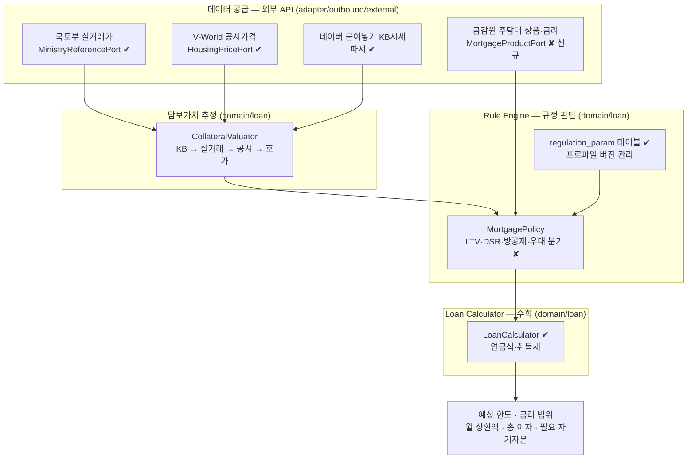

# 주담대 예상 한도 엔진 설계

> **최종 갱신**: 2026-09-01 · 구현됨. 결정 이력은 `docs/DESIGN.md` I65~I67 · I116.

> 매물 가격·사용자 소득·규제 파라미터로 **예상 대출 한도**를 산출하는 서브시스템의 설계입니다.
> 상위 설계는 `docs/DESIGN.md` 3.4(대출 한도)·I64를, 외부 API 상세는 `docs/INTERFACE_MANUAL.md`를 따릅니다.
>
> **상태: 로드맵 다섯 단계 모두 완료** (담보가치 우선순위 · 방공제 · 실거래 단가 보정 ·
> 규제지역·보유주택 LTV 분기 · 규제 관리 화면 · 금감원 금리 연동 · 부채 종류별 DSR).

---

## 1. 결론 — 구현 가능성

**가능합니다.** 다만 제안된 3계층 구조(API = 데이터 공급 / Rule Engine = 규정 판단 / Calculator = 계산)는
**Halley에 이미 절반 이상 존재합니다.** 새로 만드는 것이 아니라 **비어 있는 칸을 채우는 작업**입니다.

| 구성요소 | 상태 | 근거 |
|---|---|---|
| 국토부 실거래가 수집 | **구현됨** | `MinistryReferencePort` · `ReferenceTransactionService` |
| KB시세 확보 | **구현됨** | 네이버 붙여넣기 파싱 `property.kb_price` |
| 공시가격 확보 | **구현됨** | V-World `HousingPricePort` (설계 I54) |
| Rule Engine (파라미터 외부화) | **구현됨** | `regulation_param` 테이블 + 프로파일 버전 |
| Loan Calculator (LTV·DSR·연금식) | **구현됨** | `LoanCalculator` |
| 기존 부채 DSR 차감 | **구현됨** | 종류별 산정만기까지 (I55·I92) |
| 금감원 주담대 상품·금리 | **구현됨** | `FinanceProductPort` · `MarketRateService` (I77·I81) |
| 방공제(최우선변제금) | **구현됨** | `ltv.leaseDeduction` · MCI 가입 시 면제 (I64) |
| 담보가치 우선순위 (KB→실거래→공시→호가) | **구현됨** | `CollateralValuator` (I64·I65) |
| 실거래 단가·최근성·표본 보정 | **구현됨** | `reference_transaction.area_m2` 신설 (I65) |
| 생애최초·다주택·규제지역 분기 | **구현됨** | `MortgagePolicy` · `regulated_area` (I66) |
| 스트레스 DSR 단계 적용 | **구현됨** | 금리유형 가중치 · 단계 적용률 (I97) |

---

## 2. 제안 설계에 대한 검토 의견

제안하신 흐름은 전체적으로 맞습니다. 다만 **결과가 실제와 크게 어긋나는 지점이 네 군데** 있어
그대로 구현하면 안 됩니다.

### 2.1 담보가치는 실거래가보다 KB시세가 먼저다

제안에서는 실거래가로 담보가치를 추정했지만, **은행이 LTV를 매길 때 쓰는 것은 KB시세**입니다.
그리고 Halley는 이미 네이버 붙여넣기에서 **KB시세를 파싱해 `property.kb_price`에 저장**하고 있습니다.

실측 사례에서 호가 15억 / KB시세 13.5억으로 **1.5억 차이**가 났습니다(설계 9.2).
실거래가를 담보가치로 쓰면 이 오차가 그대로 한도에 실립니다.

**담보가치 우선순위**

```
1. kb_price            (있으면 이것)          ← 은행 기준과 동일
2. 최근 실거래가 중앙값  (동일 단지·유사 면적)   ← 국토부 API, 이미 수집 중
3. official_price ÷ 0.7 (공시가격 역산)       ← V-World, 최후 수단
4. price_deposit       (호가)                 ← 위가 모두 없을 때만, 경고 표기
```

3번의 0.7은 공동주택 공시가격 현실화율 근사치입니다. **규제 파라미터로 뺍니다**(매년 바뀜).
어느 단계를 썼는지 `valuation_source`로 남기고 화면에 표기합니다 — 4번으로 계산된 값과
1번으로 계산된 값의 신뢰도는 다릅니다.

### 2.2 금감원 금리를 DSR 역산에 그대로 넣으면 한도가 부풀려진다

제안 예시에서 연 4.0%로 DSR 한도를 역산했는데, **DSR 규제는 스트레스 금리를 얹어 계산합니다.**
실제 대출 금리가 4.0%여도 DSR 심사는 여기에 가산금리를 더한 금리로 원리금을 계산합니다.

```
금감원 API 금리 4.0%  →  월 상환액·총 이자 표시용
스트레스 금리 4.0+α%  →  DSR 한도 역산용
```

두 금리를 **같은 값으로 쓰면 한도가 실제보다 높게** 나옵니다.
현재 `LoanCalculator`는 이미 `interestRate + stressRate`로 DSR을 계산하고 있으므로,
금감원 금리는 **`interestRate`를 대체**하고 `stressRate`는 규제 파라미터로 유지합니다.

### 2.3 `min(LTV, DSR, 상품한도)`에 방공제가 빠져 있다 ⚠️

가장 큰 오차 원인입니다. **소액임차보증금 최우선변제금(방공제)** 이 LTV 한도에서 차감됩니다.

```
LTV 한도  = 담보가치 × LTV비율 − 방공제
```

서울 기준 방 1개당 수천만 원 단위이며, MCI/MCG(모기지신용보험)에 가입하면 면제됩니다.
이걸 빼먹으면 **수천만 원 단위로 높게** 나옵니다. 제안 예시(9.3억 × 60% = 5.58억)도
방공제를 빼면 실제로는 5억 초반대가 됩니다.

- 지역별 금액은 주택임대차보호법 시행령 개정 때마다 바뀌므로 **규제 파라미터**로 둡니다.
- MCI 가입 여부는 사용자 입력(기본값: 미가입 = 차감)으로 받습니다.

### 2.4 기존 부채는 "잔액"이 아니라 "연간 원리금"으로 들어간다

DSR은 잔액이 아니라 **연간 상환액**을 봅니다. 대출 종류마다 산정식이 다릅니다.

| 종류 | DSR 반영 |
|---|---|
| 주담대 | 실제 원리금 (만기까지) |
| 신용대출 | 잔액 ÷ 약정만기(규제상 하한 있음) |
| 마이너스통장 | 한도 ÷ 약정만기 |
| 전세대출 | 이자만 |

현재 Halley는 기존 부채를 **신규 대출과 같은 금리·기간으로 가정**해 추정합니다(설계 I55).
MVP로는 충분하지만, 정확도를 올리려면 부채 종류를 입력받아야 합니다.
**입력 항목이 늘어나는 만큼 이탈도 늘어나므로**, 종류 입력은 "고급" 접기 영역에 둡니다.

---

## 3. 아키텍처

제안하신 3계층 분리를 그대로 따릅니다. Halley의 포트/어댑터 구조(설계 2.5)에 얹습니다.



**경계 규칙**

- **어댑터는 계산하지 않습니다.** 금감원 응답을 금리 목록으로 바꾸는 것까지가 어댑터의 일입니다.
- **Rule Engine은 외부를 부르지 않습니다.** 순수 함수여야 테스트할 수 있습니다.
- **Calculator는 규정을 모릅니다.** 원금·금리·기간을 받아 상환액을 내는 것만 합니다.

---

## 4. 규제 데이터 소스 — 세 번째 API는 없습니다

제안에서 "규제정보 데이터 소스를 하나 더" 두라고 하셨는데, **정직하게 말하면
한국에는 규제 파라미터를 기계가 읽을 수 있는 형태로 주는 공개 API가 없습니다.**

- 금융위·금감원의 DSR·LTV 조정은 **보도자료(PDF·HTML)** 로 나옵니다.
- 규제지역(투기과열지구·조정대상지역) 지정은 **국토부 고시**입니다.
- 방공제 금액은 **주택임대차보호법 시행령**입니다.

크롤링해서 수치를 자동 추출하는 것은 **오탐 위험이 이득보다 큽니다.** 규제를 잘못 읽으면
한도가 통째로 틀어지는데, 그걸 알아챌 방법이 없습니다.

**따라서 규제는 사람이 반영하고, 시스템은 그 반영을 안전하게 만듭니다.**

```
regulation_param (profile = '2025-10-15')   ← 이미 구현됨
  ltv.rate, dsr.ratio, loan.stressRate, ...
system_config.loan.regulation.profile        ← 활성 프로파일 지정
```

- 규제가 바뀌면 **새 프로파일을 통째로 추가**하고 활성 프로파일만 바꿉니다.
  기존 프로파일은 남으므로 **과거 산출값을 재현**할 수 있습니다.
- 관리자 화면에서 프로파일을 편집·전환합니다(설정 M6 확장).
- 규제지역은 `regulated_area` 테이블(법정동코드 기준)로 두고 관리자가 관리합니다.
  토지이용계획 API에는 규제지역이 없다는 것을 대조 실험으로 확인했습니다(I69).
  고시 변경은 법제처 API로 자동 적재합니다(I73·I78).

이 방식이 "API 하나 더"보다 **정확하고, 이미 절반 구현되어 있습니다.**

---

## 5. 산출 로직

### 5.1 입력

| 출처 | 항목 |
|---|---|
| 매물 | 호가, KB시세, 전용면적, 주소(규제지역 판정), 공시가격 |
| 사용자 프로필 | 연소득, 보유 현금, 기존 대출액 *(I55에서 이미 수집 중)* |
| 화면 입력 | 생애최초 여부, 주택 보유 수, MCI 가입 여부 |
| 규제 프로파일 | LTV비율, DSR한도, 스트레스금리, 방공제, 총액상한 |
| 금감원 | 은행별 금리 범위, 최대 대출기간, 상환방식 |

### 5.2 순서

```
1. 담보가치 V = KB시세 → 실거래 중앙값 → 공시가격÷0.7 → 호가
2. LTV비율 r = policy(규제지역, 생애최초, 주택수)      ← 다주택·규제지역이면 0일 수 있음
3. LTV 한도 = min(V × r − 방공제, 총액상한)
4. DSR 여력 = 연소득 × DSR한도 − 기존부채 연간상환액
5. DSR 한도 = (DSR 여력 ÷ 12) × 연금계수(스트레스금리, 만기)
6. 예상 한도 = min(LTV 한도, DSR 한도, 상품 최대한도)
7. 월 상환액·총 이자 = Calculator(예상 한도, 실제금리, 만기, 상환방식)
8. 필요 자기자본 = 호가 − 예상 한도 + 취득세 + 중개보수
```

**4번에서 음수가 나오면 한도는 0입니다.** 기존 부채가 DSR 여력을 넘는 경우이며,
현재 `LoanCalculator`가 이미 이 경우를 0으로 잡고 있습니다.

**8번의 취득세·중개보수는 이미 매물에 파싱돼 있습니다**(설계 I53). 별도 계산이 아니라
파싱값을 우선 쓰고, 없을 때만 세율로 계산합니다.

### 5.3 출력에 반드시 붙일 것

```
예상 대출한도이며 실제 금융기관 심사 결과와 다를 수 있습니다.
담보가치는 {KB시세 | 최근 실거래가 | 공시가격 환산 | 호가} 기준입니다.
```

담보가치 출처를 함께 밝히지 않으면 **호가로 계산한 값과 KB시세로 계산한 값이
같은 얼굴로 보입니다.** 신뢰도가 다른 값을 같게 보이게 하면 안 됩니다.

---

## 6. 금감원 공시 금리를 어디에 쓰는가 (설계 I77)

**연결했습니다**(I81). `FinanceProductPort` → `MarketRateService` → `LoanEstimateService`.
아래는 무엇을 쓰고 무엇을 안 썼는지에 대한 기록입니다.

### 6.1 지금 금리가 어떻게 쓰이는가

한 곳뿐입니다. 규제 파라미터의 상수 하나입니다.

```
loan.interestRate = 0.04   ← 월 상환액 계산
loan.stressRate   = 0.055  ← DSR 역산
```

`LoanCalculator`가 `interestRate`로 원리금균등 월 상환액을 내고, `stressRate`로 DSR 한도를
역산합니다. **둘의 역할이 다릅니다.**

### 6.2 쓸 것과 쓰지 않을 것

| 금감원 값 | 쓰나 | 이유 |
|---|---|---|
| `lend_rate_avg` (전월 취급 평균금리) | **○ `interestRate` 대체** | 실제로 취급된 값이라 감각에 가장 가깝다 |
| `lend_rate_min` / `max` | △ 범위 표시용 | 조건부라 대표값으로 못 쓴다 |
| `loan_lmt` (대출한도) | **✕** | `"LTV 70% 이내"` 같은 **서술 문장**이다. 파싱해서 한도 계산에 넣으면 규제 파라미터와 이중으로 적용된다 |
| `erly_rpay_fee` · `dly_rate` | △ 화면 표시만 | 역시 서술 문장이다 |
| DSR 역산 | **✕ 그대로 두기** | DSR은 **스트레스 금리**로 계산한다. 시장 금리로 바꾸면 한도가 부풀려진다 (I64-2) |

> **핵심은 `interestRate` 하나를 바꾸는 것입니다.** 한도 산식은 건드리지 않습니다.
> 금감원이 주는 한도 문구를 규제 파라미터 위에 얹으면 같은 제약이 두 번 걸립니다.

### 6.3 어떤 옵션을 고를 것인가

한 상품이 담보유형 × 상환방식 × 금리유형마다 다른 금리를 가지므로 **옵션 단위로 고릅니다.**

```
주담대  → mrtg_type = 아파트
        → rpay_type = 분할상환
        → lend_rate_type = 변동 / 고정 (사용자 선택, 기본 변동)
전세    → rpay_type = 만기일시상환 (전세대출은 이자만 낸다 — I67)
```

권역은 **은행(020000)만** 씁니다. 저축은행·보험은 금리가 크게 높아 같은 표에 섞으면
평균이 왜곡됩니다. 나중에 넓힐 때는 권역을 사용자가 고르게 합니다.

대표 금리는 조건에 맞는 옵션들의 **`lend_rate_avg` 중앙값**으로 잡습니다. 평균을 쓰면
극단값 하나에 끌려갑니다 — 실거래가 단가에서 중앙값을 쓰는 것과 같은 이유입니다(I65).

### 6.4 어떻게 화면에 보일 것인가

금리를 바꾸는 데 그치지 않고 **왜 그 금리인지** 보여 줍니다.

```
예상 월 상환액  1,842,000원
  금리 3.62% · 은행 12곳 변동금리 평균 (2026년 1월 공시)
  [ 상품별 금리 보기 ]
```

담보가치 출처를 밝히는 것(5장)과 같은 원칙입니다. **어디서 온 숫자인지 안 보이면
사용자는 검증할 수 없습니다.**

### 6.5 언제 부를 것인가

**공시는 월 단위로만 바뀝니다.** 매 계산마다 부르면 안 됩니다 — 일 허용횟수가 있는 API고
(`err_cd = 020`), 같은 답을 반복해서 받는 낭비입니다.

| | |
|---|---|
| 주기 | 하루 한 번 배치 (규제지역 갱신과 같은 시간대) |
| 저장 | `MarketRateCache` (TTL 1일). 상품 목록은 DB에 둘 만큼 오래 쓰지 않는다 |
| 실패 시 | **규제 파라미터의 기본 금리로 떨어뜨린다.** 금리는 보조 입력이고 대출 계산 자체는 계속 돌아야 한다 (12.2 원칙) |
| 표시 | 떨어뜨렸으면 "기본 금리 4% 적용 중"이라고 밝힌다 — 조용히 다른 값을 쓰지 않는다 |

### 6.6 실제로 붙인 모습

```
LoanEstimateService.estimate()
  └ MarketRateService.find(MORTGAGE | JEONSE)     ← 캐시 우선, 없으면 조회
       └ withMarketRate(params, rate)             ← interestRate 하나만 교체
            └ LoanCalculator / JeonseLoanCalculator (변경 없음)
```

전세도 같은 흐름에 태웠습니다 — `LoanProductType`으로 엔드포인트만 갈리고,
월 상환액 계산이 다른 것은 `JeonseLoanCalculator`가 이미 처리합니다(I67).

`MarketRateJob`이 매일 04:30에 갱신합니다. 규제지역(04:00)과 시간을 벌려
기동 직후 외부 호출이 몰리지 않게 했습니다.

### 6.7 기존 부채 종류별 DSR (설계 I92)

전부 30년 주담대로 보고 있었습니다. **신용대출 1억이 연 640만원으로 잡혔는데 실제로는
연 2,200만원**입니다 — 한도가 그만큼 부풀려졌습니다.

| 종류 | DSR 산정만기 | |
|---|---|---|
| 주택담보대출 | 30년 | |
| **신용대출** | **5년** | 실제 만기와 무관 |
| **마이너스통장** | 5년 | **쓴 금액이 아니라 한도 전체** |
| 전세자금대출 | — | **원금 제외, 이자만** |
| 기타담보대출 | 8년 | |
| 할부·리스 | 3년 | |

`users.existing_loan`(단일 금액)은 **폴백으로 남깁니다.** 버리면 아직 종류를 입력하지 않은
사용자의 부채가 통째로 사라져 한도가 부풀려집니다. 종류별 입력이 있으면 그것만 씁니다 —
둘을 더하면 이중으로 셉니다.

### 6.8 남은 판단

- **금리유형(고정/변동)을 사용자가 고를지.** 지금은 `loan.market-rate.type`으로
  변동이 기본입니다. 상환 계획에 따라 갈리므로 화면에서 고르게 할 수 있습니다.
- **권역을 넓힐지.** 지금은 은행만 봅니다. 저축은행·보험을 섞으면 중앙값이 왜곡되므로,
  넓힌다면 사용자가 권역을 고르는 형태여야 합니다.

---

## 7. 로드맵

| 단계 | 내용 | 규모 |
|---|---|---|
| ~~**1**~~ | ~~방공제·담보가치 우선순위 반영 (2.1·2.3)~~ | **완료** — I64·I65 |
| ~~**2**~~ | ~~생애최초·다주택·규제지역 분기 (`MortgagePolicy`)~~ | **완료** — I66 |
| ~~**3**~~ | ~~금감원 상품·금리 연동~~ | **완료** — I77·I81 |
| ~~**4**~~ | ~~규제 프로파일 관리 화면~~ | **완료** — I68 (규제지역 관리 포함) |
| ~~**5**~~ | ~~기존 부채 종류별 DSR 산정~~ | **완료** — I92 |

> **전세자금대출 분기(I67)는 로드맵과 별도로 먼저 처리했습니다.** `ProductType.JEONSE`가
> 쓰이지 않아 전세 매물에 매매 공식이 그대로 돌고 있었고, 취득세·방공제가 잘못 표시됐습니다.
> 금감원 금리를 붙여도 계산 구조가 틀려 있으면 여전히 틀린 답이 나오므로 순서를 앞당겼습니다.

**1·2단계 완료.** 실측(호가 15억 / KB시세 13.5억)에서 LTV 한도가 **6억 → 4.85억**으로 바뀌었습니다
— 담보가치 기준 변경으로 6천만원, 방공제로 5,500만원이 내려간 결과입니다.
이전 값은 실제보다 **1.15억 높았습니다.**

금감원 연동(3단계)은 **금리를 실제 시장값으로 바꾸는 것**이지 한도 산식을 바꾸지 않습니다.
지금은 규제 파라미터의 고정 금리(4%)를 쓰고 있어, 연동 전까지는 그 값을 관리자가 조정하면 됩니다.

---

## 8. 미해결 — 확인이 필요한 것

- ~~금감원 API 엔드포인트 실측~~ — **실측 완료**. 은행 주담대 34개 상품 / 108개 옵션에서
  변동금리 중앙값 4.61%(2026년 8월 공시)를 받았습니다(I81).
- **규제 파라미터의 현재 값은 사람이 확인해야 합니다.** 방공제 금액·현실화율·LTV 매트릭스는
  시행령·고시로 정해지는데 공개 API가 없습니다. 시드 값은 형태를 갖추기 위한 것이며
  <b>실제 규제와 다를 수 있습니다</b> — 규제 관리 화면에서 확인하고 넣으세요.
- **기준 스트레스 금리는 사람이 넣습니다**(`loan.stressRate`). 실제 규제식은
  `clamp(과거 5년 최고 가계대출금리 − 현재 금리, 1.5%, 3.0%)`인데 과거 금리 시계열이 필요합니다.
  한국은행 ECOS로 자동화할 수 있지만 분기마다 한 번 바뀌는 값이라 뒤로 미뤘습니다(I97).
