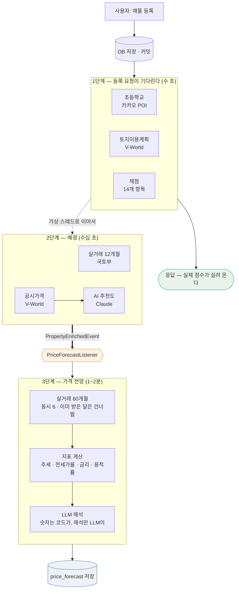
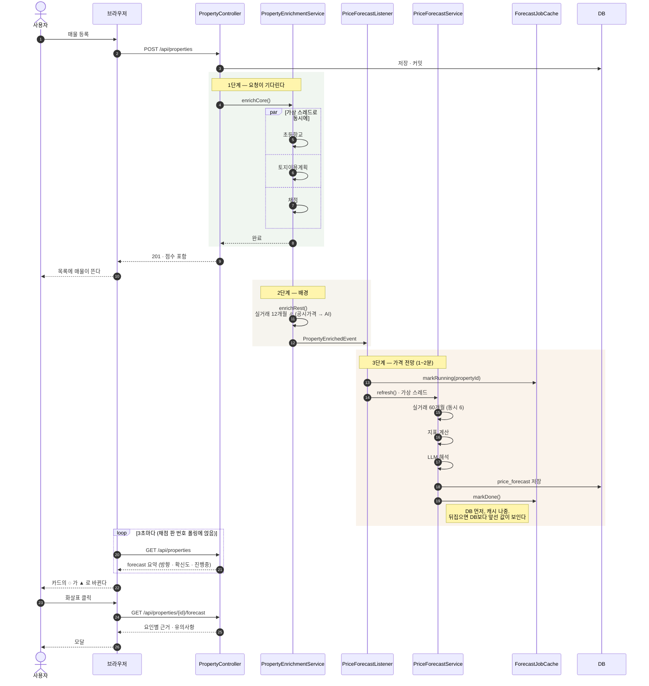

# 매물 가격 전망 — 구현 가능성과 설계 검토

> **검토 문서입니다. 구현하지 않았습니다.**
> 대상: "이 매물이 앞으로 오를지·내릴지·유지될지" 를 LLM으로 알려 주는 기능.

---

## 0. 먼저 — 이 기능의 성격

**이것은 투자 조언입니다.** 그 사실을 설계 전체가 인정하고 시작해야 합니다.

- 맞히면 사용자는 <b>이 앱을 근거로 수억 원을 움직입니다.</b>
- 틀리면 그 손실은 실재합니다.
- 그런데 <b>부동산 가격은 원리적으로 예측이 어렵습니다.</b> 금리·정책·공급·심리가
  얽혀 있고, 전문 기관도 방향을 자주 틀립니다.

그래서 **"오른다/내린다"를 단정하는 형태로 만들면 안 된다**는 것이 이 문서의 첫 결론입니다.
대신 만들 수 있는 것은 이것입니다.

> **가격에 영향을 주는 요인들을 모아 보여 주고, 각 요인이 어느 방향으로 작용하는지
> 근거와 함께 정리한다.** 판단은 사람이 합니다.

이 차이는 말장난이 아니라 **화면·프롬프트·저장 구조가 전부 달라지는** 갈림길입니다.

---

## 1. 구현 가능한가 — 재료부터 센다

### 1.1 이미 가지고 있는 것

| 재료 | 출처 | 예측에서의 쓸모 |
|---|---|---|
| 실거래가 12개월 | 국토부 RTMS | **가장 중요** — 최근 추세를 직접 보여 준다 |
| 공시가격 + 연도 | V-World | 시세 대비 공시가 비율, 보유세 부담 |
| 규제지역 여부 | 법제처 고시 | 대출·세제가 바뀌는 지점 |
| 토지이용계획 | V-World | 재건축·정비구역이면 성격이 아예 다르다 |
| 세대수·연식·주차 | 매물 | 단지 경쟁력 |
| 시장 금리 | 금감원 finlife | 자금 조달 비용 |
| 가계대출 금리 5년 | 한국은행 ECOS | **거시 국면** (I116에서 이미 붙였다) |
| 주변 시설·역세권 | 카카오 POI | 입지 |

**재료의 8할이 이미 있습니다.** 이 기능을 위해 새로 붙일 연동은 많지 않습니다.

### 1.2 있으면 크게 나아지는 것

| 재료 | 출처 | 난이도 | 비고 |
|---|---|---|---|
| **같은 단지 5년 실거래** | 국토부 RTMS | 낮음 | 지금 12개월인 조회 기간만 늘리면 된다 |
| 지역 매매가격지수 | 한국부동산원 R-ONE | 중간 | 시군구 단위 시계열. 개별 단지보다 안정적 |
| 전세가율 | R-ONE / 실거래 | 중간 | **가격 방향의 고전적 선행 지표** |
| 미분양 물량 | 국토부 통계누리 | 중간 | 공급 압력 |
| 입주 물량 | 부동산원 | 중간 | 2~3년 뒤 공급 |
| 기준금리 | 한국은행 ECOS | **낮음** | ECOS는 이미 붙어 있다 — 통계 코드만 추가 |
| **건축물대장** | 국토부 `getBrTitleInfo` | **낮음** | 연면적·대지면적·용적률. PNU를 이미 갖고 있다 (4-A.2) |
| 정비사업 단계 | 지자체별 포털 | 높음 | 전국 단일 API가 없다 (4-A.3) |

> **가장 값싼 개선은 실거래 조회 기간을 늘리는 것입니다.** 이미 붙은 API이고,
> 12개월로는 <b>추세를 말할 수 없습니다</b>(계절성 한 바퀴가 겨우 들어갑니다).
> 예측용으로는 별도 경로로 **36~60개월**을 받아 두는 것을 권합니다.

### 1.3 없는 것 — 그리고 없다고 말해야 하는 것

- **개별 단지의 미래 수급**: 알 수 없습니다
- **정책 변화**: 발표 전에는 알 수 없습니다
- **금리 경로**: 시장도 모릅니다

이것들이 결과를 좌우하는데 재료가 없다는 사실을, **결과 화면이 숨기면 안 됩니다.**

---

## 2. LLM을 어디에 쓰는가 — 역할을 좁힌다

### 2.1 LLM에게 시키면 안 되는 것

**숫자 계산을 시키지 마십시오.** 이 프로젝트는 이미 그 교훈을 얻었습니다(I59·I78).

- 실거래 평균·중앙값·변동률 → **코드로 계산**
- 전세가율·공시가 비율 → **코드로 계산**
- 금리 추세 → **코드로 계산**

LLM은 산술을 조용히 틀리고, 틀려도 그럴듯하게 씁니다. **검증 가능한 것은 코드로 구합니다.**

### 2.2 LLM에게 맡길 것 — 판단과 해석

> **계산된 지표들을 읽고 <b>방향을 판단</b>하고, 그 판단을 사람의 말로 설명하는 일.**

처음에는 "해석만" 맡기고 방향은 규칙으로 정하려 했습니다. **그 생각을 접었습니다.**

규칙으로 정하려면 임계값이 필요한데(`±2%`, `전세가율 70%`), 그 숫자에 근거가 없습니다.
"실거래가 주 신호, 나머지는 보조" 같은 위계도 마찬가지입니다 — <b>임의로 정한 규칙이
LLM의 판단보다 나을 이유가 없습니다.</b> 근거 없는 규칙은 객관적으로 보인다는 점에서
오히려 더 위험합니다.

**"숫자를 계산시키지 마라"와 "판단시키지 마라"는 다른 얘기입니다.**
전자는 지킵니다 — 중앙값·변동률은 전부 코드가 구합니다. 후자는 LLM에게 맡깁니다.

예를 들어 "실거래는 6개월째 하락인데 전세가율은 오르고 있다 — 매매 수요는 식었지만
실거주 수요는 남아 있다"처럼, <b>상충하는 신호를 저울질하는 일</b>이 LLM이 잘하는 것입니다.

### 2.2-A 코드가 못 박는 것 — LLM 판단에 맡기지 않는 것들

방향은 LLM이 정하지만, **판단의 문제가 아니라 사실의 문제인 것**은 코드가 강제합니다.

| 조건 | 강제 | 왜 |
|---|---|---|
| 실거래 표본 **3건 미만** | `UNCERTAIN` — LLM이 뭐라 하든 덮어쓴다 | 3건으로는 <b>누구도</b> 알 수 없다 |
| 지표를 하나도 못 구함 | **LLM을 부르지 않는다** | 재료 없이 물으면 일반론이 온다 |
| `direction`이 enum 밖 | `UNCERTAIN` | |
| `confidence`가 enum 밖 | `LOW` | 모르면 낮게 |
| `evidence`에 **우리가 주지 않은 숫자** | 그 factor를 버린다 | <b>근거를 지어내면 버립니다</b> |

> **마지막 항목이 환각을 잡는 실질적 장치입니다.** 프롬프트로 준 숫자 목록을 들고 있다가
> 출력의 숫자와 대조합니다. 없는 숫자를 인용했다면 그 요인은 화면에 올리지 않습니다.

#### 숫자는 절대 계산시키지 않는다

```
❌  "지난 5년 거래 내역이다. 추세를 계산해라"      ← 산술을 시킴
✅  "최근 3개월 중앙값 11.4억, 직전 12.1억 (−5.8%)"  ← 결과만 준다
```

프롬프트에 **원본 거래 목록을 넣지 않습니다.** 이미 계산된 값만 넣습니다.
LLM이 산술을 조용히 틀릴 여지를 없앱니다.

#### `temperature: 0`

판단 작업이라 흔들리면 안 됩니다. **지금 어댑터는 `temperature`를 보내지 않아
기본값(1.0)** 입니다 — `LlmMessage`에 항목을 더하고 전망은 `0`으로 보냅니다.
AI 추천도(서술)와 전망(판단)은 성질이 다르므로 호출자가 정합니다.

> 재현성은 **프롬프트 해시(I59)** 가 이미 지킵니다. 입력이 같으면 다시 묻지 않고
> 저장된 답을 그대로 씁니다 — 매물을 열 때마다 답이 바뀌지 않습니다.

---

### 2.3 출력 형태

```json
{
  "direction": "UP | DOWN | FLAT | UNCERTAIN",
  "confidence": "LOW | MEDIUM | HIGH",
  "horizonMonths": 12,
  "factors": [
    { "name": "실거래 추세", "effect": "DOWN", "weight": "HIGH",
      "evidence": "최근 6개월 중앙값 12.1억 → 11.4억 (-5.8%)" },
    { "name": "금리 국면", "effect": "UP", "weight": "MEDIUM",
      "evidence": "가계대출금리 5.5%(2023-01) → 3.4%(2026-01)" }
  ],
  "summary": "…",
  "caveats": ["정책 변화는 반영하지 못했습니다", "표본이 8건으로 적습니다"]
}
```

**`UNCERTAIN`을 1급 시민으로 둡니다.** 재료가 모자라면 모른다고 답할 수 있어야 합니다 —
선택지에 없으면 모델은 <b>반드시 셋 중 하나를 고릅니다.</b>

**`evidence`를 factor마다 강제합니다.** 근거 없는 요인은 화면에 띄우지 않습니다.
이 프로젝트가 금리·LTV·스트레스 금리에서 지켜 온 규칙과 같습니다(I81·I116).

**이것은 LLM의 출력입니다.** 저장할 때는 코드 예측을 함께 담습니다 — LLM에게는
넘기지 않지만(4.5) 화면과 사후 검증에는 필요합니다.

```json
{
  "direction": "UP",            // ← 결론. LLM 예측
  "codeDirection": "FLAT",      // ← 코드 예측. 화면의 농담을 가른다
  "agreed": false,
  "confidence": "LOW",
  ...
}
```

---

## 3. 아키텍처

### 3.1 기존 구조에 얹는다

새 개념을 만들지 않습니다. **AI 추천도(I59)와 같은 모양**으로 붙입니다.

```
domain/forecast/
  PriceFactor.java          한 요인 (이름 · 방향 · 비중 · 근거)
  PriceOutlook.java         종합 (방향 · 확신도 · 요인들 · 유의사항)
  ForecastDirection.java    UP · DOWN · FLAT · UNCERTAIN

domain/forecast/indicator/
  TradeTrendIndicator.java     실거래 추세 — 코드로 계산
  JeonseRatioIndicator.java    전세가율
  RateCycleIndicator.java      금리 국면 (ECOS)
  SupplyIndicator.java         공급 (미분양·입주)
  PriceIndicator.java          공통 인터페이스

application/event/
  PropertyEnrichedEvent.java   보정 2단계가 끝났다 (설계 I126)
  PriceForecastListener.java   그 이벤트를 받아 가상 스레드로 넘긴다

application/service/
  PriceForecastService.java    지표 계산 → 프롬프트 → LLM → 저장

adapter/outbound/persistence/
  PriceForecastRepository.java
```

`PriceIndicator`는 `CriterionScorer`와 같은 모양입니다 — **이 프로젝트가 이미 쓰는 패턴**이라
새로 배울 것이 없습니다.

### 3.2 LLM 포트는 그대로

`LlmPort`를 재사용합니다. 프롬프트만 다릅니다. 공급자 교체 가능성도 그대로 유지됩니다(I58).

### 3.3 언제 도는가

**AI 추천도와 같은 규칙을 씁니다**(I59·I110·I113).

| 시점 | 이유 |
|---|---|
| **보정 완료 이벤트** (`PropertyEnrichedEvent`) | 실거래·공시가격이 채워진 뒤라야 지표가 나온다. 자세히는 3-A.2 |
| 실거래가 갱신됐을 때 | 추세가 바뀐다 |
| 월 1회 | 금리·지수는 월 단위로 움직인다 |

**프롬프트 해시로 중복 호출을 막습니다**(I59와 동일). 지표가 그대로면 다시 묻지 않습니다.

### 3.4 저장

```sql
CREATE TABLE price_forecast (
    id              BIGINT GENERATED BY DEFAULT AS IDENTITY PRIMARY KEY,
    property_id     BIGINT NOT NULL REFERENCES property (id) ON DELETE CASCADE,
    direction       VARCHAR(20)  NOT NULL,   -- 결론 = LLM 예측
    code_direction  VARCHAR(20),               -- 코드 예측 (LLM에는 넘기지 않은 값)
    confidence      VARCHAR(20)  NOT NULL,
    horizon_months  INT          NOT NULL,
    summary         TEXT,
    factors         JSONB,          -- 요인 배열 (근거 포함)
    caveats         JSONB,
    model           VARCHAR(100),
    prompt_hash     VARCHAR(64),
    computed_at     TIMESTAMP WITH TIME ZONE NOT NULL
);
CREATE UNIQUE INDEX ux_price_forecast_property ON price_forecast (property_id);
```

> `JSONB`는 <b>읽을 때 타입을 못 박지 마십시오</b> — I117에서 겪은 그 함정입니다.

---

## 3-A. 실행 방식 — 언제 돌고 어떻게 화면에 닿나

### 3-A.1 왜 요청 안에서 못 하나

**60개월 실거래 조회가 60번의 외부 호출**입니다. 국토부 API는 한 번에 한 달치만 줍니다(I98).

```
순차 60회 × 0.3~1초  =  20~60초
```

등록 요청이 이걸 기다리면 **브라우저가 타임아웃**됩니다. 보정 앞 단계(I110)에 넣어도
`저장 중입니다…` 화면이 1분간 멈춥니다. **뒤로 빼야 합니다.**

### 3-A.2 보정 완료 이벤트로 트리거한다

보정은 이미 두 단계입니다(I110). 전망은 **세 번째**이고, **이벤트로 띄웁니다.**



**이벤트는 굵은 화살표 한 곳뿐입니다** — 2단계가 끝날 때만 발행됩니다.
등록 커밋 직후에 띄우면 1·2단계와 겹쳐 돕니다(아래).

#### 왜 '등록' 이벤트가 아니라 '보정 완료' 이벤트인가

**`PropertyCreatedEvent`(커밋 직후)로 띄우면 안 됩니다.** I110에서 이미 겪은 것입니다 —
커밋 직후에 뜬 작업이 <b>요청이 기다리는 앞 단계와 겹쳐 돌았습니다.</b>

전망도 같은 문제를 만납니다.

```
커밋 → PropertyCreatedEvent → 전망 시작 ─┐
                                        ├─ 겹친다
       앞 단계(채점) 진행 중 ─────────────┘
       2단계(공시가격) 진행 중 ───────────┘
```

- 공시가격이 아직 없는 상태로 지표를 계산합니다
- **같은 국토부 API를 2단계와 동시에 두드립니다** (12개월 + 60개월)

그래서 **2단계가 끝날 때 새 이벤트를 발행**합니다.

```java
// PropertyEnrichmentService.enrichRest() 끝
llmRecommendationService.clearPendingIfUnresolved(propertyId);
eventPublisher.publishEvent(new PropertyEnrichedEvent(propertyId));
```

```java
/**
 * 보정이 끝났으니 가격 전망을 낸다 (설계 I126).
 *
 * <p><b>등록 이벤트가 아니라 보정 완료 이벤트를 받습니다.</b> 커밋 직후에 시작하면
 * 요청이 기다리는 앞 단계와 겹쳐 돌고(I110), 공시가격이 없는 상태로 지표를 계산하며,
 * 같은 국토부 API를 2단계와 동시에 두드립니다.
 */
@Slf4j
@Component
public class PriceForecastListener {

    @Async("notificationExecutor")
    @EventListener
    public void onEnriched(PropertyEnrichedEvent event) {
        Thread.ofVirtual().name("forecast-" + event.propertyId()).start(() -> {
            try {
                priceForecastService.refresh(event.propertyId());
            } catch (RuntimeException e) {
                // 여기서 새어 나가면 가상 스레드가 조용히 죽어 아무 기록도 남지 않는다
                log.error("Price forecast failed. propertyId={}, cause={}",
                        event.propertyId(), e.toString(), e);
            }
        });
    }
}
```

> **`@TransactionalEventListener`가 아니라 `@EventListener`입니다.** 보정은 이미 커밋된
> 뒤 배경에서 도는 작업이라 <b>묶일 트랜잭션이 없습니다.</b> `AFTER_COMMIT`을 걸면
> 트랜잭션 밖에서 발행된 이벤트가 <b>조용히 버려집니다</b>.

#### 이벤트로 두는 값어치

- **결합이 느슨해집니다.** 나중에 보정 완료에 다른 후속 작업(알림·통계)을 붙일 때
  `PropertyEnrichmentService`를 건드리지 않습니다.
- **끄기 쉽습니다.** 리스너 하나를 빼면 전망만 멈춥니다.
- 다만 **순서 보장은 발행 시점이 책임집니다** — 이벤트를 어디서 쏘는지가 설계의 핵심입니다.
  "이벤트니까 알아서 순서가 맞겠지"는 틀립니다.

### 3-A.3 60개월을 어떻게 빨리 받나

**`VirtualThreadGate`를 그대로 씁니다**(I108). 이미 있는 장치입니다.

```java
final List<Callable<List<ReferenceTrade>>> tasks = months.stream()
        .map(m -> (Callable<List<ReferenceTrade>>) () -> ministryReferencePort.fetchTrades(lawdCd, m))
        .toList();
final List<List<ReferenceTrade>> results = gate.runAll(tasks);
```

세마포어가 **앱 전체의 동시 실행 수**를 묶으므로(기본 400), 매물 여러 건이 동시에
등록돼도 국토부에 요청이 몰리지 않습니다.

> **다만 전망 전용 상한을 따로 두십시오.** 60건을 한 번에 던지면 공공 API가 429를 줍니다.
> `forecast.max-concurrency`(기본 **6**) 정도로 <b>별도 세마포어</b>를 권합니다 —
> 전체 상한과 같은 값을 쓰면 전망 하나가 다른 보정을 다 밀어냅니다.

```
동시 6으로 60회  ≈  10회 × 0.3~1초  =  3~10초
```

**캐시가 듣습니다.** 같은 법정동·같은 달은 매물이 달라도 같은 결과입니다.
`reference_transaction`에 이미 저장하고 있으므로, **이미 받은 달은 건너뜁니다.**
두 번째 매물부터는 훨씬 빨라집니다.

### 3-A.4 결과를 화면에 실시간으로

**새 방식을 만들지 않습니다.** 이 앱에는 이미 검증된 장치가 둘 있습니다.

| 장치 | 주기 | 쓰는 곳 |
|---|---|---|
| `LlmJobCache` RUNNING 마커 + 폴링 | 2초 | AI 추천도 (I72) |
| 채점 판 번호(`scoreVersion`) 폴링 | 3초 | 목록 전체 (I85) |

전망은 **AI 추천도와 같은 모양**을 씁니다.

```
1. 3단계 시작        →  ForecastJobCache.markRunning(propertyId)
                        화면: 진행 막대 + "가격 전망을 분석 중입니다…"
2. 결과 저장          →  DB 먼저, 그다음 캐시 (순서가 뒤집히면 DB보다 앞선 값이 보인다)
3. 화면 폴링이 잡음   →  진행 막대 끄고 결과 렌더
4. 실패·키 없음       →  마커를 지운다. 켜 둔 채 두면 화면이 영영 돈다 (I109)
```

**진행 표시는 3단계가 시작될 때 켭니다**(I109에서 배운 것). 실제 LLM 호출 직전에 켜면
그 앞 수십 초 동안 화면은 "아직 산출되지 않았습니다"를 띄우고 <b>폴링도 시작하지 않습니다.</b>

```js
const FORECAST_POLL_INTERVAL_MS = 3000;
const FORECAST_POLL_MAX_ATTEMPTS = 60;   // 3초 x 60 = 3분이면 그만 본다
```

#### 전체 흐름 — 화면이 어떻게 결과를 받나



> **폴링이 매물마다 따로 묻지 않습니다.** 목록 응답에 전망 요약이 이미 실려 오므로,
> 채점 판 번호 폴링(I85)에 얹으면 <b>추가 요청이 없습니다.</b>

#### SSE·WebSocket은 쓰지 않습니다

"실시간"에 더 맞아 보이지만 이 앱에는 맞지 않습니다.

- **커넥션을 붙잡습니다.** Hikari 풀을 5로 줄인 마당에(I125), 사용자마다 열린 연결을
  유지하는 구조는 <b>반대 방향</b>입니다.
- Redis가 지금 불안정합니다. 다중 인스턴스에서 SSE로 밀려면 <b>브로커가 필요</b>합니다.
- 폴링 3초는 이 용도에 충분합니다. 결과가 1~2분 걸리는 일에 <b>3초 지연은 의미가 없습니다.</b>

> 사용자 몇 명이 쓰는 사설 앱입니다. **폴링이 이미 두 곳에서 잘 돌고 있고**,
> 세 번째를 같은 방식으로 붙이는 것이 새 기술을 들이는 것보다 안전합니다.

### 3-A.5 언제 다시 도나

| 계기 | 어떻게 |
|---|---|
| 매물 등록 | `PropertyEnrichedEvent` — 보정 2단계가 끝날 때 |
| 매물 수정 | 같은 이벤트. 수정도 보정을 다시 타면 자연히 걸린다 |
| 실거래가 갱신 | 추세가 바뀐다 |
| 월 1회 배치 | 금리·지수가 월 단위로 움직인다 |
| 사용자가 `다시 분석` | 명시적으로 원할 때 |

**프롬프트 해시로 중복을 막습니다**(I59). 지표가 그대로면 LLM을 다시 부르지 않습니다 —
60개월 조회는 캐시가 받고, LLM은 해시가 받습니다.

### 3-A.6 실패했을 때

| 실패 | 화면 |
|---|---|
| 국토부 조회 실패 | 받은 달까지로 계산하되 <b>표본 수를 밝힌다</b> |
| 표본 3건 미만 | `UNCERTAIN` — 판단하지 않는다 |
| LLM 실패·키 없음 | <b>지표는 그대로 보여 준다.</b> 해석만 빠진다 |

**LLM이 죽어도 지표는 나옵니다.** 이게 2~3단계를 먼저 만들라는 이유입니다 —
"최근 6개월 중앙값이 12.1억에서 11.4억으로 내렸습니다"는 LLM 없이도 참이고 유용합니다.

---

## 4. 지표 계산 — 비즈니스 로직

### 4.1 실거래 추세

```
최근 3개월 중앙값 vs 직전 3개월 중앙값 → 변동률
표본 3건 미만이면 → 판단하지 않음(UNCERTAIN)
```

**중앙값을 씁니다.** 평균은 대형 평형 한 건에 끌려갑니다.
**면적대를 맞춥니다** — 같은 단지라도 84㎡와 115㎡는 다른 시장입니다(I54에서 이미 배운 것).

### 4.2 전세가율

```
전세가율 = 전세 실거래 중앙값 / 매매 실거래 중앙값
```

높으면(70%+) 실거주 수요가 받쳐 하방이 단단하고, 낮으면(50% 미만) 매매가에 기대가
많이 실려 있다는 뜻입니다. **둘 다 방향을 단정하진 못합니다** — 요인의 하나일 뿐입니다.

### 4.3 금리 국면

ECOS 가계대출금리(I116에서 이미 받고 있습니다)의 최근 12개월 기울기.
내려가는 국면은 매수 여력을 키웁니다.

### 4.4 규제·정비

규제지역이면 대출이 조이고, 정비구역이면 <b>일반적인 시세 논리가 통하지 않습니다.</b>
후자는 지표로 재지 말고 **"이 매물은 정비사업 진행 상황이 가격을 좌우합니다"** 라고
말해 주는 편이 정직합니다.

### 4.5 방향은 LLM이 정한다 — 다만 코드도 따로 낸다

지표를 하나의 점수로 **합산하지 않습니다.** 가중치의 근거가 없고, 합산하는 순간
그 임의의 숫자가 <b>객관적 예측처럼</b> 보입니다.

대신 **둘이 각자 예측하고, 서로 보지 않습니다.**

```
        지표 계산 (코드)
              │
      ┌───────┴───────┐
      ▼               ▼
  코드 예측         LLM 예측        ← 코드 예측을 LLM에 넘기지 않는다
  (규칙 기반)      (판단 기반)
      └───────┬───────┘
              ▼
        결론 = LLM 예측
        표기 = 둘의 일치 여부
```

#### 코드 예측을 LLM에 넘기지 않는 이유

**앵커링을 막습니다.** "코드는 상승으로 봤다"를 먼저 보여 주면 모델은 그 쪽으로 끌려갑니다.
그러면 두 예측이 <b>독립이 아니게 되고</b>, 일치해도 아무 정보가 없습니다.

눈가림 2차 소견이라야 **일치 여부가 신호로서 값어치**를 가집니다.

#### 결론은 LLM이 이긴다

임계값 기반 코드 예측은 <b>맥락을 못 봅니다</b> — 표본 8건 중 하나가 이상치인지,
재건축 초기라 기대가 실린 값인지 규칙은 구분하지 못합니다. 그래서 **결론은 LLM 예측**입니다.

#### 일치 여부는 버리지 않는다

코드 예측은 결론에서 지지만 <b>사라지지 않습니다.</b> 둘이 갈리면 그 사실을
**화면에 색의 농담으로** 드러냅니다(5.1). 감춰 두면 사용자는 그 판단이 얼마나
단단한지 알 수 없습니다.

**둘 다 저장합니다.** 나중에 실제 결과와 맞춰 보면(10단계) <b>어느 쪽이 더 맞았는지</b>
알 수 있습니다 — 이 데이터가 없으면 그 검증 자체가 불가능합니다.

> **코드 예측의 임계값은 여전히 임의입니다.** 결론을 정하지는 않지만 화면의 농담을
> 가르므로, `regulation_param`에 두고 <b>조정 가능하게</b> 합니다.

---

## 4-A. 토지이용계획을 더 판다

지금은 V-World가 주는 **35건 중 3개 키워드**만 주목 표시합니다(I69).
`토지거래계약에관한허가구역` · `정비구역` · `개발행위허가제한지역`.

가격 전망에는 **이것으로 부족합니다.** 아래를 구조화된 칸으로 뽑아야 합니다.

### 4-A.1 용도지역 — 재건축 사업성의 뿌리

`conflict == INCLUDED`인 항목 중 `…주거지역`·`…상업지역`으로 끝나는 것 **하나**가
그 필지에 실제 적용되는 용도지역입니다. 지금은 목록에 섞여 있을 뿐 따로 뽑지 않습니다.

| 용도지역 | 용적률 상한(예시) | 뜻 |
|---|---|---|
| 제1종일반주거 | 150% | 저층. 재건축 사업성이 거의 없다 |
| 제2종일반주거 | 200~250% | |
| 제3종일반주거 | 250~300% | 아파트 재건축의 주 무대 |
| 준주거 | 400% | 사업성이 크게 좋아진다 |

> **상한값을 코드에 박지 마십시오.** 용적률은 <b>지자체 조례</b>로 정합니다.
> `regulation_param`에 `landuse.far.제3종일반주거` 식으로 두고, 지역별로 다를 수 있음을
> 화면에 밝히는 편이 정직합니다 (I35·I97과 같은 방식).

**뽑아야 할 칸**: `zone_category`(용도지역명), `far_limit`(조례 상한).

### 4-A.2 용적률 여유 — "얼마나 더 지을 수 있나"

```
용적률 여유 = 조례 상한 − 현재 용적률
```

**현재 용적률을 정확히 구하려면 연면적이 필요한데 지금 없습니다.** 다만 근사는 가능합니다.

- 갖고 있는 것: 세대수 · 총층수 · 건물동수 · 전용면적
- 없는 것: 대지면적 · 연면적

> **근사값을 정확한 값처럼 보여 주지 마십시오.** `약 180% 추정`처럼 <b>추정임을 이름에 넣고</b>,
> 대지면적을 못 구하면 이 지표는 <b>내지 않습니다.</b> 재건축 사업성은 이 앱에서 가장
> 크게 틀릴 수 있는 숫자입니다.

**필요한 추가 연동**: 건축물대장(국토부 `getBrTitleInfo`) — 연면적·대지면적·건폐율·용적률이
**그대로 들어 있습니다.** PNU를 이미 갖고 있으므로(I54) 붙이기 어렵지 않습니다.
**이것이 토지이용계획을 파는 가장 값싼 한 걸음입니다.**

### 4-A.3 정비사업 단계 — 미래가 얼마나 이미 값에 들어갔나

`정비구역`이라는 사실만으로는 부족합니다. **단계에 따라 가격의 성격이 완전히 다릅니다.**

```
정비구역 지정  →  조합설립  →  사업시행인가  →  관리처분인가  →  이주·철거  →  준공
   기대만          윤곽        비용 확정        분담금 확정
```

- **초기(지정~조합설립)**: 무산 위험이 크고 기대가 값에 얹혀 있다
- **중기(사업시행인가)**: 사업비 윤곽이 나와 불확실성이 크게 준다
- **후기(관리처분 이후)**: 분담금이 확정돼 <b>실질 매수가가 호가와 다르다</b>

**V-World 토지이용계획에는 단계가 없습니다.** 별도 출처가 필요합니다.

| 출처 | 내용 |
|---|---|
| 정비사업 정보몽땅 (서울) | 서울시 정비사업 단계·조합 정보 |
| 각 지자체 정비사업 포털 | 서울 밖은 흩어져 있다 |
| 국토부 정비사업 통계 | 집계 수준이라 개별 구역엔 약하다 |

> **전국 단일 API가 없습니다.** 서울만 되는 연동을 붙이고 <b>서울 밖은 "확인 필요"로
> 비워 두는</b> 편이, 없는 데이터를 추정으로 채우는 것보다 낫습니다.

### 4-A.4 지구단위계획구역 — 계획이 잡혀 있다는 신호

지금 주목 키워드에 없습니다. 지구단위계획구역이면 **개발 방향이 이미 정해져 있다는 뜻**이라
가격 전망에 의미가 있습니다. 키워드에 추가하되, `INCLUDED`일 때만 봅니다.

### 4-A.5 토지거래허가구역 — 유동성

이미 주목 표시하고 있습니다(I69). 전망 관점에서는 **거래량을 줄이는 요인**입니다 —
실거주 의무가 붙어 갭투자가 막히고, 매수자 풀이 좁아집니다.
**"나쁘다"가 아니라 "거래가 얇다"**로 읽어야 합니다. 표본이 적으면 추세 판단도 흔들립니다.

### 4-A.6 정리 — 무엇을 더 붙이나

| 순위 | 할 일 | 새 연동 | 효과 |
|---|---|---|---|
| 1 | 용도지역을 구조화된 칸으로 추출 | **없음** (이미 받는 35건 안에 있다) | 재건축 사업성의 뿌리 |
| 2 | 건축물대장 연동 (연면적·대지면적·용적률) | 국토부 1건 | 용적률 여유를 <b>추정 아닌 실측</b>으로 |
| 3 | 지구단위계획구역을 주목 키워드에 추가 | **없음** | |
| 4 | 정비사업 단계 (서울부터) | 지자체별 | 가장 크게 값을 가르지만 전국 커버가 안 된다 |

**1과 3은 새 연동이 없습니다.** 이미 받아 놓고 안 쓰던 데이터입니다.

---

## 4-B. 언론 기사·개발 호재는 어떻게 다루나

**결론부터: 점수에 넣지 않습니다. 링크 목록으로만 보여 줍니다.**

```
[관련 기사]  ※ 검증하지 않은 외부 기사입니다
· 2026-07-12  ◯◯역 복합환승센터 착공 …   (한국경제)
· 2026-05-03  ◯◯지구 정비구역 지정 고시   (연합뉴스)
```

### 왜 요인으로 쓰지 않나

1. **부동산 기사는 이해관계자가 만듭니다.** 중개업소·건설사·지역 커뮤니티가 소스인 경우가
   많고, "호재" 기사는 거의 항상 매수 유도 방향입니다.
2. **프롬프트 주입.** 웹 내용을 LLM에 먹이면 그것은 <b>신뢰할 수 없는 입력</b>입니다.
   페이지에 지시문이 섞여 있으면 모델이 따라갈 수 있고, 이 앱에서 그 출력은
   수억 원짜리 판단에 들어갑니다. 공적 API와는 성격이 완전히 다릅니다.
3. **프롬프트 해시와 충돌합니다.** 검색 결과는 매번 바뀌어 해시가 항상 달라지고,
   그러면 <b>매번 LLM을 부릅니다</b>(I59의 중복 방지가 무력화됩니다).

### 지금 LLM은 검색을 못 합니다

`ClaudeLlmAdapter`는 `model`·`max_tokens`·`messages`만 보냅니다 — 도구 설정이 없습니다.
**그런데도 물어보면 그럴듯한 답을 씁니다.** 검색하지 않고 "◯◯역 개발 호재가 있습니다"라고
쓰는 것 — 환각입니다. 검색을 붙이지 않은 채 뉴스를 묻는 것이 **가장 나쁜 선택**입니다.

붙인다면 셋 중 하나입니다.

| 방법 | 성격 |
|---|---|
| Anthropic `web_search` 도구 | 어댑터에 도구 설정 추가. 결과가 매번 달라진다 |
| 네이버 검색 API (뉴스) | 한국 부동산 기사에 강하고 <b>결정적이라 캐시된다</b> |
| 공적 자료 | 위 4-A. <b>기사보다 정확하고 이해관계가 없다</b> |

**개발 호재는 뉴스보다 4-A가 낫습니다.** 정비구역 지정·지구단위계획은 공적 고시라
날짜가 명확하고 이해관계가 없습니다. 기사는 그 고시를 <b>해석한 것</b>일 뿐입니다.

---

## 5. 화면 — 목록은 화살표 하나, 상세는 모달

### 5.1 매물 카드 — 화살표 하나뿐

목록에는 **매물 이름 오른쪽에 화살표 하나만** 붙입니다. 목록은 여러 매물을 견주는 자리라
전망을 길게 쓰면 다른 정보를 밀어냅니다.

| 예측 | 화살표 | 색 | 뜻 |
|---|---|---|---|
| `UP` | ▲ | **빨강** | 오를 것으로 봄 |
| `DOWN` | ▼ | **파랑** | 내릴 것으로 봄 |
| `FLAT` | ▶ | **검정** | 횡보 |
| `UNCERTAIN` | *(없음)* | — | **아무것도 띄우지 않는다** |
| 분석 중 | ◌ | 회색·깜빡임 | 3단계가 도는 중 |

```
측정단지 3차 ▲   🚩 임장완료   11억 4,000만원
```

> **한국 관습을 따릅니다** — 상승이 빨강, 하락이 파랑. 서구권과 반대라 헷갈릴 수 있지만
> 이 앱은 한국 부동산만 다룹니다.

> **`UNCERTAIN`은 회색 화살표를 쓰지 않습니다.** 아무것도 안 띄웁니다. 회색 화살표를 두면
> "약한 전망"으로 읽히는데, 실제로는 <b>판단하지 않았다</b>는 뜻입니다. 둘은 다릅니다.

색만으로 구분하지 않도록 **모양도 다릅니다**(▲▼▶). 색각 이상이 있어도 방향이 읽힙니다.
`title` 속성으로 `가격 전망: 상승 (확신도 낮음)`을 답니다.

> **⏳ 결론 = LLM 예측, 농담 = 코드와의 일치 여부** — 뼈대는 정해졌지만
> 아래 네 가지가 아직 미정입니다. 정해지면 이 절을 다시 씁니다.
>
> 1. **횡보(검정)의 연한 색** — 연한 검정은 회색인데, 회색 ◌ 는 이미 '분석 중'입니다
> 2. **색각 이상** — 농담은 색상보다 구분이 <b>더</b> 어렵습니다. 색 말고 다른 채널이 필요합니다
> 3. **`confidence`와 일치 여부** — 신뢰 신호가 둘입니다. 무엇이 화살표를 가릅니까
> 4. **`UNCERTAIN` 조합** — 코드 UP · LLM UNCERTAIN이면 화살표가 사라집니다. 맞습니까

### 5.2 화살표를 누르면 모달

```
┌─ 가격 전망 ─────────────────────────────────┐
│  ▲ 상승    확신도 낮음    향후 12개월        │
│                                             │
│  실거래 추세      ▲  높음                    │
│    최근 6개월 중앙값 10.8억 → 11.4억         │
│  전세가율         ▲  보통                    │
│    62% → 68% (실거주 수요 유지)              │
│  금리 국면        ▲  보통                    │
│    가계대출 5.5%(2023-01) → 3.4%(2026-01)    │
│  용적률 여유      ▶  낮음                    │
│    제3종일반주거 상한 300% · 현재 약 240%     │
│                                             │
│  ⚠ 정책 변화는 반영하지 못했습니다            │
│  ⚠ 실거래 표본이 8건으로 적습니다             │
│                                             │
│  이 전망은 예측일 뿐이며 실제 결과와          │
│  괴리가 있을 수 있습니다. 투자 판단의         │
│  근거로 삼지 마십시오.                        │
│                                    [닫기]    │
└─────────────────────────────────────────────┘
```

- **요인별 근거를 접지 않고 펼쳐 둡니다.** 결론만 크게 띄우면 근거를 아무도 안 봅니다.
- 모달은 **배경 클릭으로 닫히지 않습니다**(I122). Esc 또는 닫기.
- 열 때 `GET /api/properties/{id}/forecast`로 **다시 읽습니다**(I112) — 목록을 받아 둔
  시점과 지금이 다를 수 있습니다.
- 면책 문구는 **모달 안에 항상** 있습니다. 접거나 숨기지 않습니다.

### 5.3 실시간 전달 — 화살표가 스스로 나타난다

3단계가 도는 동안 카드에는 **회색 ◌**가 깜빡이고, 결과가 나오면 **화살표로 바뀝니다.**
사용자가 새로고침할 필요가 없습니다.

```
등록 직후        측정단지 3차 ◌      (분석 중)
1~2분 뒤         측정단지 3차 ▲      (자동으로 바뀜)
```

폴링으로 구현합니다(3-A.4). 매물마다 따로 묻지 않고 **목록에 이미 실려 오는 값**을 씁니다 —
채점 판 번호 폴링(I85)이 3초마다 목록을 갱신하므로, 전망 결과도 <b>그 흐름에 얹으면
추가 요청이 없습니다.</b>

> **`ScoredPropertyResponse`에 `forecast` 요약(방향·확신도·진행중 여부)을 넣습니다.**
> 상세는 모달을 열 때만 받습니다. 목록에 요인 전체를 실으면 응답이 무거워집니다.

---

## 5-A. 더 볼 만한 자료들

앞에서 다룬 것(실거래·전월세·건축물대장·ECOS·토지이용계획) 외에, **검토해 볼 값어치가
있는** 것들입니다. 전부 붙이라는 뜻이 아닙니다 — 아래 순서로 값어치가 떨어집니다.

### 권할 만함

| 자료 | 출처 | 왜 |
|---|---|---|
| **공동주택 단지 정보 (K-apt)** | 공동주택관리정보시스템 | 세대수·준공일·난방·주차대수·**관리비**. 지금 붙여넣기로 긁는 값들을 <b>공적 자료로 검증</b>할 수 있다 |
| **장기수선충당금 (K-apt)** | 위와 같음 | 적립액이 적으면 재건축·대수선 때 <b>분담금이 커진다.</b> 아무도 안 보는데 실제로 돈이 드는 항목 |
| **매매·전세 가격지수** | 한국부동산원 R-ONE | 시군구 단위 시계열. 개별 단지 실거래보다 <b>표본이 두꺼워</b> 추세가 안정적이다 |
| **미분양·입주 물량** | 국토부 통계누리 / 부동산원 | 2~3년 뒤 공급. <b>전망에서 가장 선행하는 지표</b> |
| **상권 정보** | 소상공인시장진흥공단 | 업종별 점포 수·변화. 카카오 POI는 <b>지금 무엇이 있나</b>만 알려 주는데, 이건 <b>늘고 있나 줄고 있나</b>를 알려 준다 |

**K-apt가 가장 값쌉니다.** 이미 갖고 있는 필드(세대수·주차)를 검증하고, **관리비와
장기수선충당금은 지금 아예 없는 정보**입니다. 매수 뒤 실제로 나가는 돈인데 화면에 없습니다.

### 조건부

| 자료 | 문제 |
|---|---|
| 지하철 개통 계획 | 국가철도공단. **계획은 자주 미뤄집니다.** "예정"을 확정처럼 보여 주면 위험 |
| 인구 이동 (KOSIS) | 시군구 단위라 단지에 닿지 않는다. 지역 전체 방향에는 쓸 만하다 |
| 학군 (학교알리미) | 학업성취도는 <b>민감한 정보</b>다. 이 앱이 다룰 성격인지 먼저 정해야 한다 |

### 권하지 않음

| 자료 | 왜 |
|---|---|
| 부동산 커뮤니티·카페 | 이해관계자가 만든 글. <b>가장 편향이 심한 소스</b> |
| 중개업소 시세 | 호가지 실거래가 아니다. 이미 KB시세를 받고 있다 |
| 유튜브·블로그 | 위와 같고, 검증할 방법이 없다 |

### 그런데 — 자료를 늘리는 것이 답이 아닙니다

지금 재료로도 **실거래 추세 · 전세가율 · 금리 국면 · 용적률 여유** 네 요인이 나옵니다.
전문 기관도 이 정도를 봅니다.

> **요인을 열 개로 늘리면 정확해지는 게 아니라 <b>틀린 이유를 찾기 어려워집니다.</b>**
> 네 개로 시작해서 <b>어느 요인이 실제로 맞았는지</b> 기록하고(6장 5번), 안 맞는 것을
> 덜어내는 편이 낫습니다. 늘리는 것보다 <b>검증하는 것</b>이 먼저입니다.

---

## 6. 반드시 지킬 것

1. **총점에 넣지 않습니다.** 채점 항목으로 만들면 "전망 좋음"이 추천 순위를 밀어 올립니다.
   전망은 <b>따로 보는 정보</b>여야 합니다.
2. **`UNCERTAIN`을 기본값으로 둡니다.** 재료가 모자라면 모른다고 답합니다.
3. **근거 없는 요인은 띄우지 않습니다.**
4. **면책 문구를 화면에서 지우지 않습니다.**
5. **틀린 전망을 남겨 둡니다.** 과거 전망과 실제 결과를 함께 보여 주면
   사용자가 이 기능을 얼마나 믿을지 스스로 판단합니다 — **가장 정직한 설계입니다.**

---

## 7. 단계

| 단계 | 내용 | 새 연동 | 비고 |
|---|---|---|---|
| **0** | **`LlmMessage`에 `temperature` 추가** | 없음 | 전망은 0. 지금은 기본값 1.0이 나간다 |
| 1 | 실거래 60개월 확보 — 3단계 배경 작업 + 게이트 | 없음 | 3-A |
| 2 | `TradeTrendIndicator` — 코드로만, LLM 없이 | 없음 | **여기까지만 해도 쓸모가 있습니다** |
| 3 | 화면에 추세 + 진행 막대 · 폴링 | 없음 | 3-A.4 |
| 4 | **용도지역 구조화 · 지구단위계획 키워드** | 없음 | 4-A.1 · 4-A.4 — 이미 받아 놓고 안 쓰던 데이터 |
| 5 | 전세가율 · ECOS 금리 국면 | 없음 | 전세 실거래도 국토부에 있다 |
| 6 | 건축물대장 → 용적률 여유 | 국토부 1건 | 4-A.2 |
| 7 | LLM 종합 해석 | 없음 | 지표가 갖춰진 뒤에 |
| 8 | 관련 기사 링크 목록 (점수 미반영) | 네이버 검색 | 4-B |
| 9 | 정비사업 단계 (서울부터) | 지자체별 | 4-A.3 — 커버가 안 되는 지역은 비워 둔다 |
| 10 | 과거 전망 대비 실제 결과 | 없음 | |

**1~5는 새 연동이 하나도 없습니다.** 이미 붙은 API와 이미 받아 놓고 안 쓰던 데이터입니다.

**2~3단계에서 멈춰도 됩니다.** "최근 6개월 중앙값이 12.1억에서 11.4억으로 내렸습니다"는
그 자체로 유용하고, <b>틀릴 수 없는 사실</b>입니다. LLM은 그 위에 얹는 선택지입니다.

---

## 8. 권고

**5단계(LLM 종합)를 먼저 만들고 싶은 유혹을 참으십시오.** 가장 화려하지만
지표가 없으면 LLM은 <b>일반론</b>을 씁니다 — "금리와 정책에 따라 달라질 수 있습니다" 같은,
읽어도 아무것도 알 수 없는 문장입니다.

지표를 먼저 만들면 LLM 없이도 쓸 수 있고, LLM을 붙였을 때 답이 <b>구체적</b>이 됩니다.
