# DB 스키마

> **원본은 `src/main/resources/schema.sql` 입니다.** 이 문서는 그것을 읽기 쉽게 옮긴 것이고,
> 둘이 어긋나면 SQL이 맞습니다. 운영 DDL은 [`DDL.sql`](./DDL.sql),
> 뒤처진 운영 DB를 맞추는 것은 [`DDL-repair.sql`](./DDL-repair.sql) 입니다.

31개 테이블입니다. **관계는 대부분 `property_id` 로 모입니다** — 이 앱이 하는 일이
매물 하나를 여러 각도에서 재는 것이라 그렇습니다.

---

## 관계도

```mermaid
erDiagram
    user_group  ||--o{ users            : "속한다"
    user_group  ||--o{ property         : "격리 단위"
    user_group  ||--o{ group_invite     : "초대"
    users       ||--o{ user_debt        : "기존 부채"
    users       ||--o{ property_comment : "쓴다"
    users       ||--o{ user_criterion_score : "쾌적함을 매긴다"
    users       ||--o{ commute_result   : "직장에서의 통근"
    users       ||--o{ property_visit   : "다녀왔다"

    property ||--o{ property_score        : "항목별 점수"
    property ||--o{ property_image        : "평면도·사진"
    property ||--o{ property_agent        : "중개사 연결"
    property ||--o{ property_comment      : "코멘트"
    property ||--o{ property_opinion      : "장단점"
    property ||--o{ user_criterion_score  : "사람별 쾌적함"
    property ||--o{ commute_result        : "사람별 통근"
    property ||--o{ property_visit        : "사람별 방문"
    property ||--o{ reference_transaction : "참고 실거래"
    property ||--o{ loan_estimate         : "대출 계산 결과"
    property ||--o{ land_use              : "토지이용계획"
    property ||--o| llm_recommendation    : "AI 추천도"
    property ||--o| comparative_analysis  : "비교 우위"
    property ||--o| price_forecast        : "현재 전망"
    property ||--o{ price_forecast_history: "전망 이력"
    property ||--o{ listing_check_log     : "생존 확인(폐지)"
    property ||--o{ notification_log      : "알림 기록"

    agent     ||--o{ property_agent : "연결"
    criterion ||--o| criterion_weight : "가중치"
    criterion ||--o{ property_score   : "무엇을 잰 점수인가"
    criterion ||--o{ user_criterion_score : "사람이 매긴 항목"

    user_group {
        bigint id PK
        varchar name
        varchar slack_webhook_url "그룹마다 다르다"
    }
    users {
        bigint id PK
        varchar login_id UK
        varchar nickname UK
        bigint group_id FK
        varchar role "ADMIN · MEMBER"
        decimal workplace_lat "직주근접의 기준점"
        bigint available_budget "그룹 합산에 들어간다"
    }
    property {
        bigint id PK
        bigint group_id FK "격리의 축"
        varchar name
        varchar deal_type "SALE · JEONSE"
        bigint price_deposit
        decimal area_exclusive_m2 "실거래 매칭의 열쇠"
        decimal lat
        decimal lng
        varchar listing_status "ACTIVE · SOLD_OUT · ARCHIVED"
        varchar source_type "PASTE · MANUAL"
        text raw_paste_text "다시 파싱할 수 있게 원문을 둔다"
    }
    property_score {
        bigint id PK
        bigint property_id FK
        varchar criterion_code FK
        numeric auto_score "계산된 값"
        numeric manual_score "사람이 덮어쓴 값"
        numeric effective_score "실제로 쓰는 값"
        varchar score_source "AUTO · MANUAL · FALLBACK"
    }
    criterion_weight {
        varchar criterion_code PK
        int priority_rank "순위가 가중치를 정한다"
        numeric weight "3.0 - (rank-1)*0.2, 하한 0.2"
    }
    price_forecast {
        bigint id PK
        bigint property_id FK
        varchar direction "UP · DOWN · FLAT · UNCERTAIN"
        varchar code_direction "규칙 예측 — 갈리면 화면이 말한다"
        varchar confidence
        jsonb factors
    }
    monthly_trade_cache {
        varchar lawd_cd PK
        varchar deal_ym PK
        varchar deal_type PK
        jsonb payload "한 달치 거래 통째로"
    }
```

> `regulation_param` · `regulated_area` · `legal_dong_code` · `regulation_notice` ·
> `system_config` 는 **매물에 딸리지 않는 참조·설정 표**라 위 그림에서 뺐습니다.
> 아래 표에는 있습니다.

---

## 표별 요약

### 사람과 그룹

| 표 | 무엇을 담나 | 열쇠 | 알아 둘 것 |
|---|---|---|---|
| `user_group` | 함께 보는 단위 | `id` | Slack 웹훅이 **그룹마다** 있습니다 (설계 I96) |
| `users` | 계정 | `id` · `login_id` UK · `nickname` UK | 탈퇴해도 **닉네임은 남깁니다** (I88). 직장 좌표가 직주근접의 기준점 |
| `user_debt` | 기존 부채 | `id` | 대출 한도 계산에 들어갑니다 |
| `group_invite` | 초대 코드 | `code` | 만료가 있습니다 |

### 매물

| 표 | 무엇을 담나 | 열쇠 | 알아 둘 것 |
|---|---|---|---|
| `property` | 매물 본체 (53열) | `id` | `group_id` 가 **격리의 축** (I87). `raw_paste_text` 로 다시 파싱할 수 있습니다 |
| `property_image` | 평면도·사진 | `id` | `image_type` 이 `FLOOR_PLAN`·`PHOTO`. 평면도는 매물당 하나 (I63) |
| `agent` · `property_agent` | 중개사 | `id` / (매물,중개사) | 여러 매물이 한 중개사를 씁니다 |
| `property_opinion` | 장단점 메모 | `id` | |
| `property_comment` | 코멘트 | `id` | 사람당 매물 하나에 **한 건** (I56). 고쳐 씁니다 |
| `property_visit` | 다녀온 곳 | (매물,사람) UK | 쾌적함 채점과 **합쳐서** 봅니다 (I226) |

### 채점

| 표 | 무엇을 담나 | 열쇠 | 알아 둘 것 |
|---|---|---|---|
| `criterion` | 채점 항목 | `code` | 14개 |
| `criterion_weight` | 항목 가중치 | `criterion_code` | **순위가 가중치를 정합니다** — `3.0 − (rank−1)×0.2`, 하한 0.2 (I29) |
| `property_score` | 항목별 점수 | `id` | `auto`·`manual`·`effective` 셋을 따로 둡니다. **총점은 저장하지 않습니다** (I173) |
| `user_criterion_score` | 사람이 매긴 점수 | (매물,사람,항목) | 지금은 쾌적함만. 1~5로 받아 평균×20 (I118) |
| `commute_result` | 사람별 통근시간 | (매물,사람) | `path_summary.source` 에 **ODsay 인지 LLM 추정인지** 남깁니다 (I210) |

### 바깥에서 받아 온 것

| 표 | 무엇을 담나 | 열쇠 | 알아 둘 것 |
|---|---|---|---|
| `reference_transaction` | 국토부 참고 실거래 | `id` | 이름+면적이 맞는 것만 저장 (I232) |
| `monthly_trade_cache` | 한 달치 거래 통째로 | (법정동,월,유형) | 전망이 씁니다. **과거 달은 다시 안 받습니다** |
| `land_use` | 토지이용계획 | `id` | `conflict` 가 매수 조건을 가릅니다 (I69) |
| `llm_recommendation` | AI 추천도 | `property_id` UK | `prompt_hash` 로 **같은 입력이면 다시 안 묻습니다** (I59) |
| `comparative_analysis` | 비교 우위 | `property_id` UK | 매물 전체를 한 번에 물어 순위를 매깁니다 |
| `loan_estimate` | 대출 계산 결과 | `id` | 계산 근거(`assumptions`)를 함께 담습니다 |

### 가격 전망

| 표 | 무엇을 담나 | 알아 둘 것 |
|---|---|---|
| `price_forecast` | **현재** 전망 | `direction` (결론) 과 `code_direction` (규칙 예측) 을 **둘 다** 둡니다 — 갈리면 화면이 말합니다 |
| `price_forecast_history` | 낼 때마다 쌓는 이력 | 사후 검증용. **지우지 않습니다** (I138) |

### 참조·설정

| 표 | 무엇을 담나 | 알아 둘 것 |
|---|---|---|
| `legal_dong_code` | 법정동코드 사전 | 10자리. 국토부에는 **앞 5자리**만 보냅니다 (I227) |
| `regulated_area` | 규제지역 | `code_prefix` 로 매칭 |
| `regulation_notice` | 규제지역 고시 이력 | 어느 고시로 채웠는지 |
| `regulation_param` | 규제 파라미터 | LTV·방공제 등. **프로파일별**로 둡니다 |
| `system_config` | 운영 설정 | `masked` 인 값은 화면에서 가립니다 |
| `notification_log` | 알림 발송 기록 | 실패하면 재시도 대상이 됩니다 |
| `listing_check_log` | 생존 확인 기록 | **배치는 폐지됐습니다** (I157). 지난 기록만 남아 있습니다 |

---

## 이 스키마에서 조심할 것

**`property.group_id` 를 안 보고 매물을 읽으면 남의 그룹 자료가 샙니다.**
그래서 사용자 요청에서 출발하는 모든 경로가 `PropertyAccessGuard` 를 지납니다 (설계 I87).
배경 작업(보정·AI·알림)은 이미 인가된 번호로 도는 것이라 거치지 않습니다.

**총점은 어디에도 없습니다.** `property_score` 는 항목별 점수만 담고, 총점은
읽을 때마다 그때의 가중치로 다시 계산합니다 (설계 I173) — 가중치를 바꾸면
재채점 없이 반영됩니다.

**`auto_score` 와 `manual_score` 를 따로 두는 이유**는 사람이 덮어써도
<b>계산된 값이 남아야</b> 하기 때문입니다. 나중에 "원래 얼마였지"를 물을 수 있습니다.

**JSON 칸(`payload` · `factors` · `assumptions` · `path_summary`)** 은
구조가 자주 바뀌거나 통째로 읽는 것들입니다. 조건으로 거는 자리가 생기면
그때 열로 빼는 것이 맞습니다 — 지금은 아닙니다.
